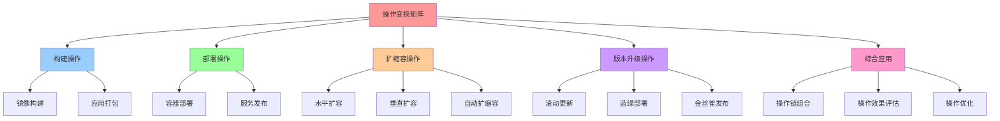
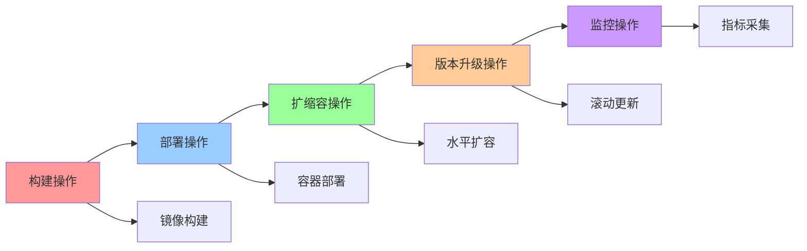
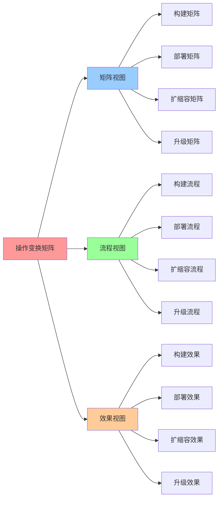

# 操作变换矩阵：各种操作的矩阵表示

## 📑 目录

- [操作变换矩阵：各种操作的矩阵表示](#操作变换矩阵各种操作的矩阵表示)
  - [📑 目录](#-目录)
  - [1 操作变换矩阵定义](#1-操作变换矩阵定义)
  - [2 构建操作矩阵](#2-构建操作矩阵)
    - [构建操作说明](#构建操作说明)
  - [3 部署操作矩阵](#3-部署操作矩阵)
    - [部署操作说明](#部署操作说明)
  - [4 扩缩容操作矩阵](#4-扩缩容操作矩阵)
    - [扩缩容操作说明](#扩缩容操作说明)
  - [5 版本升级操作矩阵](#5-版本升级操作矩阵)
    - [版本升级操作说明](#版本升级操作说明)
  - [6 操作变换的综合应用](#6-操作变换的综合应用)
    - [1 操作链组合](#1-操作链组合)
    - [2 操作效果评估](#2-操作效果评估)
    - [3 操作优化](#3-操作优化)
  - [7 🧠 认知增强：思维导图、建模视图与图表达转换](#7--认知增强思维导图建模视图与图表达转换)
    - [7.1 操作变换矩阵完整思维导图](#71-操作变换矩阵完整思维导图)
    - [7.2 操作变换矩阵建模视图](#72-操作变换矩阵建模视图)
      - [操作链流程视图](#操作链流程视图)
    - [7.3 操作变换矩阵多维关系矩阵](#73-操作变换矩阵多维关系矩阵)
      - [操作类型-概念-效果映射矩阵](#操作类型-概念-效果映射矩阵)
    - [7.4 图表达和转换](#74-图表达和转换)
      - [操作变换视图转换关系](#操作变换视图转换关系)
    - [7.5 形象化解释论证](#75-形象化解释论证)
      - [1. 操作变换 = 工厂生产线](#1-操作变换--工厂生产线)
      - [2. 操作链 = 生产流水线](#2-操作链--生产流水线)
      - [3. 操作优化 = 生产效率优化](#3-操作优化--生产效率优化)
    - [7.6 专家观点与论证](#76-专家观点与论证)
      - [计算信息软件科学家的观点](#计算信息软件科学家的观点)
        - [1. Frederick Brooks（软件工程专家）](#1-frederick-brooks软件工程专家)
        - [2. Martin Fowler（软件架构专家）](#2-martin-fowler软件架构专家)
      - [计算信息软件教育家的观点](#计算信息软件教育家的观点)
        - [1. Martin Fowler（软件架构教育家）](#1-martin-fowler软件架构教育家)
        - [2. Gene Kim（DevOps教育家）](#2-gene-kimdevops教育家)
      - [计算信息软件认知学家的观点](#计算信息软件认知学家的观点)
        - [1. David Marr（计算认知科学家）](#1-david-marr计算认知科学家)
        - [2. Douglas Hofstadter（认知科学家）](#2-douglas-hofstadter认知科学家)
    - [7.7 认知学习路径矩阵](#77-认知学习路径矩阵)
    - [7.8 专家推荐阅读路径](#78-专家推荐阅读路径)
  - [2025 年最新实践](#2025-年最新实践)
    - [操作变换矩阵应用最佳实践（2025）](#操作变换矩阵应用最佳实践2025)
  - [实际应用案例](#实际应用案例)
    - [案例 1：操作组合优化（2025）](#案例-1操作组合优化2025)

---

## 1 操作变换矩阵定义

**操作变换矩阵定义**：

$$\mathbf{T}_{\text{op}} \in \mathbb{R}^{12 \times 12}$$

其中 $\mathbf{T}_{\text{op}}[i,j]$ 表示操作对概念 $e_j$ 的影响，结果反映到概念
$e_i$ 上。

**操作类型**：

1. **构建操作**：镜像构建、应用打包
2. **部署操作**：容器部署、服务发布
3. **扩缩容操作**：水平扩容、垂直扩容
4. **版本升级操作**：滚动更新、蓝绿部署
5. **监控操作**：指标采集、日志收集
6. **策略操作**：策略应用、准入控制

**操作的数学表示**：

$$\mathbf{E}' = \mathbf{T}_{\text{op}} \cdot \mathbf{E}$$

其中 $\mathbf{E}$ 是原始概念向量，$\mathbf{E}'$ 是操作后的概念向量。

## 2 构建操作矩阵

**构建操作矩阵**：

$$\mathbf{T}_{\text{build}} \in \mathbb{R}^{12 \times 12}$$

表示构建操作对概念的影响。

**构建操作矩阵**：

| op\e         | I   | C   | Q   | R   | M   | V   | L   | S   | B   | P   | T   | Θ   |
| ------------ | --- | --- | --- | --- | --- | --- | --- | --- | --- | --- | --- | --- |
| **构建镜像** | 1.0 | 0.1 | 0   | 0   | 0   | 0.2 | 0   | 0   | 0   | 0.1 | 0   | 0.1 |
| **构建容器** | 0.8 | 1.0 | 0   | 0.1 | 0   | 0   | 0   | 0   | 0   | 0   | 0   | 0   |
| **构建策略** | 0   | 0   | 0   | 0   | 0   | 0   | 0   | 0   | 0   | 1.0 | 0   | 0.2 |

### 构建操作说明

**构建镜像操作**：

- **I → I**（1.0）：构建操作生成新镜像
- **I → C**（0.1）：构建镜像为容器运行做准备
- **I → V**（0.2）：新镜像对应新版本
- **I → P**（0.1）：镜像构建可能需要策略验证
- **I → Θ**（0.1）：镜像构建可能使用 AI 优化

**构建容器操作**：

- **C → C**（1.0）：构建操作创建容器实例
- **I → C**（0.8）：容器基于镜像构建
- **R → C**（0.1）：容器构建需要运行时支持

**构建策略操作**：

- **P → P**（1.0）：构建操作生成策略
- **P → Θ**（0.2）：策略构建可能使用 AI 优化

## 3 部署操作矩阵

**部署操作矩阵**：

$$\mathbf{T}_{\text{deploy}} \in \mathbb{R}^{12 \times 12}$$

表示部署操作对概念的影响。

**部署操作矩阵**：

| op\e         | I   | C   | Q   | R   | M   | V   | L   | S   | B   | P   | T   | Θ   |
| ------------ | --- | --- | --- | --- | --- | --- | --- | --- | --- | --- | --- | --- |
| **部署容器** | 0.5 | 1.0 | 0.3 | 0.5 | 0.2 | 0   | 0.1 | 0.2 | 0   | 0.3 | 0.1 | 0.1 |
| **部署服务** | 0.3 | 0.8 | 0.2 | 0.3 | 0.5 | 0.1 | 1.0 | 0.3 | 0   | 0.2 | 0.1 | 0.1 |
| **部署策略** | 0   | 0.3 | 0.5 | 0.3 | 0   | 0   | 0   | 0   | 0   | 1.0 | 0.3 | 0.2 |

### 部署操作说明

**部署容器操作**：

- **C → C**（1.0）：部署操作创建运行容器
- **I → C**（0.5）：容器基于镜像部署
- **Q → C**（0.3）：部署需要配额检查
- **R → C**（0.5）：容器部署需要运行时支持
- **M → C**（0.2）：部署后启动监控
- **L → C**（0.1）：容器可能需要负载均衡
- **S → C**（0.2）：容器可能需要自动扩缩容
- **P → C**（0.3）：部署需要策略验证
- **T → C**（0.1）：部署需要考虑租户隔离

**部署服务操作**：

- **L → L**（1.0）：部署服务创建负载均衡
- **C → L**（0.8）：服务管理容器
- **M → L**（0.5）：服务部署后启动监控

**Service Mesh 增强部署**：

- **L → L + Service Mesh**（0.9）：Service Mesh 提供统一的负载均衡和流量管理
- **L → M**（0.8）：Service Mesh 自动生成 Trace/Metric，提升监控集成度
- **L → P**（0.7）：Service Mesh 提供统一策略管理，提升策略集成度

**部署策略操作**：

- **P → P**（1.0）：部署策略应用到系统
- **C → P**（0.3）：策略控制容器
- **Q → P**（0.5）：策略控制配额
- **R → P**（0.3）：策略控制运行时
- **T → P**（0.3）：策略控制租户

## 4 扩缩容操作矩阵

**扩缩容操作矩阵**：

$$\mathbf{T}_{\text{scale}} \in \mathbb{R}^{12 \times 12}$$

表示扩缩容操作对概念的影响。

**扩缩容操作矩阵**：

| op\e           | I   | C   | Q   | R   | M   | V   | L   | S   | B   | P   | T   | Θ   |
| -------------- | --- | --- | --- | --- | --- | --- | --- | --- | --- | --- | --- | --- |
| **水平扩容**   | 0   | 0.8 | 0.5 | 0.3 | 0.5 | 0   | 0.3 | 1.0 | 0   | 0.2 | 0.2 | 0.5 |
| **垂直扩容**   | 0   | 0.6 | 0.8 | 0.2 | 0.3 | 0   | 0   | 1.0 | 0   | 0.2 | 0.2 | 0.3 |
| **自动扩缩容** | 0   | 0.7 | 0.6 | 0.3 | 0.8 | 0   | 0.3 | 1.0 | 0   | 0.2 | 0.2 | 1.0 |

### 扩缩容操作说明

**水平扩容操作**：

- **S → S**（1.0）：扩缩容操作直接作用于扩缩容概念
- **C → S**（0.8）：扩容增加容器数量
- **Q → S**（0.5）：扩缩容受配额限制
- **R → S**（0.3）：扩缩容可能需要运行时支持
- **M → S**（0.5）：扩缩容依赖监控指标
- **L → S**（0.3）：扩缩容影响负载均衡
- **T → S**（0.2）：扩缩容需要考虑租户隔离
- **Θ → S**（0.5）：AI 参数优化扩缩容决策

**垂直扩容操作**：

- **S → S**（1.0）：垂直扩容直接作用于扩缩容概念
- **C → S**（0.6）：垂直扩容调整容器资源
- **Q → S**（0.8）：垂直扩容受配额限制

**自动扩缩容操作**：

- **S → S**（1.0）：自动扩缩容直接作用于扩缩容概念
- **M → S**（0.8）：自动扩缩容高度依赖监控
- **Θ → S**（1.0）：自动扩缩容完全依赖 AI 参数

## 5 版本升级操作矩阵

**版本升级操作矩阵**：

$$\mathbf{T}_{\text{upgrade}} \in \mathbb{R}^{12 \times 12}$$

表示版本升级操作对概念的影响。

**版本升级操作矩阵**：

| op\e           | I   | C   | Q   | R   | M   | V   | L   | S   | B   | P   | T   | Θ   |
| -------------- | --- | --- | --- | --- | --- | --- | --- | --- | --- | --- | --- | --- |
| **滚动更新**   | 0.8 | 0.9 | 0.2 | 0.3 | 0.5 | 1.0 | 0.3 | 0.5 | 0.3 | 0.2 | 0.1 | 0.2 |
| **蓝绿部署**   | 0.9 | 0.9 | 0.3 | 0.4 | 0.6 | 1.0 | 0.5 | 0.4 | 0.5 | 0.3 | 0.2 | 0.2 |
| **金丝雀发布** | 0.7 | 0.8 | 0.2 | 0.3 | 0.7 | 1.0 | 0.4 | 0.3 | 0.3 | 0.2 | 0.1 | 0.3 |

### 版本升级操作说明

**滚动更新操作**：

- **V → V**（1.0）：滚动更新直接作用于版本升级概念
- **I → V**（0.8）：版本升级需要新镜像
- **C → V**（0.9）：版本升级更新容器
- **M → V**（0.5）：版本升级需要监控验证
- **L → V**（0.3）：版本升级影响负载均衡
- **S → V**（0.5）：版本升级可能触发扩缩容
- **B → V**（0.3）：版本升级前可能需要备份

**蓝绿部署操作**：

- **V → V**（1.0）：蓝绿部署直接作用于版本升级概念
- **I → V**（0.9）：蓝绿部署需要新镜像
- **C → V**（0.9）：蓝绿部署创建新容器
- **M → V**（0.6）：蓝绿部署需要监控验证
- **B → V**（0.5）：蓝绿部署需要备份支持
- **L → V**（0.5）：蓝绿部署需要负载均衡切换（Service Mesh 提供一键切换，影响降
  至 0.3）

**金丝雀发布操作**：

- **V → V**（1.0）：金丝雀发布直接作用于版本升级概念
- **I → V**（0.7）：金丝雀发布使用新镜像
- **M → V**（0.7）：金丝雀发布高度依赖监控（Service Mesh 自动生成 Trace/Metric，
  依赖度提升至 0.9）
- **L → V**（0.4）：金丝雀发布需要流量路由（Service Mesh 提供按 Header/权重切流
  ，影响提升至 0.6）
- **Θ → V**（0.3）：金丝雀发布可能使用 AI 决策

## 6 操作变换的综合应用

### 1 操作链组合

**操作链定义**：

$$\mathbf{T}_{\text{chain}} = \mathbf{T}_{\text{op}_n} \cdot \mathbf{T}_{\text{op}_{n-1}} \cdot \cdots \cdot \mathbf{T}_{\text{op}_1}$$

表示一系列操作的组合。

**典型操作链**：

1. **构建-部署链**：$\mathbf{T}_{\text{deploy}} \cdot \mathbf{T}_{\text{build}}$
2. **部署-扩缩容
   链**：$\mathbf{T}_{\text{scale}} \cdot \mathbf{T}_{\text{deploy}}$
3. **版本升级-监控
   链**：$\mathbf{T}_{\text{monitor}} \cdot \mathbf{T}_{\text{upgrade}}$

### 2 操作效果评估

**操作效果定义**：

$$\text{Effect}(\text{op}, e_i) = \sum_{j=1}^{12} \mathbf{T}_{\text{op}}[i,j] \cdot w_j$$

其中 $w_j$ 是概念 $e_j$ 的权重。

**操作效果评估**：

- **构建操作**：主要影响镜像（I）和容器（C）
- **部署操作**：主要影响容器（C）、服务（L）和策略（P）
- **扩缩容操作**：主要影响容器（C）、监控（M）和扩缩容（S）
- **版本升级操作**：主要影响镜像（I）、容器（C）和版本（V）

### 3 操作优化

**操作优化目标**：

$$\min_{\mathbf{T}_{\text{op}}} \text{Cost}(\mathbf{T}_{\text{op}} \cdot \mathbf{E})$$

其中 $\text{Cost}$ 是成本函数。

**优化策略**：

1. **操作选择优化**：选择成本最低的操作序列
2. **操作时序优化**：优化操作的执行顺序
3. **操作并行优化**：优化可以并行执行的操作

---

## 7 🧠 认知增强：思维导图、建模视图与图表达转换

### 7.1 操作变换矩阵完整思维导图



### 7.2 操作变换矩阵建模视图

#### 操作链流程视图



### 7.3 操作变换矩阵多维关系矩阵

#### 操作类型-概念-效果映射矩阵

| 操作类型 | 构建 | 部署 | 扩缩容 | 版本升级 | 主要影响概念 | 操作效果 | 认知价值 |
|---------|------|------|--------|---------|-------------|---------|---------|
| **构建操作** | ✅ 核心 | ❌ 无 | ❌ 无 | ❌ 无 | I, C | 镜像构建 | 构建理解 |
| **部署操作** | ❌ 无 | ✅ 核心 | ❌ 无 | ❌ 无 | C, L, P | 服务发布 | 部署理解 |
| **扩缩容操作** | ❌ 无 | ❌ 无 | ✅ 核心 | ❌ 无 | C, M, S | 资源调整 | 扩缩理解 |
| **版本升级操作** | ❌ 无 | ❌ 无 | ❌ 无 | ✅ 核心 | I, C, V | 版本更新 | 升级理解 |
| **操作链** | ⚠️ 部分 | ⚠️ 部分 | ⚠️ 部分 | ⚠️ 部分 | 多概念 | 综合效果 | 链理解 |

### 7.4 图表达和转换

#### 操作变换视图转换关系



### 7.5 形象化解释论证

#### 1. 操作变换 = 工厂生产线

> **类比**：操作变换就像工厂生产线，操作是"工序"（构建、部署、扩缩容、升级），概念是"产品组件"（Image、Container等），操作矩阵是"工序影响"（每个工序对组件的影响），就像工厂生产线通过工序、组件、影响组织生产一样，操作变换通过操作、概念、影响组织技术操作。

**认知价值**：

- **工序理解**：通过工厂生产线类比，理解操作变换的工序性
- **组件理解**：通过产品组件类比，理解概念的组件性
- **影响理解**：通过工序影响类比，理解操作矩阵的影响性

#### 2. 操作链 = 生产流水线

> **类比**：操作链就像生产流水线，操作是"流水线环节"（构建→部署→扩缩容→升级），操作链是"流水线组合"（多个环节组合），操作效果是"产品质量"（最终效果），就像生产流水线通过环节、组合、质量组织生产一样，操作链通过操作、组合、效果组织技术操作。

**认知价值**：

- **流水线理解**：通过生产流水线类比，理解操作链的流水线性
- **组合理解**：通过流水线组合类比，理解操作链的组合性
- **质量理解**：通过产品质量类比，理解操作效果的质量性

#### 3. 操作优化 = 生产效率优化

> **类比**：操作优化就像生产效率优化，操作选择是"工序选择"（选择最优工序），操作时序是"工序顺序"（优化工序顺序），操作并行是"并行生产"（并行执行工序），就像生产效率优化通过选择、顺序、并行优化生产一样，操作优化通过选择、时序、并行优化技术操作。

**认知价值**：

- **优化理解**：通过生产效率优化类比，理解操作优化的优化性
- **选择理解**：通过工序选择类比，理解操作选择的选择性
- **并行理解**：通过并行生产类比，理解操作并行的并行性

### 7.6 专家观点与论证

#### 计算信息软件科学家的观点

##### 1. Frederick Brooks（软件工程专家）

> "The essence of a software system is captured in its operations. Understanding operation transformations helps us understand how systems evolve."

**在操作变换中的应用**：

- **操作理解**：操作变换帮助我们理解系统操作
- **演化理解**：通过操作变换理解系统演化
- **系统理解**：理解系统的操作本质

##### 2. Martin Fowler（软件架构专家）

> "Operations are the verbs of software systems. Operation transformation matrices help us understand how these verbs affect system state."

**在操作变换中的应用**：

- **动词理解**：操作是软件系统的动词
- **状态理解**：操作变换矩阵帮助我们理解操作对系统状态的影响
- **系统理解**：理解系统的操作机制

#### 计算信息软件教育家的观点

##### 1. Martin Fowler（软件架构教育家）

> "Teaching operation transformations helps students understand that software systems are not static—they are dynamic systems that change through operations."

**教育价值**：

- **动态理解**：操作变换帮助学生理解软件系统的动态性
- **变化理解**：通过操作变换理解系统变化
- **操作理解**：学习系统操作的本质

##### 2. Gene Kim（DevOps教育家）

> "Operation transformations are essential for DevOps practices. They help teams understand how to automate and optimize operations."

**教育价值**：

- **DevOps理解**：操作变换对DevOps实践至关重要
- **自动化理解**：学习如何自动化操作
- **优化理解**：学习如何优化操作

#### 计算信息软件认知学家的观点

##### 1. David Marr（计算认知科学家）

> "Understanding operation transformations requires understanding them at multiple levels: individual operations, operation chains, and operation optimization."

**认知价值**：

- **多层次理解**：理解操作变换需要多层次理解
- **操作理解**：理解单个操作
- **链理解**：理解操作链

##### 2. Douglas Hofstadter（认知科学家）

> "Operation transformation matrices are cognitive tools that help us organize and understand complex system operations. They provide a structured way to think about system changes."

**认知价值**：

- **认知工具**：操作变换矩阵是组织信息的认知工具
- **操作理解**：通过操作变换理解系统操作
- **结构理解**：操作变换提供结构化的思维方式

### 7.7 认知学习路径矩阵

| 学习阶段 | 核心内容 | 形象化理解 | 数学理解 | 实践应用 | 认知目标 |
|---------|---------|-----------|---------|---------|---------|
| **入门** | 操作定义 | 工厂生产线类比 | 操作矩阵 | 简单操作 | 建立基础 |
| **进阶** | 操作链 | 生产流水线类比 | 操作链矩阵 | 操作组合 | 理解链 |
| **高级** | 操作优化 | 生产效率优化类比 | 优化算法 | 操作优化 | 掌握优化 |
| **专家** | 操作策略 | 生产策略类比 | 策略算法 | 系统操作 | 掌握策略 |

### 7.8 专家推荐阅读路径

**计算信息软件科学家推荐路径**：

1. **操作定义**：理解操作变换矩阵的定义和应用
2. **操作链**：掌握操作链的组合和效果评估
3. **操作优化**：理解操作优化的方法和策略
4. **操作策略**：学习操作策略的制定和执行

**计算信息软件教育家推荐路径**：

1. **形象化理解**：通过工厂生产线、生产流水线、生产效率优化等类比，建立直观理解
2. **渐进学习**：从简单操作开始，逐步学习复杂操作链
3. **实践结合**：结合实际项目，理解操作变换的应用
4. **思维训练**：通过操作变换学习，训练系统性思维能力

**计算信息软件认知学家推荐路径**：

1. **认知模式**：识别操作变换中的认知模式
2. **结构理解**：理解操作变换揭示的操作结构
3. **跨域应用**：将操作变换思维应用到其他领域
4. **认知提升**：通过操作变换学习，提升认知能力

---

---

## 2025 年最新实践

### 操作变换矩阵应用最佳实践（2025）

**2025 年趋势**：操作变换矩阵在操作组合和优化中的深度应用

**实践要点**：

- **操作组合**：使用操作变换矩阵进行操作组合
- **变换优化**：使用操作变换矩阵优化变换过程
- **性能分析**：使用操作变换矩阵分析操作性能

**代码示例**：

```python
# 2025 年操作变换矩阵工具
class OperationTransformationTool:
    def __init__(self):
        self.op_matrix = OperationTransformationMatrix()
        self.optimizer = OperationOptimizer()
        self.analyzer = PerformanceAnalyzer()

    def combine_operations(self, operations):
        """操作组合"""
        return self.op_matrix.combine(operations)

    def optimize_transformation(self, transformation):
        """优化变换"""
        return self.optimizer.optimize(transformation)

    def analyze_performance(self, operation):
        """分析性能"""
        return self.analyzer.analyze(operation)
```

## 实际应用案例

### 案例 1：操作组合优化（2025）

**场景**：使用操作变换矩阵优化操作组合

**实现方案**：

```python
# 操作组合优化
tool = OperationTransformationTool()

# 操作组合
operations = ['Scale', 'Monitor', 'LoadBalance']
combined = tool.combine_operations(operations)
print(f"组合操作: {combined}")

# 优化变换
optimized = tool.optimize_transformation(combined)
print(f"优化操作: {optimized}")

# 性能分析
performance = tool.analyze_performance(optimized)
print(f"性能: {performance}")
```

**效果**：

- 操作组合：使用操作变换矩阵进行操作组合
- 变换优化：使用操作变换矩阵优化变换过程
- 性能分析：使用操作变换矩阵分析操作性能

---

**参考**：

- [操作变换矩阵 - 返回目录](../README.md)
- [场景变换矩阵：场景间的迁移和转换](04-scene-transformation.md)
- [技术链矩阵序列：Docker→K8s→K3s→WasmEdge→OPA→ 多租户](06-tech-chain-sequence.md)
