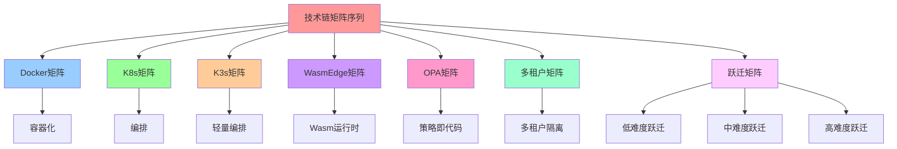
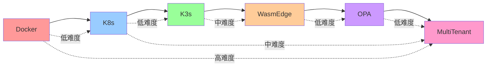
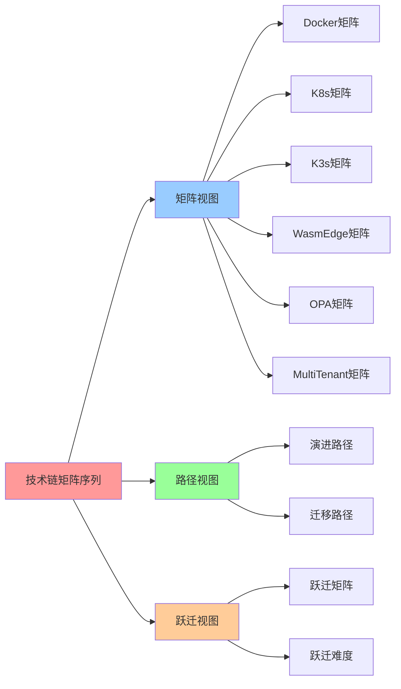

# 技术链矩阵序列：Docker→K8s→K3s→WasmEdge→OPA→ 多租户

## 📑 目录

- [技术链矩阵序列：Docker→K8s→K3s→WasmEdge→OPA→ 多租户](#技术链矩阵序列dockerk8sk3swasmedgeopa-多租户)
  - [📑 目录](#-目录)
  - [1 技术链矩阵序列定义](#1-技术链矩阵序列定义)
  - [2 Docker 矩阵](#2-docker-矩阵)
  - [3 Kubernetes 矩阵](#3-kubernetes-矩阵)
  - [4 K3s 矩阵](#4-k3s-矩阵)
  - [5 WasmEdge 矩阵](#5-wasmedge-矩阵)
  - [6 OPA 矩阵](#6-opa-矩阵)
  - [7 多租户矩阵](#7-多租户矩阵)
  - [8 技术链跃迁矩阵](#8-技术链跃迁矩阵)
  - [9 技术链矩阵序列的应用](#9-技术链矩阵序列的应用)
    - [1 技术选型决策](#1-技术选型决策)
    - [2 技术链迁移规划](#2-技术链迁移规划)
    - [3 技术链组合优化](#3-技术链组合优化)
  - [10 🧠 认知增强：思维导图、建模视图与图表达转换](#10--认知增强思维导图建模视图与图表达转换)
    - [10.1 技术链矩阵序列完整思维导图](#101-技术链矩阵序列完整思维导图)
    - [10.2 技术链矩阵序列建模视图](#102-技术链矩阵序列建模视图)
      - [技术链演进路径视图](#技术链演进路径视图)
    - [10.3 技术链矩阵序列多维关系矩阵](#103-技术链矩阵序列多维关系矩阵)
      - [技术链-场景-成熟度映射矩阵](#技术链-场景-成熟度映射矩阵)
    - [10.4 图表达和转换](#104-图表达和转换)
      - [技术链视图转换关系](#技术链视图转换关系)
    - [10.5 形象化解释论证](#105-形象化解释论证)
      - [1. 技术链 = 技术栈演进](#1-技术链--技术栈演进)
      - [2. 跃迁矩阵 = 技术迁移地图](#2-跃迁矩阵--技术迁移地图)
      - [3. 技术链组合 = 技术栈拼装](#3-技术链组合--技术栈拼装)
    - [10.6 专家观点与论证](#106-专家观点与论证)
      - [计算信息软件科学家的观点](#计算信息软件科学家的观点)
        - [1. Solomon Hykes（Docker创始人）](#1-solomon-hykesdocker创始人)
        - [2. Joe Beda（Kubernetes创始人）](#2-joe-bedakubernetes创始人)
      - [计算信息软件教育家的观点](#计算信息软件教育家的观点)
        - [1. Kelsey Hightower（Kubernetes教育家）](#1-kelsey-hightowerkubernetes教育家)
        - [2. Liz Rice（容器安全教育家）](#2-liz-rice容器安全教育家)
      - [计算信息软件认知学家的观点](#计算信息软件认知学家的观点)
        - [1. David Marr（计算认知科学家）](#1-david-marr计算认知科学家)
        - [2. Douglas Hofstadter（认知科学家）](#2-douglas-hofstadter认知科学家)
    - [10.7 认知学习路径矩阵](#107-认知学习路径矩阵)
    - [10.8 专家推荐阅读路径](#108-专家推荐阅读路径)
  - [2025 年最新实践](#2025-年最新实践)
    - [技术链矩阵序列应用最佳实践（2025）](#技术链矩阵序列应用最佳实践2025)
  - [实际应用案例](#实际应用案例)
    - [案例 1：技术链演进规划（2025）](#案例-1技术链演进规划2025)

---

## 1 技术链矩阵序列定义

**技术链矩阵序列定义**：

$$\mathbf{A}^{(1)}, \mathbf{A}^{(2)}, \mathbf{A}^{(3)}, \mathbf{A}^{(4)}, \mathbf{A}^{(5)}, \mathbf{A}^{(6)}$$

其中：

- $\mathbf{A}^{(1)} \in \mathbb{R}^{12 \times 6}$：Docker 矩阵
- $\mathbf{A}^{(2)} \in \mathbb{R}^{12 \times 6}$：Kubernetes 矩阵
- $\mathbf{A}^{(3)} \in \mathbb{R}^{12 \times 6}$：K3s 矩阵
- $\mathbf{A}^{(4)} \in \mathbb{R}^{12 \times 6}$：WasmEdge 矩阵
- $\mathbf{A}^{(5)} \in \mathbb{R}^{12 \times 6}$：OPA 矩阵
- $\mathbf{A}^{(6)} \in \mathbb{R}^{12 \times 6}$：多租户矩阵

**技术链演进**：

$$\text{Docker} \rightarrow \text{K8s} \rightarrow \text{K3s} \rightarrow \text{WasmEdge} \rightarrow \text{OPA} \rightarrow \text{MultiTenant}$$

**技术链增强**：

- **Service Mesh**：作为 K8s/K3s 的增强层，提供服务间通信治理、零信任安全、可观
  测性
- **适用场景**：微服务架构、多云环境、边缘计算
- **技术选型**：Istio、Linkerd、Cilium Service Mesh

**技术链跃迁**：

$$\mathbf{A}^{(i \rightarrow j)} = \mathbf{A}^{(j)} \cdot \boldsymbol{\Theta} \cdot \mathbf{A}^{(i)T}$$

其中 $\boldsymbol{\Theta}$ 是 AI 可学习参数矩阵，用于优化技术链跃迁。

**Service Mesh 增强效果**：

当技术链包含 Service Mesh 时，负载均衡（L）概念的成熟度在所有场景下提升
0.2-0.3：

- **流量治理**：统一的路由、灰度发布、A/B 测试
- **零信任安全**：自动 mTLS、服务间认证、授权策略
- **可观测性**：自动生成 Trace/Metric，无需应用埋点

## 2 Docker 矩阵

**Docker 矩阵**：$\mathbf{A}^{(1)} \in \mathbb{R}^{12 \times 6}$

表示 Docker 技术栈中概念在不同场景下的成熟度。

**Docker 成熟度矩阵**：

| e\s            | Dev | CI/Test | Prod | Edge/IoT | Serverless/AI | MultiTenant |
| -------------- | --- | ------- | ---- | -------- | ------------- | ----------- |
| **I 镜像**     | 1.0 | 1.0     | 1.0  | 0.9      | 0.9           | 0.8         |
| **C 容器**     | 1.0 | 1.0     | 1.0  | 0.9      | 0.9           | 0.8         |
| **Q 配额**     | 0.5 | 0.7     | 0.8  | 0.6      | 0.7           | 0.6         |
| **R 运行时**   | 1.0 | 1.0     | 1.0  | 0.8      | 0.8           | 0.8         |
| **M 监控**     | 0.6 | 0.8     | 0.8  | 0.6      | 0.7           | 0.6         |
| **V 版本升级** | 0.7 | 0.8     | 0.9  | 0.7      | 0.8           | 0.7         |
| **L 负载均衡** | 0.4 | 0.6     | 0.8  | 0.5      | 0.6           | 0.6         |
| **S 扩缩容**   | 0.2 | 0.4     | 0.6  | 0.3      | 0.5           | 0.4         |
| **B 灾备**     | 0.3 | 0.5     | 0.7  | 0.4      | 0.5           | 0.5         |
| **P 策略**     | 0.2 | 0.4     | 0.6  | 0.3      | 0.4           | 0.4         |
| **T 租户**     | 0.0 | 0.2     | 0.4  | 0.2      | 0.3           | 0.5         |
| **Θ AI 参数**  | 0.1 | 0.3     | 0.5  | 0.2      | 0.6           | 0.4         |

**Docker 矩阵特征**：

- **强项**：镜像（I）、容器（C）、运行时（R）在大部分场景下成熟度高
- **弱项**：扩缩容（S）、策略（P）、租户（T）在大部分场景下成熟度低
- **定位**：单机容器化、镜像构建和运行时管理

## 3 Kubernetes 矩阵

**Kubernetes 矩阵**：$\mathbf{A}^{(2)} \in \mathbb{R}^{12 \times 6}$

表示 Kubernetes 技术栈中概念在不同场景下的成熟度。

**Kubernetes 成熟度矩阵**：

| e\s            | Dev | CI/Test | Prod | Edge/IoT | Serverless/AI | MultiTenant |
| -------------- | --- | ------- | ---- | -------- | ------------- | ----------- |
| **I 镜像**     | 0.9 | 1.0     | 1.0  | 0.8      | 0.9           | 1.0         |
| **C 容器**     | 0.9 | 1.0     | 1.0  | 0.8      | 0.9           | 1.0         |
| **Q 配额**     | 0.2 | 0.8     | 1.0  | 0.7      | 0.8           | 1.0         |
| **R 运行时**   | 0.3 | 0.7     | 0.9  | 0.9      | 1.0           | 0.9         |
| **M 监控**     | 0.8 | 1.0     | 1.0  | 0.9      | 0.9           | 1.0         |
| **V 版本升级** | 0.4 | 0.9     | 1.0  | 0.8      | 0.9           | 1.0         |
| **L 负载均衡** | 0.2 | 0.8     | 1.0  | 0.7      | 0.9           | 1.0         |
| **S 扩缩容**   | 0.1 | 0.8     | 1.0  | 0.8      | 1.0           | 1.0         |
| **B 灾备**     | 0.0 | 0.6     | 1.0  | 0.7      | 0.8           | 1.0         |
| **P 策略**     | 0.3 | 0.8     | 1.0  | 0.8      | 0.9           | 1.0         |
| **T 租户**     | 0.0 | 0.5     | 1.0  | 0.6      | 0.7           | 1.0         |
| **Θ AI 参数**  | 0.1 | 0.6     | 0.9  | 0.7      | 1.0           | 0.9         |

**Kubernetes 矩阵特征**：

- **强项**：在生产环境（Prod）和多租户平台（MultiTenant）下，所有概念成熟度都很
  高（≥0.9）
- **弱项**：在本地开发（Dev）场景下，部分概念成熟度较低
- **定位**：企业级容器编排、大规模集群管理

## 4 K3s 矩阵

**K3s 矩阵**：$\mathbf{A}^{(3)} \in \mathbb{R}^{12 \times 6}$

表示 K3s 技术栈中概念在不同场景下的成熟度。

**K3s 成熟度矩阵**：

| e\s            | Dev | CI/Test | Prod | Edge/IoT | Serverless/AI | MultiTenant |
| -------------- | --- | ------- | ---- | -------- | ------------- | ----------- |
| **I 镜像**     | 0.9 | 1.0     | 0.9  | 1.0      | 0.9           | 0.9         |
| **C 容器**     | 0.9 | 1.0     | 0.9  | 1.0      | 0.9           | 0.9         |
| **Q 配额**     | 0.2 | 0.8     | 0.9  | 0.8      | 0.8           | 0.9         |
| **R 运行时**   | 0.3 | 0.7     | 0.9  | 1.0      | 1.0           | 0.9         |
| **M 监控**     | 0.8 | 1.0     | 0.9  | 0.9      | 0.9           | 0.9         |
| **V 版本升级** | 0.4 | 0.9     | 0.9  | 0.9      | 0.9           | 0.9         |
| **L 负载均衡** | 0.2 | 0.8     | 0.9  | 0.8      | 0.9           | 0.9         |
| **S 扩缩容**   | 0.1 | 0.8     | 0.9  | 0.9      | 1.0           | 0.9         |
| **B 灾备**     | 0.0 | 0.6     | 0.9  | 0.8      | 0.8           | 0.9         |
| **P 策略**     | 0.3 | 0.8     | 0.9  | 0.9      | 0.9           | 0.9         |
| **T 租户**     | 0.0 | 0.5     | 0.9  | 0.7      | 0.7           | 0.9         |
| **Θ AI 参数**  | 0.1 | 0.6     | 0.9  | 0.8      | 1.0           | 0.9         |

**K3s 矩阵特征**：

- **强项**：在边缘/IoT（Edge/IoT）和 Serverless/AI 场景下，运行时（R）和扩缩容
  （S）成熟度高
- **弱项**：在生产环境（Prod）下，成熟度略低于 Kubernetes
- **定位**：轻量级 Kubernetes、边缘计算、资源受限环境

## 5 WasmEdge 矩阵

**WasmEdge 矩阵**：$\mathbf{A}^{(4)} \in \mathbb{R}^{12 \times 6}$

表示 WasmEdge 技术栈中概念在不同场景下的成熟度。

**WasmEdge 成熟度矩阵**：

| e\s            | Dev | CI/Test | Prod | Edge/IoT | Serverless/AI | MultiTenant |
| -------------- | --- | ------- | ---- | -------- | ------------- | ----------- |
| **I 镜像**     | 0.8 | 0.9     | 0.9  | 0.9      | 1.0           | 0.9         |
| **C 容器**     | 0.8 | 0.9     | 0.9  | 0.9      | 1.0           | 0.9         |
| **Q 配额**     | 0.2 | 0.8     | 0.9  | 0.8      | 0.9           | 0.9         |
| **R 运行时**   | 0.7 | 0.9     | 1.0  | 1.0      | 1.0           | 1.0         |
| **M 监控**     | 0.7 | 0.9     | 0.9  | 0.9      | 0.9           | 0.9         |
| **V 版本升级** | 0.5 | 0.8     | 0.9  | 0.9      | 0.9           | 0.9         |
| **L 负载均衡** | 0.3 | 0.8     | 0.9  | 0.8      | 1.0           | 0.9         |
| **S 扩缩容**   | 0.2 | 0.8     | 0.9  | 0.9      | 1.0           | 0.9         |
| **B 灾备**     | 0.0 | 0.6     | 0.8  | 0.8      | 0.9           | 0.9         |
| **P 策略**     | 0.3 | 0.8     | 0.9  | 0.9      | 1.0           | 0.9         |
| **T 租户**     | 0.0 | 0.5     | 0.9  | 0.7      | 0.8           | 0.9         |
| **Θ AI 参数**  | 0.2 | 0.7     | 0.9  | 0.9      | 1.0           | 0.9         |

**WasmEdge 矩阵特征**：

- **强项**：在 Serverless/AI 场景下，所有相关概念成熟度都很高（≥0.9）
- **强项**：运行时（R）在所有场景下成熟度都很高（≥0.9）
- **弱项**：在本地开发（Dev）场景下，部分概念成熟度较低
- **定位**：WebAssembly 运行时、毫秒级冷启动、Serverless、边缘计算

## 6 OPA 矩阵

**OPA 矩阵**：$\mathbf{A}^{(5)} \in \mathbb{R}^{12 \times 6}$

表示 OPA 技术栈中概念在不同场景下的成熟度。

**OPA 成熟度矩阵**：

| e\s            | Dev | CI/Test | Prod | Edge/IoT | Serverless/AI | MultiTenant |
| -------------- | --- | ------- | ---- | -------- | ------------- | ----------- |
| **I 镜像**     | 0.8 | 0.9     | 1.0  | 0.9      | 0.9           | 1.0         |
| **C 容器**     | 0.8 | 0.9     | 1.0  | 0.9      | 0.9           | 1.0         |
| **Q 配额**     | 0.3 | 0.8     | 1.0  | 0.8      | 0.9           | 1.0         |
| **R 运行时**   | 0.4 | 0.8     | 1.0  | 0.9      | 1.0           | 1.0         |
| **M 监控**     | 0.7 | 0.9     | 1.0  | 0.9      | 0.9           | 1.0         |
| **V 版本升级** | 0.5 | 0.9     | 1.0  | 0.8      | 0.9           | 1.0         |
| **L 负载均衡** | 0.3 | 0.8     | 1.0  | 0.8      | 0.9           | 1.0         |
| **S 扩缩容**   | 0.2 | 0.8     | 1.0  | 0.8      | 0.9           | 1.0         |
| **B 灾备**     | 0.0 | 0.6     | 1.0  | 0.8      | 0.9           | 1.0         |
| **P 策略**     | 0.6 | 0.9     | 1.0  | 0.9      | 1.0           | 1.0         |
| **T 租户**     | 0.2 | 0.7     | 1.0  | 0.7      | 0.8           | 1.0         |
| **Θ AI 参数**  | 0.3 | 0.7     | 0.9  | 0.8      | 1.0           | 0.9         |

**OPA 矩阵特征**：

- **强项**：策略（P）在所有场景下成熟度都很高（≥0.9）
- **强项**：在生产环境（Prod）和多租户平台（MultiTenant）下，所有概念成熟度都很
  高（≥1.0）
- **强项**：在 Serverless/AI 场景下，策略（P）和运行时（R）成熟度都很高（≥1.0）
- **定位**：策略即代码、微秒级策略决策、OPA-Wasm

## 7 多租户矩阵

**多租户矩阵**：$\mathbf{A}^{(6)} \in \mathbb{R}^{12 \times 6}$

表示多租户技术栈中概念在不同场景下的成熟度。

**多租户成熟度矩阵**：

| e\s            | Dev | CI/Test | Prod | Edge/IoT | Serverless/AI | MultiTenant |
| -------------- | --- | ------- | ---- | -------- | ------------- | ----------- |
| **I 镜像**     | 0.9 | 1.0     | 1.0  | 0.8      | 0.9           | 1.0         |
| **C 容器**     | 0.9 | 1.0     | 1.0  | 0.8      | 0.9           | 1.0         |
| **Q 配额**     | 0.3 | 0.9     | 1.0  | 0.8      | 0.9           | 1.0         |
| **R 运行时**   | 0.4 | 0.9     | 1.0  | 0.9      | 1.0           | 1.0         |
| **M 监控**     | 0.8 | 1.0     | 1.0  | 0.9      | 0.9           | 1.0         |
| **V 版本升级** | 0.5 | 0.9     | 1.0  | 0.8      | 0.9           | 1.0         |
| **L 负载均衡** | 0.3 | 0.9     | 1.0  | 0.8      | 0.9           | 1.0         |
| **S 扩缩容**   | 0.2 | 0.9     | 1.0  | 0.8      | 1.0           | 1.0         |
| **B 灾备**     | 0.1 | 0.7     | 1.0  | 0.8      | 0.9           | 1.0         |
| **P 策略**     | 0.5 | 0.9     | 1.0  | 0.9      | 1.0           | 1.0         |
| **T 租户**     | 0.3 | 0.8     | 1.0  | 0.7      | 0.8           | 1.0         |
| **Θ AI 参数**  | 0.2 | 0.7     | 0.9  | 0.8      | 1.0           | 0.9         |

**多租户矩阵特征**：

- **强项**：在多租户平台（MultiTenant）场景下，所有概念成熟度都很高（≥1.0）
- **强项**：在生产环境（Prod）下，所有概念成熟度都很高（≥1.0）
- **弱项**：在本地开发（Dev）场景下，租户（T）相关概念成熟度较低
- **定位**：企业级多租户、资源隔离、策略隔离、租户管理

## 8 技术链跃迁矩阵

**技术链跃迁矩阵**：

$$\mathbf{A}^{(i \rightarrow j)} = \mathbf{A}^{(j)} \cdot \boldsymbol{\Theta} \cdot \mathbf{A}^{(i)T}$$

表示从技术链 $i$ 到技术链 $j$ 的跃迁难度（0-1，0=无缝，1=困难）。

**技术链跃迁矩阵示例（Docker → K8s）**：

| 从\到           | Docker | K8s | K3s | WasmEdge | OPA | MultiTenant |
| --------------- | ------ | --- | --- | -------- | --- | ----------- |
| **Docker**      | 0      | 0.3 | 0.4 | 0.5      | 0.6 | 0.8         |
| **K8s**         | 0.5    | 0   | 0.2 | 0.4      | 0.3 | 0.3         |
| **K3s**         | 0.6    | 0.2 | 0   | 0.3      | 0.4 | 0.5         |
| **WasmEdge**    | 0.7    | 0.4 | 0.3 | 0        | 0.2 | 0.4         |
| **OPA**         | 0.8    | 0.3 | 0.4 | 0.2      | 0   | 0.2         |
| **MultiTenant** | 0.9    | 0.3 | 0.5 | 0.4      | 0.2 | 0           |

**技术链跃迁分析**：

**低难度跃迁**（<0.3）：

- **K8s → K3s**（0.2）：K3s 是 K8s 的轻量级版本，跃迁容易
- **K8s → MultiTenant**（0.3）：K8s 天然支持多租户扩展
- **WasmEdge → OPA**（0.2）：两者都支持 Wasm，跃迁容易
- **OPA → MultiTenant**（0.2）：OPA 策略支持多租户

**中等难度跃迁**（0.3-0.6）：

- **Docker → K8s**（0.3）：需要适配编排层
- **K3s → WasmEdge**（0.3）：需要适配运行时
- **WasmEdge → MultiTenant**（0.4）：需要适配多租户隔离

**高难度跃迁**（>0.6）：

- **Docker → MultiTenant**（0.8）：需要大量改造
- **Docker → OPA**（0.6）：需要引入策略层
- **Docker → WasmEdge**（0.5）：需要适配运行时

## 9 技术链矩阵序列的应用

### 1 技术选型决策

**应用场景**：

根据场景向量 $\mathbf{S}$ 和技术链矩阵 $\mathbf{A}^{(i)}$，计算适配度：

$$\text{Adapt}(i, \mathbf{S}) = \mathbf{S} \cdot \mathbf{A}^{(i)}$$

**示例**：

```python
# 计算各技术链在边缘场景下的适配度
S_edge = [0, 0, 0, 1, 0, 0]  # 边缘场景
scores = [S_edge @ A_docker,
          S_edge @ A_k8s,
          S_edge @ A_k3s,
          S_edge @ A_wasmedge,
          S_edge @ A_opa,
          S_edge @ A_multitenant]
# K3s 和 WasmEdge 得分最高
```

### 2 技术链迁移规划

**应用场景**：

规划从技术链 $i$ 到技术链 $j$ 的迁移路径：

$$\text{Path}(i, j) = \min_k \mathbf{A}^{(i \rightarrow k)} + \mathbf{A}^{(k \rightarrow j)}$$

**示例**：

```python
# 从 Docker 迁移到 MultiTenant 的最优路径
path = shortest_path(transition_matrix, source=0, target=5)
# 最优路径：Docker → K8s → MultiTenant
```

### 3 技术链组合优化

**应用场景**：

选择最优的技术链组合：

$$\text{Optimal} = \arg\max_i \mathbf{S} \cdot \mathbf{A}^{(i)} \cdot \mathbf{w}$$

其中 $\mathbf{w}$ 是权重向量。

**示例**：

```python
# 在 Serverless/AI 场景下选择最优技术链
S_serverless = [0, 0, 0, 0, 1, 0]
weights = [1, 1, 1, 1, 1, 1]  # 所有概念权重相等
scores = [S_serverless @ A @ weights for A in tech_chains]
# WasmEdge 和 OPA 组合得分最高
```

---

## 10 🧠 认知增强：思维导图、建模视图与图表达转换

### 10.1 技术链矩阵序列完整思维导图



### 10.2 技术链矩阵序列建模视图

#### 技术链演进路径视图



### 10.3 技术链矩阵序列多维关系矩阵

#### 技术链-场景-成熟度映射矩阵

| 技术链 | Docker | K8s | K3s | WasmEdge | OPA | MultiTenant | 主要场景 | 认知价值 |
|--------|--------|-----|-----|-----------|-----|-------------|---------|---------|
| **Docker** | ✅ 核心 | ❌ 无 | ❌ 无 | ❌ 无 | ❌ 无 | ❌ 无 | Dev, CI/Test | 容器理解 |
| **K8s** | ❌ 无 | ✅ 核心 | ❌ 无 | ❌ 无 | ❌ 无 | ❌ 无 | Prod | 编排理解 |
| **K3s** | ❌ 无 | ❌ 无 | ✅ 核心 | ❌ 无 | ❌ 无 | ❌ 无 | Edge/IoT | 轻量理解 |
| **WasmEdge** | ❌ 无 | ❌ 无 | ❌ 无 | ✅ 核心 | ❌ 无 | ❌ 无 | Serverless/AI | Wasm理解 |
| **OPA** | ❌ 无 | ❌ 无 | ❌ 无 | ❌ 无 | ✅ 核心 | ❌ 无 | MultiTenant | 策略理解 |
| **MultiTenant** | ❌ 无 | ❌ 无 | ❌ 无 | ❌ 无 | ❌ 无 | ✅ 核心 | MultiTenant | 租户理解 |

### 10.4 图表达和转换

#### 技术链视图转换关系



### 10.5 形象化解释论证

#### 1. 技术链 = 技术栈演进

> **类比**：技术链就像技术栈演进，技术链是"技术栈"（Docker、K8s、K3s等），矩阵是"技术能力"（各场景下的成熟度），跃迁是"技术升级"（从一种技术到另一种技术），就像技术栈演进通过技术栈、能力、升级组织演进一样，技术链通过技术链、矩阵、跃迁组织技术演进。

**认知价值**：

- **演进理解**：通过技术栈演进类比，理解技术链的演进性
- **能力理解**：通过技术能力类比，理解矩阵的能力性
- **升级理解**：通过技术升级类比，理解跃迁的升级性

#### 2. 跃迁矩阵 = 技术迁移地图

> **类比**：跃迁矩阵就像技术迁移地图，技术链是"地点"（Docker、K8s等），跃迁难度是"距离"（0.2=近，0.8=远），跃迁路径是"路线"（最优路径），就像技术迁移地图通过地点、距离、路线组织迁移一样，跃迁矩阵通过技术链、难度、路径组织技术迁移。

**认知价值**：

- **地图理解**：通过技术迁移地图类比，理解跃迁矩阵的地图性
- **距离理解**：通过距离类比，理解跃迁难度的距离性
- **路线理解**：通过路线类比，理解跃迁路径的路线性

#### 3. 技术链组合 = 技术栈拼装

> **类比**：技术链组合就像技术栈拼装，技术链是"组件"（Docker、K8s等），组合是"拼装"（多个技术链组合），适配度是"匹配度"（技术链与场景的匹配），就像技术栈拼装通过组件、拼装、匹配度组织拼装一样，技术链组合通过技术链、组合、适配度组织技术组合。

**认知价值**：

- **拼装理解**：通过技术栈拼装类比，理解技术链组合的拼装性
- **组件理解**：通过组件类比，理解技术链的组件性
- **匹配理解**：通过匹配度类比，理解适配度的匹配性

### 10.6 专家观点与论证

#### 计算信息软件科学家的观点

##### 1. Solomon Hykes（Docker创始人）

> "Docker is the foundation of containerization. Understanding the Docker matrix helps us understand how containers work."

**在技术链中的应用**：

- **基础理解**：Docker是容器化的基础
- **矩阵理解**：Docker矩阵帮助我们理解容器的工作原理
- **技术理解**：理解Docker在技术链中的基础作用

##### 2. Joe Beda（Kubernetes创始人）

> "Kubernetes is the orchestration layer. Understanding the K8s matrix helps us understand how orchestration works."

**在技术链中的应用**：

- **编排理解**：Kubernetes是编排层
- **矩阵理解**：K8s矩阵帮助我们理解编排的工作原理
- **技术理解**：理解K8s在技术链中的编排作用

#### 计算信息软件教育家的观点

##### 1. Kelsey Hightower（Kubernetes教育家）

> "Teaching technology chains helps students understand how technologies evolve and relate to each other."

**教育价值**：

- **演进理解**：技术链帮助学生理解技术演进
- **关系理解**：通过技术链理解技术之间的关系
- **学习理解**：学习技术链的学习方法

##### 2. Liz Rice（容器安全教育家）

> "Understanding technology chains is essential for making informed technology choices."

**教育价值**：

- **选择理解**：技术链对做出明智的技术选择至关重要
- **决策理解**：通过技术链理解技术决策
- **实践理解**：学习技术链的实践方法

#### 计算信息软件认知学家的观点

##### 1. David Marr（计算认知科学家）

> "Understanding technology chains requires understanding them at multiple levels: individual technologies, technology relationships, and technology evolution."

**认知价值**：

- **多层次理解**：理解技术链需要多层次理解
- **关系理解**：理解技术之间的关系
- **演进理解**：理解技术演进

##### 2. Douglas Hofstadter（认知科学家）

> "Technology chain matrices are cognitive tools that help us organize and understand complex technology relationships. They provide a structured way to think about technology evolution."

**认知价值**：

- **认知工具**：技术链矩阵是组织信息的认知工具
- **关系理解**：通过技术链理解技术关系
- **结构理解**：技术链提供结构化的思维方式

### 10.7 认知学习路径矩阵

| 学习阶段 | 核心内容 | 形象化理解 | 数学理解 | 实践应用 | 认知目标 |
|---------|---------|-----------|---------|---------|---------|
| **入门** | 技术链定义 | 技术栈演进类比 | 技术链矩阵 | 技术识别 | 建立基础 |
| **进阶** | 技术链矩阵 | 技术能力类比 | 矩阵运算 | 技术选型 | 理解矩阵 |
| **高级** | 跃迁矩阵 | 技术迁移地图类比 | 跃迁算法 | 技术迁移 | 掌握跃迁 |
| **专家** | 技术链组合 | 技术栈拼装类比 | 组合优化 | 系统设计 | 掌握组合 |

### 10.8 专家推荐阅读路径

**计算信息软件科学家推荐路径**：

1. **技术链定义**：理解技术链矩阵序列的定义和结构
2. **技术链矩阵**：掌握各技术链矩阵的特征和应用
3. **跃迁矩阵**：理解技术链跃迁矩阵的计算和应用
4. **技术链组合**：学习技术链组合的优化方法

**计算信息软件教育家推荐路径**：

1. **形象化理解**：通过技术栈演进、技术迁移地图、技术栈拼装等类比，建立直观理解
2. **渐进学习**：从简单技术链开始，逐步学习复杂技术链组合
3. **实践结合**：结合实际项目，理解技术链的应用
4. **思维训练**：通过技术链学习，训练系统性思维能力

**计算信息软件认知学家推荐路径**：

1. **认知模式**：识别技术链中的认知模式
2. **结构理解**：理解技术链揭示的技术结构
3. **跨域应用**：将技术链思维应用到其他领域
4. **认知提升**：通过技术链学习，提升认知能力

---

**参考**：

**关联文档**：

- **[28. 架构框架](../../TECHNICAL/28-architecture-framework/architecture-framework.md)** -
  多维度架构体系与技术规范（技术架构、概念架构、数据架构、业务架构、软件架构、应
  用架构、场景架构）
- **[05. 全局架构设计](../../02-architecture-design/architecture-design/architecture-design.md)** -
  技术组合和架构决策

---

## 2025 年最新实践

### 技术链矩阵序列应用最佳实践（2025）

**2025 年趋势**：技术链矩阵序列在技术演进和选型中的深度应用

**实践要点**：

- **技术链分析**：使用技术链矩阵序列分析技术演进路径
- **序列优化**：使用技术链矩阵序列优化技术选择
- **演进规划**：使用技术链矩阵序列规划技术演进

**代码示例**：

```python
# 2025 年技术链矩阵序列工具
class TechChainSequenceTool:
    def __init__(self):
        self.chain_matrix = TechChainMatrix()
        self.optimizer = SequenceOptimizer()
        self.planner = EvolutionPlanner()

    def analyze_chain(self, tech_stack):
        """分析技术链"""
        return self.chain_matrix.analyze(tech_stack)

    def optimize_sequence(self, sequence):
        """优化序列"""
        return self.optimizer.optimize(sequence)

    def plan_evolution(self, current, target):
        """规划演进"""
        return self.planner.plan(current, target)
```

## 实际应用案例

### 案例 1：技术链演进规划（2025）

**场景**：使用技术链矩阵序列规划技术演进路径

**实现方案**：

```python
# 技术链演进规划
tool = TechChainSequenceTool()

# 分析技术链
chain = tool.analyze_chain(['Docker', 'K8s', 'K3s', 'WasmEdge'])
print(f"技术链: {chain}")

# 优化序列
optimized = tool.optimize_sequence(chain)
print(f"优化序列: {optimized}")

# 规划演进
evolution = tool.plan_evolution('Docker', 'WasmEdge')
print(f"演进路径: {evolution}")
```

**效果**：

- 技术链分析：使用技术链矩阵序列分析技术演进路径
- 序列优化：使用技术链矩阵序列优化技术选择
- 演进规划：使用技术链矩阵序列规划技术演进

---

- [技术链矩阵序列 - 返回目录](../README.md)
- [操作变换矩阵：各种操作的矩阵表示](05-operation-transformation.md)
- [AI 参数矩阵：AI 可学习参数矩阵](07-ai-parameters.md)
