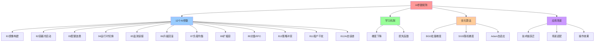
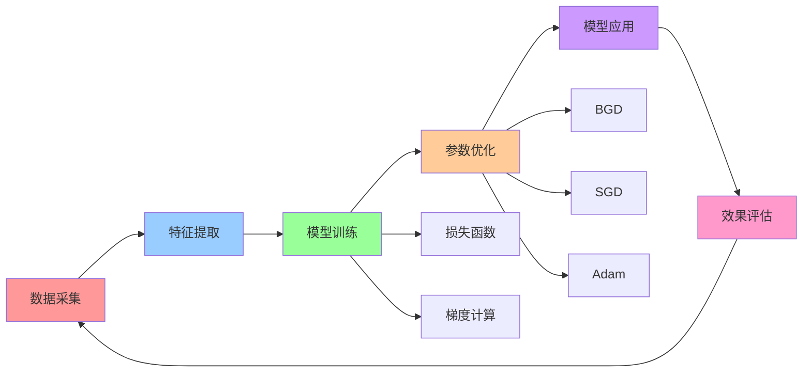
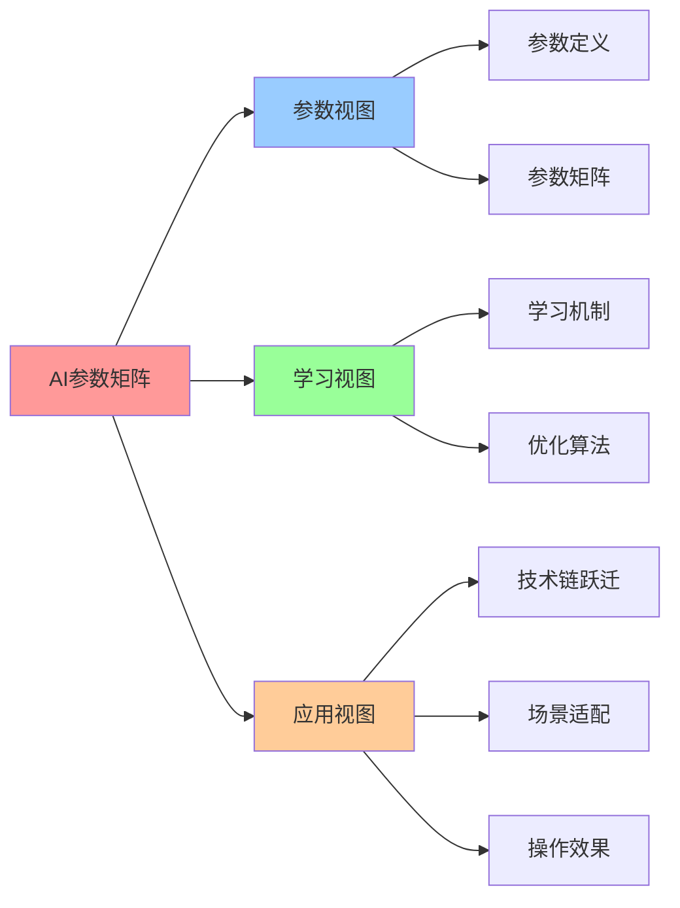

# AI 可学习参数矩阵

## 📑 目录

- [AI 可学习参数矩阵](#ai-可学习参数矩阵)
  - [📑 目录](#-目录)
  - [1 AI 参数矩阵定义](#1-ai-参数矩阵定义)
  - [2 AI 参数详解](#2-ai-参数详解)
    - [θ₁: 镜像构建时长预测](#θ-镜像构建时长预测)
    - [θ₂: 容器冷启动时长](#θ-容器冷启动时长)
    - [θ₃: 配额浪费率预测](#θ-配额浪费率预测)
    - [θ₄: 运行时切换失败率](#θ-运行时切换失败率)
    - [θ₅: 监测误报率](#θ-监测误报率)
    - [θ₆: 升级回滚概率](#θ-升级回滚概率)
    - [θ₇: 负载均衡热点预测](#θ-负载均衡热点预测)
    - [θ₈: 扩缩容提前量](#θ-扩缩容提前量)
    - [θ₉: 灾备 RPO 预测](#θ-灾备-rpo-预测)
    - [θ₁₀: 策略冲突概率](#θ-策略冲突概率)
    - [θ₁₁: 租户噪声干扰](#θ-租户噪声干扰)
    - [θ₁₂: AI 自误差](#θ-ai-自误差)
  - [3 AI 参数学习机制](#3-ai-参数学习机制)
  - [4 AI 参数优化算法](#4-ai-参数优化算法)
    - [1 批量梯度下降（BGD）](#1-批量梯度下降bgd)
    - [2 随机梯度下降（SGD）](#2-随机梯度下降sgd)
    - [3 自适应学习率（Adam）](#3-自适应学习率adam)
  - [5 AI 参数的应用](#5-ai-参数的应用)
    - [1 技术链跃迁优化](#1-技术链跃迁优化)
    - [2 场景适配优化](#2-场景适配优化)
    - [3 操作效果优化](#3-操作效果优化)
  - [6 🧠 认知增强：思维导图、建模视图与图表达转换](#6--认知增强思维导图建模视图与图表达转换)
    - [6.1 AI参数矩阵完整思维导图](#61-ai参数矩阵完整思维导图)
    - [6.2 AI参数矩阵建模视图](#62-ai参数矩阵建模视图)
      - [AI参数学习流程视图](#ai参数学习流程视图)
    - [6.3 AI参数矩阵多维关系矩阵](#63-ai参数矩阵多维关系矩阵)
      - [参数-概念-算法映射矩阵](#参数-概念-算法映射矩阵)
    - [6.4 图表达和转换](#64-图表达和转换)
      - [AI参数视图转换关系](#ai参数视图转换关系)
    - [6.5 形象化解释论证](#65-形象化解释论证)
      - [1. AI参数 = 智能调节器](#1-ai参数--智能调节器)
      - [2. 梯度下降 = 下山路径](#2-梯度下降--下山路径)
      - [3. 参数优化 = 调音过程](#3-参数优化--调音过程)
    - [6.6 专家观点与论证](#66-专家观点与论证)
      - [计算信息软件科学家的观点](#计算信息软件科学家的观点)
        - [1. Geoffrey Hinton（深度学习专家）](#1-geoffrey-hinton深度学习专家)
        - [2. Yann LeCun（深度学习专家）](#2-yann-lecun深度学习专家)
      - [计算信息软件教育家的观点](#计算信息软件教育家的观点)
        - [1. Andrew Ng（机器学习教育家）](#1-andrew-ng机器学习教育家)
        - [2. Fei-Fei Li（AI教育家）](#2-fei-fei-liai教育家)
      - [计算信息软件认知学家的观点](#计算信息软件认知学家的观点)
        - [1. David Marr（计算认知科学家）](#1-david-marr计算认知科学家)
        - [2. Douglas Hofstadter（认知科学家）](#2-douglas-hofstadter认知科学家)
    - [6.7 认知学习路径矩阵](#67-认知学习路径矩阵)
    - [6.8 专家推荐阅读路径](#68-专家推荐阅读路径)
  - [2025 年最新实践](#2025-年最新实践)
    - [AI 参数矩阵应用最佳实践（2025）](#ai-参数矩阵应用最佳实践2025)
  - [实际应用案例](#实际应用案例)
    - [案例 1：AI 参数学习优化（2025）](#案例-1ai-参数学习优化2025)

---

## 1 AI 参数矩阵定义

**AI 参数矩阵定义**：

$$\boldsymbol{\Theta} = \text{diag}(\theta_1, \theta_2, \ldots, \theta_{12}) \in \mathbb{R}^{12 \times 12}$$

其中 $\theta_i$ 是概念 $e_i$ 对应的 AI 可学习参数。

**AI 参数矩阵**：

| 参数 | 概念         | 物理含义         | 2025 AI 开源实现                       | 可微？ | 学习率 |
| ---- | ------------ | ---------------- | -------------------------------------- | ------ | ------ |
| θ₁   | **I** 镜像   | 镜像构建时长预测 | Docker BuildKit AI                     | ✅     | 1e-3   |
| θ₂   | **C** 容器   | 容器冷启动时长   | WasmEdge/crun AI                       | ✅     | 1e-3   |
| θ₃   | **Q** 配额   | 配额浪费率预测   | Volcano AI-Queue                       | ✅     | 1e-4   |
| θ₄   | **R** 运行时 | 运行时切换失败率 | runwasi AI 健康分                      | ✅     | 1e-3   |
| θ₅   | **M** 监控   | 监测误报率       | Grafana LLM 异常检测                   | ✅     | 1e-4   |
| θ₆   | **V** 版本   | 升级回滚概率     | Flux-AI 自动审批模型                   | ✅     | 1e-4   |
| θ₇   | **L** 负载   | 负载均衡热点预测 | Cilium AI 拓扑 + Service Mesh 流量预测 | ✅     | 1e-3   |
| θ₈   | **S** 扩缩容 | 扩缩容提前量     | KEDA AI 预测适配器                     | ✅     | 1e-3   |
| θ₉   | **B** 灾备   | 灾备 RPO 预测    | Velero-AI 插件                         | ✅     | 1e-4   |
| θ₁₀  | **P** 策略   | 策略冲突概率     | OPA-AI 自动生成模型                    | ✅     | 1e-4   |
| θ₁₁  | **T** 租户   | 租户噪声干扰     | Capsule-AI 负载画像                    | ✅     | 1e-4   |
| θ₁₂  | **Θ** AI     | AI 自误差        | Meta-ML 在线校正                       | ✅     | 1e-5   |

**AI 参数矩阵的数学表示**：

$$
\boldsymbol{\Theta} = \begin{bmatrix}
\theta_1 & 0 & \cdots & 0 \\
0 & \theta_2 & \cdots & 0 \\
\vdots & \vdots & \ddots & \vdots \\
0 & 0 & \cdots & \theta_{12}
\end{bmatrix}
$$

## 2 AI 参数详解

### θ₁: 镜像构建时长预测

**物理含义**：预测镜像构建所需的时间

**2025 实现**：Docker BuildKit AI 缓存

**学习机制**：

$$\theta_1 \leftarrow \theta_1 - \alpha \cdot \frac{\partial L}{\partial \theta_1}$$

其中 $L$ 是构建时长的损失函数。

**应用场景**：

- **CI/CD 优化**：预测构建时间，优化 CI 流水线
- **缓存策略**：智能缓存构建层，减少重复构建

### θ₂: 容器冷启动时长

**物理含义**：预测容器的冷启动时间

**2025 实现**：WasmEdge/crun AI 预加载

**学习机制**：

$$\theta_2 \leftarrow \theta_2 - \alpha \cdot \frac{\partial L}{\partial \theta_2}$$

其中 $L$ 是冷启动时长的损失函数。

**应用场景**：

- **Serverless 优化**：预测冷启动时间，优化预热策略
- **边缘计算**：预测边缘节点启动时间，优化调度

### θ₃: 配额浪费率预测

**物理含义**：预测配额资源的浪费率

**2025 实现**：Volcano AI-Queue

**学习机制**：

$$\theta_3 \leftarrow \theta_3 - \alpha \cdot \frac{\partial L}{\partial \theta_3}$$

其中 $L$ 是配额浪费率的损失函数。

**应用场景**：

- **成本优化**：预测配额浪费，优化资源分配
- **容量规划**：根据配额使用情况，规划容量

### θ₄: 运行时切换失败率

**物理含义**：预测运行时切换的失败概率

**2025 实现**：runwasi AI 健康分

**学习机制**：

$$\theta_4 \leftarrow \theta_4 - \alpha \cdot \frac{\partial L}{\partial \theta_4}$$

其中 $L$ 是运行时切换失败率的损失函数。

**应用场景**：

- **运行时迁移**：预测迁移成功率，优化迁移策略
- **健康检查**：根据健康分，决定是否切换运行时

### θ₅: 监测误报率

**物理含义**：预测监控告警的误报率

**2025 实现**：Grafana LLM 异常检测

**学习机制**：

$$\theta_5 \leftarrow \theta_5 - \alpha \cdot \frac{\partial L}{\partial \theta_5}$$

其中 $L$ 是监测误报率的损失函数。

**应用场景**：

- **告警优化**：减少误报，提高告警准确性
- **异常检测**：智能识别真实异常，过滤噪声

### θ₆: 升级回滚概率

**物理含义**：预测版本升级需要回滚的概率

**2025 实现**：Flux-AI 自动审批模型

**学习机制**：

$$\theta_6 \leftarrow \theta_6 - \alpha \cdot \frac{\partial L}{\partial \theta_6}$$

其中 $L$ 是升级回滚概率的损失函数。

**应用场景**：

- **升级策略**：预测升级风险，选择最优升级时机
- **自动审批**：根据风险概率，自动审批或拒绝升级

### θ₇: 负载均衡热点预测

**物理含义**：预测负载均衡中的热点节点

**2025 实现**：Cilium AI 拓扑 + Service Mesh 流量预测（Istio/Linkerd）

**学习机制**：

$$\theta_7 \leftarrow \theta_7 - \alpha \cdot \frac{\partial L}{\partial \theta_7}$$

其中 $L$ 是负载均衡热点预测的损失函数。

**Service Mesh 增强**：

Service Mesh 提供丰富的流量数据，增强负载均衡热点预测：

- **流量数据**：Service Mesh 自动生成流量指标（QPS、延迟、错误率）
- **路由规则**：Service Mesh 提供路由规则，可以预测流量分布
- **灰度发布**：Service Mesh 支持灰度发布，可以预测新版本流量
- **多维度预测**：结合 Service Mesh 的 Trace 数据，可以更准确地预测热点

**应用场景**：

- **负载均衡优化**：预测热点，提前调整流量分配
- **容量规划**：根据负载预测，规划节点容量
- **Service Mesh 流量治理**：基于流量预测，优化路由规则和灰度发布策略

### θ₈: 扩缩容提前量

**物理含义**：预测扩缩容操作需要提前的时间量

**2025 实现**：KEDA AI 预测适配器

**学习机制**：

$$\theta_8 \leftarrow \theta_8 - \alpha \cdot \frac{\partial L}{\partial \theta_8}$$

其中 $L$ 是扩缩容提前量的损失函数。

**应用场景**：

- **弹性伸缩**：预测负载变化，提前扩容
- **成本优化**：优化扩缩容时机，减少资源浪费

### θ₉: 灾备 RPO 预测

**物理含义**：预测灾备恢复点目标（RPO）

**2025 实现**：Velero-AI 插件

**学习机制**：

$$\theta_9 \leftarrow \theta_9 - \alpha \cdot \frac{\partial L}{\partial \theta_9}$$

其中 $L$ 是灾备 RPO 的损失函数。

**应用场景**：

- **备份策略**：预测 RPO，优化备份频率
- **恢复规划**：根据 RPO 预测，规划恢复方案

### θ₁₀: 策略冲突概率

**物理含义**：预测策略规则的冲突概率

**2025 实现**：OPA-AI 自动生成模型

**学习机制**：

$$\theta_{10} \leftarrow \theta_{10} - \alpha \cdot \frac{\partial L}{\partial \theta_{10}}$$

其中 $L$ 是策略冲突概率的损失函数。

**应用场景**：

- **策略优化**：预测冲突，优化策略规则
- **自动生成**：根据历史数据，自动生成策略

### θ₁₁: 租户噪声干扰

**物理含义**：预测租户间的资源干扰程度

**2025 实现**：Capsule-AI 负载画像

**学习机制**：

$$\theta_{11} \leftarrow \theta_{11} - \alpha \cdot \frac{\partial L}{\partial \theta_{11}}$$

其中 $L$ 是租户噪声干扰的损失函数。

**应用场景**：

- **租户隔离**：预测干扰，优化租户分配
- **资源调度**：根据干扰预测，优化节点调度

### θ₁₂: AI 自误差

**物理含义**：AI 模型自身的预测误差

**2025 实现**：Meta-ML 在线校正

**学习机制**：

$$\theta_{12} \leftarrow \theta_{12} - \alpha \cdot \frac{\partial L}{\partial \theta_{12}}$$

其中 $L$ 是 AI 自误差的损失函数。

**应用场景**：

- **模型校准**：校正模型误差，提高预测准确性
- **元学习**：学习如何学习，优化学习过程

## 3 AI 参数学习机制

**统一学习机制**：

所有 AI 参数采用梯度下降法进行优化：

$$\boldsymbol{\Theta} \leftarrow \boldsymbol{\Theta} - \alpha \cdot \nabla_{\boldsymbol{\Theta}} L$$

其中：

- $\alpha$ 是学习率（learning rate）
- $L$ 是损失函数（loss function）
- $\nabla_{\boldsymbol{\Theta}} L$ 是损失函数对参数的梯度

**损失函数定义**：

$$L = \sum_{i=1}^{12} w_i \cdot L_i(\theta_i)$$

其中 $w_i$ 是概念 $e_i$ 的权重，$L_i$ 是概念 $e_i$ 的损失函数。

**损失函数类型**：

1. **回归损失**：用于连续值预测（如构建时长、冷启动时长）

   - MSE：$L = \frac{1}{n} \sum_{i=1}^{n} (y_i - \hat{y}_i)^2$
   - MAE：$L = \frac{1}{n} \sum_{i=1}^{n} |y_i - \hat{y}_i|$

2. **分类损失**：用于概率预测（如回滚概率、冲突概率）

   - Cross-entropy：$L = -\frac{1}{n} \sum_{i=1}^{n} [y_i \log \hat{y}_i + (1-y_i) \log(1-\hat{y}_i)]$

3. **排序损失**：用于排序任务（如负载均衡热点预测）
   - Pairwise Ranking Loss：$L = \sum_{i,j} \max(0, 1 - (s_i - s_j))$

## 4 AI 参数优化算法

### 1 批量梯度下降（BGD）

**算法**：

$$\theta_i^{(t+1)} = \theta_i^{(t)} - \alpha \cdot \frac{1}{n} \sum_{j=1}^{n} \frac{\partial L_j}{\partial \theta_i}$$

**特点**：

- **优点**：收敛稳定，适用于凸优化
- **缺点**：计算量大，需要全部数据

### 2 随机梯度下降（SGD）

**算法**：

$$\theta_i^{(t+1)} = \theta_i^{(t)} - \alpha \cdot \frac{\partial L_j}{\partial \theta_i}$$

**特点**：

- **优点**：计算量小，适合在线学习
- **缺点**：收敛不稳定，需要调整学习率

### 3 自适应学习率（Adam）

**算法**：

$$m_t = \beta_1 m_{t-1} + (1-\beta_1) g_t$$
$$v_t = \beta_2 v_{t-1} + (1-\beta_2) g_t^2$$
$$\theta_t = \theta_{t-1} - \alpha \cdot \frac{m_t}{\sqrt{v_t} + \epsilon}$$

**特点**：

- **优点**：自适应学习率，收敛快
- **缺点**：需要调参，内存占用大

## 5 AI 参数的应用

### 1 技术链跃迁优化

**应用**：

使用 AI 参数优化技术链跃迁：

$$\mathbf{A}^{(i \rightarrow j)} = \mathbf{A}^{(j)} \cdot \boldsymbol{\Theta} \cdot \mathbf{A}^{(i)T}$$

**示例**：

```python
# 优化 Docker → K8s 的跃迁
Theta = diag([theta_1, theta_2, ..., theta_12])
A_migration = A_k8s @ Theta @ A_docker.T
```

### 2 场景适配优化

**应用**：

使用 AI 参数优化场景适配：

$$\text{Adapt}(e_i, s_j, s_k) = \alpha \cdot \min(A^{(\text{mat})}_{i,j}, A^{(\text{mat})}_{i,k}) + \beta \cdot \boldsymbol{\Theta}[i,i]$$

**示例**：

```python
# 优化镜像在 Dev → Prod 的适配
adaptation = alpha * min(A_mat[0, 0], A_mat[0, 2]) + beta * Theta[0, 0]
```

### 3 操作效果优化

**应用**：

使用 AI 参数优化操作效果：

$$\text{Effect}(\text{op}, e_i) = \sum_{j=1}^{12} \mathbf{T}_{\text{op}}[i,j] \cdot w_j \cdot \boldsymbol{\Theta}[j,j]$$

**示例**：

```python
# 优化部署操作的效果
effect = sum(T_deploy[i, j] * w[j] * Theta[j, j] for j in range(12))
```

---

## 6 🧠 认知增强：思维导图、建模视图与图表达转换

### 6.1 AI参数矩阵完整思维导图



### 6.2 AI参数矩阵建模视图

#### AI参数学习流程视图



### 6.3 AI参数矩阵多维关系矩阵

#### 参数-概念-算法映射矩阵

| 参数 | 概念 | 物理含义 | 学习算法 | 应用场景 | 认知价值 |
|-----|------|---------|---------|---------|---------|
| **θ1** | I镜像 | 构建时长预测 | BGD/SGD/Adam | 构建优化 | 预测理解 |
| **θ2** | C容器 | 冷启动时长 | BGD/SGD/Adam | 启动优化 | 预测理解 |
| **θ3** | Q配额 | 浪费率预测 | BGD/SGD/Adam | 资源优化 | 预测理解 |
| **θ4** | R运行时 | 切换失败率 | BGD/SGD/Adam | 切换优化 | 预测理解 |
| **θ5** | M监控 | 误报率 | BGD/SGD/Adam | 告警优化 | 预测理解 |
| **θ6** | V版本 | 回滚概率 | BGD/SGD/Adam | 升级优化 | 预测理解 |
| **θ7** | L负载均衡 | 热点预测 | BGD/SGD/Adam | 负载优化 | 预测理解 |
| **θ8** | S扩缩容 | 提前量 | BGD/SGD/Adam | 弹性优化 | 预测理解 |
| **θ9** | B灾备 | RPO预测 | BGD/SGD/Adam | 备份优化 | 预测理解 |
| **θ10** | P策略 | 冲突概率 | BGD/SGD/Adam | 策略优化 | 预测理解 |
| **θ11** | T租户 | 干扰预测 | BGD/SGD/Adam | 隔离优化 | 预测理解 |
| **θ12** | ΘAI | 自误差 | BGD/SGD/Adam | 模型校准 | 预测理解 |

### 6.4 图表达和转换

#### AI参数视图转换关系



### 6.5 形象化解释论证

#### 1. AI参数 = 智能调节器

> **类比**：AI参数就像智能调节器，参数是"调节旋钮"（θ1-θ12），学习机制是"自动调节"（梯度下降），优化算法是"调节策略"（BGD/SGD/Adam），就像智能调节器通过旋钮、调节、策略自动调节系统一样，AI参数通过参数、学习、算法自动优化技术系统。

**认知价值**：

- **调节理解**：通过智能调节器类比，理解AI参数的调节性
- **自动理解**：通过自动调节类比，理解学习机制的自动性
- **策略理解**：通过调节策略类比，理解优化算法的策略性

#### 2. 梯度下降 = 下山路径

> **类比**：梯度下降就像下山路径，损失函数是"山峰"（需要最小化），梯度是"下山方向"（最陡下降方向），学习率是"步长"（每步走多远），就像下山路径通过山峰、方向、步长找到最优路径一样，梯度下降通过损失、梯度、学习率找到最优参数。

**认知价值**：

- **路径理解**：通过下山路径类比，理解梯度下降的路径性
- **方向理解**：通过下山方向类比，理解梯度的方向性
- **步长理解**：通过步长类比，理解学习率的步长性

#### 3. 参数优化 = 调音过程

> **类比**：参数优化就像调音过程，参数是"音调"（θ1-θ12），损失函数是"音质"（需要优化），优化算法是"调音方法"（BGD/SGD/Adam），就像调音过程通过音调、音质、方法优化音质一样，参数优化通过参数、损失、算法优化系统性能。

**认知价值**：

- **调音理解**：通过调音过程类比，理解参数优化的调音性
- **音质理解**：通过音质类比，理解损失函数的音质性
- **方法理解**：通过调音方法类比，理解优化算法的方法性

### 6.6 专家观点与论证

#### 计算信息软件科学家的观点

##### 1. Geoffrey Hinton（深度学习专家）

> "Neural networks learn by adjusting parameters. Understanding AI parameter matrices helps us understand how AI systems learn."

**在AI参数中的应用**：

- **学习理解**：神经网络通过调整参数学习
- **矩阵理解**：AI参数矩阵帮助我们理解AI系统的学习过程
- **系统理解**：理解AI参数在系统中的作用

##### 2. Yann LeCun（深度学习专家）

> "Gradient descent is the foundation of machine learning. Understanding gradient descent helps us understand how AI parameters are optimized."

**在AI参数中的应用**：

- **基础理解**：梯度下降是机器学习的基础
- **优化理解**：理解梯度下降如何优化AI参数
- **学习理解**：理解AI参数的学习过程

#### 计算信息软件教育家的观点

##### 1. Andrew Ng（机器学习教育家）

> "Teaching AI parameters helps students understand that AI systems are not magic—they learn through mathematical optimization."

**教育价值**：

- **数学理解**：AI参数帮助学生理解AI系统的数学本质
- **优化理解**：通过AI参数理解数学优化
- **学习理解**：学习AI参数的学习方法

##### 2. Fei-Fei Li（AI教育家）

> "Understanding AI parameters is essential for building reliable AI systems."

**教育价值**：

- **可靠性理解**：AI参数对构建可靠的AI系统至关重要
- **系统理解**：通过AI参数理解AI系统
- **实践理解**：学习AI参数的实践方法

#### 计算信息软件认知学家的观点

##### 1. David Marr（计算认知科学家）

> "Understanding AI parameters requires understanding them at multiple levels: individual parameters, parameter relationships, and parameter optimization."

**认知价值**：

- **多层次理解**：理解AI参数需要多层次理解
- **关系理解**：理解参数之间的关系
- **优化理解**：理解参数优化

##### 2. Douglas Hofstadter（认知科学家）

> "AI parameter matrices are cognitive tools that help us organize and understand complex AI systems. They provide a structured way to think about AI learning."

**认知价值**：

- **认知工具**：AI参数矩阵是组织信息的认知工具
- **系统理解**：通过AI参数理解AI系统
- **结构理解**：AI参数提供结构化的思维方式

### 6.7 认知学习路径矩阵

| 学习阶段 | 核心内容 | 形象化理解 | 数学理解 | 实践应用 | 认知目标 |
|---------|---------|-----------|---------|---------|---------|
| **入门** | 参数定义 | 智能调节器类比 | 参数矩阵 | 参数识别 | 建立基础 |
| **进阶** | 学习机制 | 下山路径类比 | 梯度下降 | 参数学习 | 理解学习 |
| **高级** | 优化算法 | 调音过程类比 | 优化算法 | 参数优化 | 掌握优化 |
| **专家** | 参数应用 | 系统优化类比 | 应用算法 | 系统优化 | 掌握应用 |

### 6.8 专家推荐阅读路径

**计算信息软件科学家推荐路径**：

1. **参数定义**：理解AI参数矩阵的定义和结构
2. **学习机制**：掌握梯度下降和损失函数
3. **优化算法**：理解BGD、SGD、Adam等优化算法
4. **参数应用**：学习AI参数在技术链跃迁、场景适配、操作效果中的应用

**计算信息软件教育家推荐路径**：

1. **形象化理解**：通过智能调节器、下山路径、调音过程等类比，建立直观理解
2. **渐进学习**：从简单参数开始，逐步学习复杂优化算法
3. **实践结合**：结合实际项目，理解AI参数的应用
4. **思维训练**：通过AI参数学习，训练系统性思维能力

**计算信息软件认知学家推荐路径**：

1. **认知模式**：识别AI参数中的认知模式
2. **结构理解**：理解AI参数揭示的学习结构
3. **跨域应用**：将AI参数思维应用到其他领域
4. **认知提升**：通过AI参数学习，提升认知能力

---

**参考**：

---

## 2025 年最新实践

### AI 参数矩阵应用最佳实践（2025）

**2025 年趋势**：AI 参数矩阵在智能调度和优化中的深度应用

**实践要点**：

- **参数学习**：使用 AI 参数矩阵学习最优参数
- **智能优化**：使用 AI 参数矩阵进行智能优化
- **自适应调整**：使用 AI 参数矩阵进行自适应调整

**代码示例**：

```python
# 2025 年 AI 参数矩阵工具
class AIParameterMatrixTool:
    def __init__(self):
        self.param_matrix = AIParameterMatrix()
        self.learner = ParameterLearner()
        self.optimizer = IntelligentOptimizer()

    def learn_parameters(self, training_data):
        """学习参数"""
        return self.learner.learn(training_data)

    def optimize_with_ai(self, system_config):
        """智能优化"""
        return self.optimizer.optimize(system_config)

    def adaptive_adjust(self, current_state, target_state):
        """自适应调整"""
        return self.param_matrix.adapt(current_state, target_state)
```

## 实际应用案例

### 案例 1：AI 参数学习优化（2025）

**场景**：使用 AI 参数矩阵进行智能调度优化

**实现方案**：

```python
# AI 参数学习优化
tool = AIParameterMatrixTool()

# 学习参数
training_data = load_training_data()
parameters = tool.learn_parameters(training_data)
print(f"学习参数: {parameters}")

# 智能优化
optimized = tool.optimize_with_ai(system_config)
print(f"优化结果: {optimized}")

# 自适应调整
adjusted = tool.adaptive_adjust(current_state, target_state)
print(f"调整结果: {adjusted}")
```

**效果**：

- 参数学习：使用 AI 参数矩阵学习最优参数
- 智能优化：使用 AI 参数矩阵进行智能优化
- 自适应调整：使用 AI 参数矩阵进行自适应调整

---

- [AI 参数矩阵 - 返回目录](../README.md)
- [技术链矩阵序列：Docker→K8s→K3s→WasmEdge→OPA→ 多租户](06-tech-chain-sequence.md)
- [矩阵运算与应用：实际的计算方法和应用场景](08-matrix-operations.md)

---

**最后更新**：2025-11-15
