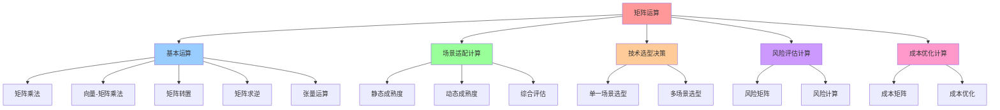
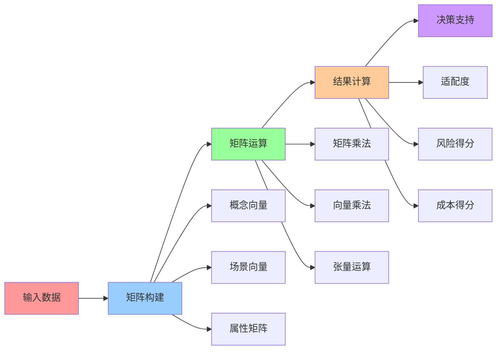
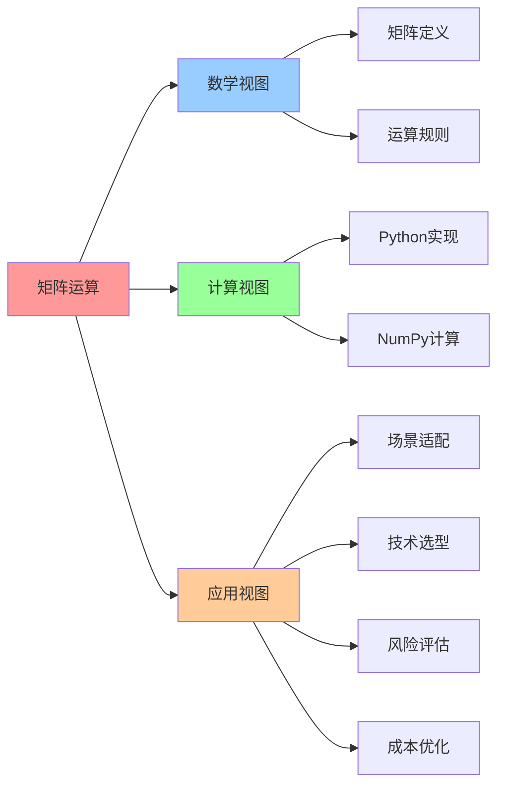

# 矩阵运算与应用

## 📑 目录

- [矩阵运算与应用](#矩阵运算与应用)
  - [📑 目录](#-目录)
  - [1 矩阵运算基础](#1-矩阵运算基础)
    - [基本运算](#基本运算)
    - [张量运算](#张量运算)
  - [2 场景适配计算](#2-场景适配计算)
    - [场景-静态成熟度](#场景-静态成熟度)
    - [场景-动态成熟度](#场景-动态成熟度)
    - [综合成熟度评估](#综合成熟度评估)
  - [3 技术选型决策](#3-技术选型决策)
    - [单一场景技术选型](#单一场景技术选型)
    - [多场景技术选型](#多场景技术选型)
  - [4 风险评估计算](#4-风险评估计算)
    - [风险矩阵定义](#风险矩阵定义)
  - [5 成本优化计算](#5-成本优化计算)
    - [成本矩阵定义](#成本矩阵定义)
    - [成本优化](#成本优化)
  - [6 Python 实现示例](#6-python-实现示例)
    - [完整示例](#完整示例)
  - [7 🧠 认知增强：思维导图、建模视图与图表达转换](#7--认知增强思维导图建模视图与图表达转换)
    - [7.1 矩阵运算完整思维导图](#71-矩阵运算完整思维导图)
    - [7.2 矩阵运算建模视图](#72-矩阵运算建模视图)
      - [矩阵运算流程视图](#矩阵运算流程视图)
    - [7.3 矩阵运算多维关系矩阵](#73-矩阵运算多维关系矩阵)
      - [运算类型-应用-算法映射矩阵](#运算类型-应用-算法映射矩阵)
    - [7.4 图表达和转换](#74-图表达和转换)
      - [矩阵运算视图转换关系](#矩阵运算视图转换关系)
    - [7.5 形象化解释论证](#75-形象化解释论证)
      - [1. 矩阵运算 = 计算引擎](#1-矩阵运算--计算引擎)
      - [2. 场景适配计算 = 匹配度测试](#2-场景适配计算--匹配度测试)
      - [3. 成本优化 = 预算优化](#3-成本优化--预算优化)
    - [7.6 专家观点与论证](#76-专家观点与论证)
      - [计算信息软件科学家的观点](#计算信息软件科学家的观点)
        - [1. Gilbert Strang（线性代数专家）](#1-gilbert-strang线性代数专家)
        - [2. Gene Golub（数值计算专家）](#2-gene-golub数值计算专家)
      - [计算信息软件教育家的观点](#计算信息软件教育家的观点)
        - [1. Gilbert Strang（MIT教授）](#1-gilbert-strangmit教授)
        - [2. David Lay（线性代数教育家）](#2-david-lay线性代数教育家)
      - [计算信息软件认知学家的观点](#计算信息软件认知学家的观点)
        - [1. David Marr（计算认知科学家）](#1-david-marr计算认知科学家)
        - [2. Douglas Hofstadter（认知科学家）](#2-douglas-hofstadter认知科学家)
    - [7.7 认知学习路径矩阵](#77-认知学习路径矩阵)
    - [7.8 专家推荐阅读路径](#78-专家推荐阅读路径)
  - [2025 年最新实践](#2025-年最新实践)
    - [矩阵运算应用最佳实践（2025）](#矩阵运算应用最佳实践2025)
  - [实际应用案例](#实际应用案例)
    - [案例 1：矩阵并行计算（2025）](#案例-1矩阵并行计算2025)

---

## 1 矩阵运算基础

### 基本运算

**矩阵乘法**：

$$\mathbf{C} = \mathbf{A} \cdot \mathbf{B}$$

其中
$\mathbf{A} \in \mathbb{R}^{m \times n}$，$\mathbf{B} \in \mathbb{R}^{n \times p}$，$\mathbf{C} \in \mathbb{R}^{m \times p}$。

**向量-矩阵乘法**：

$$\mathbf{v}' = \mathbf{v} \cdot \mathbf{A}$$

其中
$\mathbf{v} \in \mathbb{R}^{1 \times n}$，$\mathbf{A} \in \mathbb{R}^{n \times m}$，$\mathbf{v}' \in \mathbb{R}^{1 \times m}$。

**矩阵转置**：

$$\mathbf{A}^T$$

**矩阵求逆**：

$$\mathbf{A}^{-1}$$

### 张量运算

**张量切片**：

$$\mathbf{A}[:,j,k] \in \mathbb{R}^{12 \times 1}$$

获取张量 $\mathbf{A} \in \mathbb{R}^{12 \times 6 \times 2}$ 的第 $j$ 个场景、第
$k$ 个时间维度的向量。

**张量乘法**：

$$\mathbf{C} = \mathbf{A} \cdot \mathbf{B}$$

其中
$\mathbf{A} \in \mathbb{R}^{12 \times 6 \times 2}$，$\mathbf{B} \in \mathbb{R}^{2 \times 1}$，$\mathbf{C} \in \mathbb{R}^{12 \times 6}$。

## 2 场景适配计算

### 场景-静态成熟度

**计算公式**：

$$\text{Score}_{\text{static}} = \mathbf{S} \cdot \mathbf{A}[:,:,0]$$

其中 $\mathbf{S} \in \mathbb{R}^{1 \times 6}$ 是场景向量
，$\mathbf{A}[:,:,0] \in \mathbb{R}^{12 \times 6}$ 是静态属性矩阵。

**Python 实现**：

```python
import numpy as np

# 定义场景向量（只关心在线生产）
s_prod = np.array([0, 0, 1, 0, 0, 0])

# 定义静态成熟度矩阵（K8s 层）
A_static = np.array([
    [0.9, 1.0, 1.0, 0.8, 0.9, 1.0],  # I 镜像
    [0.9, 1.0, 1.0, 0.8, 0.9, 1.0],  # C 容器
    [0.2, 0.8, 1.0, 0.7, 0.8, 1.0],  # Q 配额
    # ... 其他概念
])

# 计算静态成熟度得分
score_static = s_prod @ A_static.T
print(score_static)
# 输出：[1.0, 1.0, 1.0, 0.9, 1.0, 1.0, 1.0, 1.0, 1.0, 1.0, 1.0, 0.9]
```

### 场景-动态成熟度

**计算公式**：

$$\text{Score}_{\text{dynamic}} = \mathbf{S} \cdot \mathbf{A}[:,:,1]$$

其中 $\mathbf{A}[:,:,1] \in \mathbb{R}^{12 \times 6}$ 是动态属性矩阵。

**Python 实现**：

```python
# 定义动态成熟度矩阵
A_dynamic = np.array([
    [0.3, 0.8, 1.0, 0.8, 0.9, 1.0],  # I 镜像
    [0.3, 0.8, 1.0, 0.8, 0.9, 1.0],  # C 容器
    [0.1, 0.7, 0.9, 0.7, 0.8, 0.9],  # Q 配额
    # ... 其他概念
])

# 计算动态成熟度得分
score_dynamic = s_prod @ A_dynamic.T
print(score_dynamic)
```

### 综合成熟度评估

**计算公式**：

$$\text{Score}_{\text{total}} = w_1 \cdot \text{Score}_{\text{static}} + w_2 \cdot \text{Score}_{\text{dynamic}}$$

其中 $w_1 + w_2 = 1$。

**Python 实现**：

```python
# 权重
w1, w2 = 0.6, 0.4

# 综合成熟度得分
score_total = w1 * score_static + w2 * score_dynamic
print(score_total)
```

## 3 技术选型决策

### 单一场景技术选型

**计算公式**：

$$\text{Best}(s_j) = \arg\max_i \mathbf{S}[j] \cdot \mathbf{A}^{(i)}$$

其中 $\mathbf{S}[j]$ 是场景 $s_j$ 的向量表示，$\mathbf{A}^{(i)}$ 是第 $i$ 个技术
链的成熟度矩阵。

**Python 实现**：

```python
# 场景向量（边缘/IoT）
s_edge = np.array([0, 0, 0, 1, 0, 0])

# 技术链矩阵
tech_chains = {
    'Docker': A_docker,
    'K8s': A_k8s,
    'K3s': A_k3s,
    'WasmEdge': A_wasmedge,
    'OPA': A_opa,
    'MultiTenant': A_multitenant
}

# 计算各技术链在边缘场景下的得分
scores = {}
for name, A in tech_chains.items():
    scores[name] = s_edge @ A.T

# 找出最优技术链
best_tech = max(scores, key=scores.get)
print(f"最优技术链：{best_tech}")
print(f"得分：{scores[best_tech]}")
# 输出：最优技术链：K3s 或 WasmEdge
```

### 多场景技术选型

**计算公式**：

$$\text{Best} = \arg\max_i \sum_{j=1}^{6} w_j \cdot (\mathbf{S}[j] \cdot \mathbf{A}^{(i)})$$

其中 $w_j$ 是场景 $s_j$ 的权重。

**Python 实现**：

```python
# 场景权重
scene_weights = np.array([0.1, 0.2, 0.3, 0.2, 0.15, 0.05])

# 各场景向量
scenes = np.eye(6)

# 计算各技术链的综合得分
total_scores = {}
for name, A in tech_chains.items():
    scene_scores = np.array([s @ A.T for s in scenes])
    total_scores[name] = np.sum(scene_weights @ scene_scores)

# 找出最优技术链
best_tech = max(total_scores, key=total_scores.get)
print(f"最优技术链：{best_tech}")
```

## 4 风险评估计算

### 风险矩阵定义

**风险函数**：

$$\text{Risk}(\mathbf{A}) = \sigma(\lambda_1 \cdot \text{StaticDrop} + \lambda_2 \cdot \text{DynamicJitter} + \lambda_3 \cdot \text{AI\_Uncertainty})$$

其中：

- $\sigma$ 是 sigmoid 函数：$\sigma(x) = \frac{1}{1 + e^{-x}}$
- $\text{StaticDrop} = 1 - \min_i \mathbf{A}[i,:,0]$：静态成熟度下降风险
- $\text{DynamicJitter} = \max_i \text{std}(\mathbf{A}[i,:,1])$：动态成熟度波动
  风险
- $\text{AI\_Uncertainty} = 1 - \min_i \boldsymbol{\Theta}[i,i]$：AI 参数不确定
  性风险

**Python 实现**：

```python
def calculate_risk(A, Theta, lambda1=0.3, lambda2=0.7, lambda3=0.2):
    """
    计算风险矩阵

    Args:
        A: 属性张量 (12, 6, 2)
        Theta: AI 参数矩阵 (12, 12)
        lambda1, lambda2, lambda3: 权重系数
    """
    # 静态成熟度下降风险
    static_drop = 1 - np.min(A[:, :, 0])

    # 动态成熟度波动风险
    dynamic_jitter = np.max([np.std(A[i, :, 1]) for i in range(12)])

    # AI 参数不确定性风险
    ai_uncertainty = 1 - np.min(np.diag(Theta))

    # 综合风险
    risk = lambda1 * static_drop + lambda2 * dynamic_jitter + lambda3 * ai_uncertainty

    # Sigmoid 归一化
    risk_score = 1 / (1 + np.exp(-risk))

    return risk_score

# 计算风险
risk = calculate_risk(A, Theta)
print(f"风险得分：{risk}")
```

## 5 成本优化计算

### 成本矩阵定义

**成本函数**：

$$\text{Cost}(\mathbf{A}) = \sum_{i=1}^{12} \sum_{j=1}^{6} w_{i,j} \cdot \mathbf{A}^{(\text{cost})}[i,j]$$

其中 $\mathbf{A}^{(\text{cost})} \in \mathbb{R}^{12 \times 6}$ 是成本属性矩阵
，$w_{i,j}$ 是概念 $e_i$ 在场景 $s_j$ 下的权重。

**Python 实现**：

```python
def calculate_cost(A_cost, weights):
    """
    计算成本

    Args:
        A_cost: 成本属性矩阵 (12, 6)
        weights: 权重矩阵 (12, 6)
    """
    cost = np.sum(weights * A_cost)
    return cost

# 定义成本属性矩阵（内存占用，单位：MB）
A_cost = np.array([
    [100, 500, 2000, 500, 100, 2000],   # I 镜像
    [50, 200, 1000, 200, 2, 1000],      # C 容器
    # ... 其他概念
])

# 定义权重矩阵
weights = np.ones((12, 6))

# 计算成本
cost = calculate_cost(A_cost, weights)
print(f"总成本：{cost} MB")
```

### 成本优化

**优化目标**：

$$\min_{\mathbf{A}} \text{Cost}(\mathbf{A}) \quad \text{s.t.} \quad \text{Score}(\mathbf{A}) \geq \text{threshold}$$

**Python 实现**：

```python
from scipy.optimize import minimize

def cost_optimization(A_cost, A_maturity, threshold=0.8):
    """
    成本优化

    Args:
        A_cost: 成本属性矩阵
        A_maturity: 成熟度属性矩阵
        threshold: 成熟度阈值
    """
    def objective(x):
        # x 是优化变量（技术选型）
        return np.sum(A_cost * x.reshape(12, 6))

    def constraint(x):
        # 成熟度约束
        score = np.sum(A_maturity * x.reshape(12, 6))
        return score - threshold

    # 初始值
    x0 = np.ones(12 * 6)

    # 约束条件
    cons = {'type': 'ineq', 'fun': constraint}

    # 优化
    result = minimize(objective, x0, constraints=cons)

    return result

# 执行优化
result = cost_optimization(A_cost, A_maturity)
print(f"优化结果：{result.x}")
```

## 6 Python 实现示例

### 完整示例

```python
import numpy as np
from scipy.optimize import minimize

# 定义 12 维原子概念向量
E = np.array([
    'I', 'C', 'Q', 'R', 'M', 'V', 'L', 'S', 'B', 'P', 'T', 'Θ'
])

# 定义 6 维场景向量
S = np.array([
    'Dev', 'CI/Test', 'Prod', 'Edge/IoT', 'Serverless/AI', 'MultiTenant'
])

# 定义 K8s 成熟度矩阵（12 × 6）
A_k8s = np.array([
    [0.9, 1.0, 1.0, 0.8, 0.9, 1.0],  # I 镜像
    [0.9, 1.0, 1.0, 0.8, 0.9, 1.0],  # C 容器
    [0.2, 0.8, 1.0, 0.7, 0.8, 1.0],  # Q 配额
    [0.3, 0.7, 0.9, 0.9, 1.0, 0.9],  # R 运行时
    [0.8, 1.0, 1.0, 0.9, 0.9, 1.0],  # M 监控
    [0.4, 0.9, 1.0, 0.8, 0.9, 1.0],  # V 版本升级
    [0.2, 0.8, 1.0, 0.7, 0.9, 1.0],  # L 负载均衡
    [0.1, 0.8, 1.0, 0.8, 1.0, 1.0],  # S 扩缩容
    [0.0, 0.6, 1.0, 0.7, 0.8, 1.0],  # B 灾备
    [0.3, 0.8, 1.0, 0.8, 0.9, 1.0],  # P 策略
    [0.0, 0.5, 1.0, 0.6, 0.7, 1.0],  # T 租户
    [0.1, 0.6, 0.9, 0.7, 1.0, 0.9],  # Θ AI 参数
])

# 场景向量（只关心在线生产）
s_prod = np.array([0, 0, 1, 0, 0, 0])

# 计算成熟度得分
score = s_prod @ A_k8s.T
print("概念成熟度得分：")
for i, concept in enumerate(E):
    print(f"{concept}: {score[i]:.2f}")

# 计算风险
Theta = np.eye(12) * 0.9  # AI 参数矩阵（示例）
A = np.stack([A_k8s, A_k8s * 0.8], axis=2)  # 属性张量（示例）
risk = calculate_risk(A, Theta)
print(f"\n风险得分：{risk:.2f}")

# 计算成本
A_cost = np.array([
    [100, 500, 2000, 500, 100, 2000],   # I 镜像
    [50, 200, 1000, 200, 2, 1000],      # C 容器
    [1, 5, 10, 5, 1, 10],               # Q 配额
    [20, 50, 100, 50, 20, 100],         # R 运行时
    [50, 200, 500, 100, 50, 500],       # M 监控
    [10, 50, 100, 50, 10, 100],         # V 版本升级
    [20, 100, 200, 50, 20, 200],        # L 负载均衡
    [10, 50, 100, 50, 10, 100],         # S 扩缩容
    [0, 100, 500, 200, 0, 500],         # B 灾备
    [5, 20, 50, 20, 2, 50],             # P 策略
    [0, 0, 100, 0, 0, 100],             # T 租户
    [0, 50, 100, 50, 100, 100],         # Θ AI 参数
])

weights = np.ones((12, 6))
cost = calculate_cost(A_cost, weights)
print(f"\n总成本：{cost} MB")
```

---

## 7 🧠 认知增强：思维导图、建模视图与图表达转换

### 7.1 矩阵运算完整思维导图



### 7.2 矩阵运算建模视图

#### 矩阵运算流程视图



### 7.3 矩阵运算多维关系矩阵

#### 运算类型-应用-算法映射矩阵

| 运算类型 | 矩阵乘法 | 向量乘法 | 张量运算 | 应用场景 | 算法复杂度 | 认知价值 |
|---------|---------|---------|---------|---------|-----------|---------|
| **矩阵乘法** | ✅ 核心 | ❌ 无 | ❌ 无 | 技术链跃迁 | O(n³) | 运算理解 |
| **向量乘法** | ❌ 无 | ✅ 核心 | ❌ 无 | 场景适配 | O(n) | 运算理解 |
| **张量运算** | ❌ 无 | ❌ 无 | ✅ 核心 | 属性计算 | O(n³) | 运算理解 |
| **风险评估** | ⚠️ 部分 | ⚠️ 部分 | ⚠️ 部分 | 风险分析 | O(n²) | 风险理解 |
| **成本优化** | ⚠️ 部分 | ⚠️ 部分 | ⚠️ 部分 | 成本分析 | O(n²) | 成本理解 |

### 7.4 图表达和转换

#### 矩阵运算视图转换关系



### 7.5 形象化解释论证

#### 1. 矩阵运算 = 计算引擎

> **类比**：矩阵运算就像计算引擎，矩阵是"数据"（概念向量、场景向量、属性矩阵），运算是"计算"（矩阵乘法、向量乘法），结果是"输出"（适配度、风险得分、成本得分），就像计算引擎通过数据、计算、输出进行计算一样，矩阵运算通过矩阵、运算、结果进行技术计算。

**认知价值**：

- **引擎理解**：通过计算引擎类比，理解矩阵运算的引擎性
- **数据理解**：通过数据类比，理解矩阵的数据性
- **计算理解**：通过计算类比，理解运算的计算性

#### 2. 场景适配计算 = 匹配度测试

> **类比**：场景适配计算就像匹配度测试，概念是"候选人"（Image、Container等），场景是"岗位"（Dev、Prod、Edge等），适配度是"匹配度"（0.9=匹配良好，0.3=匹配困难），就像匹配度测试通过候选人、岗位、匹配度评估匹配一样，场景适配计算通过概念、场景、适配度评估技术适配。

**认知价值**：

- **测试理解**：通过匹配度测试类比，理解场景适配计算的测试性
- **匹配理解**：通过匹配度类比，理解适配度的匹配性
- **评估理解**：通过评估类比，理解适配计算的评估性

#### 3. 成本优化 = 预算优化

> **类比**：成本优化就像预算优化，成本矩阵是"预算表"（各概念在各场景下的成本），优化目标是"最小成本"（在满足成熟度要求下最小化成本），约束条件是"成熟度要求"（成熟度不能低于阈值），就像预算优化通过预算表、目标、约束优化预算一样，成本优化通过成本矩阵、目标、约束优化技术成本。

**认知价值**：

- **预算理解**：通过预算优化类比，理解成本优化的预算性
- **目标理解**：通过最小成本类比，理解优化目标的目标性
- **约束理解**：通过成熟度要求类比，理解约束条件的约束性

### 7.6 专家观点与论证

#### 计算信息软件科学家的观点

##### 1. Gilbert Strang（线性代数专家）

> "Matrix operations are the foundation of computational science. Understanding matrix operations helps us understand how computations work."

**在矩阵运算中的应用**：

- **基础理解**：矩阵运算是计算科学的基础
- **计算理解**：理解矩阵运算如何进行计算
- **应用理解**：理解矩阵运算在技术选型中的应用

##### 2. Gene Golub（数值计算专家）

> "Matrix operations provide a powerful language for expressing computations. Understanding matrix operations helps us build efficient algorithms."

**在矩阵运算中的应用**：

- **语言工具**：矩阵运算提供表达计算的强大语言
- **算法理解**：理解矩阵运算如何构建高效算法
- **效率理解**：理解矩阵运算的效率

#### 计算信息软件教育家的观点

##### 1. Gilbert Strang（MIT教授）

> "Teaching matrix operations through practical examples helps students understand that mathematics is not just abstract—it's a practical tool for solving real problems."

**教育价值**：

- **实用工具**：矩阵运算是解决实际问题的实用工具
- **例子理解**：通过实际例子理解矩阵运算
- **问题解决**：矩阵运算帮助学生解决实际问题

##### 2. David Lay（线性代数教育家）

> "Matrix operations provide a visual and intuitive way to understand computations. This helps students build mental models."

**教育价值**：

- **直观理解**：矩阵运算提供直观的理解方式
- **视觉理解**：通过矩阵运算理解计算
- **模型构建**：矩阵运算帮助学生构建心理模型

#### 计算信息软件认知学家的观点

##### 1. David Marr（计算认知科学家）

> "Understanding matrix operations requires understanding them at multiple levels: mathematical operations, computational algorithms, and practical applications."

**认知价值**：

- **多层次理解**：理解矩阵运算需要多层次理解
- **数学理解**：理解数学运算
- **算法理解**：理解计算算法

##### 2. Douglas Hofstadter（认知科学家）

> "Matrix operations are cognitive tools that help us organize and understand complex computations. They provide a structured way to think about calculations."

**认知价值**：

- **认知工具**：矩阵运算是组织信息的认知工具
- **计算理解**：通过矩阵运算理解复杂计算
- **结构理解**：矩阵运算提供结构化的思维方式

### 7.7 认知学习路径矩阵

| 学习阶段 | 核心内容 | 形象化理解 | 数学理解 | 实践应用 | 认知目标 |
|---------|---------|-----------|---------|---------|---------|
| **入门** | 基本运算 | 计算引擎类比 | 矩阵乘法 | 简单计算 | 建立基础 |
| **进阶** | 场景适配 | 匹配度测试类比 | 向量乘法 | 场景适配 | 理解适配 |
| **高级** | 风险评估 | 风险分析类比 | 风险计算 | 风险分析 | 掌握风险 |
| **专家** | 成本优化 | 预算优化类比 | 优化算法 | 系统优化 | 掌握优化 |

### 7.8 专家推荐阅读路径

**计算信息软件科学家推荐路径**：

1. **基本运算**：理解矩阵乘法和向量乘法的定义和应用
2. **场景适配**：掌握场景适配计算的方法和应用
3. **风险评估**：理解风险评估计算的方法和应用
4. **成本优化**：学习成本优化的算法和应用

**计算信息软件教育家推荐路径**：

1. **形象化理解**：通过计算引擎、匹配度测试、预算优化等类比，建立直观理解
2. **渐进学习**：从简单运算开始，逐步学习复杂优化算法
3. **实践结合**：结合实际项目，理解矩阵运算的应用
4. **思维训练**：通过矩阵运算学习，训练系统性思维能力

**计算信息软件认知学家推荐路径**：

1. **认知模式**：识别矩阵运算中的认知模式
2. **结构理解**：理解矩阵运算揭示的计算结构
3. **跨域应用**：将矩阵运算思维应用到其他领域
4. **认知提升**：通过矩阵运算学习，提升认知能力

---

---

## 2025 年最新实践

### 矩阵运算应用最佳实践（2025）

**2025 年趋势**：矩阵运算在技术分析和计算中的深度应用

**实践要点**：

- **矩阵计算**：使用矩阵运算进行技术分析计算
- **性能优化**：使用矩阵运算优化计算性能
- **并行计算**：使用矩阵运算进行并行计算

**代码示例**：

```python
# 2025 年矩阵运算工具
class MatrixOperationsTool:
    def __init__(self):
        self.calculator = MatrixCalculator()
        self.optimizer = ComputationOptimizer()
        self.parallel_executor = ParallelExecutor()

    def compute(self, matrix1, matrix2, operation):
        """矩阵计算"""
        return self.calculator.compute(matrix1, matrix2, operation)

    def optimize_computation(self, computation):
        """优化计算"""
        return self.optimizer.optimize(computation)

    def parallel_compute(self, computations):
        """并行计算"""
        return self.parallel_executor.execute(computations)
```

## 实际应用案例

### 案例 1：矩阵并行计算（2025）

**场景**：使用矩阵运算进行大规模并行计算

**实现方案**：

```python
# 矩阵并行计算
tool = MatrixOperationsTool()

# 矩阵计算
result = tool.compute(matrix1, matrix2, 'multiply')
print(f"计算结果: {result}")

# 优化计算
optimized = tool.optimize_computation(computation)
print(f"优化计算: {optimized}")

# 并行计算
parallel_results = tool.parallel_compute(computations)
print(f"并行结果: {parallel_results}")
```

**效果**：

- 矩阵计算：使用矩阵运算进行技术分析计算
- 性能优化：使用矩阵运算优化计算性能
- 并行计算：使用矩阵运算进行并行计算

---

**参考**：

- [矩阵运算与应用 - 返回目录](../README.md)
- [AI 参数矩阵：AI 可学习参数矩阵](07-ai-parameters.md)
- [实践案例：边缘计算、Serverless、AI 推理、多租户等场景的矩阵分析](09-practice-cases.md)
