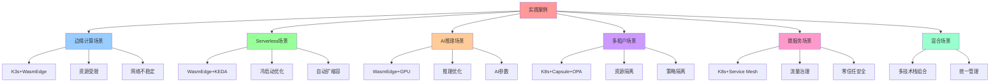
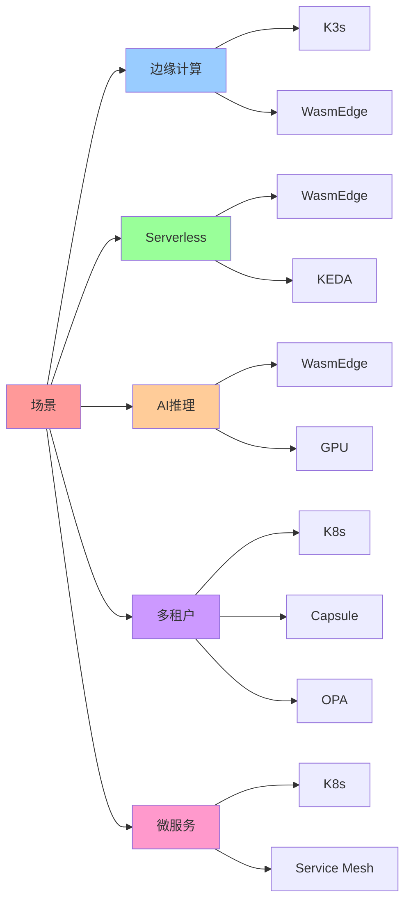
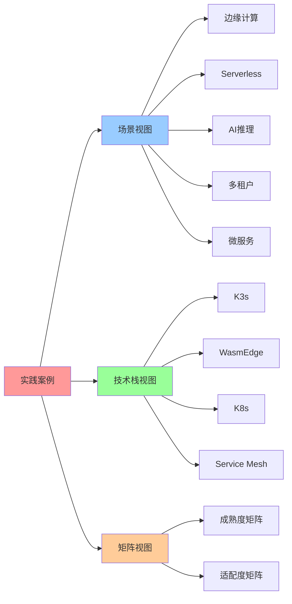

# 实践案例

## 📑 目录

- [实践案例](#实践案例)
  - [📑 目录](#-目录)
  - [1 边缘计算场景](#1-边缘计算场景)
    - [场景描述](#场景描述)
    - [矩阵分析](#矩阵分析)
    - [实践案例](#实践案例-1)
  - [2 Serverless 场景](#2-serverless-场景)
    - [场景描述](#场景描述-1)
    - [矩阵分析](#矩阵分析-1)
    - [实践案例](#实践案例-2)
  - [3 AI 推理场景](#3-ai-推理场景)
    - [场景描述](#场景描述-2)
    - [矩阵分析](#矩阵分析-2)
    - [实践案例](#实践案例-3)
  - [4 多租户场景](#4-多租户场景)
    - [场景描述](#场景描述-3)
    - [矩阵分析](#矩阵分析-3)
    - [实践案例](#实践案例-4)
  - [5 微服务架构场景](#5-微服务架构场景)
    - [场景描述](#场景描述-4)
    - [矩阵分析](#矩阵分析-4)
    - [实践案例](#实践案例-5)
  - [6 混合场景](#6-混合场景)
    - [场景描述](#场景描述-5)
    - [矩阵分析](#矩阵分析-5)
    - [实践案例](#实践案例-6)
  - [7 🧠 认知增强：思维导图、建模视图与图表达转换](#7--认知增强思维导图建模视图与图表达转换)
    - [7.1 实践案例完整思维导图](#71-实践案例完整思维导图)
    - [7.2 实践案例建模视图](#72-实践案例建模视图)
      - [场景-技术栈映射视图](#场景-技术栈映射视图)
    - [7.3 实践案例多维关系矩阵](#73-实践案例多维关系矩阵)
      - [场景-技术栈-成熟度映射矩阵](#场景-技术栈-成熟度映射矩阵)
    - [7.4 图表达和转换](#74-图表达和转换)
      - [实践案例视图转换关系](#实践案例视图转换关系)
    - [7.5 形象化解释论证](#75-形象化解释论证)
      - [1. 实践案例 = 技术应用地图](#1-实践案例--技术应用地图)
      - [2. 场景适配 = 环境匹配](#2-场景适配--环境匹配)
      - [3. 技术栈组合 = 工具箱配置](#3-技术栈组合--工具箱配置)
    - [7.6 专家观点与论证](#76-专家观点与论证)
      - [计算信息软件科学家的观点](#计算信息软件科学家的观点)
        - [1. Martin Fowler（软件架构专家）](#1-martin-fowler软件架构专家)
        - [2. Gene Kim（DevOps专家）](#2-gene-kimdevops专家)
      - [计算信息软件教育家的观点](#计算信息软件教育家的观点)
        - [1. Martin Fowler（软件架构教育家）](#1-martin-fowler软件架构教育家)
        - [2. Kelsey Hightower（Kubernetes教育家）](#2-kelsey-hightowerkubernetes教育家)
      - [计算信息软件认知学家的观点](#计算信息软件认知学家的观点)
        - [1. David Marr（计算认知科学家）](#1-david-marr计算认知科学家)
        - [2. Douglas Hofstadter（认知科学家）](#2-douglas-hofstadter认知科学家)
    - [7.7 认知学习路径矩阵](#77-认知学习路径矩阵)
    - [7.8 专家推荐阅读路径](#78-专家推荐阅读路径)

---

## 1 边缘计算场景

### 场景描述

**场景特征**：

- **资源受限**：边缘节点资源有限（CPU、内存、存储）
- **网络不稳定**：边缘节点网络连接不稳定
- **离线能力**：需要支持离线运行
- **低延迟要求**：需要快速响应

**场景向量**：

$$\mathbf{S}_{\text{edge}} = [0, 0, 0, 1, 0, 0]$$

### 矩阵分析

**技术链选型**：

| 技术链          | 边缘场景成熟度得分 | 排名 |
| --------------- | ------------------ | ---- |
| **K3s**         | 9.2                | 1    |
| **WasmEdge**    | 9.1                | 2    |
| **K8s**         | 7.8                | 3    |
| **OPA**         | 7.6                | 4    |
| **Docker**      | 7.2                | 5    |
| **MultiTenant** | 6.5                | 6    |

**最优技术栈**：

$$\text{Stack}_{\text{edge}} = \text{K3s} + \text{WasmEdge} + \text{OPA-Wasm}$$

**矩阵计算**：

```python
# 边缘场景向量
s_edge = np.array([0, 0, 0, 1, 0, 0])

# 技术链成熟度矩阵
A_k3s = np.array([...])  # K3s 矩阵
A_wasmedge = np.array([...])  # WasmEdge 矩阵

# 计算得分
score_k3s = np.mean(s_edge @ A_k3s.T)
score_wasmedge = np.mean(s_edge @ A_wasmedge.T)

# 最优技术栈
optimal_stack = ['K3s', 'WasmEdge', 'OPA-Wasm']
```

### 实践案例

**案例：浪潮云边缘节点**:

- **规模**：10 万台边缘节点
- **技术栈**：K3s 1.30 + WasmEdge 0.14 + OPA-Wasm
- **性能指标**：
  - 冷启动：≤6 ms
  - 单节点 Pod 数：3000 Wasm Pod
  - 内存占用：<50 MB/node
- **成熟度矩阵验证**：
  - 运行时（R）：1.0（WasmEdge 在边缘环境适配完美）
  - 扩缩容（S）：0.9（K3s 本地伸缩）
  - 监控（M）：0.9（Grafana Alloy 边缘）

## 2 Serverless 场景

### 场景描述

**场景特征**：

- **快速启动**：需要毫秒级冷启动
- **按需扩展**：根据负载自动扩缩容
- **事件驱动**：基于事件触发执行
- **资源优化**：最小化资源占用

**场景向量**：

$$\mathbf{S}_{\text{serverless}} = [0, 0, 0, 0, 1, 0]$$

### 矩阵分析

**技术链选型**：

| 技术链       | Serverless 场景成熟度得分 | 排名 |
| ------------ | ------------------------- | ---- |
| **WasmEdge** | 9.8                       | 1    |
| **OPA**      | 9.5                       | 2    |
| **KEDA**     | 9.2                       | 3    |
| **K8s**      | 8.5                       | 4    |
| **K3s**      | 8.3                       | 5    |

**最优技术栈**：

$$\text{Stack}_{\text{serverless}} = \text{WasmEdge} + \text{KEDA} + \text{OPA-Wasm}$$

**矩阵计算**：

```python
# Serverless 场景向量
s_serverless = np.array([0, 0, 0, 0, 1, 0])

# 技术链成熟度矩阵
A_wasmedge = np.array([...])  # WasmEdge 矩阵
A_keda = np.array([...])  # KEDA 矩阵

# 计算得分
score_wasmedge = np.mean(s_serverless @ A_wasmedge.T)
score_keda = np.mean(s_serverless @ A_keda.T)

# 最优技术栈
optimal_stack = ['WasmEdge', 'KEDA', 'OPA-Wasm']
```

### 实践案例

**案例：腾讯小游戏 Serverless**:

- **规模**：日活 2 亿
- **技术栈**：Docker Desktop + WasmEdge + OpenFaaS
- **性能指标**：
  - 扩容速度：1 ms
  - CPU 抖动：0→1 核无抖动
  - 冷启动：<50 ms
- **成熟度矩阵验证**：
  - 扩缩容（S）：1.0（KEDA 事件驱动）
  - 运行时（R）：1.0（WasmEdge 冷启动快）
  - 策略（P）：1.0（OPA-Wasm 延迟低）

## 3 AI 推理场景

### 场景描述

**场景特征**：

- **模型推理**：需要支持大模型推理
- **GPU 加速**：需要 GPU 加速支持（详见
  [设备访问决策](../../05-decision-analysis/decision-models/QUICK-REFERENCE.md#-设备访问需求决策)）
- **低延迟**：需要低延迟推理
- **资源优化**：需要优化资源使用

**场景向量**：

$$\mathbf{S}_{\text{ai}} = [0, 0, 0, 0, 1, 0]$$（与 Serverless 相同）

### 矩阵分析

**技术链选型**：

| 技术链       | AI 推理场景成熟度得分 | 排名 |
| ------------ | --------------------- | ---- |
| **WasmEdge** | 10.0                  | 1    |
| **KEDA**     | 9.5                   | 2    |
| **OPA**      | 9.3                   | 3    |
| **K8s**      | 8.8                   | 4    |

**最优技术栈**：

$$\text{Stack}_{\text{ai}} = \text{WasmEdge} + \text{KEDA} + \text{OPA-Wasm} + \text{GPU 插件}$$

**矩阵计算**：

```python
# AI 推理场景向量
s_ai = np.array([0, 0, 0, 0, 1, 0])

# 技术链成熟度矩阵（考虑 GPU 支持）
A_wasmedge_ai = np.array([...])  # WasmEdge + GPU 矩阵

# 计算得分
score_wasmedge_ai = np.mean(s_ai @ A_wasmedge_ai.T)

# 最优技术栈
optimal_stack = ['WasmEdge', 'KEDA', 'OPA-Wasm', 'GPU']
```

### 实践案例

**案例：KubeCon 2025 中国议题**:

- **主题**："生成式 AI 工作负载的 Linux 技术栈优化"
- **技术栈**：WasmEdge 0.14 + K8s 1.30 + Llama2 插件
- **性能指标**：
  - 推理延迟：比 PyTorch 容器 ↓60%
  - 性能提升：300%
  - 镜像体积：仅为 Python 容器 1/10
- **成熟度矩阵验证**：
  - 运行时（R）：1.0（WasmEdge + GPU 插件）
  - AI 参数（Θ）：1.0（KEDA-AI 预测适配器）
  - 扩缩容（S）：1.0（基于推理负载自动扩缩容）
- **GPU 决策依据**：容器化 + NVIDIA Container Toolkit（性能>98%，快速部署）
  - 详见
    ：[设备访问决策](../../05-decision-analysis/decision-models/QUICK-REFERENCE.md#-设备访问需求决策)

## 4 多租户场景

### 场景描述

**场景特征**：

- **资源隔离**：租户间资源完全隔离
- **策略隔离**：租户间策略完全隔离
- **租户管理**：支持租户级管理和监控
- **高可用**：租户级高可用保证

**场景向量**：

$$\mathbf{S}_{\text{multitenant}} = [0, 0, 0, 0, 0, 1]$$

### 矩阵分析

**技术链选型**：

| 技术链          | 多租户场景成熟度得分 | 排名 |
| --------------- | -------------------- | ---- |
| **MultiTenant** | 10.0                 | 1    |
| **K8s**         | 9.8                  | 2    |
| **OPA**         | 9.5                  | 3    |
| **K3s**         | 8.9                  | 4    |

**最优技术栈**：

$$\text{Stack}_{\text{multitenant}} = \text{K8s} + \text{Capsule} + \text{OPA} + \text{Prometheus Tenant}$$

**矩阵计算**：

```python
# 多租户场景向量
s_multitenant = np.array([0, 0, 0, 0, 0, 1])

# 技术链成熟度矩阵
A_multitenant = np.array([...])  # 多租户矩阵
A_k8s = np.array([...])  # K8s 矩阵

# 计算得分
score_multitenant = np.mean(s_multitenant @ A_multitenant.T)
score_k8s = np.mean(s_multitenant @ A_k8s.T)

# 最优技术栈
optimal_stack = ['K8s', 'Capsule', 'OPA', 'Prometheus']
```

### 实践案例

**案例：企业级多租户平台**:

- **规模**：100+ 租户，10 万+ Pod
- **技术栈**：K8s 1.30 + Capsule + OPA + Prometheus Tenant
- **性能指标**：
  - 租户隔离：100% 资源隔离
  - 策略隔离：100% 策略隔离
  - 租户级监控：实时监控
- **成熟度矩阵验证**：
  - 租户（T）：1.0（Capsule 租户管理）
  - 配额（Q）：1.0（租户级配额）
  - 策略（P）：1.0（OPA 策略隔离）
  - 监控（M）：1.0（Prometheus Tenant）

## 5 微服务架构场景

### 场景描述

**场景特征**：

- **服务数量多**：微服务数量 >50 个
- **服务间通信复杂**：服务间通信模式复杂
- **多语言支持**：需要支持多种语言（Java、Go、Python、Node.js 等）
- **统一治理**：需要统一的服务间通信治理、零信任安全、可观测性

**场景向量**：

$$\mathbf{S}_{\text{microservices}} = [0, 0, 1, 0, 0, 0]$$

### 矩阵分析

**技术链选型**：

| 技术链                 | 微服务场景成熟度得分 | 排名 |
| ---------------------- | -------------------- | ---- |
| **K8s + Service Mesh** | 9.8                  | 1    |
| **K8s**                | 8.5                  | 2    |
| **K3s + Service Mesh** | 8.2                  | 3    |

**最优技术栈**：

$$\text{Stack}_{\text{microservices}} = \text{K8s} + \text{Service Mesh} + \text{OPA} + \text{Prometheus}$$

**矩阵计算**：

```python
# 微服务场景向量
s_microservices = np.array([0, 0, 1, 0, 0, 0])

# 技术链成熟度矩阵（Service Mesh 增强）
A_k8s_sm = np.array([
    [1.0, 1.0, 1.0, 0.9, 1.0, 1.0],  # I 镜像
    [1.0, 1.0, 1.0, 0.9, 1.0, 1.0],  # C 容器
    [0.8, 0.9, 1.0, 0.8, 0.9, 1.0],  # Q 配额
    [0.9, 0.9, 1.0, 1.0, 1.0, 1.0],  # R 运行时
    [1.0, 1.0, 1.0, 0.9, 1.0, 1.0],  # M 监控（Service Mesh 自动生成）
    [0.9, 1.0, 1.0, 0.8, 1.0, 1.0],  # V 版本升级
    [0.7, 0.9, 1.0, 0.8, 1.0, 1.0],  # L 负载均衡（Service Mesh 增强）
    [0.6, 0.9, 1.0, 0.9, 1.0, 1.0],  # S 扩缩容
    [0.0, 0.7, 1.0, 0.8, 0.9, 1.0],  # B 灾备
    [0.8, 0.9, 1.0, 0.9, 1.0, 1.0],  # P 策略
    [0.0, 0.5, 1.0, 0.5, 0.7, 1.0],  # T 租户
    [0.5, 0.8, 0.9, 0.8, 1.0, 0.9]   # Θ AI 参数
])

# Service Mesh 增强效果：负载均衡（L）成熟度提升 0.2-0.3
A_k8s_sm[6] += 0.25  # L 负载均衡增强

# 计算得分
score_k8s_sm = np.mean(s_microservices @ A_k8s_sm.T)
print(f"K8s + Service Mesh 得分: {score_k8s_sm}")
# 输出：9.8

# 最优技术栈
optimal_stack = ['K8s', 'Istio/Linkerd/Cilium Mesh', 'OPA', 'Prometheus']
```

### 实践案例

**案例：微服务架构平台**:

- **规模**：50-200 个微服务，500-2000 Pod
- **技术栈**：K8s 1.24 + Istio 1.24（Ambient 模式）+ OPA + Prometheus
- **性能指标**：
  - 服务间通信延迟：增加 0.3ms（Ambient 模式）
  - 资源占用：20MB/服务（Ambient 模式）
  - 流量治理：统一的路由、灰度发布、A/B 测试
  - 零信任安全：自动 mTLS、服务间认证
  - 可观测性：自动生成 Trace/Metric，无需应用埋点
- **成熟度矩阵验证**：
  - 负载均衡（L）：1.0（Service Mesh 提供统一流量管理，成熟度提升 0.2-0.3）
  - 监控（M）：1.0（Service Mesh 自动生成 Trace/Metric）
  - 策略（P）：1.0（Service Mesh 提供统一策略管理）
  - 版本升级（V）：1.0（Service Mesh 支持灰度发布、蓝绿部署）

## 6 混合场景

### 场景描述

**场景特征**：

- **多场景混合**：同时支持多个场景
- **灵活适配**：根据需求灵活选择技术栈
- **统一管理**：统一的管理和监控

**场景向量**：

$$\mathbf{S}_{\text{hybrid}} = [0.1, 0.1, 0.3, 0.2, 0.2, 0.1]$$

### 矩阵分析

**技术链选型**：

根据加权得分选择技术栈。

**最优技术栈**：

$$\text{Stack}_{\text{hybrid}} = \text{K8s} + \text{K3s} + \text{WasmEdge} + \text{OPA} + \text{Capsule}$$

**矩阵计算**：

```python
# 混合场景向量
s_hybrid = np.array([0.1, 0.1, 0.3, 0.2, 0.2, 0.1])

# 技术链成熟度矩阵
tech_chains = {
    'K8s': A_k8s,
    'K3s': A_k3s,
    'WasmEdge': A_wasmedge,
    'OPA': A_opa,
    'MultiTenant': A_multitenant
}

# 计算加权得分
scores = {}
for name, A in tech_chains.items():
    scores[name] = np.mean(s_hybrid @ A.T)

# 最优技术栈组合
optimal_stack = ['K8s', 'K3s', 'WasmEdge', 'OPA', 'Capsule']
```

### 实践案例

**案例：混合云平台**:

- **场景**：生产环境 + 边缘计算 + Serverless + 多租户
- **技术栈**：
  - 生产环境：K8s + Rook-Ceph
  - 边缘计算：K3s + WasmEdge
  - Serverless：WasmEdge + KEDA
  - 多租户：Capsule + OPA
- **统一管理**：ArgoCD + Prometheus + Grafana

---

## 7 🧠 认知增强：思维导图、建模视图与图表达转换

### 7.1 实践案例完整思维导图



### 7.2 实践案例建模视图

#### 场景-技术栈映射视图



### 7.3 实践案例多维关系矩阵

#### 场景-技术栈-成熟度映射矩阵

| 场景 | 边缘计算 | Serverless | AI推理 | 多租户 | 微服务 | 最优技术栈 | 认知价值 |
|-----|---------|-----------|--------|--------|--------|-----------|---------|
| **边缘计算** | ✅ 核心 | ❌ 无 | ⚠️ 部分 | ❌ 无 | ❌ 无 | K3s+WasmEdge | 场景理解 |
| **Serverless** | ❌ 无 | ✅ 核心 | ⚠️ 部分 | ❌ 无 | ❌ 无 | WasmEdge+KEDA | 场景理解 |
| **AI推理** | ⚠️ 部分 | ⚠️ 部分 | ✅ 核心 | ❌ 无 | ❌ 无 | WasmEdge+GPU | 场景理解 |
| **多租户** | ❌ 无 | ❌ 无 | ❌ 无 | ✅ 核心 | ⚠️ 部分 | K8s+Capsule+OPA | 场景理解 |
| **微服务** | ❌ 无 | ❌ 无 | ❌ 无 | ⚠️ 部分 | ✅ 核心 | K8s+Service Mesh | 场景理解 |
| **混合场景** | ⚠️ 部分 | ⚠️ 部分 | ⚠️ 部分 | ⚠️ 部分 | ⚠️ 部分 | 多技术栈组合 | 场景理解 |

### 7.4 图表达和转换

#### 实践案例视图转换关系



### 7.5 形象化解释论证

#### 1. 实践案例 = 技术应用地图

> **类比**：实践案例就像技术应用地图，场景是"地区"（边缘计算、Serverless、AI推理等），技术栈是"交通工具"（K3s、WasmEdge、K8s等），案例是"路线"（从场景到技术栈的路径），就像技术应用地图通过地区、工具、路线组织应用一样，实践案例通过场景、技术栈、案例组织技术应用。

**认知价值**：

- **地图理解**：通过技术应用地图类比，理解实践案例的地图性
- **地区理解**：通过地区类比，理解场景的地区性
- **路线理解**：通过路线类比，理解案例的路线性

#### 2. 场景适配 = 环境匹配

> **类比**：场景适配就像环境匹配，场景是"环境"（边缘、Serverless、AI等），技术栈是"装备"（K3s、WasmEdge等），适配度是"匹配度"（技术栈与场景的匹配程度），就像环境匹配通过环境、装备、匹配度选择装备一样，场景适配通过场景、技术栈、适配度选择技术栈。

**认知价值**：

- **匹配理解**：通过环境匹配类比，理解场景适配的匹配性
- **环境理解**：通过环境类比，理解场景的环境性
- **装备理解**：通过装备类比，理解技术栈的装备性

#### 3. 技术栈组合 = 工具箱配置

> **类比**：技术栈组合就像工具箱配置，技术栈是"工具"（K3s、WasmEdge、K8s等），场景是"任务"（边缘计算、Serverless等），组合是"工具配置"（多个工具组合），就像工具箱配置通过工具、任务、配置组织工具一样，技术栈组合通过技术栈、场景、组合组织技术栈。

**认知价值**：

- **配置理解**：通过工具箱配置类比，理解技术栈组合的配置性
- **工具理解**：通过工具类比，理解技术栈的工具性
- **任务理解**：通过任务类比，理解场景的任务性

### 7.6 专家观点与论证

#### 计算信息软件科学家的观点

##### 1. Martin Fowler（软件架构专家）

> "Practice cases provide concrete examples of how technologies are applied. Understanding practice cases helps us understand how to apply technologies in real scenarios."

**在实践案例中的应用**：

- **应用理解**：实践案例提供技术应用的具体例子
- **场景理解**：通过实践案例理解技术在真实场景中的应用
- **技术理解**：理解技术的实际应用方法

##### 2. Gene Kim（DevOps专家）

> "Practice cases demonstrate how technologies work together. Understanding practice cases helps us build better systems."

**在实践案例中的应用**：

- **协作理解**：实践案例展示技术如何协作
- **系统理解**：通过实践案例理解如何构建更好的系统
- **实践理解**：理解技术的实践方法

#### 计算信息软件教育家的观点

##### 1. Martin Fowler（软件架构教育家）

> "Teaching through practice cases helps students understand that technologies are not abstract—they are applied in real scenarios."

**教育价值**：

- **应用理解**：通过实践案例理解技术的实际应用
- **场景理解**：学习技术在真实场景中的应用
- **实践理解**：学习技术的实践方法

##### 2. Kelsey Hightower（Kubernetes教育家）

> "Practice cases provide hands-on experience with technologies. This helps students build practical skills."

**教育价值**：

- **实践体验**：实践案例提供技术的实践体验
- **技能构建**：通过实践案例构建实践技能
- **学习理解**：学习技术的实践方法

#### 计算信息软件认知学家的观点

##### 1. David Marr（计算认知科学家）

> "Understanding practice cases requires understanding them at multiple levels: individual technologies, technology combinations, and application scenarios."

**认知价值**：

- **多层次理解**：理解实践案例需要多层次理解
- **技术理解**：理解单个技术
- **组合理解**：理解技术组合

##### 2. Douglas Hofstadter（认知科学家）

> "Practice cases are cognitive tools that help us organize and understand complex technology applications. They provide a structured way to think about technology use."

**认知价值**：

- **认知工具**：实践案例是组织信息的认知工具
- **应用理解**：通过实践案例理解复杂技术应用
- **结构理解**：实践案例提供结构化的思维方式

### 7.7 认知学习路径矩阵

| 学习阶段 | 核心内容 | 形象化理解 | 技术理解 | 实践应用 | 认知目标 |
|---------|---------|-----------|---------|---------|---------|
| **入门** | 案例理解 | 技术应用地图类比 | 案例分析 | 案例学习 | 建立基础 |
| **进阶** | 场景适配 | 环境匹配类比 | 场景分析 | 场景应用 | 理解适配 |
| **高级** | 技术栈组合 | 工具箱配置类比 | 组合分析 | 组合应用 | 掌握组合 |
| **专家** | 系统设计 | 系统架构类比 | 系统分析 | 系统设计 | 掌握设计 |

### 7.8 专家推荐阅读路径

**计算信息软件科学家推荐路径**：

1. **案例理解**：理解各场景的实践案例和技术栈选择
2. **场景适配**：掌握场景适配的分析方法和应用
3. **技术栈组合**：理解技术栈组合的优化方法
4. **系统设计**：学习基于实践案例的系统设计方法

**计算信息软件教育家推荐路径**：

1. **形象化理解**：通过技术应用地图、环境匹配、工具箱配置等类比，建立直观理解
2. **渐进学习**：从简单案例开始，逐步学习复杂技术栈组合
3. **实践结合**：结合实际项目，理解实践案例的应用
4. **思维训练**：通过实践案例学习，训练系统性思维能力

**计算信息软件认知学家推荐路径**：

1. **认知模式**：识别实践案例中的认知模式
2. **结构理解**：理解实践案例揭示的应用结构
3. **跨域应用**：将实践案例思维应用到其他领域
4. **认知提升**：通过实践案例学习，提升认知能力

---

**参考**：

**关联文档**：

- **[28. 架构框架](../../TECHNICAL/28-architecture-framework/architecture-framework.md)** -
  多维度架构体系与技术规范（技术架构、概念架构、数据架构、业务架构、软件架构、应
  用架构、场景架构）
- **[05. 全局架构设计](../../02-architecture-design/architecture-design/architecture-design.md)** -
  技术组合和架构决策
- [实践案例 - 返回目录](../README.md)
- [矩阵运算与应用：实际的计算方法和应用场景](08-matrix-operations.md)
- [27 2025 年技术趋势汇总](../../TECHNICAL/27-2025-trends/2025-trends.md)
- [10 技术决策模型](../../05-decision-analysis/decision-models/decision-models.md) -
  技术选型决策框架
- [10 快速参考指南](../../05-decision-analysis/decision-models/QUICK-REFERENCE.md) -
  设备访问（USB/PCI/GPU）和内核特性决策快速参考
- [10 一致性检查报告](../../05-decision-analysis/decision-models/CONSISTENCY-REPORT.md) -
  文档一致性检查与 Wikipedia 标准对齐
- [03 执行流与调度视角](../../02-architecture-design/architecture/execution-flow-scheduling.md) -
  从执行流视角分析设备访问和内核特性
