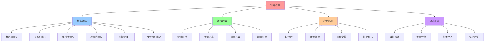

# 09. 矩阵视角：云原生技术栈的矩阵力学

## 📑 目录

- [09. 矩阵视角：云原生技术栈的矩阵力学](#09-矩阵视角云原生技术栈的矩阵力学)
  - [📑 目录](#-目录)
  - [1 目录结构](#1-目录结构)
  - [2 快速导航](#2-快速导航)
  - [3 文档定位](#3-文档定位)
  - [4 矩阵视角数学基础](#4-矩阵视角数学基础)
  - [5 核心概念](#5-核心概念)
    - [5.1 12 维原子概念向量](#51-12-维原子概念向量)
    - [5.2 6 维场景向量](#52-6-维场景向量)
    - [5.3 技术链序列](#53-技术链序列)
  - [6 参考](#6-参考)
  - [7 认知增强：思维导图、知识矩阵与专家观点](#7-认知增强思维导图知识矩阵与专家观点)
    - [7.1 矩阵视角完整思维导图](#71-矩阵视角完整思维导图)
    - [7.2 知识多维关系矩阵](#72-知识多维关系矩阵)
      - [12维原子概念多维关系矩阵](#12维原子概念多维关系矩阵)
      - [场景变换多维关系矩阵](#场景变换多维关系矩阵)
    - [7.3 形象化解释论证](#73-形象化解释论证)
      - [矩阵视角的形象化类比](#矩阵视角的形象化类比)
        - [1. 概念向量 = 技术DNA](#1-概念向量--技术dna)
        - [2. 关系矩阵 = 城市交通网络](#2-关系矩阵--城市交通网络)
        - [3. 场景向量 = 环境参数](#3-场景向量--环境参数)
        - [4. 变换矩阵 = 转换工厂](#4-变换矩阵--转换工厂)
    - [7.4 专家观点与论证](#74-专家观点与论证)
      - [计算信息软件科学家的观点](#计算信息软件科学家的观点)
        - [1. Gilbert Strang（线性代数专家）](#1-gilbert-strang线性代数专家)
        - [2. Terence Tao（数学家）](#2-terence-tao数学家)
        - [3. Geoffrey Hinton（深度学习专家）](#3-geoffrey-hinton深度学习专家)
      - [计算信息软件教育家的观点](#计算信息软件教育家的观点)
        - [1. Gilbert Strang（MIT教授）](#1-gilbert-strangmit教授)
        - [2. David Lay（线性代数教材作者）](#2-david-lay线性代数教材作者)
      - [计算信息软件认知学家的观点](#计算信息软件认知学家的观点)
        - [1. David Marr（计算认知科学家）](#1-david-marr计算认知科学家)
        - [2. Douglas Hofstadter（认知科学家）](#2-douglas-hofstadter认知科学家)
    - [7.5 认知学习路径矩阵](#75-认知学习路径矩阵)
    - [7.6 专家推荐阅读路径](#76-专家推荐阅读路径)

---

## 1 目录结构

```text
09-matrix-perspective/
├── README.md                    # 文档主索引
├── QUICK-REFERENCE.md           # 快速参考指南
├── SUMMARY.md                   # 文档体系总结
├── CHECKLIST.md                # 文档完整性检查清单
├── 01-core-concepts.md          # 核心概念矩阵（12维概念向量）
├── 02-relation-matrix.md         # 关系矩阵（依赖、转换、组合）
├── 03-attribute-matrix.md        # 属性矩阵（概念属性在不同场景下的表现）
├── 04-scene-transformation.md    # 场景变换矩阵（场景间的迁移和转换）
├── 05-operation-transformation.md # 操作变换矩阵（构建、部署、扩缩容等）
├── 06-tech-chain-sequence.md     # 技术链矩阵序列（Docker→K8s→K3s→WasmEdge→OPA→多租户）
├── 07-ai-parameters.md           # AI 可学习参数矩阵
├── 08-matrix-operations.md       # 矩阵运算与应用
├── 09-practice-cases.md          # 实践案例
└── REFERENCES.md                 # 参考链接

```

## 2 快速导航

- **[快速参考指南](QUICK-REFERENCE.md)** - 核心概念、公式、决策表速查
- **[文档体系总结](SUMMARY.md)** - 矩阵视角文档体系完整总结
- **[完整性检查清单](CHECKLIST.md)** - 文档完整性验证清单
- **[核心概念矩阵](01-core-concepts.md)** - 12 维原子概念向量、6 维场景向量、变
  换算子
- **[关系矩阵](02-relation-matrix.md)** - 概念之间的依赖、转换、组合关系
- **[属性矩阵](03-attribute-matrix.md)** - 概念属性在不同场景下的表现
- **[场景变换矩阵](04-scene-transformation.md)** - 场景间的迁移和转换规则
- **[操作变换矩阵](05-operation-transformation.md)** - 各种操作的矩阵表示
- **[技术链矩阵序列](06-tech-chain-sequence.md)** - Docker→K8s→K3s→WasmEdge→OPA→
  多租户的矩阵序列
- **[AI 参数矩阵](07-ai-parameters.md)** - AI 可学习参数矩阵
- **[矩阵运算与应用](08-matrix-operations.md)** - 实际的计算方法和应用场景
- **[实践案例](09-practice-cases.md)** - 边缘计算、Serverless、AI 推理、多租户等
  场景的矩阵分析

## 3 文档定位

本文档从**矩阵视角**（Matrix Perspective）审视云原生容器技术栈，将系统抽象为**概
念矩阵**、**关系矩阵**、**属性矩阵**、**场景矩阵**和**变换矩阵**等数学结构，揭示
技术本质的数学规律和可计算的决策机制。

**为什么选择矩阵视角而非范畴论**：

- **矩阵视角更直观**：矩阵运算直接对应实际的工程操作（部署、迁移、扩缩容等）
- **矩阵视角可计算**：通过矩阵乘法、张量运算等可以直接得到决策结果
- **矩阵视角易扩展**：AI 可学习参数可以自然地嵌入矩阵结构
- **矩阵视角实用性强**：矩阵元素直接对应技术成熟度、性能指标等可观测量
- **矩阵视角场景适配**：通过场景向量与矩阵的运算，可以直接得到场景适配度

## 4 矩阵视角数学基础

$$\text{云原生技术栈} = \{ \mathbf{E}, \mathbf{R}, \mathbf{A}, \mathbf{S}, \mathbf{T}, \boldsymbol{\Theta} \}$$

其中：

- $\mathbf{E} \in \mathbb{R}^{12 \times 1}$：12 维原子概念向量
- $\mathbf{R} \in \mathbb{R}^{12 \times 12}$：概念关系矩阵
- $\mathbf{A} \in \mathbb{R}^{12 \times 6 \times 2}$：属性张量（概念 × 场景 × 时
  间）
- $\mathbf{S} \in \mathbb{R}^{1 \times 6}$：场景向量
- $\mathbf{T} \in \mathbb{R}^{12 \times 12}$：变换矩阵
- $\boldsymbol{\Theta} \in \mathbb{R}^{12 \times 12}$：AI 可学习参数矩阵（对角）

## 5 核心概念

### 5.1 12 维原子概念向量

| 编号 | 符号  | 概念                        | 2025 代表实例                              |
| ---- | ----- | --------------------------- | ------------------------------------------ |
| e₁   | **I** | Image 镜像                  | `yourhub/app:v1.2.0@sha256:abc`            |
| e₂   | **C** | Container 容器运行时实例    | `containerd cri-container`                 |
| e₃   | **Q** | Quota 配额                  | `ResourceQuota/LimitRange`                 |
| e₄   | **R** | RuntimeTransform 运行时切换 | `runc ↔ crun ↔ wasm`                       |
| e₅   | **M** | Monitor 观测                | `Prometheus + OTEL`                        |
| e₆   | **V** | VersionUpgrade 版本变更     | `Git → Flux → RollingUpdate`               |
| e₇   | **L** | LoadBalance 负载均衡        | `Cilium L4/L7 + Envoy Wasm + Service Mesh` |
| e₈   | **S** | Scale 扩缩容                | `HPA/VPA/CA/KEDA`                          |
| e₉   | **B** | BackupRestore 灾备          | `Velero + VolumeSnapshot`                  |
| e₁₀  | **P** | Policy 策略                 | `OPA/Gatekeeper + OPA-Wasm`                |
| e₁₁  | **T** | Tenant 隔离                 | `Capsule/HNC/Cluster-API-Nested`           |
| e₁₂  | **Θ** | AI-Parameter 可学习参数     | `KEDA-AI/Fluid-AI/Volcano-AI`              |

### 5.2 6 维场景向量

$$\mathbf{S} = [\text{本地开发}, \text{CI/测试}, \text{在线生产}, \text{边缘/IoT}, \text{Serverless/AI}, \text{多租户平台}]$$

### 5.3 技术链序列

$$\text{技术链} = \text{Docker} \rightarrow \text{K8s} \rightarrow \text{K3s} \rightarrow \text{WasmEdge} \rightarrow \text{Service Mesh} \rightarrow \text{OPA} \rightarrow \text{多租户}$$

**技术链增强**：

- **Service Mesh**：作为 K8s/K3s 的增强层，提供服务间通信治理、零信任安全、可观
  测性
- **增强效果**：负载均衡（L）概念成熟度在所有场景下提升 0.2-0.3

## 6 参考

**关联文档**：

- **[28. 架构框架](../../TECHNICAL/28-architecture-framework/architecture-framework.md)** -
  多维度架构体系与技术规范（技术架构、概念架构、数据架构、业务架构、软件架构、应
  用架构、场景架构）
- **[05. 全局架构设计](../../02-architecture-design/architecture-design/architecture-design.md)** -
  技术组合和架构决策
- [ai_view.md](../../ai_view.md) - 核心矩阵内容的原始来源
- [27. 2025 年技术趋势汇总](../../TECHNICAL/10-reference-trends/2025-trends/2025-trends.md) - 最
  新技术趋势
- [06. 问题-解决方案矩阵](../../02-architecture-design/problem-solution-matrix/problem-solution-matrix.md) -
  问题解决方案矩阵
- [07. 形式化理论](../formal-theory/formal-theory.md) - 形式化理论基础
- [10. 技术决策模型](../../05-decision-analysis/decision-models/decision-models.md) -
  技术选型决策框架
- [10. 快速参考指南](../../05-decision-analysis/decision-models/QUICK-REFERENCE.md) -
  设备访问（USB/PCI/GPU）和内核特性决策快速参考
- [10. 一致性检查报告](../../05-decision-analysis/decision-models/CONSISTENCY-REPORT.md) -
  文档一致性检查与 Wikipedia 标准对齐

---

## 7 认知增强：思维导图、知识矩阵与专家观点

### 7.1 矩阵视角完整思维导图



### 7.2 知识多维关系矩阵

#### 12维原子概念多维关系矩阵

| 概念维度 | 概念符号 | 概念名称 | 技术映射 | 数学表示 | 场景适配 | 性能特征 | 认知价值 |
|---------|---------|---------|---------|---------|---------|---------|---------|
| **e₁ I** | I | Image镜像 | Dockerfile、OCI | 向量分量 | 所有场景 | 构建优化 | 构建抽象 |
| **e₂ C** | C | Container容器 | containerd、runc | 向量分量 | 所有场景 | 轻量快速 | 运行时抽象 |
| **e₃ Q** | Q | Quota配额 | ResourceQuota | 向量分量 | 多租户 | 资源限制 | 资源抽象 |
| **e₄ R** | R | RuntimeTransform | runc↔crun↔wasm | 向量分量 | 边缘、Serverless | 运行时切换 | 转换抽象 |
| **e₅ M** | M | Monitor观测 | Prometheus+OTEL | 向量分量 | 所有场景 | 可观测性 | 监控抽象 |
| **e₆ V** | V | VersionUpgrade | Git→Flux | 向量分量 | CI/CD | 版本管理 | 版本抽象 |
| **e₇ L** | L | LoadBalance | Cilium+Envoy | 向量分量 | 微服务 | 负载均衡 | 网络抽象 |
| **e₈ S** | S | Scale扩缩容 | HPA/VPA/CA | 向量分量 | 弹性应用 | 自动扩缩 | 弹性抽象 |
| **e₉ B** | B | BackupRestore | Velero | 向量分量 | 生产环境 | 灾备恢复 | 可靠性抽象 |
| **e₁₀ P** | P | Policy策略 | OPA/Gatekeeper | 向量分量 | 多租户、安全 | 策略控制 | 安全抽象 |
| **e₁₁ T** | T | Tenant隔离 | Capsule/HNC | 向量分量 | 多租户 | 租户隔离 | 隔离抽象 |
| **e₁₂ Θ** | Θ | AI-Parameter | KEDA-AI | 向量分量 | AI推理 | 智能优化 | 智能抽象 |

#### 场景变换多维关系矩阵

| 场景维度 | 本地开发 | CI/测试 | 在线生产 | 边缘/IoT | Serverless/AI | 多租户平台 | 变换矩阵 | 认知价值 |
|---------|---------|---------|---------|----------|---------------|-----------|---------|---------|
| **概念适配** | I,C,M,V | I,C,M,V,L | I,C,M,V,L,S,B | I,C,R,M | I,C,R,M,S,Θ | I,C,Q,M,P,T | T矩阵 | 场景理解 |
| **性能要求** | 快速迭代 | 快速验证 | 高可用 | 低延迟 | 极速启动 | 资源隔离 | 属性矩阵 | 性能理解 |
| **技术栈** | Docker Compose | K3s | Kubernetes | K3s+WasmEdge | WasmEdge+OPA | Kubernetes+OPA | 技术链 | 技术理解 |

### 7.3 形象化解释论证

#### 矩阵视角的形象化类比

##### 1. 概念向量 = 技术DNA

> **类比**：12维概念向量就像技术DNA，每个维度（I、C、Q、R等）是DNA的一个基因，通过不同基因的组合（向量运算），可以构建不同的技术栈（生物体），就像DNA组合产生不同生物一样。

**认知价值**：

- **基因理解**：通过DNA类比，理解概念向量的基因性质
- **组合理解**：通过DNA组合类比，理解向量运算的组合作用
- **多样性理解**：通过生物多样性类比，理解技术栈的多样性

##### 2. 关系矩阵 = 城市交通网络

> **类比**：关系矩阵就像城市交通网络，矩阵元素是道路（关系），矩阵乘法是路径规划（关系组合），就像交通网络规划路径一样。

**认知价值**：

- **网络理解**：通过交通网络类比，理解关系矩阵的网络结构
- **路径理解**：通过路径规划类比，理解矩阵乘法的路径作用
- **连接理解**：通过道路连接类比，理解概念之间的连接关系

##### 3. 场景向量 = 环境参数

> **类比**：场景向量就像环境参数，不同场景（本地开发、生产环境等）是不同的环境条件，通过场景向量与概念向量的运算，可以得到场景适配度（环境适应性），就像环境参数影响生物适应性一样。

**认知价值**：

- **环境理解**：通过环境参数类比，理解场景向量的环境性质
- **适配理解**：通过环境适应性类比，理解场景适配的计算方法
- **选择理解**：通过环境选择类比，理解技术选型的场景适配

##### 4. 变换矩阵 = 转换工厂

> **类比**：变换矩阵就像转换工厂，输入一种技术（输入向量），经过变换矩阵（工厂生产线），输出另一种技术（输出向量），就像转换工厂将原材料转换为产品一样。

**认知价值**：

- **转换理解**：通过转换工厂类比，理解变换矩阵的转换作用
- **流程理解**：通过生产线类比，理解变换的流程
- **结果理解**：通过产品类比，理解变换的结果

### 7.4 专家观点与论证

#### 计算信息软件科学家的观点

##### 1. Gilbert Strang（线性代数专家）

> "Matrices are the language of linear transformations. Understanding matrices is understanding how systems transform and evolve."

**在矩阵视角中的应用**：

- **变换理解**：矩阵是线性变换的语言，理解矩阵就是理解系统变换
- **演化理解**：通过矩阵，我们可以理解系统的演化过程
- **系统理解**：矩阵视角帮助我们理解系统变换

##### 2. Terence Tao（数学家）

> "Matrix operations provide a powerful computational framework for understanding complex systems. They allow us to reason about systems at a high level of abstraction."

**在矩阵视角中的应用**：

- **计算框架**：矩阵运算提供了强大的计算框架
- **抽象理解**：通过矩阵，我们可以在高层次抽象上推理系统
- **系统理解**：矩阵视角帮助我们理解复杂系统

##### 3. Geoffrey Hinton（深度学习专家）

> "Matrices are the fundamental building blocks of neural networks. Understanding matrix operations is essential for understanding how AI systems learn and make decisions."

**在矩阵视角中的应用**：

- **基础构建**：矩阵是AI系统的基础构建块
- **学习理解**：通过矩阵，我们可以理解AI系统的学习过程
- **决策理解**：矩阵视角帮助我们理解AI决策过程

#### 计算信息软件教育家的观点

##### 1. Gilbert Strang（MIT教授）

> "Teaching linear algebra through matrices helps students understand that many complex problems can be solved through simple matrix operations."

**教育价值**：

- **简化理解**：矩阵运算帮助学生理解复杂问题的简化方法
- **操作理解**：通过矩阵运算，学生可以理解简单操作的力量
- **问题解决**：矩阵视角帮助学生解决复杂问题

##### 2. David Lay（线性代数教材作者）

> "Matrices provide a visual and computational way to understand linear transformations. This makes abstract concepts more concrete and accessible."

**教育价值**：

- **可视化理解**：矩阵提供了可视化的方式理解线性变换
- **具体化理解**：通过矩阵，抽象概念变得更加具体
- **可访问性**：矩阵视角使抽象概念更容易理解

#### 计算信息软件认知学家的观点

##### 1. David Marr（计算认知科学家）

> "Matrix representations allow us to encode complex information in a structured way. This structured encoding is essential for cognitive processing."

**认知价值**：

- **编码理解**：矩阵表示帮助我们以结构化方式编码复杂信息
- **认知处理**：结构化编码对认知处理至关重要
- **信息理解**：矩阵视角帮助我们理解信息处理

##### 2. Douglas Hofstadter（认知科学家）

> "Matrices teach us to think in terms of transformations and relationships. This is a fundamental cognitive skill that applies to many domains."

**认知价值**：

- **变换思维**：矩阵训练我们从变换角度思考
- **关系理解**：通过矩阵，我们可以理解关系
- **认知技能**：矩阵视角训练了我们的基本认知技能

### 7.5 认知学习路径矩阵

| 学习阶段 | 核心概念 | 形象化理解 | 数学理解 | 实践应用 | 认知目标 |
|---------|---------|-----------|---------|---------|---------|
| **入门** | 12维概念向量 | 技术DNA类比 | 向量运算 | 技术选型 | 建立直觉 |
| **进阶** | 关系矩阵、属性矩阵 | 交通网络、环境参数类比 | 矩阵运算、张量运算 | 场景转换 | 理解矩阵 |
| **高级** | 变换矩阵、AI参数 | 转换工厂、学习系统类比 | 线性变换、机器学习 | 智能优化 | 掌握变换 |
| **专家** | 矩阵序列、多维分析 | 深层结构类比 | 张量分析、优化理论 | 系统设计 | 灵活应用 |

### 7.6 专家推荐阅读路径

**计算信息软件科学家推荐路径**：

1. **数学基础**：从线性代数开始，理解矩阵的数学基础
2. **概念理解**：理解12维概念向量和6维场景向量
3. **矩阵运算**：掌握矩阵运算和张量运算
4. **理论应用**：将矩阵视角应用到技术选型和系统设计

**计算信息软件教育家推荐路径**：

1. **形象化理解**：通过技术DNA、交通网络等类比，建立直观理解
2. **渐进学习**：从简单向量开始，逐步学习复杂矩阵
3. **实践结合**：结合实际案例，理解矩阵应用
4. **思维训练**：通过矩阵视角，训练线性思维和变换思维

**计算信息软件认知学家推荐路径**：

1. **认知模式**：识别矩阵视角中的认知模式
2. **编码理解**：理解矩阵表示的信息编码方式
3. **跨域应用**：将矩阵思维应用到其他领域
4. **认知提升**：通过矩阵视角，提升认知能力

---

**最后更新**：2025-11-15
**文档状态**：✅ 完整 | 📊 包含思维导图、知识多维关系矩阵、形象化解释论证、专家观点 | 🎯 生产就绪
**维护者**：项目团队

> **📊 2025 年技术趋势参考**：详细技术状态和版本信息请查看
> [27. 2025 年技术趋势汇总](../../TECHNICAL/10-reference-trends/2025-trends/2025-trends.md)
