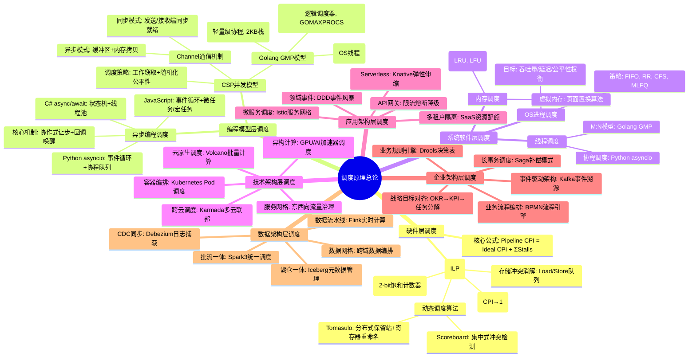

# 调度原理综合总览：从硬件到企业架构的完整体系

> **文档版本**：v1.0 **最后更新**：2025-11-10 **维护者**：项目团队

---

## 📑 目录

- [📑 目录](#-目录)
- [1 概述](#1-概述)
- [2 调度系统分层体系](#2-调度系统分层体系)
  - [2.1 六层架构模型](#21-六层架构模型)
  - [2.2 层次关系与交互](#22-层次关系与交互)
- [3 调度原理思维导图](#3-调度原理思维导图)
- [4 多维对比矩阵](#4-多维对比矩阵)
  - [4.1 调度粒度对比](#41-调度粒度对比)
  - [4.2 调度开销对比](#42-调度开销对比)
  - [4.3 形式化工具对比](#43-形式化工具对比)
- [5 统一形式化框架](#5-统一形式化框架)
  - [5.1 调度系统定义](#51-调度系统定义)
  - [5.2 调度问题建模](#52-调度问题建模)
  - [5.3 正确性属性](#53-正确性属性)
- [6 关键定理汇总](#6-关键定理汇总)
- [7 跨层次协同机制](#7-跨层次协同机制)
  - [7.1 端到端延迟模型](#71-端到端延迟模型)
  - [7.2 资源分配博弈](#72-资源分配博弈)
- [8 技术演进路径](#8-技术演进路径)
- [9 实际应用案例](#9-实际应用案例)
  - [9.1 电商大促场景](#91-电商大促场景)
  - [9.2 金融交易场景](#92-金融交易场景)
- [10 相关文档](#10-相关文档)
  - [分层调度文档](#分层调度文档)
  - [分析方法文档](#分析方法文档)
  - [专题文档](#专题文档)
- [11 参考](#11-参考)
  - [学术参考](#学术参考)
  - [实践参考](#实践参考)

---

## 1 概述

**调度原理综合总览**提供从硬件层到企业架构层的完整调度体系视图，整合所有层次的调
度原理、形式化证明和实践应用。

**核心思想**：

> **调度是跨越抽象层次的资源博弈与约束满足问题**

调度系统的本质是在资源约束下，通过合理的资源分配和任务调度，实现性能、公平性、可
用性等多目标优化。

**为什么需要综合总览？**

调度系统涉及多个抽象层次，每个层次都有其独特的调度机制。综合总览有助于：

- **整体理解**：理解调度系统的完整体系
- **层次关联**：理解不同层次之间的关联和影响
- **技术选型**：根据场景选择合适的调度策略

---

## 2 调度系统分层体系

### 2.1 六层架构模型

**完整分层架构**：

```text
┌─────────────────────────────────────────┐
│   企业架构层（Enterprise Architecture）   │
│   BPMN、Saga、数据流水线、微服务网格      │
└─────────────────────────────────────────┘
                    ↓
┌─────────────────────────────────────────┐
│   应用架构层（Application Architecture）  │
│   微服务调度、Serverless、API网关         │
└─────────────────────────────────────────┘
                    ↓
┌─────────────────────────────────────────┐
│   技术架构层（Technical Architecture）    │
│   Kubernetes、容器编排、服务网格          │
└─────────────────────────────────────────┘
                    ↓
┌─────────────────────────────────────────┐
│   系统软件层（System Software）          │
│   OS进程调度、线程调度、内存调度          │
└─────────────────────────────────────────┘
                    ↓
┌─────────────────────────────────────────┐
│   编程模型层（Programming Model）        │
│   异步编程、CSP/Golang、事件循环          │
└─────────────────────────────────────────┘
                    ↓
┌─────────────────────────────────────────┐
│   硬件层（Hardware）                     │
│   指令级并行、Tomasulo、分支预测          │
└─────────────────────────────────────────┘
```

**形式化定义**：

```text
调度系统 = (企业架构层, 应用架构层, 技术架构层, 系统软件层, 编程模型层, 硬件层, 层次交互)
```

### 2.2 层次关系与交互

**垂直交互**：

- **自上而下**：上层调度决策影响下层资源分配
- **自下而上**：下层状态反馈影响上层调度决策

**水平交互**：

- **负载均衡**：在多个实例间分配负载
- **故障转移**：在实例故障时切换到备用实例

---

## 3 调度原理思维导图



---

## 4 多维对比矩阵

### 4.1 调度粒度对比

| 层次           | 调度单位     | 粒度大小 | 时间尺度  | 典型实现                  |
| -------------- | ------------ | -------- | --------- | ------------------------- |
| **硬件层**     | 指令/微指令  | 字节级   | 纳秒级    | CPU 流水线、Tomasulo 算法 |
| **编程模型层** | 函数/协程    | KB 级    | 纳秒-微秒 | asyncio、Goroutine        |
| **系统软件层** | 进程/线程    | MB 级    | 微秒-毫秒 | Linux CFS、Golang GMP     |
| **技术架构层** | Pod/容器     | MB-GB 级 | 毫秒级    | Kubernetes Scheduler      |
| **应用架构层** | 微服务实例   | GB 级    | 毫秒-秒   | Istio、Serverless         |
| **企业架构层** | 业务流程实例 | GB-TB 级 | 秒-分钟   | BPMN、Saga、Flink         |

### 4.2 调度开销对比

| 层次           | 切换开销  | 调度延迟   | 性能损失 | 优化方向               |
| -------------- | --------- | ---------- | -------- | ---------------------- |
| **硬件层**     | ~1ns      | ~1ns       | 0%       | 分支预测、寄存器重命名 |
| **编程模型层** | 30-150ns  | 50-150ns   | 0-1%     | 批量 IO、无锁队列      |
| **系统软件层** | 1-5μs     | 1-10μs     | 1-3%     | NUMA 感知、CPU 亲和性  |
| **技术架构层** | 100ms-1s  | 100ms-1s   | 1-5%     | 预调度、批量绑定       |
| **应用架构层** | 1-10s     | 10ms-100ms | 5-10%    | 连接池、缓存预热       |
| **企业架构层** | 分钟-小时 | 秒-分钟    | 10-20%   | 异步化、批量处理       |

### 4.3 形式化工具对比

| 层次           | 形式化工具         | 验证方法          | 复杂度 | 典型应用              |
| -------------- | ------------------ | ----------------- | ------ | --------------------- |
| **硬件层**     | 时序逻辑(VHDL)     | 仿真+时序分析     | 高     | CPU 设计验证          |
| **编程模型层** | π-演算、CSP 代数   | 进程代数验证      | 中     | 并发程序验证          |
| **系统软件层** | TLA+、Isabelle/HOL | 模型检查+定理证明 | 高     | seL4 微内核验证       |
| **技术架构层** | TLA+、线性规划     | 模型检查+优化     | 中     | Kubernetes 调度器验证 |
| **应用架构层** | TLA+、BPMN         | 模型检查+流程验证 | 中     | 微服务编排验证        |
| **企业架构层** | TLA+、Petri 网     | 模型检查+可达性   | 中     | 业务流程正确性验证    |

---

## 5 统一形式化框架

### 5.1 调度系统定义

**统一调度系统模型**：

$$
\text{Scheduler} = \langle S, A, \delta, J, C \rangle
$$

其中：

- $S$：状态空间（State Space）
- $A$：动作集合（Action Set）
- $\delta: S \times A \to S$：状态转移函数
- $J: S \to \mathbb{R}$：目标函数（性能指标）
- $C: S \to \{\text{True}, \text{False}\}$：约束条件

**各层实例化**：

- **硬件层**：$S$=寄存器+流水线阶段，$A$=指令发射，$J$=最小化 CPI
- **运行时层**：$S$=协程/线程状态，$A$=上下文切换，$J$=最小化平均响应时间
- **业务层**：$S$=分布式状态机，$A$=任务分配，$J$=最大化 QoE+公平性

### 5.2 调度问题建模

**统一优化问题**：

$$
\begin{align}
\text{Minimize} \quad & \sum_{i} w_i \cdot \text{Perf}_i \\
\text{Subject to} \quad & \text{Correctness} \land \text{Fairness} \land \text{ResourceLimit}
\end{align}
$$

其中 $w_i$ 为各层级性能指标的权重。

### 5.3 正确性属性

**统一正确性属性**：

- **安全性(Safety)**：$\Box \neg \text{BadState}$（永不进入非法状态）
- **活性(Liveness)**：$\Box\Diamond \text{GoodState}$（最终到达目标状态）
- **公平性(Fairness)**：$\forall t, \Box\Diamond \text{Scheduled}(t)$（每个任务
  被无限次调度）

---

## 6 关键定理汇总

| 定理名称               | 层次       | 内容                     | 证明方法              | 应用场景         |
| ---------------------- | ---------- | ------------------------ | --------------------- | ---------------- |
| **Tomasulo 正确性**    | 硬件层     | 乱序执行 ≡ 顺序执行      | 重排序缓冲区+结构归纳 | CPU 设计验证     |
| **Goroutine 无饥饿性** | 编程模型层 | 所有 G 最终被执行        | 马尔可夫链+遍历性证明 | Golang 运行时    |
| **Channel 无死锁**     | 编程模型层 | 良构 CSP 程序无死锁      | CSP 迹语义+平行组合律 | 并发程序验证     |
| **CFS 公平性**         | 系统软件层 | CPU 时间 ∝ 权重          | 红黑树性质+数学归纳   | Linux 调度器     |
| **一致性哈希均衡性**   | 技术架构层 | 节点增减数据迁移量最小化 | 概率论+期望值计算     | 分布式缓存       |
| **async 语义保持**     | 编程模型层 | 转换前后观察等价         | 结构归纳法+状态机等价 | 编译器正确性     |
| **Saga 补偿正确性**    | 企业架构层 | 失败时能够正确补偿       | TLA+模型检查          | 分布式事务       |
| **VCG 激励相容**       | 企业架构层 | 真实报价是占优策略       | 博弈论+机制设计证明   | 多租户资源分配   |
| **Little's Law**       | 随机过程   | L = λ × W                | 系统守恒性证明        | 排队系统分析     |
| **P-K 公式**           | 随机过程   | M/G/1 平均等待时间公式   | 生灭过程理论          | 一般服务时间排队 |

---

## 7 跨层次协同机制

### 7.1 端到端延迟模型

**总延迟分解**：

$$
Latency_{total} = T_{business} + T_{application} + T_{technical} + T_{system} + T_{programming} + T_{hardware}
$$

**各层典型延迟**：

- **企业架构层**：业务流程编排 ~10-100ms
- **应用架构层**：微服务调用 ~1-10ms
- **技术架构层**：容器调度 ~100ms-1s
- **系统软件层**：进程调度 ~1-10μs
- **编程模型层**：协程切换 ~50-150ns
- **硬件层**：指令执行 ~1-10ns

**优化目标**：

$$
\sum_{i=1}^{6} T_i < 200ms \quad (\text{用户感知SLA})
$$

### 7.2 资源分配博弈

**多租户资源竞争**：

在多租户系统中，调度器作为**中心仲裁者**解决资源竞争。

**纳什均衡条件**：

$$
\forall i, \quad u_i(x_i^*, \mathbf{x}_{-i}^*) \ge u_i(x_i, \mathbf{x}_{-i}^*)
$$

**VCG 拍卖机制**：

$$
Payment_i = \sum_{j \neq i} u_j(\mathbf{x}_{-i}^*) - \sum_{j \neq i} u_j(\mathbf{x}^*)
$$

---

## 8 技术演进路径

**虚拟化 → 容器化 → 沙盒化**：

1. **虚拟化**：硬件级隔离，性能开销 10-15%
2. **容器化**：OS 级隔离，性能开销 1-3%
3. **沙盒化**：应用级隔离，性能开销 5-10%，启动时间 10-100ms

**调度演进趋势**：

- **从集中式到去中心化**：每个节点自治调度
- **从静态到动态**：根据负载动态调整
- **从规则到智能**：AI 驱动的预测性调度

---

## 9 实际应用案例

### 9.1 电商大促场景

**系统架构**：

- 前端 → 网关 → 微服务 → 数据层 → 基础设施

**跨层调度策略**：

- 业务层：Saga 模式处理下单
- 应用层：Istio 金丝雀发布
- 数据层：Flink 实时计算
- 技术层：K8s Pod 调度
- 系统层：Goroutine 调度
- 硬件层：AVX-512 指令并行

**端到端延迟**：163ms（符合 SLA）

### 9.2 金融交易场景

**系统要求**：

- 交易延迟 < 1ms
- 可用性 > 99.99%

**跨层优化**：

- 硬件层：专用交易网卡
- 系统层：SCHED_FIFO 实时调度
- 应用层：内存数据库
- 网络层：RDMA

**端到端延迟**：180μs < 1ms

---

## 10 相关文档

### 分层调度文档

- [硬件层调度](09-hardware-layer-scheduling.md) - 指令级并行与动态调度算法
- [编程模型层调度](10-programming-model-scheduling.md) - 异步编程与 CSP 并发模型
- [系统软件层调度](11-system-software-scheduling.md) - OS 进程调度与内存调度
- [技术架构层调度](03-layered-analysis.md) - Kubernetes 调度系统（全局/节点/任务
  三层）
- [应用架构层调度](12-enterprise-architecture-scheduling.md#4-应用架构层调度) -
  微服务网格与 Serverless
- [企业架构层调度](12-enterprise-architecture-scheduling.md) - 业务流程编排与数
  据流水线

### 分析方法文档

- [静态分析](01-static-analysis.md) - 调度策略与约束分析
- [动态分析](02-dynamic-analysis.md) - 调度行为与性能分析
- [分层分析](03-layered-analysis.md) - 调度系统的层次结构
- [图模型](04-graph-model.md) - 调度问题的图论表示
- [动态系统](05-dynamic-system.md) - 调度系统的状态转换
- [随机过程](06-stochastic-process.md) - 调度过程的随机性分析
- [有界系统](07-bounded-system.md) - 调度系统的边界约束
- [调度策略](08-scheduling-strategies.md) - 常见调度策略分析

### 专题文档

- [跨层次调度协同](13-cross-layer-scheduling.md) - 端到端调度延迟与资源分配博弈
- [虚拟化容器化沙盒化调度](14-virtualization-containerization-sandboxing.md) -
  技术趋势与形式化论证

---

## 11 参考

### 学术参考

1. Pinedo, M. L. (2016). _Scheduling: Theory, Algorithms, and Systems_.
   Springer.

2. Hennessy, J. L., & Patterson, D. A. (2019). _Computer Architecture: A
   Quantitative Approach_. Morgan Kaufmann.

3. Hoare, C. A. R. (1978). "Communicating Sequential Processes." _Communications
   of the ACM_.

### 实践参考

- [Kubernetes Scheduler](https://kubernetes.io/docs/concepts/scheduling-eviction/)
- [Linux CFS Scheduler](https://www.kernel.org/doc/html/latest/scheduler/sched-design-CFS.html)
- [Go Scheduler Design](https://go.dev/src/runtime/proc.go)

---

**最后更新**：2025-11-10 **维护者**：项目团队
