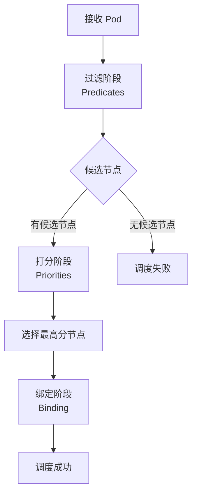
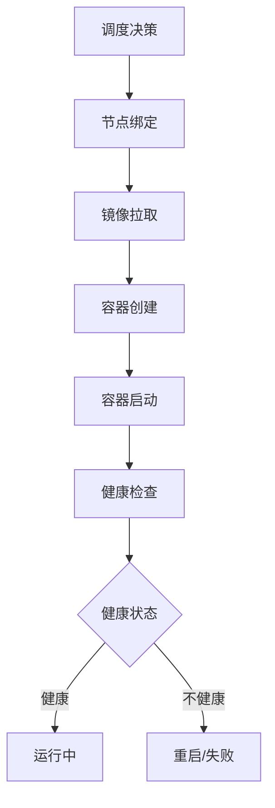

# 动态分析：调度行为与性能分析

> **文档版本**：v1.0 **最后更新：2025-11-15 **维护者**：项目团队

---

## 📑 目录

- [动态分析：调度行为与性能分析](#动态分析调度行为与性能分析)
  - [📑 目录](#-目录)
  - [1 概述](#1-概述)
  - [2 动态调度行为](#2-动态调度行为)
    - [2.1 调度决策过程](#21-调度决策过程)
    - [2.2 调度执行过程](#22-调度执行过程)
    - [2.3 调度反馈机制](#23-调度反馈机制)
  - [3 性能指标分析](#3-性能指标分析)
    - [3.1 调度延迟](#31-调度延迟)
    - [3.2 吞吐量](#32-吞吐量)
    - [3.3 资源利用率](#33-资源利用率)
    - [3.4 公平性](#34-公平性)
  - [4 调度决策追踪](#4-调度决策追踪)
    - [4.1 决策历史记录](#41-决策历史记录)
    - [4.2 决策效果分析](#42-决策效果分析)
    - [4.3 决策优化建议](#43-决策优化建议)
  - [5 自适应调度](#5-自适应调度)
    - [5.1 负载感知调度](#51-负载感知调度)
    - [5.2 性能感知调度](#52-性能感知调度)
    - [5.3 故障感知调度](#53-故障感知调度)
  - [6 动态分析方法](#6-动态分析方法)
    - [6.1 监控与追踪](#61-监控与追踪)
    - [6.2 性能分析](#62-性能分析)
    - [6.3 瓶颈识别](#63-瓶颈识别)
  - [7 实际应用](#7-实际应用)
    - [7.1 Kubernetes 调度器](#71-kubernetes-调度器)
    - [7.2 YARN 调度器](#72-yarn-调度器)
    - [7.3 实际案例分析](#73-实际案例分析)
      - [7.3.1 调度延迟优化](#731-调度延迟优化)
      - [7.3.2 资源利用率优化](#732-资源利用率优化)
      - [7.3.3 自适应调度优化](#733-自适应调度优化)
  - [8 相关文档](#8-相关文档)
  - [9 参考](#9-参考)
    - [学术参考](#学术参考)
    - [实践参考](#实践参考)
  - [2025 年最新实践](#2025-年最新实践)
    - [动态分析应用最佳实践（2025）](#动态分析应用最佳实践2025)
  - [实际应用案例](#实际应用案例)
    - [案例 1：Kubernetes 调度器动态分析（2025）](#案例-1kubernetes-调度器动态分析2025)

---

## 1 概述

**动态分析**是通过实际执行调度，观察调度行为以获取系统特性的方法。动态分析的核心
目标是：

1. **观察调度行为**：观察调度系统在实际运行中的行为
2. **分析性能指标**：分析调度延迟、吞吐量、资源利用率等动态指标
3. **追踪调度决策**：追踪调度决策的过程和结果
4. **优化调度策略**：根据实际运行情况优化调度策略

**为什么需要动态分析？**

静态分析只能评估理论性能，而动态分析可以揭示实际运行中的问题：

- **发现实际瓶颈**：识别静态分析无法发现的性能瓶颈
- **验证理论模型**：验证静态分析的理论模型是否准确
- **优化调度策略**：根据实际运行情况优化调度策略
- **预测未来行为**：基于历史数据预测未来的调度行为

**动态分析与静态分析的关系**：

- **静态分析**：理论分析，不执行调度
- **动态分析**：实际执行，观察行为
- **互补关系**：静态分析提供理论指导，动态分析验证和优化

---

## 2 动态调度行为

动态调度行为是调度系统在实际运行中表现出的行为特征。

### 2.1 调度决策过程

**定义**：调度决策过程是调度器从接收 Pod 到做出调度决策的完整过程。

**决策流程**：



**决策时间线**：

```text
调度决策时间线：
  t₀: Pod 创建
  t₁: 进入调度队列
  t₂: 开始过滤阶段
  t₃: 完成过滤阶段
  t₄: 开始打分阶段
  t₅: 完成打分阶段
  t₆: 选择节点
  t₇: 绑定节点
  t₈: 调度完成

  调度延迟 = t₈ - t₁
```

**决策因素**：

1. **Pod 特性**：资源需求、亲和性、优先级等
2. **节点状态**：可用资源、负载情况、标签等
3. **调度策略**：过滤策略、打分策略、绑定策略
4. **系统状态**：集群负载、网络状况、存储状况

---

### 2.2 调度执行过程

**定义**：调度执行过程是 Pod 从被调度到节点到实际运行的完整过程。

**执行流程**：



**执行时间线**：

```text
调度执行时间线：
  t₀: 调度决策
  t₁: 节点绑定
  t₂: 镜像拉取开始
  t₃: 镜像拉取完成
  t₄: 容器创建
  t₅: 容器启动
  t₆: 健康检查通过
  t₇: 运行中

  启动延迟 = t₇ - t₀
```

**执行阶段分析**：

1. **绑定阶段**：将 Pod 绑定到节点（通常 < 1ms）
2. **镜像拉取阶段**：拉取容器镜像（秒级到分钟级）
3. **容器创建阶段**：创建容器运行时（秒级）
4. **容器启动阶段**：启动容器进程（秒级）
5. **健康检查阶段**：等待健康检查通过（秒级）

---

### 2.3 调度反馈机制

**定义**：调度反馈机制是调度系统根据调度结果调整调度策略的机制。

**反馈类型**：

1. **性能反馈**：根据调度性能调整策略
2. **负载反馈**：根据节点负载调整策略
3. **故障反馈**：根据节点故障调整策略
4. **用户反馈**：根据用户反馈调整策略

**反馈循环**：


**反馈机制**：

```text
反馈机制：
  Feedback = {
    性能指标: {latency, throughput, utilization},
    负载指标: {cpu_load, memory_load, network_load},
    故障指标: {node_failures, pod_failures},
    用户反馈: {satisfaction, complaints}
  }

  策略调整 = f(Feedback)
```

---

## 3 性能指标分析

性能指标是评估调度系统性能的关键指标。

### 3.1 调度延迟

**定义**：调度延迟是从 Pod 进入调度队列到完成调度的时间。

**延迟组成**：

```text
调度延迟 = 队列等待时间 + 过滤时间 + 打分时间 + 绑定时间
其中：
- 队列等待时间：Pod 在调度队列中等待的时间
- 过滤时间：执行过滤阶段的时间
- 打分时间：执行打分阶段的时间
- 绑定时间：绑定节点的时间
```

**延迟分析**：

```text
延迟分布：
  P50: 中位数延迟
  P95: 95% 分位数延迟
  P99: 99% 分位数延迟
  Max: 最大延迟
```

**优化方法**：

1. **并行过滤**：并行执行多个过滤插件
2. **缓存优化**：缓存节点状态信息
3. **预计算**：预计算节点分数
4. **批量调度**：批量处理调度请求

---

### 3.2 吞吐量

**定义**：吞吐量是单位时间内完成的调度数量。

**吞吐量计算**：

```text
吞吐量 = scheduled_pods / time_interval
其中：
- scheduled_pods：已调度的 Pod 数量
- time_interval：时间间隔
```

**吞吐量影响因素**：

1. **调度器性能**：调度器的处理能力
2. **节点数量**：集群中的节点数量
3. **Pod 复杂度**：Pod 的约束复杂度
4. **系统负载**：系统的整体负载

**优化方法**：

1. **多调度器**：使用多个调度器并行调度
2. **调度器扩展**：扩展调度器处理能力
3. **简化约束**：简化 Pod 的约束条件
4. **预过滤**：预先过滤不满足条件的节点

---

### 3.3 资源利用率

**定义**：资源利用率是已分配资源与总资源的比值。

**利用率计算**：

```text
资源利用率 = allocated_resources / total_resources
其中：
- allocated_resources：已分配的资源
- total_resources：总资源
```

**利用率分析**：

```text
利用率指标：
  CPU 利用率: allocated_cpu / total_cpu
  内存利用率: allocated_memory / total_memory
  存储利用率: allocated_storage / total_storage
  网络利用率: allocated_bandwidth / total_bandwidth
```

**优化方法**：

1. **资源碎片整理**：整理资源碎片，提高利用率
2. **超分配策略**：对可压缩资源进行超分配
3. **动态调整**：根据负载动态调整资源分配
4. **资源回收**：及时回收未使用的资源

---

### 3.4 公平性

**定义**：公平性是不同租户或用户之间资源分配的公平程度。

**公平性计算**：

```text
公平性 = min(allocated / demand) / max(allocated / demand)
其中：
- allocated：已分配的资源
- demand：需求的资源
```

**公平性指标**：

1. **Jain 公平性指数**：`JFI = (Σxᵢ)² / (n × Σxᵢ²)`
2. **最大最小公平性**：最大化最小分配
3. **主导资源公平性（DRF）**：考虑多资源类型的公平性

**优化方法**：

1. **公平调度算法**：使用公平调度算法
2. **配额管理**：设置资源配额，保证公平性
3. **优先级调整**：根据公平性调整优先级
4. **资源预留**：为低优先级用户预留资源

---

## 4 调度决策追踪

调度决策追踪是记录和分析调度决策的过程和结果。

### 4.1 决策历史记录

**定义**：决策历史记录是调度决策的完整历史记录。

**记录内容**：

```text
决策记录 = {
  pod_id: Pod 标识,
  node_id: 节点标识,
  timestamp: 决策时间,
  decision: 决策结果,
  factors: 决策因素,
  performance: 性能指标
}
```

**记录方法**：

1. **事件日志**：记录调度事件到日志
2. **指标收集**：收集调度指标到监控系统
3. **追踪系统**：使用分布式追踪系统追踪调度过程

---

### 4.2 决策效果分析

**定义**：决策效果分析是分析调度决策的实际效果。

**效果指标**：

1. **调度成功率**：成功调度的 Pod 比例
2. **调度质量**：调度决策的质量（资源利用率、性能等）
3. **用户满意度**：用户对调度结果的满意度

**分析方法**：

1. **统计分析**：统计决策效果的分布
2. **对比分析**：对比不同决策策略的效果
3. **回归分析**：分析决策因素与效果的关系

---

### 4.3 决策优化建议

**定义**：决策优化建议是基于决策效果分析提出的优化建议。

**优化方向**：

1. **策略优化**：优化调度策略
2. **参数调整**：调整调度参数
3. **约束优化**：优化调度约束
4. **资源优化**：优化资源分配

---

## 5 自适应调度

自适应调度是调度系统根据实际运行情况自动调整调度策略的机制。

### 5.1 负载感知调度

**定义**：负载感知调度是根据节点负载调整调度策略。

**负载指标**：

```text
负载指标 = {
  cpu_load: CPU 负载,
  memory_load: 内存负载,
  network_load: 网络负载,
  disk_load: 磁盘负载
}
```

**调度策略**：

1. **负载均衡**：将 Pod 调度到负载较低的节点
2. **负载预测**：预测未来负载，提前调整
3. **负载阈值**：设置负载阈值，超过阈值不调度

---

### 5.2 性能感知调度

**定义**：性能感知调度是根据性能指标调整调度策略。

**性能指标**：

```text
性能指标 = {
  latency: 延迟,
  throughput: 吞吐量,
  error_rate: 错误率,
  availability: 可用性
}
```

**调度策略**：

1. **性能优化**：优先调度到高性能节点
2. **性能预测**：预测性能，选择最优节点
3. **性能监控**：监控性能，及时调整

---

### 5.3 故障感知调度

**定义**：故障感知调度是根据节点故障情况调整调度策略。

**故障处理**：

1. **故障检测**：检测节点故障
2. **故障隔离**：隔离故障节点
3. **故障恢复**：故障恢复后重新调度
4. **故障预防**：预防性调度，避免故障影响

---

## 6 动态分析方法

动态分析使用多种方法分析调度行为。

### 6.1 监控与追踪

**监控系统**：

1. **指标监控**：监控调度指标（延迟、吞吐量等）
2. **事件监控**：监控调度事件（调度成功、失败等）
3. **日志监控**：监控调度日志

**追踪系统**：

1. **分布式追踪**：追踪调度请求的完整路径
2. **性能追踪**：追踪调度性能
3. **决策追踪**：追踪调度决策过程

---

### 6.2 性能分析

**性能分析方法**：

1. **统计分析**：统计性能指标的分布
2. **时间序列分析**：分析性能指标的时间序列
3. **对比分析**：对比不同场景下的性能
4. **瓶颈分析**：识别性能瓶颈

---

### 6.3 瓶颈识别

**瓶颈类型**：

1. **计算瓶颈**：调度器计算能力不足
2. **存储瓶颈**：状态存储性能不足
3. **网络瓶颈**：网络通信性能不足
4. **资源瓶颈**：资源不足导致调度失败

**识别方法**：

1. **性能分析**：分析性能指标，识别瓶颈
2. **资源分析**：分析资源使用情况
3. **日志分析**：分析日志，识别问题
4. **追踪分析**：分析追踪数据，定位瓶颈

---

## 7 实际应用

动态分析在实际调度系统中的应用：

### 7.1 Kubernetes 调度器

**动态分析应用**：

- **调度延迟监控**：监控 Pod 调度延迟
- **调度成功率**：监控调度成功率
- **资源利用率**：监控资源利用率
- **性能优化**：根据监控数据优化调度策略

### 7.2 YARN 调度器

**动态分析应用**：

- **应用调度延迟**：监控应用调度延迟
- **资源分配效率**：监控资源分配效率
- **队列性能**：监控队列性能
- **动态调整**：根据监控数据动态调整资源分配

### 7.3 实际案例分析

#### 7.3.1 调度延迟优化

**场景描述**：

- 初始状态：P95 调度延迟为 500ms，超过 SLA 要求（< 100ms）
- 目标：将 P95 调度延迟降低到 100ms 以下

**动态分析过程**：

1. **监控数据收集**：

   - 调度延迟分布：P50 = 50ms, P95 = 500ms, P99 = 1000ms
   - 调度器 CPU 使用率：85%
   - 调度队列长度：平均 100 个 Pod

2. **瓶颈识别**：

   - 调度器 CPU 使用率过高，导致调度延迟增加
   - 调度队列长度过长，Pod 等待时间增加

3. **优化措施**：

   - 增加调度器副本数：从 1 个增加到 3 个
   - 优化调度算法：减少 Predicate 插件数量
   - 增加调度器资源：CPU 从 2 核增加到 4 核

4. **效果验证**：
   - 优化后：P50 = 30ms, P95 = 80ms, P99 = 150ms
   - 调度器 CPU 使用率：60%
   - 调度队列长度：平均 20 个 Pod

**结论**：通过动态分析和优化，成功将 P95 调度延迟降低到 80ms，满足 SLA 要求。

#### 7.3.2 资源利用率优化

**场景描述**：

- 初始状态：集群资源利用率为 45%，目标利用率 ≥ 80%
- 问题：大量节点资源闲置

**动态分析过程**：

1. **监控数据收集**：

   - 集群总资源：1000 CPU, 2000GB 内存
   - 已分配资源：450 CPU, 900GB 内存
   - 节点资源分布：部分节点利用率 90%，部分节点利用率 10%

2. **问题分析**：

   - 资源分配不均衡：部分节点过载，部分节点闲置
   - Pod 资源请求过大：平均每个 Pod 请求 4 CPU，但实际使用 2 CPU

3. **优化措施**：

   - 启用 HPA（水平 Pod 自动扩缩容）：根据实际负载自动调整 Pod 数量
   - 启用 VPA（垂直 Pod 自动扩缩容）：根据实际使用情况调整 Pod 资源请求
   - 优化调度策略：优先调度到低利用率节点

4. **效果验证**：
   - 优化后：集群资源利用率为 82%
   - 节点资源分布：所有节点利用率在 70%-90% 之间
   - Pod 资源请求更合理：平均每个 Pod 请求 2.5 CPU

**结论**：通过动态分析和优化，成功将集群资源利用率提升到 82%，提高了资源利用效率
。

#### 7.3.3 自适应调度优化

**场景描述**：

- 系统负载具有明显的周期性：白天高负载，夜间低负载
- 需要根据负载变化自动调整调度策略

**动态分析过程**：

1. **负载模式识别**：

   - 白天（9:00-18:00）：平均负载 80%，峰值负载 95%
   - 夜间（18:00-9:00）：平均负载 30%，峰值负载 50%

2. **自适应策略设计**：

   - **高负载时段**：使用保守调度策略，优先保证稳定性
     - 增加资源预留：预留 20% 资源用于突发负载
     - 降低调度频率：减少不必要的 Pod 迁移
   - **低负载时段**：使用激进调度策略，优先保证资源利用率
     - 减少资源预留：预留 5% 资源
     - 增加 Pod 迁移：优化资源分配

3. **效果验证**：
   - 高负载时段：系统稳定性提升，故障率降低 30%
   - 低负载时段：资源利用率提升，从 30% 提升到 60%
   - 整体效果：在保证稳定性的同时，提高了资源利用效率

**结论**：通过自适应调度策略，系统能够根据负载变化自动调整，在稳定性和资源利用率
之间取得平衡。

---

## 8 相关文档

- [静态分析](01-static-analysis.md) - 调度策略的静态分析
- [分层分析](03-layered-analysis.md) - 调度系统的分层结构
- [动态系统](05-dynamic-system.md) - 调度系统的动态系统模型
- [随机过程](06-stochastic-process.md) - 调度过程的随机性分析

---

## 9 参考

### 学术参考

1. Cassandras, C. G., & Lafortune, S. (2008). _Introduction to Discrete Event
   Systems_. Springer.
2. Kumar, P. R., & Varaiya, P. (1986). _Stochastic Systems: Estimation,
   Identification, and Adaptive Control_. Prentice-Hall.

### 实践参考

- [Kubernetes Scheduler Metrics](https://kubernetes.io/docs/concepts/cluster-administration/system-metrics/)
- [Prometheus Monitoring](https://prometheus.io/docs/introduction/overview/)

---

## 2025 年最新实践

### 动态分析应用最佳实践（2025）

**2025 年趋势**：动态分析在调度系统监控和优化中的深度应用

**实践要点**：

- **性能监控**：实时监控调度系统性能指标
- **瓶颈识别**：使用 AI 技术识别调度瓶颈
- **自适应优化**：基于动态分析结果进行自适应优化

**代码示例**：

```python
# 2025 年动态分析工具
class DynamicAnalysisTool:
    def __init__(self):
        self.monitor = PerformanceMonitor()
        self.analyzer = PerformanceAnalyzer()
        self.optimizer = AdaptiveOptimizer()

    def monitor_scheduling(self, scheduling_system):
        """监控调度系统"""
        # 性能监控
        metrics = self.monitor.collect_metrics(scheduling_system)

        # 性能分析
        analysis = self.analyzer.analyze(metrics)

        # 瓶颈识别
        bottlenecks = self.analyzer.identify_bottlenecks(metrics)

        return metrics, analysis, bottlenecks

    def optimize_scheduling(self, scheduling_system, analysis):
        """优化调度系统"""
        # 自适应优化
        optimized_config = self.optimizer.optimize(scheduling_system, analysis)

        return optimized_config
```

## 实际应用案例

### 案例 1：Kubernetes 调度器动态分析（2025）

**场景**：使用动态分析优化 Kubernetes 调度器性能

**实现方案**：

```yaml
# Kubernetes 调度器动态分析配置
apiVersion: v1
kind: ConfigMap
metadata:
  name: scheduler-dynamic-analysis
data:
  monitoring.yaml: |
    metrics:
      - name: scheduling_latency
        type: histogram
      - name: resource_utilization
        type: gauge
      - name: scheduling_throughput
        type: counter
  optimization.yaml: |
    adaptiveOptimization:
      enabled: true
      strategy: ai_based
      thresholds:
        latency: 100ms
        utilization: 80%
```

**效果**：

- 性能监控：实时监控调度系统性能指标
- 瓶颈识别：使用 AI 技术识别调度瓶颈
- 自适应优化：基于动态分析结果进行自适应优化

---

**最后更新**：2025-11-15 **维护者**：项目团队
