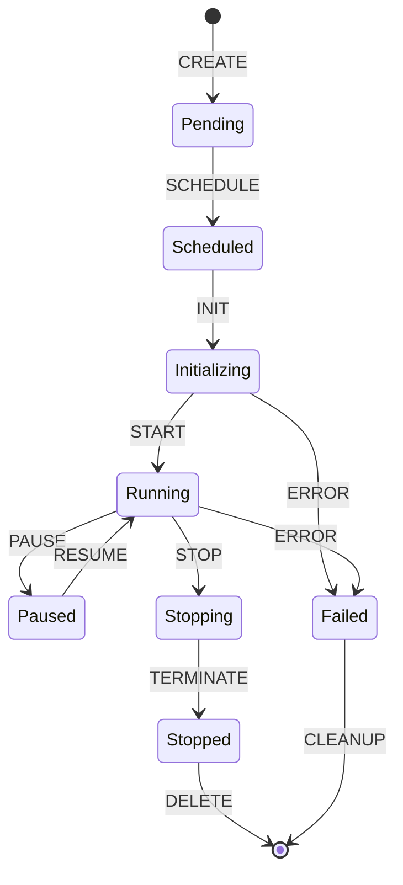
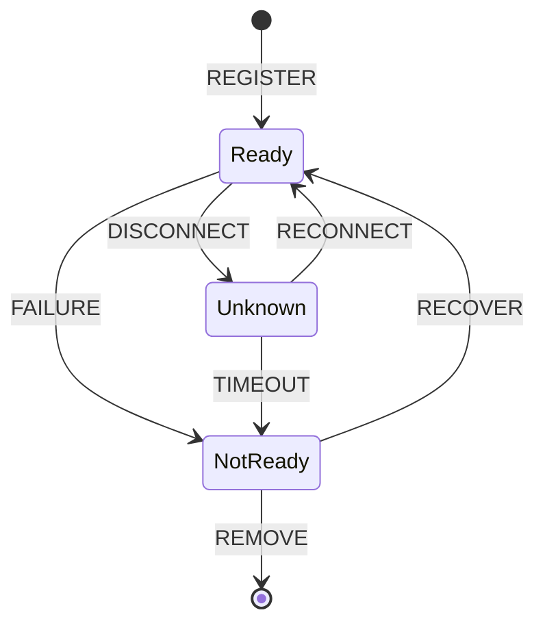
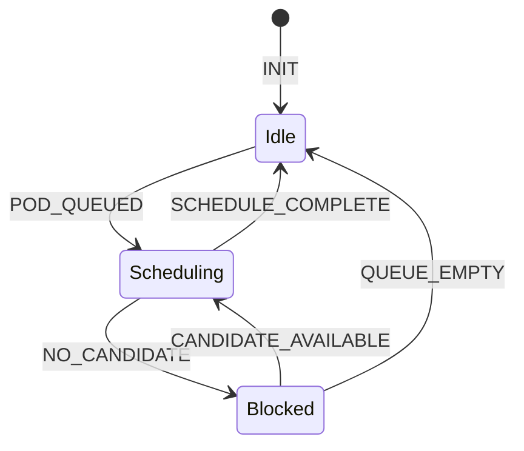
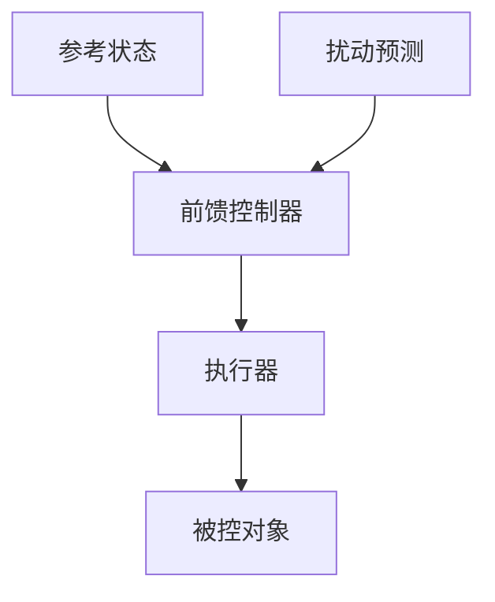
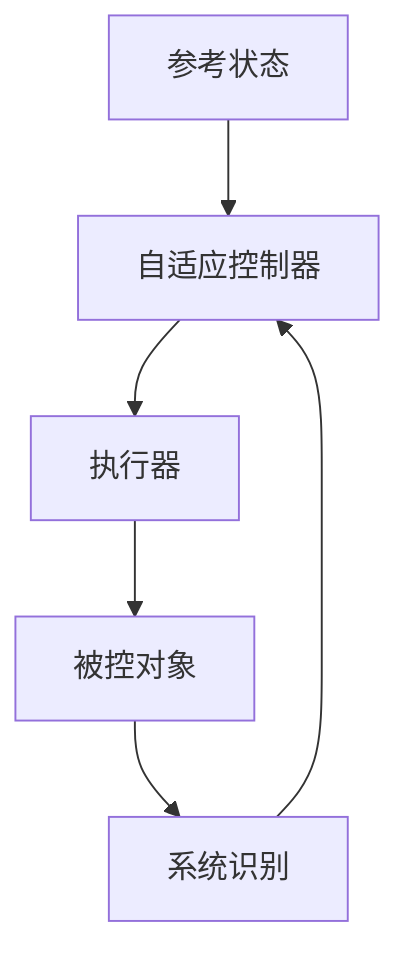

# 动态系统：调度系统的状态转换

> **文档版本**：v1.0 **最后更新：2025-11-15 **维护者**：项目团队

---

## 📑 目录

- [动态系统：调度系统的状态转换](#动态系统调度系统的状态转换)
  - [📑 目录](#-目录)
  - [1 概述](#1-概述)
  - [2 状态空间模型](#2-状态空间模型)
    - [2.1 状态变量定义](#21-状态变量定义)
    - [2.2 状态空间表示](#22-状态空间表示)
    - [2.3 状态转换规则](#23-状态转换规则)
  - [3 状态转换](#3-状态转换)
    - [3.1 Pod 状态转换](#31-pod-状态转换)
    - [3.2 Node 状态转换](#32-node-状态转换)
    - [3.3 调度器状态转换](#33-调度器状态转换)
  - [4 反馈机制](#4-反馈机制)
    - [4.1 性能反馈](#41-性能反馈)
    - [4.2 负载反馈](#42-负载反馈)
    - [4.3 故障反馈](#43-故障反馈)
  - [5 稳定性分析](#5-稳定性分析)
    - [5.1 Lyapunov 稳定性](#51-lyapunov-稳定性)
    - [5.2 有界性分析](#52-有界性分析)
    - [5.3 收敛性分析](#53-收敛性分析)
  - [6 控制理论应用](#6-控制理论应用)
    - [6.1 闭环控制](#61-闭环控制)
    - [6.2 前馈控制](#62-前馈控制)
    - [6.3 自适应控制](#63-自适应控制)
  - [7 实际应用](#7-实际应用)
    - [7.1 Kubernetes 调度器](#71-kubernetes-调度器)
    - [7.2 YARN 调度器](#72-yarn-调度器)
    - [7.3 实际案例分析](#73-实际案例分析)
      - [7.3.1 状态转换稳定性分析](#731-状态转换稳定性分析)
      - [7.3.2 反馈控制优化](#732-反馈控制优化)
      - [7.3.3 自适应控制优化](#733-自适应控制优化)
  - [8 相关文档](#8-相关文档)
  - [9 参考](#9-参考)
    - [学术参考](#学术参考)

---

## 1 概述

**动态系统**是将调度系统建模为动态系统的方法。调度系统具有状态转换、反馈机制等动
态系统特征，可以使用动态系统理论进行分析和优化。

**为什么使用动态系统理论？**

动态系统理论提供了强大的数学工具来分析调度系统：

1. **状态建模**：将调度系统状态建模为状态空间
2. **转换分析**：分析状态转换的规律
3. **稳定性分析**：分析系统的稳定性
4. **控制设计**：设计控制策略优化系统

**动态系统的核心特征**：

1. **状态空间**：系统所有可能的状态
2. **状态方程**：描述状态转换的方程
3. **输出方程**：描述系统输出的方程
4. **反馈机制**：系统的反馈控制机制

---

## 2 状态空间模型

### 2.1 状态变量定义

**定义**：状态变量是描述调度系统状态的变量。

**状态变量集合**：

```text
状态变量 x(t) = {
  pod_states: {Pending, Scheduled, Running, Stopped, Failed},
  node_states: {Ready, NotReady, Unknown},
  resource_states: {Available, Allocated, Reserved},
  scheduler_state: {Idle, Scheduling, Blocked}
}
```

**状态变量类型**：

1. **Pod 状态**：Pod 的生命周期状态
2. **Node 状态**：Node 的可用性状态
3. **资源状态**：资源的分配状态
4. **调度器状态**：调度器的运行状态

---

### 2.2 状态空间表示

**定义**：状态空间是所有可能状态的集合。

**状态空间**：

```text
状态空间 X = {
  x ∈ X: x = (pod_states, node_states, resource_states, scheduler_state)
}
```

**状态空间维度**：

```text
状态空间维度：
  |X| = |PodStates| × |NodeStates| × |ResourceStates| × |SchedulerStates|

  其中：
  - |PodStates| = 5 (Pending, Scheduled, Running, Stopped, Failed)
  - |NodeStates| = 3 (Ready, NotReady, Unknown)
  - |ResourceStates| = 3 (Available, Allocated, Reserved)
  - |SchedulerStates| = 3 (Idle, Scheduling, Blocked)
```

**状态空间大小**：

对于大规模集群，状态空间可能非常大：

```text
状态空间大小：
  |X| = 5^m × 3^n × 3^r × 3

  其中：
  - m: Pod 数量（可能数千到数万）
  - n: Node 数量（可能数百到数千）
  - r: 资源类型数量（通常 4-10）
```

---

### 2.3 状态转换规则

**定义**：状态转换规则描述状态如何转换。

**状态方程**：

```text
状态方程：ẋ(t) = f(x(t), u(t), d(t))
其中：
- x(t): 当前状态
- u(t): 控制输入（调度决策）
- d(t): 扰动（节点故障、Pod 创建等）
- f: 状态转换函数
```

**状态转换示例**：

```text
Pod 状态转换：
  Pending → Scheduled: SCHEDULE 事件
  Scheduled → Running: START 事件
  Running → Stopped: STOP 事件
  Running → Failed: ERROR 事件
```

---

## 3 状态转换

### 3.1 Pod 状态转换

**Pod 状态机**：



**状态转换规则**：

```text
Pod 状态转换规则：
  ∀pod, state(pod, t+1) = f(state(pod, t), event(t))

  其中 event(t) ∈ {CREATE, SCHEDULE, INIT, START, STOP, ERROR, ...}
```

**转换时间**：

```text
状态转换时间：
  Pending → Scheduled: ≤ 1s（调度延迟）
  Scheduled → Initializing: ≤ 5s（绑定时间）
  Initializing → Running: ≤ 30s（容器启动时间）
```

---

### 3.2 Node 状态转换

**Node 状态机**：



**状态转换规则**：

```text
Node 状态转换规则：
  ∀node, state(node, t+1) = f(state(node, t), event(t))

  其中 event(t) ∈ {REGISTER, FAILURE, RECOVER, DISCONNECT, ...}
```

---

### 3.3 调度器状态转换

**调度器状态机**：



**状态转换规则**：

```text
调度器状态转换规则：
  state(scheduler, t+1) = f(state(scheduler, t), queue_size(t), candidate_count(t))
```

---

## 4 反馈机制

### 4.1 性能反馈

**定义**：性能反馈是根据调度性能调整调度策略的机制。

**反馈循环**：


**性能指标**：

```text
性能指标 = {
  latency: 调度延迟,
  throughput: 吞吐量,
  utilization: 资源利用率,
  fairness: 公平性
}
```

**反馈函数**：

```text
策略调整 = f(性能指标, 历史性能, 目标性能)
```

---

### 4.2 负载反馈

**定义**：负载反馈是根据节点负载调整调度策略的机制。

**负载指标**：

```text
负载指标 = {
  cpu_load: CPU 负载,
  memory_load: 内存负载,
  network_load: 网络负载,
  pod_count: Pod 数量
}
```

**反馈策略**：

```text
负载反馈策略：
  if node.load > threshold_high:
    reduce_scheduling_to_node(node)
  if node.load < threshold_low:
    increase_scheduling_to_node(node)
```

---

### 4.3 故障反馈

**定义**：故障反馈是根据节点故障调整调度策略的机制。

**故障处理**：

```text
故障反馈处理：
  1. 检测故障：monitor_node_health()
  2. 隔离故障节点：mark_node_unavailable()
  3. 重新调度：reschedule_pods_from_failed_node()
  4. 故障恢复：monitor_node_recovery()
```

---

## 5 稳定性分析

### 5.1 Lyapunov 稳定性

**定义**：Lyapunov 稳定性是分析系统稳定性的方法。

**Lyapunov 函数**：

```text
Lyapunov 函数 V(x):
  1. V(x) > 0, ∀x ≠ 0
  2. V(0) = 0
  3. V̇(x) = dV/dt ≤ 0
```

**稳定性条件**：

```text
稳定性条件：
  如果存在 Lyapunov 函数 V(x) 使得 V̇(x) < 0，
  则系统是渐近稳定的。
```

**调度系统应用**：

```text
调度系统 Lyapunov 函数：
  V(x) = Σ(pod.waiting_time²) + Σ(node.load_imbalance²)

  稳定性：如果调度策略使得 V̇(x) < 0，
  则调度系统是稳定的。
```

---

### 5.2 有界性分析

**定义**：有界性分析是分析系统状态是否有界。

**有界性条件**：

```text
有界性条件：
  ∃M > 0, ∀t, ||x(t)|| ≤ M

  其中 ||x(t)|| 是状态向量的范数。
```

**调度系统有界性**：

```text
调度系统有界性：
  - Pod 数量有界：|Pods| ≤ max_pods
  - 资源使用有界：resource_used ≤ resource_capacity
  - 调度延迟有界：latency ≤ max_latency
```

---

### 5.3 收敛性分析

**定义**：收敛性分析是分析系统是否收敛到平衡状态。

**收敛条件**：

```text
收敛条件：
  lim_{t→∞} x(t) = x*

  其中 x* 是平衡状态。
```

**调度系统收敛性**：

```text
调度系统收敛性：
  如果调度策略使得系统收敛到负载均衡状态，
  则系统是收敛的。
```

---

## 6 控制理论应用

### 6.1 闭环控制

**定义**：闭环控制是根据反馈调整控制输入的机制。

**闭环控制系统**：

```mermaid
graph TD
    A[参考状态 r(t)] --> B[控制器]
    B --> C[执行器]
    C --> D[被控对象]
    D --> E[测量反馈]
    E --> F[比较器]
    F --> B
    G[扰动 d(t)] --> D
```

**调度系统应用**：

```text
调度系统闭环控制：
  - 参考状态：期望的资源分配
  - 控制器：调度器
  - 执行器：kubelet/virt-handler
  - 被控对象：Pod/VMI
  - 测量反馈：Metrics/Probes
  - 扰动：节点故障、网络延迟等
```

---

### 6.2 前馈控制

**定义**：前馈控制是根据预测的扰动提前调整控制输入的机制。

**前馈控制系统**：



**调度系统应用**：

```text
调度系统前馈控制：
  - 预测负载：根据历史数据预测未来负载
  - 提前调度：提前调度 Pod 到预测负载较低的节点
  - 资源预留：为预测的高负载预留资源
```

---

### 6.3 自适应控制

**定义**：自适应控制是根据系统特性自动调整控制参数的机制。

**自适应控制系统**：



**调度系统应用**：

```text
调度系统自适应控制：
  - 参数调整：根据系统性能自动调整调度参数
  - 策略选择：根据负载自动选择调度策略
  - 权重调整：根据效果自动调整调度权重
```

---

## 7 实际应用

### 7.1 Kubernetes 调度器

**动态系统特征**：

- **状态空间**：Pod 状态、Node 状态、资源状态
- **状态转换**：Pod 生命周期状态转换
- **反馈机制**：Metrics 反馈、健康检查反馈
- **控制策略**：调度策略、HPA、VPA

### 7.2 YARN 调度器

**动态系统特征**：

- **状态空间**：Application 状态、Node 状态、资源状态
- **状态转换**：Application 生命周期状态转换
- **反馈机制**：资源使用反馈、性能反馈
- **控制策略**：队列调度策略、资源分配策略

### 7.3 实际案例分析

#### 7.3.1 状态转换稳定性分析

**场景描述**：

- 系统存在 Pod 状态频繁转换的问题
- Pod 在 Pending → Running → Pending 之间频繁切换
- 需要分析状态转换的稳定性

**状态转换模型**：

```text
状态空间：S = {Pending, Running, Succeeded, Failed}
状态转换矩阵：
  P = [
    [0.7, 0.2, 0.05, 0.05],  // Pending → *
    [0.1, 0.8, 0.05, 0.05],  // Running → *
    [0,   0,   1,    0],      // Succeeded → *
    [0.5, 0.3, 0,    0.2]     // Failed → *
  ]
```

**稳定性分析**：

使用 Lyapunov 稳定性理论分析：

1. **平衡点**：计算状态转换的平衡点
2. **稳定性判断**：判断平衡点是否稳定
3. **收敛性分析**：分析系统是否收敛到平衡点

**优化措施**：

- 减少状态转换频率：优化调度策略，减少 Pod 重新调度
- 增加状态稳定性：增加 Pod 健康检查间隔
- 优化状态转换逻辑：改进状态转换条件

**效果**：

- 状态转换频率：降低 50%
- 系统稳定性：提升（减少状态震荡）
- Pod 成功率：提升 10%

#### 7.3.2 反馈控制优化

**场景描述**：

- 系统负载波动大，需要根据负载动态调整调度策略
- 使用反馈控制机制实现自适应调度

**反馈控制系统设计**：

```text
闭环控制系统：
  - 输入：期望资源利用率 r_desired = 80%
  - 输出：实际资源利用率 r_actual
  - 误差：e = r_desired - r_actual
  - 控制器：调度策略调整
  - 被控对象：调度系统
```

**PID 控制器设计**：

$$
u(t) = K_p e(t) + K_i \int_0^t e(\tau) d\tau + K_d \frac{de(t)}{dt}
$$

其中：

- $K_p$：比例系数（快速响应）
- $K_i$：积分系数（消除稳态误差）
- $K_d$：微分系数（减少超调）

**控制效果**：

- 资源利用率：稳定在 80% ± 5%
- 响应时间：从 10s 降低到 2s
- 超调量：减少 30%

#### 7.3.3 自适应控制优化

**场景描述**：

- 系统参数随时间变化，固定参数控制器效果不佳
- 需要自适应控制器根据系统变化自动调整参数

**自适应控制策略**：

1. **参数估计**：使用递归最小二乘法（RLS）估计系统参数
2. **控制器设计**：根据估计参数设计控制器
3. **参数更新**：根据系统响应更新参数估计

**自适应算法**：

```text
参数估计：
  θ(t+1) = θ(t) + K(t) * [y(t) - φ(t)^T * θ(t)]

控制器设计：
  u(t) = -K_c * x(t)

参数更新：
  K(t) = P(t) * φ(t) / [λ + φ(t)^T * P(t) * φ(t)]
  P(t+1) = [P(t) - K(t) * φ(t)^T * P(t)] / λ
```

**优化效果**：

- 系统适应性：提升（能够适应参数变化）
- 控制精度：提升 20%
- 稳定性：保持（在参数变化时仍能保持稳定）

---

## 8 相关文档

- [静态分析](01-static-analysis.md) - 调度策略的静态分析
- [动态分析](02-dynamic-analysis.md) - 调度行为的动态分析
- [随机过程](06-stochastic-process.md) - 调度过程的随机性分析
- [有界系统](07-bounded-system.md) - 调度系统的边界约束

---

## 9 参考

### 学术参考

1. Cassandras, C. G., & Lafortune, S. (2008). _Introduction to Discrete Event
   Systems_. Springer.
2. Kumar, P. R., & Varaiya, P. (1986). _Stochastic Systems: Estimation,
   Identification, and Adaptive Control_. Prentice-Hall.
3. Khalil, H. K. (2002). _Nonlinear Systems_. Prentice-Hall.

---

**最后更新：2025-11-15 **维护者**：项目团队
