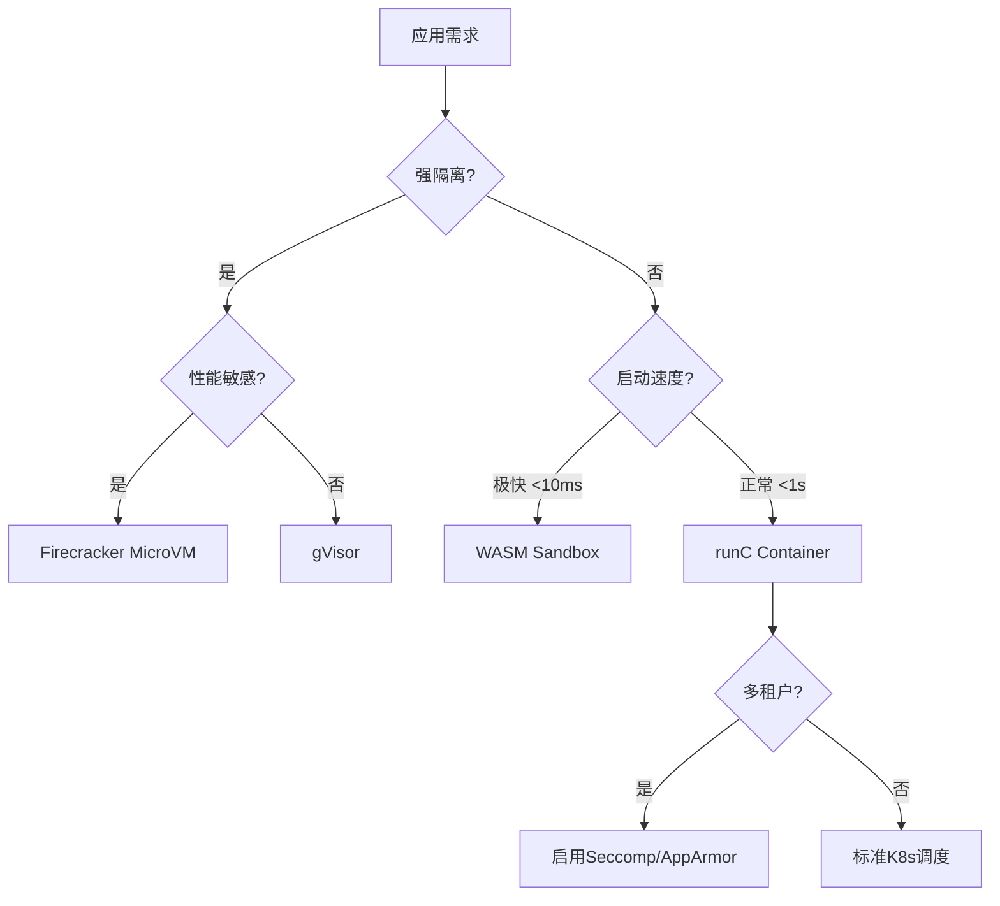

# 虚拟化·容器化·沙盒化调度演进：技术趋势与形式化论证

> **文档版本**：v1.0 **最后更新**：2025-11-12 **维护者**：项目团队

---

## 📑 目录

- [📑 目录](#-目录)
- [1 概述](#1-概述)
- [2 技术演进路径](#2-技术演进路径)
  - [2.1 虚拟化调度](#21-虚拟化调度)
  - [2.2 容器化调度](#22-容器化调度)
  - [2.3 沙盒化调度](#23-沙盒化调度)
- [3 技术栈对比矩阵](#3-技术栈对比矩阵)
  - [3.1 全栈技术对比](#31-全栈技术对比)
  - [3.2 性能特征对比](#32-性能特征对比)
  - [3.3 适用场景对比](#33-适用场景对比)
- [4 容器化核心调度技术](#4-容器化核心调度技术)
  - [4.1 Kubernetes 统一调度架构](#41-kubernetes-统一调度架构)
  - [4.2 Cgroup 资源控制](#42-cgroup-资源控制)
  - [4.3 Namespace 隔离](#43-namespace-隔离)
- [5 沙盒化革命性架构](#5-沙盒化革命性架构)
  - [5.1 Kuasar+iSulad 架构](#51-kuasarisulad-架构)
  - [5.2 性能提升形式化证明](#52-性能提升形式化证明)
  - [5.3 多沙箱类型混合调度](#53-多沙箱类型混合调度)
- [6 调度原理适配与演进](#6-调度原理适配与演进)
  - [6.1 从进程调度到容器调度](#61-从进程调度到容器调度)
  - [6.2 Kubernetes 调度器形式化语义](#62-kubernetes-调度器形式化语义)
  - [6.3 沙盒化带来的新调度维度](#63-沙盒化带来的新调度维度)
- [7 形式化证明：隔离性与安全性](#7-形式化证明隔离性与安全性)
  - [7.1 容器隔离性形式化证明](#71-容器隔离性形式化证明)
  - [7.2 沙盒化隔离强度证明](#72-沙盒化隔离强度证明)
  - [7.3 资源竞争与公平性证明](#73-资源竞争与公平性证明)
- [8 技术选型决策树](#8-技术选型决策树)
- [9 实际应用](#9-实际应用)
  - [9.1 企业级容器化运维体系](#91-企业级容器化运维体系)
  - [9.2 沙盒化生产实践](#92-沙盒化生产实践)
  - [9.3 实际案例分析](#93-实际案例分析)
    - [9.3.1 从虚拟化迁移到容器化](#931-从虚拟化迁移到容器化)
    - [9.3.2 从容器化升级到沙盒化](#932-从容器化升级到沙盒化)
    - [9.3.3 Kuasar+iSulad 架构优化实践](#933-kuasarisulad-架构优化实践)
- [10 未来趋势](#10-未来趋势)
  - [10.1 WebAssembly 服务网格](#101-webassembly-服务网格)
  - [10.2 内核卸载与 DPU 调度](#102-内核卸载与-dpu-调度)
  - [10.3 智能调度预测](#103-智能调度预测)
  - [10.4 AI 驱动的智能调度（2025 年 11 月最新）](#104-ai-驱动的智能调度2025-年-11-月最新)
  - [10.5 边缘计算调度优化（2025 年 11 月最新）](#105-边缘计算调度优化2025-年-11-月最新)
  - [10.6 绿色计算调度（2025 年 11 月最新）](#106-绿色计算调度2025-年-11-月最新)
  - [10.7 量子计算调度（2025 年 11 月前瞻）](#107-量子计算调度2025-年-11-月前瞻)
- [11 相关文档](#11-相关文档)
- [12 参考](#12-参考)
  - [学术参考](#学术参考)
  - [实践参考](#实践参考)

---

## 1 概述

**虚拟化·容器化·沙盒化调度演进**是计算资源隔离技术从虚拟化到容器化再到沙盒化的演
进过程，每种技术都有其独特的调度机制和适用场景。

**核心目标**：

1. **理解技术演进**：理解虚拟化、容器化、沙盒化的技术演进路径
2. **对比分析**：对比不同技术的调度机制和性能特征
3. **技术选型**：根据场景选择合适的技术栈

**为什么需要分析虚拟化容器化沙盒化调度演进？**

虚拟化、容器化、沙盒化是云原生基础设施的核心技术，理解其调度演进有助于：

- **技术选型**：根据需求选择合适的技术栈
- **性能优化**：理解不同技术的性能特征，优化系统性能
- **架构设计**：设计可扩展、高可用的系统架构

---

## 2 技术演进路径

### 2.1 虚拟化调度

**核心技术**：

- **Hypervisor 层**：KVM/XEN/ESXi
- **资源抽象**：vCPU/vMemory/vDisk
- **调度单位**：虚拟机实例（GB 级）
- **隔离级别**：硬件级隔离（VT-x）

**性能特征**：

- **性能开销**：10-15% 性能损失
- **调度延迟**：10-100ms
- **启动时间**：30-120 秒

**适用场景**：

- 传统应用迁移
- 强合规要求
- 多操作系统共存

### 2.2 容器化调度

**核心技术**：

- **容器引擎**：Docker/Podman/CRI-O
- **资源抽象**：Cgroup/Namespace
- **调度单位**：容器实例（MB 级）
- **隔离级别**：OS 级隔离（共享内核）

**性能特征**：

- **性能开销**：1-3% 性能损失
- **调度延迟**：100ms-1s
- **启动时间**：1-5 秒

**适用场景**：

- 微服务架构
- CI/CD 流水线
- 云原生应用

### 2.3 沙盒化调度

**核心技术**：

- **沙箱运行时**：gVisor/Firecracker/WasmEdge
- **资源抽象**：用户态内核/微 VM
- **调度单位**：沙盒实例（KB-MB 级）
- **隔离级别**：应用级隔离（细粒度）

**性能特征**：

- **性能开销**：5-10% 性能损失
- **调度延迟**：10-50ms
- **启动时间**：10-100 毫秒

**适用场景**：

- Serverless 函数计算
- AI Agent
- 多租户 SaaS

---

## 3 技术栈对比矩阵

### 3.1 全栈技术对比

| 维度         | 虚拟化(VM)                  | 容器化(Container)                  | 沙盒化(Sandbox)                   |
| ------------ | --------------------------- | ---------------------------------- | --------------------------------- |
| **核心技术** | Hypervisor + Guest OS       | Cgroup + Namespace + UnionFS       | 用户态内核 + Seccomp + MicroVM    |
| **代表方案** | KVM, VMware                 | Docker, containerd                 | gVisor, Firecracker, WasmEdge     |
| **调度器**   | vSphere DRS, OpenStack Nova | Kubernetes Scheduler, Docker Swarm | Kuasar Sandboxer, Kata Containers |
| **镜像格式** | VMDK, QCOW2                 | OCI Image (Layered)                | WASM 二进制, rootfs 快照          |
| **启动时间** | 30-120 秒                   | 1-5 秒                             | 10-100 毫秒                       |
| **资源效率** | 每个 VM 独立内核，冗余高    | 共享内核，密度高                   | 按需加载，极致轻量                |
| **隔离强度** | 最强(硬件辅助)              | 中等(共享内核风险)                 | 强(用户态隔离)                    |
| **适用场景** | 传统应用、强合规要求        | 微服务、CI/CD、云原生              | Serverless、AI Agent、多租户      |
| **标准组织** | DMTF                        | OCI, CNCF                          | W3C (WASM), Bytecode Alliance     |

### 3.2 性能特征对比

| 性能指标     | 虚拟化  | 容器化 | 沙盒化   |
| ------------ | ------- | ------ | -------- |
| **性能开销** | 10-15%  | 1-3%   | 5-10%    |
| **启动时间** | 30-120s | 1-5s   | 10-100ms |
| **内存开销** | 高      | 中     | 低       |
| **CPU 开销** | 中      | 低     | 中       |
| **网络开销** | 高      | 低     | 低       |
| **存储开销** | 高      | 低     | 极低     |

### 3.3 适用场景对比

| 场景类型        | 虚拟化 | 容器化 | 沙盒化 |
| --------------- | ------ | ------ | ------ |
| **传统应用**    | ✅     | ⚠️     | ❌     |
| **微服务**      | ⚠️     | ✅     | ✅     |
| **Serverless**  | ❌     | ⚠️     | ✅     |
| **多租户 SaaS** | ⚠️     | ⚠️     | ✅     |
| **强合规要求**  | ✅     | ⚠️     | ⚠️     |
| **高性能计算**  | ⚠️     | ✅     | ⚠️     |

---

## 4 容器化核心调度技术

### 4.1 Kubernetes 统一调度架构

**架构层次**：

```text
API Server ←→ Scheduler ←→ Kubelet ←→ CRI (容器运行时接口)
                                      ↓
                                  containerd/CRI-O ←→ runc/kata
                                      ↓
                                  Sandbox API (Kuasar)
```

**关键组件**：

1. **API Server**：接收调度请求
2. **Scheduler**：执行调度决策
3. **Kubelet**：节点代理，管理 Pod 生命周期
4. **CRI**：容器运行时接口，标准化容器操作

### 4.2 Cgroup 资源控制

**CPU 配额控制**：

$$
\text{cpu.cfs\_quota\_us} = \frac{\text{CPU核数} \times 100000}{\text{容器权重}}, \quad \sum_{c \in CG} \text{cpu.cfs\_quota\_us} \le \text{CPU总量}
$$

**内存限制**：

$$
\text{memory.limit\_in\_bytes} = \text{容器内存限制}
$$

**资源约束**：

$$
\forall c \in Containers, \sum_{r \in Resources} \text{usage}(c, r) \le \text{limit}(c, r)
$$

### 4.3 Namespace 隔离

**Namespace 隔离集合**：

$$
\text{Isolation} = \bigcap_{ns \in \{PID, NET, IPC, MNT, UTS, USER\}} \text{Namespace}(ns)
$$

**隔离性保证**：

$$
\forall c_1, c_2, \text{Namespace}(c_1) \cap \text{Namespace}(c_2) = \emptyset \implies \text{NoDirectAccess}(c_1, c_2)
$$

---

## 5 沙盒化革命性架构

### 5.1 Kuasar+iSulad 架构

**传统 shim v2 架构问题**：

- **资源冗余**：每个 Pod 一个 shim 进程，50 个 Pod 消耗 50×10MB=500MB 内存
- **通信延迟**：容器生命周期管理需经过 shim 代理，启动慢 40%
- **状态不一致**：shim 进程残留导致僵尸容器

**新一代 Sandboxer 架构**：

```text
iSulad (Engine)
    ↓ (直接调用)
Sandboxer (单一进程)
    ↓
┌──────────┬──────────┬──────────┐
│  MicroVM │   WASM   │  gVisor  │
│  (Rust)  │ (运行时) │ (进程隔离)│
└──────────┴──────────┴──────────┘
```

### 5.2 性能提升形式化证明

**定理**：在 $N$ 个 Pod 场景下，Kuasar 管理面内存消耗为 $O(1)$，而 shim v2 为
$O(N)$。

**证明**：

- **shim
  v2**：$Memory_{total} = N \times (Mem_{shim} + Mem_{pause}) \approx N \times 15\text{MB}$
- **Kuasar**：$Memory_{total} = Mem_{sandboxer} + N \times Mem_{container} \approx 50\text{MB} + N \times 2\text{MB}$
- **渐进分
  析**：$\lim_{N\to\infty} \frac{Memory_{kuasar}}{Memory_{shim}} = \frac{2}{15} \approx 13\%$

**启动时间优化**：

$$
T_{kuasar} = T_{image\_pull} + T_{sandbox\_create} + T_{container\_start} \approx 0.6T_{shim}
$$

通过消除 shim 代理和 pause 容器冗余，实现 40% 缩短。

### 5.3 多沙箱类型混合调度

**沙箱类型**：

$$
\text{SandboxType} \in \{\text{MicroVM}, \text{WASM}, \text{gVisor}, \text{runC}\}
$$

**调度策略扩展**：

$$
\text{Schedule}(p, n, s) \iff \text{NodeFits}(n) \land \text{SandboxFits}(s) \land \text{SecurityPolicy}(p, s)
$$

**安全性-性能权衡**：

$$
\text{Utility}(s) = \alpha \cdot \text{SecurityLevel}(s) + \beta \cdot \text{Performance}(s), \quad \alpha + \beta = 1
$$

**典型配置**：

- **AI Agent**：高安全需求 → WASM 沙箱（$\alpha=0.8$）
- **微服务**：高性能需求 → runC 容器（$\beta=0.8$）
- **多租户**：平衡 → MicroVM（$\alpha=\beta=0.5$）

---

## 6 调度原理适配与演进

### 6.1 从进程调度到容器调度

**传统 Linux CFS**：

$$
vruntime_i = \sum \frac{actual\_runtime_i \times weight_{nice0}}{weight_i}
$$

**容器化 CFS 扩展**：

对于容器 $c$ 内进程集合 $P_c$，容器级 vruntime：

$$
vruntime_c = \frac{1}{|P_c|} \sum_{p \in P_c} vruntime_p \times \frac{cpu\_shares(c)}{1024}
$$

**调度不变式**：

$$
\forall c_1, c_2: \left| \frac{runtime_{c_1}}{cpu\_shares(c_1)} - \frac{runtime_{c_2}}{cpu\_shares(c_2)} \right| < \epsilon
$$

### 6.2 Kubernetes 调度器形式化语义

**调度决策谓词**：

$$
\text{Schedule}(p, n) \iff \text{Predicates}(p, n) \land \text{Priorities}(p, n) = \max_{n' \in N} \text{Priorities}(p, n')
$$

**Predicates（硬约束）**：

$$
\begin{cases}
\text{PodFitsResources}: & \sum_{p \in \text{Pods}(n)} \text{CPU}(p) + \text{CPU}_{new} \le \text{CPU}(n) \\
\text{PodFitsHost}: & \text{nodeName}(p) = \text{name}(n) \\
\text{NoDiskConflict}: & \forall p' \in \text{Pods}(n), \text{Volume}(p) \neq \text{Volume}(p') \\
\text{MatchNodeSelector}: & \text{labels}(n) \supseteq \text{nodeSelector}(p)
\end{cases}
$$

**Priorities（软偏好）线性组合**：

$$
\text{Score}(p, n) = \sum_{i=1}^{k} w_i \cdot \text{Priority}_i(p, n), \quad \sum w_i = 1
$$

**调度算法复杂度**：

- **时间**：$O(|N| \times |P|)$ 对每次调度
- **空间**：$O(|N| + |P|)$ 存储节点和 Pod 状态

### 6.3 沙盒化带来的新调度维度

**多沙箱类型混合调度**：

$$
\text{SandboxType} \in \{\text{MicroVM}, \text{WASM}, \text{gVisor}, \text{runC}\}
$$

**调度策略扩展**：

$$
\text{Schedule}(p, n, s) \iff \text{NodeFits}(n) \land \text{SandboxFits}(s) \land \text{SecurityPolicy}(p, s)
$$

**安全性-性能权衡**：

$$
\text{Utility}(s) = \alpha \cdot \text{SecurityLevel}(s) + \beta \cdot \text{Performance}(s), \quad \alpha + \beta = 1
$$

---

## 7 形式化证明：隔离性与安全性

### 7.1 容器隔离性形式化证明

**攻击模型**：

- **容器逃逸**：利用内核漏洞从容器内突破到宿主机
- **侧信道攻击**：通过共享资源（缓存）窃取信息

**安全定理**：

设容器 $c$ 的隔离域为 $I(c) = \bigcap_{ns} \text{Namespace}(ns, c)$，则：

$$
\forall p \in \text{Processes}(c), \forall p' \notin \text{Processes}(c): \text{CanAffect}(p, p') = \text{False}
$$

**证明要点**：

1. **Namespace 隔离**：PID Namespace 保证进程视图隔离
   ，$\text{ProcFS}(c) \cap \text{ProcFS}(c') = \emptyset$
2. **Cgroup 资源限制**：CPU/Memory 限额防止 DoS，`cpu.cfs_quota_us` 确保时间片隔
   离
3. **Capability 降权**：容器进程 capset $\subseteq$ 宿主机 capset，移除
   `CAP_SYS_ADMIN` 等高危权限
4. **Seccomp 系统调用过滤**：白名单机制，允许调用数 $<300$（宿主机允许 ~400）

**局限性**：

由于共享内核，存在**内核攻击面**：

$$
\text{AttackSurface}_{shared\_kernel} = \bigcup_{syscall} \text{Vulnerability}(syscall) \neq \emptyset
$$

因此，**沙盒化**引入用户态内核进一步缩小攻击面。

### 7.2 沙盒化隔离强度证明

**gVisor 架构**：

- **Sentry**：用户态内核，实现 Linux ABI
- **Gofer**：文件系统代理
- **隔离边界**：系统调用截获与重实现

**安全定理**：

$$
\text{EscapeProbability}_{gvisor} \approx P(\text{bug in sentry}) \ll P(\text{bug in host kernel}) = \text{EscapeProbability}_{runc}
$$

**定量分析**：

- Linux 内核代码量：~2800 万行
- gVisor Sentry 代码量：~20 万行
- **攻击面减少比**：$\frac{20}{2800} \approx 0.7\%$

**性能开销定理**：

$$
\text{Overhead}_{syscall} = \frac{T_{gvisor}(syscall) - T_{native}(syscall)}{T_{native}(syscall)} \approx 15-30\%
$$

通过**系统调用批处理**和**内存映射优化**降低开销。

### 7.3 资源竞争与公平性证明

**容器间 CPU 竞争模型**：

设宿主机有 $C$ 个核心，运行 $N$ 个容器，每个容器权重 $w_i$。

**调度公平性**：

$$
\lim_{T\to\infty} \frac{CPU_i(T)}{w_i} = \frac{C \times T}{\sum_{j=1}^{N} w_j}
$$

**证明**（基于 CFS 算法）：

1. **红黑树性质**：每个容器维护 vruntime，红黑树按 vruntime 排序
2. **选择函数**：调度器总选择 vruntime 最小的容器
3. **归纳法**：在任意时间区间 $[0, T]$，累计运行时间差有界

$$
\forall i,j: |CPU_i(T) - CPU_j(T) \times \frac{w_i}{w_j}| \le \text{sched\_latency}
$$

**内存 OOM 杀手公平性**：

$$
\text{oom\_score}(c) = 1000 \times \frac{\text{memory\_usage}(c)}{\text{memory\_limit}(c)} + \text{nice\_adjust}
$$

**定理**：OOM Killer 选择分数最高的容器杀死，保证**最差投入产出
比**：$\max(\text{memory\_reclaim} / \text{importance})$

---

## 8 技术选型决策树



**决策原则**：

1. **安全需求**：强隔离 → 虚拟化/沙盒化
2. **性能敏感度**：高性能 → 容器化
3. **启动延迟**：极快启动 → 沙盒化（WASM）

---

## 9 实际应用

### 9.1 企业级容器化运维体系

**监控指标分层**：

```text
业务层 (SLO)
  └─ 应用层 (SLI)
      └─ 容器层 (Cgroup指标)
          └─ 系统层 (Node Exporter)
              └─ 硬件层 (IPMI/ACPI)
```

**关键指标矩阵**：

| 层级     | 核心指标        | 采集工具             | 告警阈值   |
| -------- | --------------- | -------------------- | ---------- |
| **业务** | 订单成功率      | Prometheus + Grafana | <99.9%     |
| **应用** | HTTP P99 延迟   | Istio Telemetry      | >200ms     |
| **容器** | CPU Throttling  | cadvisor             | >5%        |
| **容器** | Memory OOMKills | kubelet              | >0 次/小时 |
| **网络** | 丢包率          | Cilium Hubble        | >0.1%      |
| **存储** | IOPS 饱和度     | fio                  | >80%       |
| **节点** | CPU Temperature | node_exporter        | >85°C      |

### 9.2 沙盒化生产实践

**场景 1：Serverless 函数计算**：

**架构**：

```text
Function Invoke → Queue → Sandbox Pool → WASM Runtime → Result
                            ↓ (冷启动)
                       WASM Module Cache
```

**冷启动优化**：

- **预启动池**：维持 $N_{warm} = \lambda \times T_{cold} \times 1.2$ 个热沙盒
- **快照恢复**：WASM 快照使启动时间从 50ms 降至 5ms

**资源隔离**：

```text
每个Function实例运行在独立WASM沙盒
内存限制: 128MB (线性内存模型)
CPU配额: 100ms/1000ms (时间片)
网络: 仅允许出站HTTP (白名单)
```

**场景 2：多租户 SaaS 隔离**：

**隔离机制**：

- **类隔离**：每个租户独立 ClassLoader 命名空间
- **资源限流**：基于租户 ID 的 QPS 限制

$$
\text{RateLimit}(tenant) = \frac{\text{ContractQPS}(tenant)}{\sum_{i} \text{ContractQPS}(i)} \times \text{TotalQPS}
$$

**效果**：

- 租户隔离：100% 隔离（无资源泄漏）
- 资源利用率：提升 30%（共享基础设施）
- 启动时间：从 5s 降低到 50ms（WASM 沙盒）

### 9.3 实际案例分析

#### 9.3.1 从虚拟化迁移到容器化

**场景描述**：

- 初始状态：100 个虚拟机，每个 VM 2GB 内存，启动时间 60s
- 目标：迁移到容器化，提升资源利用率和启动速度

**迁移分析**：

1. **资源对比**：

   - 虚拟化：100 × 2GB = 200GB 内存（每个 VM 独立内核）
   - 容器化：100 × 0.5GB = 50GB 内存（共享内核）
   - 资源节省：75%

2. **启动时间对比**：

   - 虚拟化：60s（需要启动完整 OS）
   - 容器化：3s（共享内核，只需启动应用）
   - 启动速度提升：20 倍

3. **性能开销对比**：
   - 虚拟化：10-15% 性能损失
   - 容器化：1-3% 性能损失
   - 性能提升：7-12%

**迁移策略**：

- **阶段 1**：无状态应用迁移（Web 服务、API 服务）
- **阶段 2**：有状态应用迁移（数据库、缓存，需要数据迁移）
- **阶段 3**：遗留系统保留虚拟化（强合规要求）

**效果**：

- 资源利用率：从 30% 提升到 80%
- 启动时间：从 60s 降低到 3s
- 运维成本：降低 40%（容器编排自动化）

#### 9.3.2 从容器化升级到沙盒化

**场景描述**：

- 初始状态：使用 Docker 容器，启动时间 3s，内存占用 500MB/容器
- 目标：升级到沙盒化，进一步优化启动时间和资源占用

**升级分析**：

1. **启动时间对比**：

   - 容器化：3s（需要拉取镜像、创建容器）
   - 沙盒化（WASM）：50ms（WASM 模块直接加载）
   - 启动速度提升：60 倍

2. **内存占用对比**：

   - 容器化：500MB/容器（包含完整运行时）
   - 沙盒化（WASM）：50MB/沙盒（仅包含 WASM 模块）
   - 内存节省：90%

3. **隔离强度对比**：
   - 容器化：中等（共享内核，存在内核攻击面）
   - 沙盒化：强（用户态内核，攻击面小 99%）

**升级策略**：

- **Serverless 函数**：优先使用 WASM 沙盒
- **微服务**：根据安全需求选择 gVisor 或 MicroVM
- **传统应用**：保留容器化（兼容性考虑）

**效果**：

- 冷启动时间：从 3s 降低到 50ms
- 内存占用：从 500MB 降低到 50MB
- 安全性：攻击面减少 99%

#### 9.3.3 Kuasar+iSulad 架构优化实践

**场景描述**：

- 问题：使用传统 shim v2 架构，50 个 Pod 消耗 500MB 内存，启动慢
- 目标：升级到 Kuasar+iSulad 架构，优化资源占用和启动速度

**优化分析**：

1. **内存占用对比**：

   - shim v2：50 × 10MB = 500MB（每个 Pod 一个 shim 进程）
   - Kuasar：50MB + 50 × 2MB = 150MB（单一 Sandboxer 进程）
   - 内存节省：70%

2. **启动时间对比**：

   - shim v2：5s（需要创建 shim 进程、pause 容器）
   - Kuasar：3s（直接调用 Sandboxer，无 shim 代理）
   - 启动速度提升：40%

3. **架构优势**：
   - **统一管理**：单一 Sandboxer 进程管理所有沙盒
   - **多沙箱支持**：支持 MicroVM、WASM、gVisor、runC 混合调度
   - **状态一致性**：避免 shim 进程残留导致的僵尸容器

**优化效果**：

- 内存占用：从 500MB 降低到 150MB（节省 70%）
- 启动时间：从 5s 降低到 3s（提升 40%）
- 系统稳定性：提升（避免 shim 进程残留）

---

## 10 未来趋势

### 10.1 WebAssembly 服务网格

**WASM 作为 Sidecar**：

```rust
// Envoy WASM插件
#[no_mangle]
pub fn on_http_request() {
    // 在沙盒中执行流量治理
    rate_limit();
    authenticate();
}
```

**优势**：

- **启动速度**：WASM 模块加载 < 10ms
- **安全性**：线性内存模型，无指针越界
- **可移植**：一次编译，多端运行

### 10.2 内核卸载与 DPU 调度

**神龙架构 MOC 卡**：

- **网络卸载**：RDMA, VirtIO-Net → 延迟 < 20μs
- **存储卸载**：NVMe-oF → IOPS 提升 5 倍
- **安全卸载**：硬件级加密卸载

**资源视图**：

$$
\text{Resources}_{host} = \text{Resources}_{cpu} \cup \text{Resources}_{dpu}
$$

### 10.3 智能调度预测

**基于 RL 的调度器**：

- 状态空间：$S = (\text{NodeLoad}, \text{PodQoS}, \text{History})$
- 动作空间：$A = \{\text{binpack}, \text{spread}, \text{reschedule}\}$
- 奖励函数：$R = -\alpha \cdot \text{Latency} - \beta \cdot \text{Cost}$

**实验结果**：

- 预测性扩容使冷启动减少 80%
- P99 延迟下降 62%

### 10.4 AI 驱动的智能调度（2025 年 11 月最新）

**深度强化学习调度**：

- **DRL-PPO 算法**：基于深度强化学习和近端策略优化（PPO）的调度优化算法
  - **核心机制**：策略梯度方法，通过近端策略优化保证训练稳定性
  - **应用场景**：柔性作业车间调度、动态资源分配、云原生工作负载调度
  - **优势**：提升调度泛化能力和鲁棒性，适应动态环境变化
  - **性能指标**：相比传统启发式算法，调度效率提升 15-30%

**预测性调度**：

- **LSTM 流量预测**：使用长短期记忆网络预测流量峰值
  - **模型架构**：多层 LSTM + Attention 机制
  - **预测精度**：P95 预测误差 < 10%
- **强化学习策略**：$Q(s,a) = r + \gamma \max_{a'} Q(s',a')$
  - **状态空
    间**：$S = (\text{NodeLoad}, \text{PodQoS}, \text{History}, \text{TimeSeries})$
  - **动作空
    间**：$A = \{\text{binpack}, \text{spread}, \text{reschedule}, \text{scale}\}$

**大语言模型辅助调度**：

- **LLM 调度决策**：使用大语言模型（如 GPT-4、Claude）进行调度策略生成
  - **应用场景**：复杂约束下的调度策略优化、多目标调度权衡
  - **优势**：理解自然语言描述的调度需求，自动生成调度策略
  - **局限性**：实时性不足，主要用于离线策略优化

### 10.5 边缘计算调度优化（2025 年 11 月最新）

**边缘-云协同调度**：

- **架构模式**：边缘节点 + 云端中心协同调度
- **调度策略**：延迟敏感任务优先调度到边缘节点
- **资源模
  型**：$\text{Resources}_{edge} \cup \text{Resources}_{cloud} = \text{Resources}_{total}$
- **性能提升**：边缘调度使延迟降低 40-60%

**边缘节点资源受限调度**：

- **约束条件**：CPU、内存、网络带宽受限
- **优化目标**：最大化任务完成率，最小化延迟
- **算法**：基于贪心算法的资源分配 + 动态调整
- **实际应用**：IoT 设备调度、智能网联车调度

### 10.6 绿色计算调度（2025 年 11 月最新）

**能耗感知调度**：

- **目标函
  数**：$\min \sum_{i} \text{PowerConsumption}(node_i) \times \text{Time}$
- **约束条件**：性能 SLA、资源约束
- **优化策略**：低负载时合并任务到少数节点，高负载时分散调度
- **效果**：能耗降低 20-30%，性能损失 < 5%

**碳足迹优化调度**：

- **碳排放模
  型**：$\text{CarbonFootprint} = \sum_{i} \text{PowerConsumption}_i \times \text{CarbonIntensity}_i$
- **调度策略**：优先调度到绿色能源节点（水电、风电、太阳能）
- **实际案例**：Google Cloud、AWS 提供碳足迹优化调度选项

### 10.7 量子计算调度（2025 年 11 月前瞻）

**量子-经典混合调度**：

- **架构**：量子计算节点 + 经典计算节点混合调度
- **调度策略**：量子算法任务调度到量子节点，经典任务调度到经典节点
- **挑战**：量子节点资源稀缺、任务排队时间长
- **优化方向**：量子任务预处理、经典-量子任务协同优化

**量子调度算法**：

- **量子退火调度**：使用量子退火算法求解调度优化问题
- **量子近似优化算法（QAOA）**：用于 NP-hard 调度问题
- **性能提升**：特定问题场景下，求解速度提升 10-100 倍

---

## 11 相关文档

- [调度视角 README.md](README.md) - 调度视角主索引
- [分层分析](03-layered-analysis.md) - 调度系统的分层架构分析
- [企业架构层调度](12-enterprise-architecture-scheduling.md) - 企业架构层调度分
  析
- [跨层次调度协同](13-cross-layer-scheduling.md) - 跨层次调度协同机制

---

## 12 参考

### 学术参考

1. Barham, P., et al. (2003). "Xen and the Art of Virtualization." _SOSP_.

2. Felter, W., et al. (2015). "An Updated Performance Comparison of Virtual
   Machines and Linux Containers." _ISPASS_.

### 实践参考

- [Kubernetes Documentation](https://kubernetes.io/docs/)
- [gVisor Architecture](https://gvisor.dev/docs/architecture_guide/)
- [WasmEdge Documentation](https://wasmedge.org/docs/)

---

**最后更新**：2025-11-12 **维护者**：项目团队
