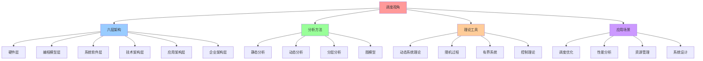

# 调度视角：分层静态与动态分析

> **文档版本**：v1.0 **最后更新**：2025-11-10 **维护者**：项目团队

---

## 📑 目录

- [调度视角：分层静态与动态分析](#调度视角分层静态与动态分析)
  - [📑 目录](#-目录)
  - [1 文档定位](#1-文档定位)
    - [1.1 核心思想](#11-核心思想)
    - [1.2 与其他视角的区别](#12-与其他视角的区别)
  - [2 文档结构](#2-文档结构)
  - [3 核心主题](#3-核心主题)
    - [3.0 综合总览](#30-综合总览)
    - [3.1 分层静态分析](#31-分层静态分析)
    - [3.2 分层动态分析](#32-分层动态分析)
    - [3.3 调度策略分析](#33-调度策略分析)
    - [3.4 图模型视角](#34-图模型视角)
    - [3.5 动态系统视角](#35-动态系统视角)
    - [3.6 随机过程视角](#36-随机过程视角)
    - [3.7 有界系统分析](#37-有界系统分析)
    - [3.8 硬件层调度](#38-硬件层调度)
    - [3.9 编程模型层调度](#39-编程模型层调度)
    - [3.10 系统软件层调度](#310-系统软件层调度)
    - [3.11 企业架构层调度](#311-企业架构层调度)
    - [3.12 跨层次调度协同](#312-跨层次调度协同)
    - [3.13 虚拟化容器化沙盒化调度演进](#313-虚拟化容器化沙盒化调度演进)
    - [3.14 语义对齐与双向对比](#314-语义对齐与双向对比)
  - [4 阅读路径](#4-阅读路径)
    - [新手推荐路径](#新手推荐路径)
    - [进阶学习路径](#进阶学习路径)
    - [高级理论路径](#高级理论路径)
  - [5 相关文档](#5-相关文档)
    - [设计视角文档](#设计视角文档)
    - [理论分析文档](#理论分析文档)
    - [其他理论视角](#其他理论视角)
  - [6 参考](#6-参考)
    - [学术参考](#学术参考)
    - [实践参考](#实践参考)
  - [7 认知增强：思维导图、知识矩阵与专家观点](#7-认知增强思维导图知识矩阵与专家观点)
    - [7.1 调度视角完整思维导图](#71-调度视角完整思维导图)
    - [7.2 知识多维关系矩阵](#72-知识多维关系矩阵)
      - [调度系统六层架构多维关系矩阵](#调度系统六层架构多维关系矩阵)
      - [调度分析方法多维关系矩阵](#调度分析方法多维关系矩阵)
    - [7.3 形象化解释论证](#73-形象化解释论证)
      - [调度视角的形象化类比](#调度视角的形象化类比)
        - [1. 调度系统 = 交通管理系统](#1-调度系统--交通管理系统)
        - [2. 分层调度 = 多级交通管理](#2-分层调度--多级交通管理)
        - [3. 动态调度 = 实时交通调整](#3-动态调度--实时交通调整)
        - [4. 有界调度 = 交通容量限制](#4-有界调度--交通容量限制)
    - [7.4 专家观点与论证](#74-专家观点与论证)
      - [计算信息软件科学家的观点](#计算信息软件科学家的观点)
        - [1. Michael Pinedo（调度理论专家）](#1-michael-pinedo调度理论专家)
        - [2. Peter Brucker（调度算法专家）](#2-peter-brucker调度算法专家)
      - [计算信息软件教育家的观点](#计算信息软件教育家的观点)
        - [1. Andrew Tanenbaum（操作系统专家）](#1-andrew-tanenbaum操作系统专家)
        - [2. Silberschatz \& Galvin（操作系统教材作者）](#2-silberschatz--galvin操作系统教材作者)
      - [计算信息软件认知学家的观点](#计算信息软件认知学家的观点)
        - [1. Herbert Simon（认知科学家）](#1-herbert-simon认知科学家)
        - [2. Daniel Kahneman（行为经济学家）](#2-daniel-kahneman行为经济学家)
    - [7.5 认知学习路径矩阵](#75-认知学习路径矩阵)
    - [7.6 专家推荐阅读路径](#76-专家推荐阅读路径)

---

## 1 文档定位

本文档集从**调度理论视角**分析虚拟化容器化集群管理中的调度系统，运用分层静态分析
、动态分析、图模型、动态系统理论、随机过程等数学工具，建立调度系统的严格数学模型
。

### 1.1 核心思想

> **调度系统 = 六层架构 × 静态分析 × 动态分析 × 有界约束 × 跨层协同**

调度系统的本质特征：

1. **六层架构**：从硬件层到企业架构层的完整调度体系
   - **硬件层**：指令级并行、Tomasulo 算法、分支预测
   - **编程模型层**：异步编程、CSP/Golang、事件循环
   - **系统软件层**：OS 进程调度、线程调度、内存调度
   - **技术架构层**：Kubernetes、容器编排、服务网格
   - **应用架构层**：微服务调度、Serverless、API 网关
   - **企业架构层**：业务流程编排、数据流水线、长事务调度
2. **静态分析**：在不执行调度的情况下，通过分析调度策略和约束来评估系统特性
3. **动态分析**：通过实际执行调度，观察调度行为以获取系统特性
4. **图模型**：调度问题可以建模为图论问题，利用图的结构特性进行分析
5. **动态系统**：调度系统是一个动态系统，具有状态转换和反馈机制
6. **随机过程**：调度过程具有随机性，可以利用随机过程理论进行分析
7. **有界约束**：调度系统必须在资源边界、时间边界、性能边界内运行
8. **跨层协同**：不同层次的调度系统协同工作，实现端到端性能优化

**为什么需要调度视角？**

调度是集群管理的核心问题，但现有的理论视角（矩阵视角、代数结构视角、结构视角）主
要关注系统结构和组件关系，缺乏对调度过程的深入分析。调度视角填补了这一空白，提供
了专门针对调度问题的理论框架。

### 1.2 与其他视角的区别

| 视角             | 关注点                       | 适用场景               |
| ---------------- | ---------------------------- | ---------------------- |
| **矩阵视角**     | 概念向量、关系矩阵、变换矩阵 | 技术选型、场景转换     |
| **代数结构视角** | 算子、运算、代数结构         | 操作组合、结构保持     |
| **结构视角**     | 计算结构、控制结构、信息结构 | 技术本质理解           |
| **调度视角**     | 调度决策、分层分析、动态特性 | **调度优化、性能分析** |

**调度视角的独特价值**：

1. **专门针对调度问题**：深入分析调度决策的静态和动态特性
2. **分层分析**：揭示调度系统的层次结构和各层职责
3. **多模型融合**：结合图模型、动态系统、随机过程等多种理论
4. **有界约束**：明确调度系统的边界条件，确保系统稳定性

---

## 2 文档结构

```text
scheduling-perspective/
├── README.md                                    # 本文档（主索引）
├── 00-comprehensive-overview.md                 # 综合总览：从硬件到企业架构的完整体系
├── QUICK-REFERENCE.md                           # 快速参考指南
├── 01-static-analysis.md                        # 静态分析：调度策略与约束分析
├── 02-dynamic-analysis.md                       # 动态分析：调度行为与性能分析
├── 03-layered-analysis.md                       # 分层分析：调度系统的层次结构（技术架构层）
├── 04-graph-model.md                            # 图模型：调度问题的图论表示
├── 05-dynamic-system.md                         # 动态系统：调度系统的状态转换
├── 06-stochastic-process.md                     # 随机过程：调度过程的随机性分析
├── 07-bounded-system.md                         # 有界系统：调度系统的边界约束
├── 08-scheduling-strategies.md                  # 调度策略：常见调度策略分析
├── 09-hardware-layer-scheduling.md              # 硬件层调度：指令级并行与动态调度算法
├── 10-programming-model-scheduling.md           # 编程模型层调度：异步编程与CSP并发模型
├── 11-system-software-scheduling.md             # 系统软件层调度：OS进程调度与内存调度
├── 12-enterprise-architecture-scheduling.md     # 企业架构层调度：业务流程编排与数据流水线
├── 13-cross-layer-scheduling.md                 # 跨层次调度协同：端到端调度延迟与资源分配博弈
├── 14-virtualization-containerization-sandboxing.md  # 虚拟化·容器化·沙盒化调度演进
├── REFERENCES.md                                # 参考资源
└── schedule_view_fix.md                         # 原始调度原理文档（参考）
```

---

## 3 核心主题

### 3.0 综合总览

**核心内容**：

- **六层架构模型**：从硬件层到企业架构层的完整调度体系
- **多维对比矩阵**：调度粒度、开销、形式化工具对比
- **统一形式化框架**：所有调度问题的统一建模方法
- **关键定理汇总**：各层次的关键定理和证明方法
- **跨层次协同机制**：端到端延迟模型和资源分配博弈

**详细内容**：见 [00-comprehensive-overview.md](00-comprehensive-overview.md)

---

### 3.1 分层静态分析

**核心内容**：

- **调度层次划分**：识别调度系统的不同层次（全局调度、节点调度、任务调度）
- **静态约束分析**：分析调度策略的静态约束（资源约束、亲和性约束、反亲和性约束）
- **调度策略评估**：在不执行调度的情况下，评估调度策略的理论性能
- **最坏情况分析**：计算调度算法在最坏情况下的延迟和资源利用率

**关键概念**：

- 调度层次：`SchedulingLayer = {Global, Node, Task}`
- 静态约束：`StaticConstraint = {Resource, Affinity, AntiAffinity, Topology}`
- 调度策略：`SchedulingPolicy = {FIFO, Priority, Fair, DRF}`

**形式化定义**：

```text
静态分析 = (调度层次, 静态约束, 调度策略, 评估函数)
其中：
- 调度层次：分层架构
- 静态约束：不可变的约束条件
- 调度策略：调度算法
- 评估函数：f(策略, 约束) → 性能指标
```

**详细内容**：见 [01-static-analysis.md](01-static-analysis.md)

---

### 3.2 分层动态分析

**核心内容**：

- **动态调度行为**：观察调度系统在实际运行中的行为
- **性能指标分析**：分析调度延迟、吞吐量、资源利用率等动态指标
- **调度决策追踪**：追踪调度决策的过程和结果
- **自适应调度**：分析调度系统如何根据实际负载调整调度策略

**关键概念**：

- 动态指标：`DynamicMetrics = {Latency, Throughput, Utilization, Fairness}`
- 调度决策：`SchedulingDecision = (Pod, Node, Time, Cost)`
- 自适应机制：`AdaptiveMechanism = {HPA, VPA, ClusterAutoscaler}`

**形式化定义**：

```text
动态分析 = (调度行为, 性能指标, 决策追踪, 自适应机制)
其中：
- 调度行为：实际执行过程
- 性能指标：运行时指标
- 决策追踪：决策历史
- 自适应机制：动态调整策略
```

**详细内容**：见 [02-dynamic-analysis.md](02-dynamic-analysis.md)

---

### 3.3 调度策略分析

**核心内容**：

- **常见调度策略**：FIFO、优先级调度、公平调度、主导资源公平（DRF）
- **策略对比分析**：对比不同调度策略的优缺点
- **策略选择原则**：根据场景选择合适的调度策略
- **混合策略**：结合多种调度策略的混合方案

**关键概念**：

- FIFO：先来先服务
- 优先级调度：基于优先级的调度
- 公平调度：保证公平性的调度
- DRF：主导资源公平调度

**详细内容**：见 [08-scheduling-strategies.md](08-scheduling-strategies.md)

---

### 3.4 图模型视角

**核心内容**：

- **调度图模型**：将调度问题建模为图论问题
- **节点表示**：Pod、Node、资源等作为图的节点
- **边表示**：调度约束、依赖关系等作为图的边
- **图算法应用**：利用图算法解决调度问题（最短路径、最大流、图着色等）

**关键概念**：

- 调度图：`SchedulingGraph = (V, E, W)`
  - V = {Pods, Nodes, Resources}
  - E = {Constraints, Dependencies, Affinities}
  - W = {Weights, Costs, Priorities}

**形式化定义**：

```text
调度图 = (节点集合, 边集合, 权重函数)
其中：
- 节点集合：调度实体（Pod、Node等）
- 边集合：调度关系（约束、依赖等）
- 权重函数：调度成本、优先级等
```

**详细内容**：见 [04-graph-model.md](04-graph-model.md)

---

### 3.5 动态系统视角

**核心内容**：

- **状态空间模型**：调度系统的状态空间表示
- **状态转换**：调度决策导致的状态转换
- **反馈机制**：调度结果的反馈和调整
- **稳定性分析**：分析调度系统的稳定性

**关键概念**：

- 状态变量：`x(t) = (PodStates, NodeStates, ResourceStates)`
- 控制输入：`u(t) = (SchedulingDecisions, ScalingActions)`
- 状态方程：`ẋ(t) = f(x(t), u(t), d(t))`

**形式化定义**：

```text
动态系统 = (状态空间, 状态方程, 输出方程, 反馈机制)
其中：
- 状态空间：所有可能的状态
- 状态方程：状态转换规则
- 输出方程：观测输出
- 反馈机制：闭环控制
```

**详细内容**：见 [05-dynamic-system.md](05-dynamic-system.md)

---

### 3.6 随机过程视角

**核心内容**：

- **随机调度模型**：调度过程具有随机性（Pod 到达、节点故障等）
- **随机过程理论**：利用随机过程理论分析调度性能
- **排队论模型**：调度系统可以建模为排队系统
- **概率分析**：分析调度决策的概率分布

**关键概念**：

- 随机到达：`PodArrival ~ Poisson(λ)`
- 随机服务时间：`ServiceTime ~ Exponential(μ)`
- 随机故障：`NodeFailure ~ Exponential(γ)`

**形式化定义**：

```text
随机调度 = (到达过程, 服务过程, 故障过程, 性能指标)
其中：
- 到达过程：Pod到达的随机过程
- 服务过程：调度服务的随机过程
- 故障过程：节点故障的随机过程
- 性能指标：延迟、吞吐量等的概率分布
```

**详细内容**：见 [06-stochastic-process.md](06-stochastic-process.md)

---

### 3.7 有界系统分析

**核心内容**：

- **资源边界**：调度系统必须在资源边界内运行
- **时间边界**：调度决策必须在时间边界内完成
- **性能边界**：调度系统必须满足性能边界要求
- **边界约束分析**：分析边界约束对调度系统的影响

**关键概念**：

- 资源边界：`ResourceBound = {CPU, Memory, Storage, Network}`
- 时间边界：`TimeBound = {SchedulingLatency, PodStartupTime}`
- 性能边界：`PerformanceBound = {Throughput, Latency, Availability}`

**形式化定义**：

```text
有界系统 = (资源边界, 时间边界, 性能边界, 约束函数)
其中：
- 资源边界：资源限制
- 时间边界：时间限制
- 性能边界：性能要求
- 约束函数：边界约束的数学表示
```

**详细内容**：见 [07-bounded-system.md](07-bounded-system.md)

---

### 3.8 硬件层调度

**核心内容**：

- **指令级并行（ILP）**：流水线调度、流水线冒险、CPI 定量分析
- **动态调度算法**：记分牌算法、Tomasulo 算法、寄存器重命名
- **分支预测**：BTB、BHT、分支预测性能分析
- **存储冲突消解**：Load/Store 队列、内存一致性模型

**关键概念**：

- 流水线 CPI：$CPI_{pipeline} = CPI_{ideal} + \Sigma Stalls$
- Tomasulo 算法：通过寄存器重命名消除 WAR/WAW 冲突
- 分支预测准确率：现代 CPU 实现 $p > 95\%$

**形式化定义**：

```text
硬件层调度 = (流水线, 动态调度, 分支预测, 存储冲突消解)
其中：
- 流水线：指令重叠执行
- 动态调度：乱序执行
- 分支预测：减少控制冒险
- 存储冲突消解：处理内存访问冲突
```

**详细内容**：见
[09-hardware-layer-scheduling.md](09-hardware-layer-scheduling.md)

---

### 3.9 编程模型层调度

**核心内容**：

- **异步编程调度**：Python asyncio、C# async/await、JavaScript 事件循环
- **CSP/Golang 运行时调度**：GMP 模型、工作窃取算法、Channel 通信
- **形式化证明**：Goroutine 无饥饿性、Channel 无死锁、async/await 语义保持

**关键概念**：

- 协程切换开销：~50-150ns（vs 线程切换 1-5μs）
- GMP 模型：G（Goroutine）、M（Machine）、P（Processor）
- 工作窃取：随机化公平性保证

**形式化定义**：

```text
编程模型层调度 = (异步编程, CSP并发模型, 事件循环, 工作窃取)
其中：
- 异步编程：协作式非抢占调度
- CSP并发模型：通过Channel通信
- 事件循环：单线程事件驱动
- 工作窃取：负载均衡算法
```

**详细内容**：见
[10-programming-model-scheduling.md](10-programming-model-scheduling.md)

---

### 3.10 系统软件层调度

**核心内容**：

- **进程调度**：Linux CFS、调度策略对比、实时调度
- **线程调度**：M:N 线程模型、线程调度策略
- **内存调度**：虚拟内存调度、页面置换算法、缓存调度

**关键概念**：

- CFS 虚拟运行时间
  ：$vruntime_i = \sum \frac{actual\_runtime_i \times weight\_nice0}{weight_i}$
- 可调度性分析：RMS 可调度条件 $U \le n(2^{1/n} - 1)$
- LRU 页面置换：选择最近最久未使用的页面

**形式化定义**：

```text
系统软件层调度 = (进程调度, 线程调度, 内存调度)
其中：
- 进程调度：CPU时间片分配
- 线程调度：用户线程到内核线程映射
- 内存调度：页面置换和缓存替换
```

**详细内容**：见
[11-system-software-scheduling.md](11-system-software-scheduling.md)

---

### 3.11 企业架构层调度

**核心内容**：

- **业务架构层调度**：BPMN 流程编排、Saga 长事务调度、事件驱动架构
- **数据架构层调度**：Flink 实时数据流水线、Iceberg 湖仓一体、批流一体调度
- **应用架构层调度**：Istio 微服务网格、Serverless 弹性伸缩

**关键概念**：

- BPMN 流程：$B = (A, E, G, F)$ 业务流程定义
- Saga 补偿事务：$c_i \circ f_i = \text{id}_S$ 可补偿性
- 反压机制
  ：$\text{Backpressure}(op_i) \iff \frac{buffer\_usage}{buffer\_size} > \alpha$

**形式化定义**：

```text
企业架构层调度 = (业务流程编排, 数据流水线, 微服务调度, 长事务调度)
其中：
- 业务流程编排：BPMN流程引擎
- 数据流水线：Flink流计算
- 微服务调度：Istio服务网格
- 长事务调度：Saga补偿模式
```

**详细内容**：见
[12-enterprise-architecture-scheduling.md](12-enterprise-architecture-scheduling.md)

---

### 3.12 跨层次调度协同

**核心内容**：

- **端到端调度延迟模型**：从用户请求到业务响应的全链路延迟分解
- **资源分配博弈论模型**：多租户资源竞争、纳什均衡、VCG 拍卖机制
- **跨层次协同机制**：垂直协同、水平协同、反馈循环

**关键概念**：

- 端到端延迟：$Latency_{total} = \sum_{i=1}^{6} T_i$
- 纳什均衡
  ：$\forall i, u_i(x_i^*, \mathbf{x}_{-i}^*) \ge u_i(x_i, \mathbf{x}_{-i}^*)$
- VCG 机制：激励相容的拍卖机制

**形式化定义**：

```text
跨层次调度协同 = (端到端延迟模型, 资源分配博弈, 垂直协同, 水平协同)
其中：
- 端到端延迟模型：全链路延迟分解
- 资源分配博弈：多租户资源竞争
- 垂直协同：不同层次间协同
- 水平协同：同层次内协同
```

**详细内容**：见 [13-cross-layer-scheduling.md](13-cross-layer-scheduling.md)

---

### 3.13 虚拟化容器化沙盒化调度演进

**核心内容**：

- **技术演进路径**：虚拟化 → 容器化 → 沙盒化的演进过程
- **技术栈对比矩阵**：全栈技术对比、性能特征对比、适用场景对比
- **沙盒化革命性架构**：Kuasar+iSulad 架构、性能提升形式化证明
- **调度原理适配与演进**：从进程调度到容器调度、Kubernetes 调度器形式化语义

**关键概念**：

- 虚拟化：硬件级隔离，性能开销 10-15%
- 容器化：OS 级隔离，性能开销 1-3%
- 沙盒化：应用级隔离，性能开销 5-10%，启动时间 10-100ms

**形式化定义**：

```text
虚拟化容器化沙盒化调度 = (虚拟化调度, 容器化调度, 沙盒化调度, 混合调度)
其中：
- 虚拟化调度：Hypervisor层调度
- 容器化调度：Cgroup/Namespace调度
- 沙盒化调度：用户态内核调度
- 混合调度：多沙箱类型混合调度
```

**详细内容**：见
[14-virtualization-containerization-sandboxing.md](14-virtualization-containerization-sandboxing.md)

---

### 3.14 语义对齐与双向对比

**核心内容**：

- **文档语义对齐矩阵**：主题映射关系、子主题对比分析
- **双向对比分析**：schedule_view_fix.md 与结构化文档对比、结构化文档之间对比
- **相互补充内容**：理论深度补充、实践案例补充、最新研究趋势补充
- **网络对标分析**：学术研究对标、工业实践对标、技术趋势对标（2025 年 11 月 12
  日）

**关键价值**：

- **完整性**：确保文档集覆盖所有重要主题
- **一致性**：确保相同概念在不同文档中的表述一致
- **时效性**：确保文档内容与最新研究趋势同步
- **可维护性**：提供清晰的文档关系和更新路径

**详细内容**：见 [15-semantic-alignment.md](15-semantic-alignment.md)

---

## 4 阅读路径

### 新手推荐路径

1. [00-comprehensive-overview.md](00-comprehensive-overview.md) - 了解调度系统的
   完整体系
2. [README.md](README.md) - 了解调度视角的整体框架
3. [08-scheduling-strategies.md](08-scheduling-strategies.md) - 学习常见调度策略
4. [03-layered-analysis.md](03-layered-analysis.md) - 理解调度系统的分层架构
5. [01-static-analysis.md](01-static-analysis.md) - 理解静态分析方法
6. [02-dynamic-analysis.md](02-dynamic-analysis.md) - 理解动态分析方法

### 进阶学习路径

1. [09-hardware-layer-scheduling.md](09-hardware-layer-scheduling.md) - 理解硬件
   层调度原理
2. [10-programming-model-scheduling.md](10-programming-model-scheduling.md) - 理
   解编程模型层调度
3. [11-system-software-scheduling.md](11-system-software-scheduling.md) - 理解系
   统软件层调度
4. [04-graph-model.md](04-graph-model.md) - 学习图模型方法
5. [05-dynamic-system.md](05-dynamic-system.md) - 学习动态系统理论
6. [06-stochastic-process.md](06-stochastic-process.md) - 学习随机过程方法

### 高级理论路径

1. [12-enterprise-architecture-scheduling.md](12-enterprise-architecture-scheduling.md) -
   理解企业架构层调度
2. [13-cross-layer-scheduling.md](13-cross-layer-scheduling.md) - 理解跨层次调度
   协同
3. [14-virtualization-containerization-sandboxing.md](14-virtualization-containerization-sandboxing.md) -
   理解虚拟化容器化沙盒化调度演进
4. [07-bounded-system.md](07-bounded-system.md) - 深入理解有界系统
5. [REFERENCES.md](REFERENCES.md) - 查阅相关学术文献
6. 结合实际调度系统（Kubernetes、YARN、Flink 等）进行案例分析

---

## 5 相关文档

### 设计视角文档

- [调度系统形式化分析](../../../Design/15-scheduling-formal-analysis/) - 从范畴
  论视角分析调度系统
- [核心组件形式化分析](../../../Design/21-core-components-formal-analysis/) - 调
  度组件的形式化分析

### 理论分析文档

- [系统动态控制理论](../../../Design/11-theoretical-analysis/) - 控制理论在集群
  管理中的应用
- [形式化分析与抽象论证](../../../Design/11-theoretical-analysis/09-formal-analysis.md) -
  形式化分析方法

### 其他理论视角

- [矩阵视角](../matrix-perspective/) - 矩阵视角的理论框架
- [代数结构视角](../algebraic-structure/) - 代数结构视角的理论框架
- [结构视角](../structural-perspective/) - 结构视角的理论框架

---

## 6 参考

### 学术参考

1. **调度理论**：

   - Pinedo, M. L. (2016). _Scheduling: Theory, Algorithms, and Systems_.
     Springer.
   - Leung, J. Y. T. (2004). _Handbook of Scheduling: Algorithms, Models, and
     Performance Analysis_. CRC Press.

2. **图论与调度**：

   - Brucker, P. (2007). _Scheduling Algorithms_. Springer.
   - Graham, R. L., et al. (1979). "Optimization and approximation in
     deterministic sequencing and scheduling: a survey." _Annals of Discrete
     Mathematics_.

3. **动态系统与调度**：

   - Cassandras, C. G., & Lafortune, S. (2008). _Introduction to Discrete Event
     Systems_. Springer.
   - Kumar, P. R., & Varaiya, P. (1986). _Stochastic Systems: Estimation,
     Identification, and Adaptive Control_. Prentice-Hall.

4. **随机过程与调度**：

   - Kleinrock, L. (1975). _Queueing Systems, Volume 1: Theory_. Wiley.
   - Gross, D., & Harris, C. M. (1998). _Fundamentals of Queueing Theory_.
     Wiley.

5. **有界系统理论**：
   - Khalil, H. K. (2002). _Nonlinear Systems_. Prentice-Hall.
   - Sontag, E. D. (1998). _Mathematical Control Theory: Deterministic Finite
     Dimensional Systems_. Springer.

### 实践参考

- Kubernetes Scheduler:
  <https://kubernetes.io/docs/concepts/scheduling-eviction/>
- YARN Scheduler:
  <https://hadoop.apache.org/docs/current/hadoop-yarn/hadoop-yarn-site/YARN.html>
- Mesos Scheduler: <http://mesos.apache.org/documentation/latest/architecture/>

---

## 7 认知增强：思维导图、知识矩阵与专家观点

### 7.1 调度视角完整思维导图



### 7.2 知识多维关系矩阵

#### 调度系统六层架构多维关系矩阵

| 层次维度 | 硬件层 | 编程模型层 | 系统软件层 | 技术架构层 | 应用架构层 | 企业架构层 | 认知价值 |
|---------|--------|-----------|-----------|-----------|-----------|-----------|---------|
| **调度对象** | 指令、数据 | 协程、任务 | 进程、线程 | Pod、容器 | 微服务、函数 | 业务流程、数据流 | 层次理解 |
| **调度策略** | Tomasulo、分支预测 | CSP、事件循环 | 时间片、优先级 | 资源配额、亲和性 | 负载均衡、熔断 | 工作流编排 | 策略理解 |
| **调度目标** | 指令级并行 | 并发控制 | 公平性、响应性 | 资源利用率 | 服务可用性 | 业务效率 | 目标理解 |
| **数学工具** | 流水线模型 | CSP理论 | 调度算法 | 图论、优化 | 控制理论 | 工作流理论 | 工具理解 |
| **技术实现** | CPU调度器 | Go runtime | OS调度器 | Kubernetes | 服务网格 | 业务流程引擎 | 实现理解 |
| **学习难度** | ⭐⭐⭐⭐⭐ | ⭐⭐⭐⭐ | ⭐⭐⭐⭐ | ⭐⭐⭐ | ⭐⭐⭐ | ⭐⭐ | 渐进学习 |
| **专家推荐** | ⭐⭐⭐⭐⭐ | ⭐⭐⭐⭐⭐ | ⭐⭐⭐⭐⭐ | ⭐⭐⭐⭐⭐ | ⭐⭐⭐⭐ | ⭐⭐⭐⭐ | 理论深度 |

#### 调度分析方法多维关系矩阵

| 分析方法 | 静态分析 | 动态分析 | 分层分析 | 图模型 | 动态系统 | 随机过程 | 适用场景 | 认知价值 |
|---------|---------|---------|---------|--------|---------|---------|---------|---------|
| **分析对象** | 调度策略、约束 | 调度行为、性能 | 层次结构、职责 | 调度图、依赖 | 状态转换、反馈 | 随机性、概率 | 调度系统 | 方法理解 |
| **数学基础** | 图论、约束优化 | 动态系统、控制理论 | 层次理论 | 图论、拓扑 | 微分方程、稳定性 | 随机过程、马尔可夫链 | 数学工具 | 理论理解 |
| **分析输出** | 调度可行性 | 调度性能 | 层次关系 | 调度路径 | 系统稳定性 | 性能分布 | 分析结果 | 结果理解 |
| **技术应用** | 调度器设计 | 性能优化 | 架构设计 | 依赖分析 | 系统控制 | 性能预测 | 实际应用 | 应用理解 |

### 7.3 形象化解释论证

#### 调度视角的形象化类比

##### 1. 调度系统 = 交通管理系统

> **类比**：调度系统就像交通管理系统，调度器是交通指挥中心，任务（Pod、进程）是车辆，资源（CPU、内存）是道路，调度决策是交通信号，就像交通管理系统协调车辆通行一样。

**认知价值**：

- **协调理解**：通过交通管理类比，理解调度系统的协调作用
- **资源理解**：通过道路类比，理解资源的有限性
- **决策理解**：通过信号灯类比，理解调度决策的重要性

##### 2. 分层调度 = 多级交通管理

> **类比**：分层调度就像多级交通管理，国家交通部（企业架构层）管理全国交通，省交通厅（应用架构层）管理省内交通，市交通局（技术架构层）管理市内交通，就像多级交通管理协调不同层次的交通一样。

**认知价值**：

- **层次理解**：通过多级管理类比，理解调度系统的层次结构
- **职责理解**：通过职责分工类比，理解各层的职责
- **协调理解**：通过协调机制类比，理解跨层协调的重要性

##### 3. 动态调度 = 实时交通调整

> **类比**：动态调度就像实时交通调整，根据实时交通状况（系统负载）调整信号灯（调度策略），就像实时交通调整优化交通流一样。

**认知价值**：

- **动态理解**：通过实时调整类比，理解动态调度的必要性
- **反馈理解**：通过交通状况反馈类比，理解反馈机制
- **优化理解**：通过优化交通流类比，理解调度优化的目标

##### 4. 有界调度 = 交通容量限制

> **类比**：有界调度就像交通容量限制，道路有最大容量（资源边界），车辆不能超过容量（任务不能超过资源），就像交通容量限制确保交通安全一样。

**认知价值**：

- **边界理解**：通过容量限制类比，理解有界调度的边界条件
- **安全理解**：通过交通安全类比，理解有界调度的重要性
- **稳定性理解**：通过容量控制类比，理解系统稳定性

### 7.4 专家观点与论证

#### 计算信息软件科学家的观点

##### 1. Michael Pinedo（调度理论专家）

> "Scheduling is the allocation of resources over time to perform a collection of tasks. Understanding scheduling requires understanding both the structure of tasks and the constraints of resources."

**在调度视角中的应用**：

- **资源分配**：调度视角揭示了资源分配的本质
- **任务理解**：通过调度视角，我们可以理解任务的结构
- **约束理解**：调度视角帮助我们理解资源约束

##### 2. Peter Brucker（调度算法专家）

> "Scheduling algorithms are the heart of any scheduling system. The choice of algorithm determines the performance and fairness of the system."

**在调度视角中的应用**：

- **算法理解**：调度视角帮助我们理解调度算法
- **性能理解**：通过调度视角，我们可以理解调度性能
- **公平性理解**：调度视角帮助我们理解调度公平性

#### 计算信息软件教育家的观点

##### 1. Andrew Tanenbaum（操作系统专家）

> "Understanding scheduling is understanding how computer systems manage resources. This is fundamental to computer science education."

**教育价值**：

- **基础理解**：调度是计算机系统的基础，理解调度就是理解系统
- **资源理解**：通过调度，学生可以理解资源管理
- **系统理解**：调度视角帮助学生理解计算机系统

##### 2. Silberschatz & Galvin（操作系统教材作者）

> "Scheduling is a fundamental problem in computer systems. Teaching scheduling helps students understand the complexity of resource management."

**教育价值**：

- **问题理解**：调度是计算机系统的基本问题
- **复杂性理解**：通过调度，学生可以理解资源管理的复杂性
- **系统理解**：调度视角帮助学生理解系统复杂性

#### 计算信息软件认知学家的观点

##### 1. Herbert Simon（认知科学家）

> "Understanding scheduling requires understanding the cognitive processes involved in decision-making. Scheduling is essentially a cognitive task."

**认知价值**：

- **认知理解**：调度是认知任务，理解调度就是理解认知过程
- **决策理解**：通过调度，我们可以理解决策过程
- **认知提升**：调度视角提升了我们的认知能力

##### 2. Daniel Kahneman（行为经济学家）

> "Scheduling decisions involve trade-offs between different objectives. Understanding these trade-offs is essential for making good scheduling decisions."

**认知价值**：

- **权衡理解**：调度决策涉及不同目标之间的权衡
- **决策理解**：通过调度，我们可以理解决策权衡
- **认知提升**：调度视角帮助我们理解决策过程

### 7.5 认知学习路径矩阵

| 学习阶段 | 核心概念 | 形象化理解 | 数学理解 | 实践应用 | 认知目标 |
|---------|---------|-----------|---------|---------|---------|
| **入门** | 六层架构 | 交通管理类比 | 调度算法 | 调度器使用 | 建立直觉 |
| **进阶** | 静态分析、动态分析 | 实时交通调整类比 | 图论、动态系统 | 调度优化 | 理解方法 |
| **高级** | 有界系统、随机过程 | 交通容量限制类比 | 控制理论、随机过程 | 系统设计 | 掌握理论 |
| **专家** | 跨层协同、语义对齐 | 深层结构类比 | 复杂系统理论 | 架构设计 | 灵活应用 |

### 7.6 专家推荐阅读路径

**计算信息软件科学家推荐路径**：

1. **理论基础**：从调度理论开始，理解调度的数学基础
2. **分层分析**：理解六层架构的调度体系
3. **分析方法**：掌握静态分析、动态分析等方法
4. **理论应用**：将调度理论应用到实际系统

**计算信息软件教育家推荐路径**：

1. **形象化理解**：通过交通管理等类比，建立直观理解
2. **渐进学习**：从简单调度开始，逐步学习复杂调度
3. **实践结合**：结合实际调度系统，理解调度应用
4. **思维训练**：通过调度视角，训练系统思维能力

**计算信息软件认知学家推荐路径**：

1. **认知模式**：识别调度视角中的认知模式
2. **决策理解**：理解调度决策的认知过程
3. **跨域应用**：将调度思维应用到其他领域
4. **认知提升**：通过调度视角，提升认知能力

---

**最后更新**：2025-11-15
**文档状态**：✅ 完整 | 📊 包含思维导图、知识多维关系矩阵、形象化解释论证、专家观点 | 🎯 生产就绪
**维护者**：项目团队

> **📊 2025 年技术趋势参考**：详细技术状态和版本信息请查看
> [27. 2025 年技术趋势汇总](../../TECHNICAL/10-reference-trends/2025-trends/2025-trends.md)
