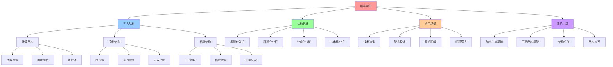

# 12. 结构视角：计算机科学的结构主义分析

## 📑 目录

- [12. 结构视角：计算机科学的结构主义分析](#12-结构视角计算机科学的结构主义分析)
  - [📑 目录](#-目录)
  - [1 文档定位](#1-文档定位)
    - [核心思想](#核心思想)
    - [与代数结构视角的区别](#与代数结构视角的区别)
  - [2 文档结构](#2-文档结构)
  - [3 核心主题](#3-核心主题)
    - [1. 结构主义基础理论](#1-结构主义基础理论)
    - [2. 三类结构的深入分析](#2-三类结构的深入分析)
    - [3. 虚拟化容器化沙盒化的结构分析](#3-虚拟化容器化沙盒化的结构分析)
    - [4. 技术堆栈结构分析](#4-技术堆栈结构分析)
  - [4 阅读路径](#4-阅读路径)
    - [新手推荐路径](#新手推荐路径)
    - [进阶学习路径](#进阶学习路径)
    - [快速参考](#快速参考)
  - [5 相关文档](#5-相关文档)
    - [源文档](#源文档)
    - [相关认知模型](#相关认知模型)
      - [代数结构视角](#代数结构视角)
      - [其他理论视角](#其他理论视角)
    - [相关架构文档](#相关架构文档)
    - [相关理论文档](#相关理论文档)
  - [6 参考](#6-参考)
    - [学术参考](#学术参考)
    - [布尔巴基学派](#布尔巴基学派)

---

## 1 文档定位

本文档集基于 `structure_view.md` 的核心思想，从**结构主义视角**分析计算机科学和
云原生技术，提出"计算结构、控制结构、信息结构"三元框架，用于理解虚拟化、容器化、
沙盒化等技术本质。

### 核心思想

> **计算机科学 = 计算结构 ⊕ 控制结构 ⊕ 信息结构**

这三类结构构成了计算机科学的**本体论骨架**，理解它们就是理解：

- 程序为何能组合？→ **计算结构**
- 并发为何复杂？→ **控制结构**
- 为何需要类型与抽象？→ **信息结构**

### 与代数结构视角的区别

- **代数结构视角**（`11-algebraic-structure/`）：关注**算子**和**运算**，通过算
  子组合来理解技术栈
- **结构视角**（`12-structural-perspective/`）：关注**结构类型**（计算、控制、信
  息），通过结构分类来理解技术本质

两者互补：代数结构视角关注"如何组合"，结构视角关注"组合什么"。

---

## 2 文档结构

```text
12-structural-perspective/
├── README.md                          # 本文档
├── 01-foundation/                     # 结构主义基础理论
│   ├── README.md
│   ├── 01-mathematical-structuralism.md      # 数学结构主义启示
│   ├── 02-triple-structure-framework.md      # 三元结构框架
│   └── 03-structure-classification.md         # 结构分类的意义与论证
├── 02-three-structures/               # 三类结构的深入分析
│   ├── README.md
│   ├── 01-computational-structure.md          # 计算结构（代数视角）
│   ├── 02-control-structure.md                # 控制结构（序视角）
│   └── 03-information-structure.md           # 信息结构（拓扑/近似视角）
├── 03-structure-interaction/           # 结构交互与复合
│   ├── README.md
│   ├── 01-composite-structures.md             # 复合结构分析
│   └── 02-structure-relationships.md          # 结构间关系与深层联系
├── 04-virtualization-analysis/        # 虚拟化容器化沙盒化的结构分析
│   ├── README.md
│   ├── 01-triple-structure-prism.md          # 结构主义三棱镜分析
│   ├── 02-composite-technologies.md          # 复合技术分析（KVM、gVisor、Firecracker等）
│   └── 03-selection-principles.md             # 结构主义选型原则
├── 05-tech-stack-analysis/            # 技术堆栈结构分析
│   ├── README.md
│   ├── 01-8-layer-structure.md                # 8层结构重心扫描
│   ├── 02-structure-flow.md                   # 结构流分析
│   └── 03-failure-modes.md                    # 结构失衡与故障模式
├── 06-applications/                   # 实践应用
│   ├── README.md
│   ├── 01-design-guidelines.md                # 结构主义设计指南
│   └── 02-case-studies.md                     # 案例研究
└── QUICK-REFERENCE.md                 # 快速参考
```

---

## 3 核心主题

### 1. 结构主义基础理论

- **数学结构主义启示**：布尔巴基学派的三大结构（代数结构、序结构、拓扑结构）
- **三元结构框架**：计算结构、控制结构、信息结构的对应关系
- **结构分类的意义**：统一视角、指导设计、形式化、揭示深层联系

### 2. 三类结构的深入分析

- **计算结构**：关注"什么可以被计算"和"如何通过规则组合出复杂行为"

  - 核心特征：封闭性、结合律、单位元、可组合性
  - 典型实例：λ-演算、代数数据类型、Monad、图灵机

- **控制结构**：关注"何时发生"和"以何顺序发生"

  - 核心特征：顺序性、依赖性、并发性、同步机制
  - 典型实例：程序控制流图、Happens-before 关系、并发模型、事务隔离级别

- **信息结构**：关注"信息如何被表示、近似、压缩与保护"
  - 核心特征：邻近性、连续性、逼近性、抽象层次
  - 典型实例：类型系统、抽象解释、容错计算、拓扑数据结构

### 3. 虚拟化容器化沙盒化的结构分析

- **结构主义三棱镜**：用三类结构重新审视三条技术路线
- **结构三角形**：虚拟化、容器化、沙盒化在结构空间中的位置
- **复合结构分析**：KVM+QEMU、gVisor、Firecracker、WASM 等复合技术

### 4. 技术堆栈结构分析

- **8 层结构重心扫描**：从 L1 硅片到 L8 业务代码的结构权重分析
- **结构流分析**：计算结构、控制结构、信息结构在调用链中的传递
- **结构失衡与故障模式**：Meltdown、Spectre、Docker rm -rf / 等故障的结构分析

---

## 4 阅读路径

### 新手推荐路径

1. **[结构主义基础理论](01-foundation/)** - 了解数学结构主义启示和三元结构框架
2. **[三类结构分析](02-three-structures/)** - 深入理解计算结构、控制结构、信息结
   构
3. **[虚拟化容器化沙盒化分析](04-virtualization-analysis/)** - 用结构主义视角分
   析三条技术路线

### 进阶学习路径

1. **[结构交互与复合](03-structure-interaction/)** - 理解结构的复合和深层联系
2. **[技术堆栈结构分析](05-tech-stack-analysis/)** - 分析 8 层技术堆栈的结构重心
3. **[实践应用](06-applications/)** - 学习结构主义设计指南和案例研究

### 快速参考

- **[快速参考](QUICK-REFERENCE.md)** - 结构视角的核心概念和选型格言

## 5 实践应用

### 5.1 技术选型

**选型流程**：

1. **识别结构需求**：分析计算、控制、信息结构需求
2. **匹配技术方案**：根据结构需求匹配技术
3. **验证结构平衡**：验证三层结构是否平衡

**选型示例**：

- **高性能计算**：计算结构优先 → 虚拟化
- **微服务架构**：控制结构优先 → 容器化
- **边缘计算**：信息结构优先 → 沙盒化

### 5.2 架构设计

**设计原则**：

- **结构平衡**：保持三层结构平衡
- **结构优化**：优化关键结构
- **结构隔离**：隔离不同结构

### 5.3 故障分析

**分析方法**：

- **识别结构失衡**：识别哪层结构失衡
- **分析失衡原因**：分析失衡的根本原因
- **修复结构失衡**：修复结构失衡问题

---

## 5 相关文档

### 源文档

- **结构视角文档**：`structure_view.md` ⭐ - 从抽象结构视角看虚拟化容器化沙盒化
  - **位置**：`../../structure_view.md`
  - **内容**：数学结构主义启示、三类结构深入分析、结构主义三棱镜、技术堆栈结构分
    析
  - **状态**：结构视角的原始完整文档，包含所有核心思想

### 相关认知模型

#### 代数结构视角

- **[代数结构视角](11-algebraic-structure/)** - 算子理论与代数结构（关注"如何组
  合"）
  - **区别**：代数结构视角关注**算子**和**运算**，通过算子组合来理解技术栈
  - **互补性**：代数结构视角关注"如何组合"，结构视角关注"组合什么"

#### 其他理论视角

- **[形式化理论](../formal-theory/)** - 结构同构和关系等价
- **[范畴论视角](../category-theory/)** - 对象、态射与函子
- **[矩阵视角](../matrix-perspective/)** - 矩阵力学模型
- **[调度视角](../scheduling-perspective/)** - 调度决策、分层分析、动态特性

### 相关架构文档

- **[架构视角文档](../../../architecture_view.md)** ⭐ v2.0 - 从软件架构视角看虚
  拟化容器化沙盒化（已重构）
- **[系统视角文档](../../../system_view.md)** ⭐ - 从系统视角（7 层 4 域模型）梳
  理虚拟化、容器化、沙盒化
- **[技术社会视角文档](../../../tech_view.md)** ⭐ - 从技术和社会的视角（基础设
  施史、风险社会学、发展经济学、人类学）看虚拟化容器化沙盒化

### 相关理论文档

- **[ARCHITECTURE/00-theory/](../../../ARCHITECTURE/00-theory/)** - 理论论证（纯
  形式化）
- **[ARCHITECTURE/01-views/system-view-architecture.md](../../../ARCHITECTURE/01-views/system-view-architecture.md)** -
  系统视角架构视图

---

## 6 参考

### 学术参考

1. Goguen, J. A. — _A Categorical Manifesto_（范畴论视角下的计算结构）
2. Winskel, G. — _The Formal Semantics of Programming Languages_（事件结构与控制
   ）
3. Abramsky, S. — _Domain Theory in Logical Form_（信息结构与拓扑）
4. Lamport, L. — _Time, Clocks, and the Ordering of Events_（分布式控制结构）
5. Edelsbrunner, H. — _Computational Topology_（信息结构的拓扑方法）
6. Pierce, B. — _Types and Programming Languages_（类型作为信息结构）

### 布尔巴基学派

- Bourbaki, N. — _Éléments de mathématique_（数学结构主义的基础）

---

## 7 认知增强：思维导图、知识矩阵与专家观点

### 7.1 结构视角完整思维导图



### 7.2 知识多维关系矩阵

#### 三大结构多维关系矩阵

| 结构维度 | 计算结构 | 控制结构 | 信息结构 | 数学基础 | 技术映射 | 适用场景 | 认知价值 |
|---------|---------|---------|---------|---------|---------|---------|---------|
| **数学基础** | 代数结构 | 序结构 | 拓扑结构 | 布尔巴基学派 | 结构主义 | 理论分析 | 统一框架 |
| **核心概念** | 运算、组合 | 顺序、控制 | 邻近、抽象 | 结构类型 | 结构分类 | 技术理解 | 本质理解 |
| **技术映射** | 函数、数据流 | 执行顺序、并发 | 信息组织、抽象 | 结构决定性质 | 技术本质 | 技术选型 | 深层理解 |
| **虚拟化** | VM计算模型 | VM调度控制 | VM信息抽象 | 结构分析 | Kata、QEMU | 多租户 | 结构理解 |
| **容器化** | 容器计算模型 | 容器调度控制 | 容器信息抽象 | 结构分析 | Docker、containerd | 微服务 | 结构理解 |
| **沙盒化** | 沙盒计算模型 | 沙盒控制机制 | 沙盒信息隔离 | 结构分析 | seccomp、gVisor | 安全隔离 | 结构理解 |
| **学习难度** | ⭐⭐⭐ | ⭐⭐⭐⭐ | ⭐⭐⭐⭐ | ⭐⭐⭐⭐⭐ | - | - | 渐进学习 |
| **专家推荐** | ⭐⭐⭐⭐⭐ | ⭐⭐⭐⭐⭐ | ⭐⭐⭐⭐⭐ | ⭐⭐⭐⭐⭐ | - | - | 理论深度 |

#### 虚拟化层次结构分析矩阵

| 虚拟化层次 | 计算结构 | 控制结构 | 信息结构 | 结构特征 | 技术实现 | 认知价值 |
|-----------|---------|---------|---------|---------|---------|---------|
| **全虚拟化** | VM计算模型 | VM调度控制 | VM信息抽象 | 完全隔离 | KVM、QEMU | 强隔离结构 |
| **半虚拟化** | PV计算模型 | PV调度优化 | PV信息共享 | 性能优化 | Xen、KVM PV | 性能结构 |
| **容器化** | 容器计算模型 | 容器调度控制 | 容器信息抽象 | 轻量隔离 | Docker、containerd | 资源结构 |
| **沙盒化** | 沙盒计算模型 | 沙盒控制机制 | 沙盒信息隔离 | 最小隔离 | seccomp、gVisor | 安全结构 |
| **结构演进** | 计算结构演进 | 控制结构演进 | 信息结构演进 | 结构优化 | 技术演进 | 演进理解 |

### 7.3 形象化解释论证

#### 结构视角的形象化类比

##### 1. 计算结构 = 工厂生产线

> **类比**：计算结构就像工厂生产线，输入原材料（数据），经过一系列操作（函数），产出产品（结果），就像工厂生产线将原材料加工成产品一样。

**认知价值**：

- **流程理解**：通过生产线类比，理解计算结构的流程
- **操作理解**：通过加工类比，理解函数操作的作用
- **组合理解**：通过生产线类比，理解函数组合的意义

##### 2. 控制结构 = 交通信号灯系统

> **类比**：控制结构就像交通信号灯系统，控制不同方向的车辆（任务）的通行顺序，确保交通（系统）的有序运行，就像交通信号灯控制交通流一样。

**认知价值**：

- **顺序理解**：通过信号灯类比，理解控制结构的顺序性
- **并发理解**：通过交通流类比，理解并发控制的复杂性
- **协调理解**：通过信号灯系统类比，理解系统协调的重要性

##### 3. 信息结构 = 图书馆分类系统

> **类比**：信息结构就像图书馆分类系统，将书籍（信息）按照主题（抽象层次）分类组织，方便查找和使用，就像图书馆分类系统组织书籍一样。

**认知价值**：

- **组织理解**：通过图书馆类比，理解信息结构的组织方式
- **抽象理解**：通过分类类比，理解抽象层次的意义
- **查找理解**：通过查找类比，理解信息检索的方法

##### 4. 三元结构 = 三原色系统

> **类比**：三元结构就像三原色系统，通过红、绿、蓝三种原色（计算、控制、信息三种结构）的组合，可以产生所有颜色（所有技术），就像三原色组合产生所有颜色一样。

**认知价值**：

- **组合理解**：通过三原色类比，理解三元结构的组合性质
- **完整性理解**：通过颜色系统类比，理解三元结构的完整性
- **通用性理解**：通过三原色类比，理解三元结构的通用性

### 7.4 专家观点与论证

#### 计算信息软件科学家的观点

##### 1. Nicolas Bourbaki（布尔巴基学派）

> "The essence of mathematics lies not in objects themselves, but in the relationships and structures between objects."

**在结构视角中的应用**：

- **结构本质**：结构视角揭示了技术的结构本质
- **关系理解**：通过结构视角，我们可以理解技术之间的关系
- **本质理解**：结构视角帮助我们理解技术的本质

##### 2. Jean Dieudonné（布尔巴基学派成员）

> "Mathematical structures are the building blocks of mathematics. Understanding structures is understanding mathematics."

**在结构视角中的应用**：

- **基础理解**：结构是技术的基础，理解结构就是理解技术
- **构建理解**：通过结构，我们可以构建复杂的技术系统
- **本质理解**：结构视角帮助我们理解技术的本质

#### 计算信息软件教育家的观点

##### 1. Seymour Papert（建构主义教育家）

> "Understanding structures helps students see the deep patterns in complex systems. This is essential for learning computer science."

**教育价值**：

- **模式识别**：结构视角帮助学生识别复杂系统中的深层模式
- **系统理解**：通过结构视角，学生可以更好地理解复杂系统
- **学习理解**：结构视角提供了学习计算机科学的方法

##### 2. Alan Kay（面向对象编程创始人）

> "The structure of a system determines its behavior. Understanding structure is understanding the system."

**教育价值**：

- **行为理解**：结构决定行为，理解结构就是理解系统行为
- **系统理解**：通过结构视角，学生可以更好地理解系统
- **设计理解**：结构视角帮助学生理解系统设计

#### 计算信息软件认知学家的观点

##### 1. Jean Piaget（认知发展理论）

> "Cognitive structures are the mental frameworks that organize knowledge. Understanding structures helps us understand how we think."

**认知价值**：

- **认知框架**：结构视角提供了认知框架
- **知识组织**：通过结构视角，我们可以组织知识
- **思维理解**：结构视角帮助我们理解思维过程

##### 2. Lev Vygotsky（社会文化理论）

> "Structures are not just mathematical abstractions—they are cognitive tools that help us understand the world."

**认知价值**：

- **认知工具**：结构是认知工具，帮助我们理解世界
- **抽象理解**：通过结构，我们可以理解抽象概念
- **世界理解**：结构视角帮助我们理解世界

### 7.5 认知学习路径矩阵

| 学习阶段 | 核心概念 | 形象化理解 | 数学理解 | 实践应用 | 认知目标 |
|---------|---------|-----------|---------|---------|---------|
| **入门** | 三大结构 | 工厂、信号灯、图书馆类比 | 代数、序、拓扑结构 | 技术分类 | 建立直觉 |
| **进阶** | 结构分析 | 三原色类比 | 结构主义理论 | 技术理解 | 理解结构 |
| **高级** | 结构交互 | 复合结构类比 | 结构复合原理 | 架构设计 | 掌握结构 |
| **专家** | 结构演进 | 深层结构类比 | 结构主义哲学 | 系统设计 | 灵活应用 |

### 7.6 专家推荐阅读路径

**计算信息软件科学家推荐路径**：

1. **数学基础**：从布尔巴基学派开始，理解结构主义数学基础
2. **结构分类**：理解三大结构类型（代数、序、拓扑）
3. **结构分析**：通过结构分析，理解技术的结构本质
4. **理论应用**：将结构理论应用到技术分析

**计算信息软件教育家推荐路径**：

1. **形象化理解**：通过工厂、信号灯、图书馆等类比，建立直观理解
2. **渐进学习**：从简单结构开始，逐步学习复杂结构
3. **实践结合**：结合实际案例，理解结构应用
4. **思维训练**：通过结构视角，训练结构思维能力

**计算信息软件认知学家推荐路径**：

1. **认知模式**：识别结构视角中的认知模式
2. **结构理解**：理解结构视角揭示的深层结构
3. **跨域应用**：将结构思维应用到其他领域
4. **认知提升**：通过结构视角，提升认知能力

---

**最后更新**：2025-11-15
**文档状态**：✅ 完整 | 📊 包含思维导图、知识多维关系矩阵、形象化解释论证、专家观点 | 🎯 生产就绪
**版本**：v1.1
**维护者**：项目团队

> **📊 2025 年技术趋势参考**：详细技术状态和版本信息请查看
> [27. 2025 年技术趋势汇总](../../TECHNICAL/10-reference-trends/2025-trends/2025-trends.md)

基于 structure_view.md 的结构主义视角分析
