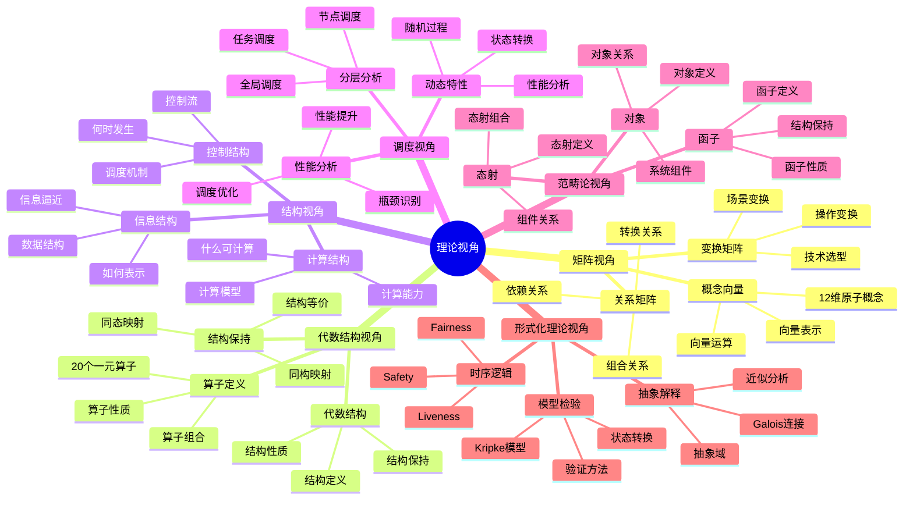
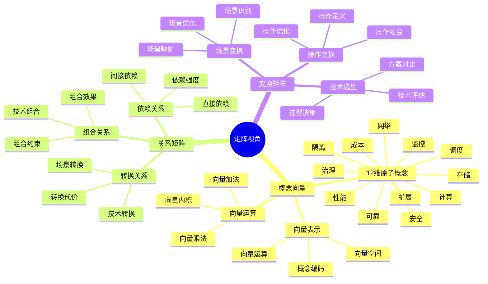
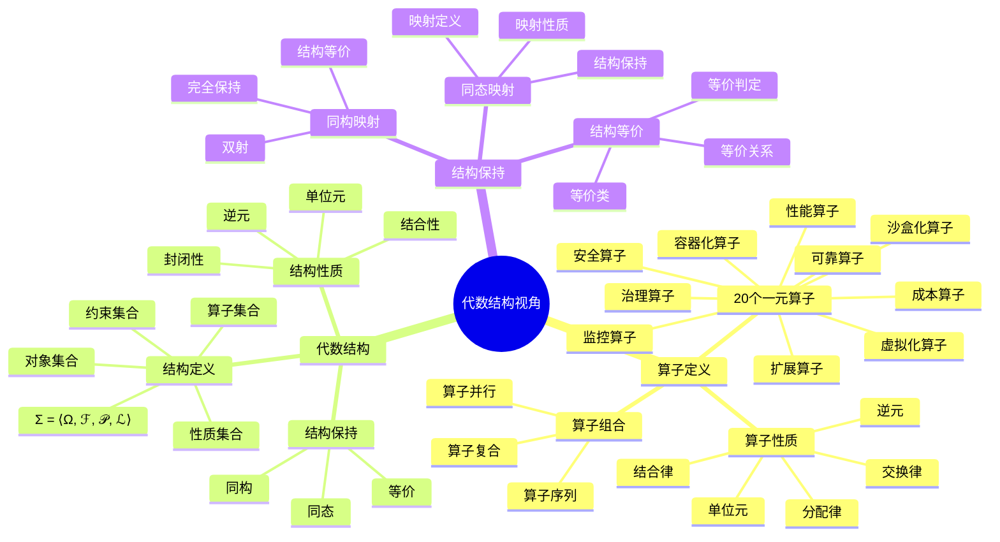
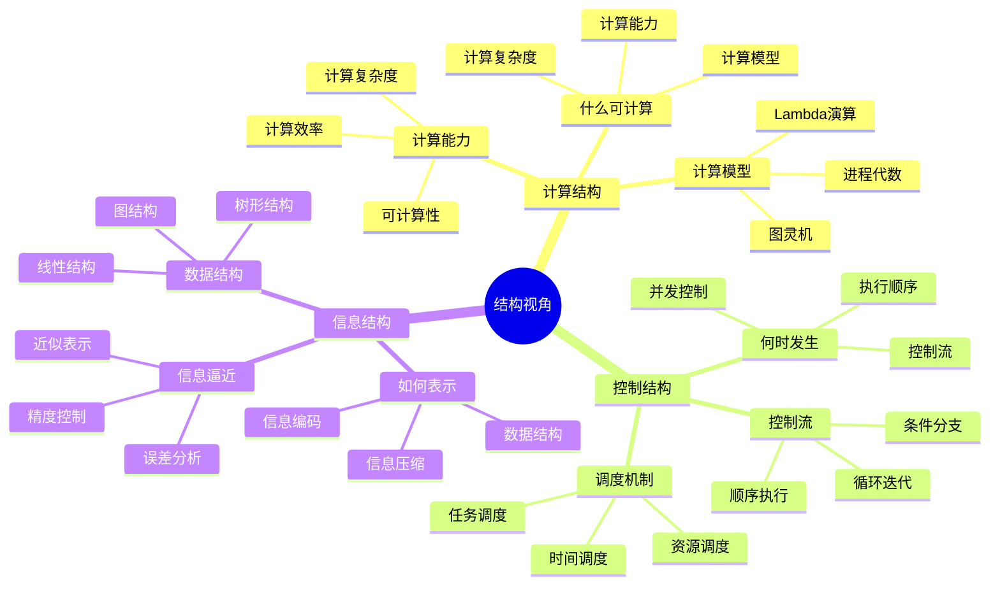
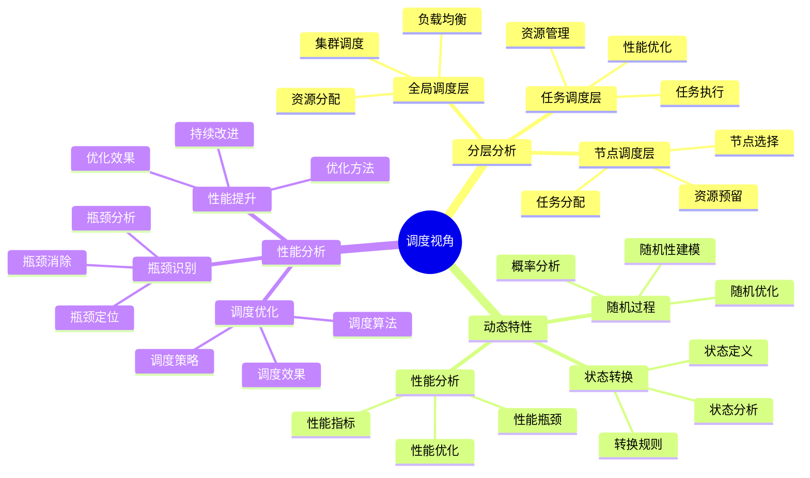

# 理论视角思维导图

## 📑 目录

- [理论视角思维导图](#理论视角思维导图)
  - [📑 目录](#-目录)
  - [1 理论视角全景](#1-理论视角全景)
  - [2 矩阵视角思维导图](#2-矩阵视角思维导图)
  - [3 代数结构视角思维导图](#3-代数结构视角思维导图)
  - [4 结构视角思维导图](#4-结构视角思维导图)
  - [5 调度视角思维导图](#5-调度视角思维导图)
  - [6 使用指南](#6-使用指南)
    - [6.1 快速开始](#61-快速开始)
    - [6.2 视角选择应用](#62-视角选择应用)
    - [6.3 深入学习应用](#63-深入学习应用)
  - [7 使用技巧](#7-使用技巧)
    - [7.1 视角选择技巧](#71-视角选择技巧)
    - [7.2 视角应用技巧](#72-视角应用技巧)
  - [8 相关文档](#8-相关文档)

---

## 1 理论视角全景

---

## 2 矩阵视角思维导图

---

## 3 代数结构视角思维导图

---

## 4 结构视角思维导图

---

## 5 调度视角思维导图

---

## 6 使用指南

### 6.1 快速开始

**适用场景**：理论视角入门、快速了解理论视角

**使用步骤**：

1. **理解理论视角**：从"理论视角全景"开始，理解各个理论视角的核心概念
2. **选择视角**：根据问题类型选择合适的理论视角
3. **深入学习**：深入学习所选视角的详细内容
4. **应用实践**：在实际问题中应用理论视角

**推荐度**：⭐⭐⭐⭐⭐

---

### 6.2 视角选择应用

**适用场景**：技术选型、操作组合、技术本质理解

**使用步骤**：

1. **问题识别**：识别问题的类型和特征
2. **视角选择**：
   - **技术选型** → 矩阵视角
   - **架构设计** → 结构视角
   - **性能优化** → 调度视角
   - **操作组合** → 代数结构视角
   - **系统结构分析** → 范畴论视角
   - **系统验证** → 形式化理论视角
3. **视角应用**：使用所选视角的分析方法和工具
4. **综合多视角**：结合多个视角进行全面分析

**推荐度**：⭐⭐⭐⭐⭐

---

### 6.3 深入学习应用

**适用场景**：深入学习、系统理解

**使用步骤**：

1. **核心思想学习**：深入理解每个视角的核心思想
2. **分析工具掌握**：掌握视角的分析工具和方法
3. **实践应用**：在实际问题中应用理论视角
4. **知识体系建立**：建立完整的理论视角知识体系

**推荐度**：⭐⭐⭐⭐⭐

---

## 7 使用技巧

### 7.1 视角选择技巧

**技巧1：问题导向**:

- 根据问题的类型和特征选择视角
- 避免盲目选择视角
- 理解各视角的适用场景

**技巧2：多视角结合**:

- 结合多个视角进行全面分析
- 避免单一视角的局限性
- 建立多视角分析框架

**技巧3：视角切换**:

- 根据分析需要灵活切换视角
- 理解视角之间的关系
- 建立视角切换机制

**推荐度**：⭐⭐⭐⭐⭐

---

### 7.2 视角应用技巧

**技巧1：工具使用**:

- 掌握各视角的分析工具和方法
- 根据问题选择合适的工具
- 避免工具滥用

**技巧2：方法组合**:

- 组合使用不同的分析方法
- 建立方法组合框架
- 提高分析效果

**技巧3：实践验证**:

- 在实际问题中验证视角的有效性
- 积累实践经验
- 持续改进分析方法

**推荐度**：⭐⭐⭐⭐⭐

---

## 8 相关文档

- **[理论视角对比矩阵](02-perspective-comparison-matrix.md)** - 视角功能对比、适用场景、复杂度、选择指南
- **[矩阵视角详细思维导图](03-matrix-perspective-detailed.md)** - 矩阵视角核心概念、12维原子概念详解、关系矩阵详解
- **[结构视角详细思维导图](04-structural-perspective-detailed.md)** - 结构视角核心概念、计算结构详解、控制结构详解
- **[调度视角详细思维导图](05-scheduling-perspective-detailed.md)** - 调度视角核心概念、分层分析详解、动态特性详解
- **[代数结构视角详细思维导图](06-algebraic-perspective-detailed.md)** - 算子定义详解、代数结构详解、结构保持详解
- **[理论视角应用案例](09-perspective-application-cases.md)** - 矩阵视角应用案例、结构视角应用案例、调度视角应用案例
- **[理论视角集成指南](10-perspective-integration-guide.md)** - 理论视角集成全景、视角组合策略、视角应用流程
- **[理论视角实践综合指南](11-perspective-practice-guide.md)** - 理论视角实践全景、矩阵视角实践、结构视角实践

---

**最后更新**：2025-11-15
**文档状态**：✅ 完整 | 📊 包含理论视角思维导图、使用指南、使用技巧 | 🎯 生产就绪
**维护者**：项目团队
