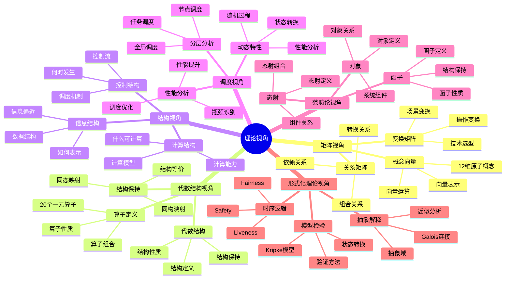
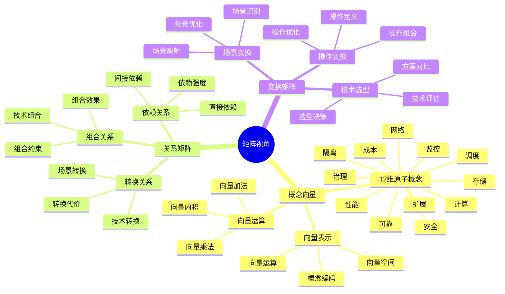
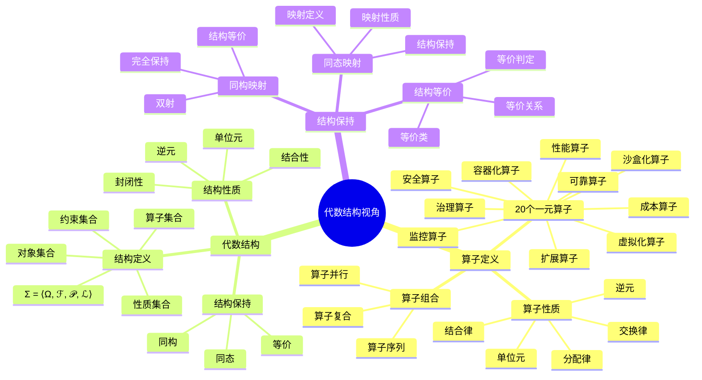
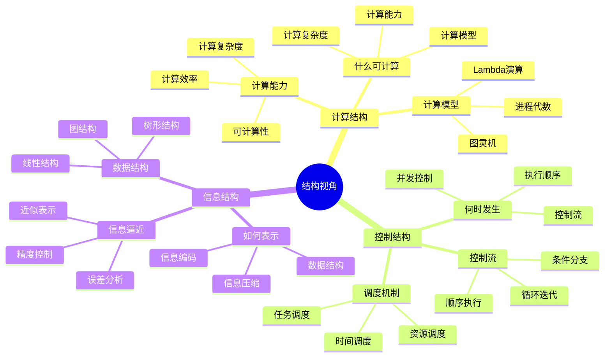
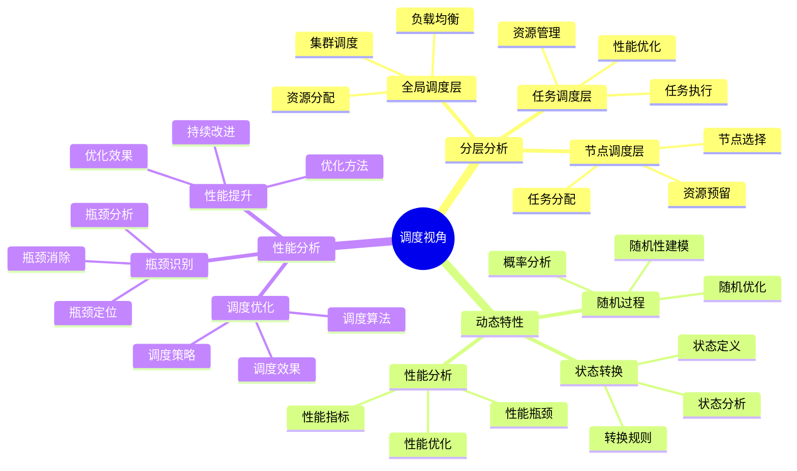

# 理论视角思维导图

## 📑 目录

- [理论视角思维导图](#理论视角思维导图)
  - [📑 目录](#-目录)
  - [1 理论视角全景](#1-理论视角全景)
  - [2 矩阵视角思维导图](#2-矩阵视角思维导图)
  - [3 代数结构视角思维导图](#3-代数结构视角思维导图)
  - [4 结构视角思维导图](#4-结构视角思维导图)
  - [5 调度视角思维导图](#5-调度视角思维导图)

---

## 1 理论视角全景

---

## 2 矩阵视角思维导图

---

## 3 代数结构视角思维导图

---

## 4 结构视角思维导图

---

## 5 调度视角思维导图

---

**最后更新**：2025-11-07
**文档状态**：✅ 完整 | 📊 包含理论视角思维导图 | 🎯 生产就绪
**维护者**：项目团队
