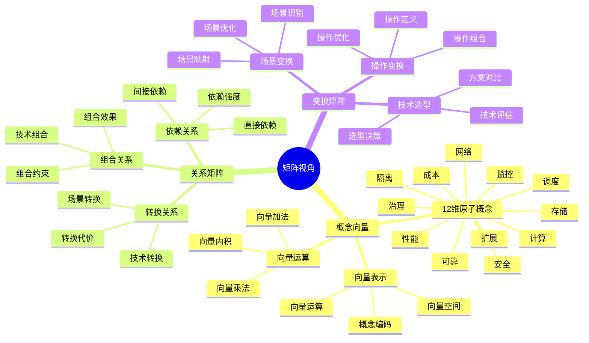
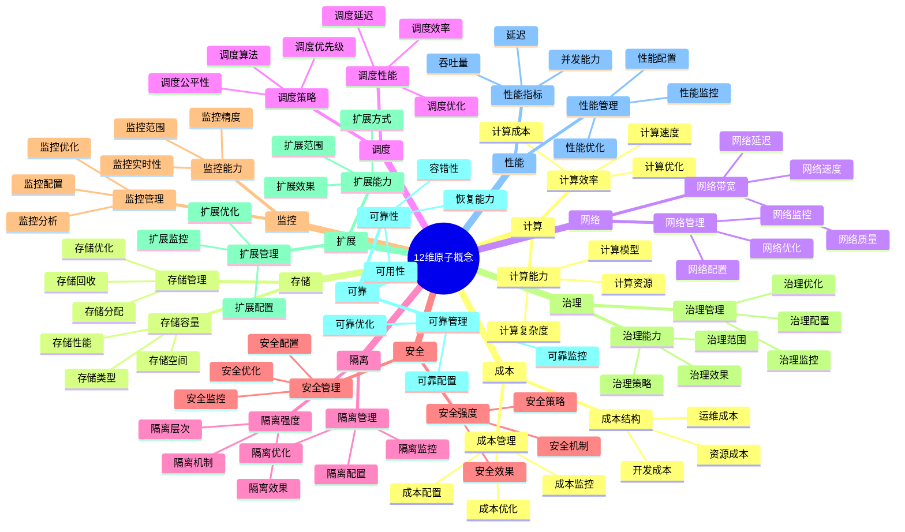
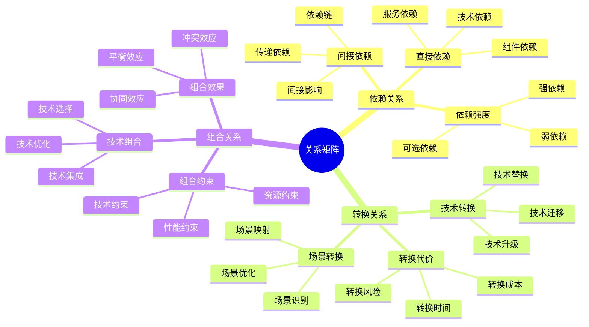
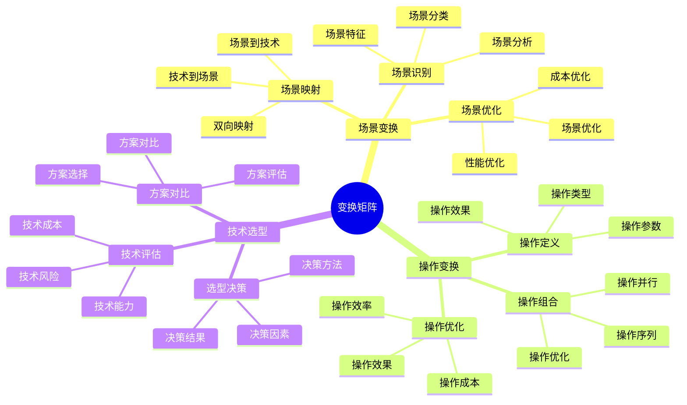

# 矩阵视角详细思维导图

## 📑 目录

- [矩阵视角详细思维导图](#矩阵视角详细思维导图)
  - [📑 目录](#-目录)
  - [1 矩阵视角核心概念](#1-矩阵视角核心概念)
  - [2 12维原子概念详解](#2-12维原子概念详解)
  - [3 关系矩阵详解](#3-关系矩阵详解)
  - [4 变换矩阵详解](#4-变换矩阵详解)
  - [5 矩阵视角应用示例](#5-矩阵视角应用示例)
  - [6 使用指南](#6-使用指南)
    - [6.1 快速开始](#61-快速开始)
    - [6.2 技术选型应用](#62-技术选型应用)
    - [6.3 场景转换应用](#63-场景转换应用)
  - [7 使用技巧](#7-使用技巧)
    - [7.1 向量构建技巧](#71-向量构建技巧)
    - [7.2 矩阵运算技巧](#72-矩阵运算技巧)
  - [8 实践案例](#8-实践案例)
    - [8.1 容器运行时选型案例](#81-容器运行时选型案例)
    - [8.2 微服务架构场景转换案例](#82-微服务架构场景转换案例)
  - [9 相关文档](#9-相关文档)
  - [10 2025 年最新实践](#10-2025-年最新实践)
    - [10.1 矩阵视角在云原生技术选型中的应用（2025）](#101-矩阵视角在云原生技术选型中的应用2025)
    - [10.2 矩阵视角在边缘计算场景中的应用（2025）](#102-矩阵视角在边缘计算场景中的应用2025)
  - [11 实际应用案例](#11-实际应用案例)
    - [案例 1：微服务架构技术选型（2025）](#案例-1微服务架构技术选型2025)
    - [案例 2：容器运行时选型（2025）](#案例-2容器运行时选型2025)
    - [案例 3：边缘计算技术栈选型（2025）](#案例-3边缘计算技术栈选型2025)

---

## 1 矩阵视角核心概念



---

## 2 12维原子概念详解



---

## 3 关系矩阵详解



---

## 4 变换矩阵详解



---

## 5 矩阵视角应用示例

| 应用场景 | 使用矩阵 | 输入 | 输出 | 效果 | 推荐度 |
|---------|---------|------|------|------|--------|
| **技术选型** | 关系矩阵 | 需求向量 | 技术向量 | 高 | ⭐⭐⭐⭐⭐ |
| **场景转换** | 变换矩阵 | 场景向量 | 技术向量 | 高 | ⭐⭐⭐⭐⭐ |
| **技术组合** | 组合矩阵 | 技术向量 | 组合向量 | 高 | ⭐⭐⭐⭐ |
| **性能优化** | 性能矩阵 | 配置向量 | 性能向量 | 中 | ⭐⭐⭐⭐ |
| **成本分析** | 成本矩阵 | 资源向量 | 成本向量 | 中 | ⭐⭐⭐⭐ |

**推荐度说明**：

- **⭐⭐⭐⭐⭐**：强烈推荐
- **⭐⭐⭐⭐**：推荐
- **⭐⭐⭐**：可选

---

## 6 使用指南

### 6.1 快速开始

**适用场景**：技术选型、场景转换、技术组合

**使用步骤**：

1. **理解核心概念**：理解12维原子概念和向量表示方法
2. **构建关系矩阵**：根据需求构建关系矩阵（依赖关系、转换关系、组合关系）
3. **应用变换矩阵**：使用变换矩阵进行场景变换、操作变换、技术选型
4. **分析结果**：分析矩阵运算结果，做出决策

**推荐度**：⭐⭐⭐⭐⭐

---

### 6.2 技术选型应用

**适用场景**：实际项目中的技术选型

**使用步骤**：

1. **需求向量化**：将需求转化为12维原子概念向量
2. **技术向量化**：将候选技术转化为12维原子概念向量
3. **关系矩阵构建**：构建需求与技术之间的关系矩阵
4. **矩阵运算**：进行矩阵运算，计算技术匹配度
5. **决策选择**：根据匹配度选择最适合的技术

**推荐度**：⭐⭐⭐⭐⭐

---

### 6.3 场景转换应用

**适用场景**：场景转换、技术迁移

**使用步骤**：

1. **场景向量化**：将当前场景转化为向量表示
2. **目标场景向量化**：将目标场景转化为向量表示
3. **变换矩阵构建**：构建场景变换矩阵
4. **矩阵运算**：进行矩阵运算，计算转换路径
5. **转换实施**：按照转换路径实施场景转换

**推荐度**：⭐⭐⭐⭐⭐

---

## 7 使用技巧

### 7.1 向量构建技巧

**技巧1：概念编码**:

- 准确理解12维原子概念的含义
- 根据实际情况对概念进行编码
- 避免概念混淆和编码错误

**技巧2：向量归一化**:

- 对向量进行归一化处理
- 确保向量之间的可比性
- 提高矩阵运算的准确性

**推荐度**：⭐⭐⭐⭐⭐

---

### 7.2 矩阵运算技巧

**技巧1：矩阵选择**:

- 根据应用场景选择合适的矩阵类型
- 理解不同矩阵的适用场景
- 避免矩阵滥用

**技巧2：结果解释**:

- 正确解释矩阵运算结果
- 理解结果的物理意义
- 避免结果误读

**推荐度**：⭐⭐⭐⭐⭐

---

## 8 实践案例

### 8.1 容器运行时选型案例

**场景**：需要选择容器运行时技术（containerd vs runc vs gVisor）

**分析过程**：

1. **需求向量化**：
   - 计算：高（需要高性能）
   - 隔离：高（需要强隔离）
   - 安全：高（需要高安全性）
   - 性能：高（需要高性能）
   - 其他维度：根据实际需求设置

2. **技术向量化**：
   - containerd：计算高、隔离中、安全中、性能高
   - runc：计算高、隔离低、安全低、性能高
   - gVisor：计算中、隔离高、安全高、性能中

3. **关系矩阵构建**：构建需求与技术之间的关系矩阵

4. **矩阵运算**：计算各技术的匹配度

5. **决策选择**：根据匹配度选择containerd（综合匹配度最高）

**效果**：成功选择最适合的容器运行时技术

**推荐度**：⭐⭐⭐⭐⭐

---

### 8.2 微服务架构场景转换案例

**场景**：从单体架构转换为微服务架构

**分析过程**：

1. **当前场景向量化**：单体架构的特征向量
2. **目标场景向量化**：微服务架构的特征向量
3. **变换矩阵构建**：构建架构转换变换矩阵
4. **矩阵运算**：计算转换路径和转换代价
5. **转换实施**：按照转换路径逐步实施架构转换

**效果**：成功实现从单体架构到微服务架构的转换

**推荐度**：⭐⭐⭐⭐⭐

---

## 9 相关文档

- **[理论视角思维导图](01-theoretical-perspectives-mindmap.md)** - 理论视角全景、矩阵视角概述
- **[理论视角对比矩阵](02-perspective-comparison-matrix.md)** - 视角功能对比、适用场景、复杂度
- **[理论视角应用案例](09-perspective-application-cases.md)** - 矩阵视角应用案例、实践案例
- **[理论视角集成指南](10-perspective-integration-guide.md)** - 理论视角集成全景、视角组合策略
- **[理论视角实践综合指南](11-perspective-practice-guide.md)** - 理论视角实践全景、矩阵视角实践

---

## 10 2025 年最新实践

### 10.1 矩阵视角在云原生技术选型中的应用（2025）

**2025 年趋势**：使用矩阵视角进行云原生技术选型

**实践要点**：

- **多维度评估**：使用12维原子概念向量进行多维度技术评估
- **自动化选型**：使用 Python 脚本自动化技术选型流程
- **实时更新**：矩阵数据实时更新，反映最新技术趋势

**代码示例**：

```python
# 2025 年矩阵视角技术选型工具
import numpy as np
import pandas as pd

class TechnologySelector:
    def __init__(self):
        # 12维原子概念向量
        self.dimensions = [
            '计算', '存储', '网络', '隔离', '安全', '性能',
            '可扩展性', '可维护性', '成本', '兼容性', '成熟度', '社区'
        ]

    def vectorize_requirement(self, requirement):
        """将需求转化为12维向量"""
        vector = np.zeros(12)
        # 根据需求设置各维度权重
        if requirement.get('high_performance'):
            vector[5] = 1.0  # 性能
        if requirement.get('strong_isolation'):
            vector[3] = 1.0  # 隔离
        if requirement.get('high_security'):
            vector[4] = 1.0  # 安全
        return vector

    def vectorize_technology(self, tech_profile):
        """将技术特征转化为12维向量"""
        vector = np.zeros(12)
        # 根据技术特征设置各维度值
        for i, dim in enumerate(self.dimensions):
            if dim in tech_profile:
                vector[i] = tech_profile[dim]
        return vector

    def calculate_match_score(self, req_vector, tech_vector):
        """计算匹配度"""
        # 使用余弦相似度计算匹配度
        dot_product = np.dot(req_vector, tech_vector)
        norm_req = np.linalg.norm(req_vector)
        norm_tech = np.linalg.norm(tech_vector)
        if norm_req == 0 or norm_tech == 0:
            return 0
        return dot_product / (norm_req * norm_tech)

# 使用示例
selector = TechnologySelector()

# 需求向量化
requirement = {
    'high_performance': True,
    'strong_isolation': True,
    'high_security': True
}
req_vector = selector.vectorize_requirement(requirement)

# 技术向量化
containerd_profile = {
    '计算': 0.9, '隔离': 0.7, '安全': 0.7, '性能': 0.9
}
containerd_vector = selector.vectorize_technology(containerd_profile)

# 计算匹配度
match_score = selector.calculate_match_score(req_vector, containerd_vector)
print(f"Containerd 匹配度: {match_score:.2f}")
```

### 10.2 矩阵视角在边缘计算场景中的应用（2025）

**2025 年趋势**：边缘计算场景中的矩阵视角应用

**实践要点**：

- **场景向量化**：将边缘计算场景特征转化为向量
- **技术映射**：使用变换矩阵进行场景到技术的映射
- **优化决策**：基于矩阵运算结果进行优化决策

**代码示例**：

```python
# 边缘计算场景矩阵分析
class EdgeComputingMatrix:
    def __init__(self):
        self.scenario_features = [
            '低延迟', '资源受限', '离线能力', '安全隔离',
            '轻量级', '快速启动', '低功耗', '网络不稳定'
        ]

    def analyze_edge_scenario(self, scenario):
        """分析边缘计算场景"""
        feature_vector = np.array([
            scenario.get('low_latency', 0),
            scenario.get('resource_constrained', 0),
            scenario.get('offline_capability', 0),
            scenario.get('security_isolation', 0),
            scenario.get('lightweight', 0),
            scenario.get('fast_startup', 0),
            scenario.get('low_power', 0),
            scenario.get('unstable_network', 0)
        ])

        # 推荐技术栈
        if feature_vector[1] > 0.7:  # 资源受限
            return 'WasmEdge'  # 轻量级运行时
        elif feature_vector[4] > 0.7:  # 轻量级
            return 'K3s'  # 轻量级 Kubernetes
        else:
            return 'Kubernetes'  # 标准 Kubernetes

# 使用示例
edge_matrix = EdgeComputingMatrix()
scenario = {
    'low_latency': 0.9,
    'resource_constrained': 0.8,
    'lightweight': 0.9,
    'fast_startup': 0.8
}
recommended_tech = edge_matrix.analyze_edge_scenario(scenario)
print(f"推荐技术: {recommended_tech}")
```

## 11 实际应用案例

### 案例 1：微服务架构技术选型（2025）

**场景**：为微服务架构选择合适的技术栈

**实现方案**：

```python
# 微服务架构技术选型
class MicroservicesTechSelection:
    def __init__(self):
        self.selector = TechnologySelector()

    def select_service_mesh(self, requirements):
        """选择服务网格技术"""
        req_vector = self.selector.vectorize_requirement(requirements)

        # 候选技术
        istio_profile = {
            '计算': 0.8, '网络': 0.9, '安全': 0.9,
            '可扩展性': 0.9, '成熟度': 0.9
        }
        linkerd_profile = {
            '计算': 0.7, '网络': 0.8, '安全': 0.8,
            '可扩展性': 0.8, '成熟度': 0.8, '性能': 0.9
        }

        istio_vector = self.selector.vectorize_technology(istio_profile)
        linkerd_vector = self.selector.vectorize_technology(linkerd_profile)

        istio_score = self.selector.calculate_match_score(req_vector, istio_vector)
        linkerd_score = self.selector.calculate_match_score(req_vector, linkerd_vector)

        if istio_score > linkerd_score:
            return 'Istio', istio_score
        else:
            return 'Linkerd', linkerd_score

# 使用示例
microservices_selector = MicroservicesTechSelection()
requirements = {
    'high_security': True,
    'high_scalability': True,
    'high_maturity': True
}
selected_tech, score = microservices_selector.select_service_mesh(requirements)
print(f"选择技术: {selected_tech}, 匹配度: {score:.2f}")
```

**效果**：

- 自动化选型：通过矩阵运算自动化技术选型
- 多维度评估：综合考虑多个维度进行选型
- 量化决策：通过匹配度量化技术选型决策

### 案例 2：容器运行时选型（2025）

**场景**：为容器化应用选择运行时

**实现方案**：

```yaml
# Kubernetes RuntimeClass 配置示例
apiVersion: node.k8s.io/v1
kind: RuntimeClass
metadata:
  name: wasmedge
handler: wasmedge
overhead:
  podFixed:
    cpu: "10m"
    memory: "10Mi"
scheduling:
  nodeSelector:
    kubernetes.io/arch: wasm32-wasi
---
apiVersion: node.k8s.io/v1
kind: RuntimeClass
metadata:
  name: gvisor
handler: runsc
overhead:
  podFixed:
    cpu: "50m"
    memory: "50Mi"
```

**Python 选型脚本**：

```python
# 容器运行时选型
class ContainerRuntimeSelector:
    def select_runtime(self, workload_profile):
        """根据工作负载特征选择运行时"""
        if workload_profile.get('lightweight') and workload_profile.get('fast_startup'):
            return 'WasmEdge'  # 轻量级、快速启动
        elif workload_profile.get('strong_isolation'):
            return 'gVisor'  # 强隔离
        elif workload_profile.get('high_performance'):
            return 'runc'  # 高性能
        else:
            return 'containerd'  # 默认

# 使用示例
runtime_selector = ContainerRuntimeSelector()
workload = {
    'lightweight': True,
    'fast_startup': True,
    'strong_isolation': False
}
selected_runtime = runtime_selector.select_runtime(workload)
print(f"推荐运行时: {selected_runtime}")
```

**效果**：

- 场景适配：根据工作负载特征选择最适合的运行时
- 性能优化：选择能够提供最佳性能的运行时
- 资源优化：选择资源占用最少的运行时

### 案例 3：边缘计算技术栈选型（2025）

**场景**：为边缘计算场景选择技术栈

**实现方案**：

```python
# 边缘计算技术栈选型
class EdgeTechStackSelector:
    def select_orchestration(self, edge_requirements):
        """选择编排平台"""
        if edge_requirements.get('lightweight') and edge_requirements.get('resource_constrained'):
            return 'K3s'  # 轻量级 Kubernetes
        else:
            return 'Kubernetes'  # 标准 Kubernetes

    def select_runtime(self, edge_requirements):
        """选择运行时"""
        if edge_requirements.get('lightweight') and edge_requirements.get('fast_startup'):
            return 'WasmEdge'  # WebAssembly 运行时
        else:
            return 'containerd'  # 容器运行时

# 使用示例
edge_selector = EdgeTechStackSelector()
edge_req = {
    'lightweight': True,
    'resource_constrained': True,
    'fast_startup': True
}
orchestration = edge_selector.select_orchestration(edge_req)
runtime = edge_selector.select_runtime(edge_req)
print(f"编排平台: {orchestration}, 运行时: {runtime}")
```

**Kubernetes 配置示例**：

```yaml
# 边缘节点配置
apiVersion: v1
kind: Node
metadata:
  name: edge-node-1
  labels:
    node-type: edge
    kubernetes.io/arch: arm64
spec:
  taints:
  - key: edge
    value: "true"
    effect: NoSchedule
---
# 边缘工作负载部署
apiVersion: apps/v1
kind: Deployment
metadata:
  name: edge-app
spec:
  replicas: 3
  selector:
    matchLabels:
      app: edge-app
  template:
    spec:
      runtimeClassName: wasmedge
      nodeSelector:
        node-type: edge
      containers:
      - name: app
        image: edge-app:latest
        resources:
          requests:
            cpu: "100m"
            memory: "128Mi"
```

**效果**：

- 边缘适配：选择适合边缘环境的技术栈
- 资源优化：最小化资源占用
- 性能优化：最大化边缘计算性能

---

**最后更新**：2025-11-15
**文档状态**：✅ 完整 | 📊 包含矩阵视角详细思维导图、使用指南、使用技巧、实践案例、2025年最新实践 | 🎯 生产就绪
**维护者**：项目团队
