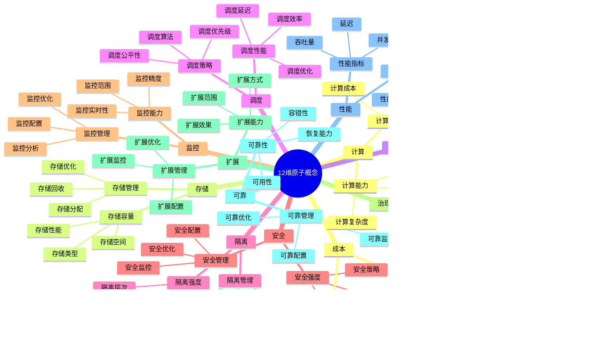

# 矩阵视角详细思维导图

## 📑 目录

- [矩阵视角详细思维导图](#矩阵视角详细思维导图)
  - [📑 目录](#-目录)
  - [1 矩阵视角核心概念](#1-矩阵视角核心概念)
  - [2 12维原子概念详解](#2-12维原子概念详解)
  - [3 关系矩阵详解](#3-关系矩阵详解)
  - [4 变换矩阵详解](#4-变换矩阵详解)

---

## 1 矩阵视角核心概念

---

## 2 12维原子概念详解

---

## 3 关系矩阵详解

---

## 4 变换矩阵详解

---

## 5 矩阵视角应用示例

| 应用场景 | 使用矩阵 | 输入 | 输出 | 效果 | 推荐度 |
|---------|---------|------|------|------|--------|
| **技术选型** | 关系矩阵 | 需求向量 | 技术向量 | 高 | ⭐⭐⭐⭐⭐ |
| **场景转换** | 变换矩阵 | 场景向量 | 技术向量 | 高 | ⭐⭐⭐⭐⭐ |
| **技术组合** | 组合矩阵 | 技术向量 | 组合向量 | 高 | ⭐⭐⭐⭐ |
| **性能优化** | 性能矩阵 | 配置向量 | 性能向量 | 中 | ⭐⭐⭐⭐ |
| **成本分析** | 成本矩阵 | 资源向量 | 成本向量 | 中 | ⭐⭐⭐⭐ |

**推荐度说明**：
- **⭐⭐⭐⭐⭐**：强烈推荐
- **⭐⭐⭐⭐**：推荐
- **⭐⭐⭐**：可选

---

**最后更新**：2025-11-07
**文档状态**：✅ 完整 | 📊 包含矩阵视角详细思维导图 | 🎯 生产就绪
**维护者**：项目团队
