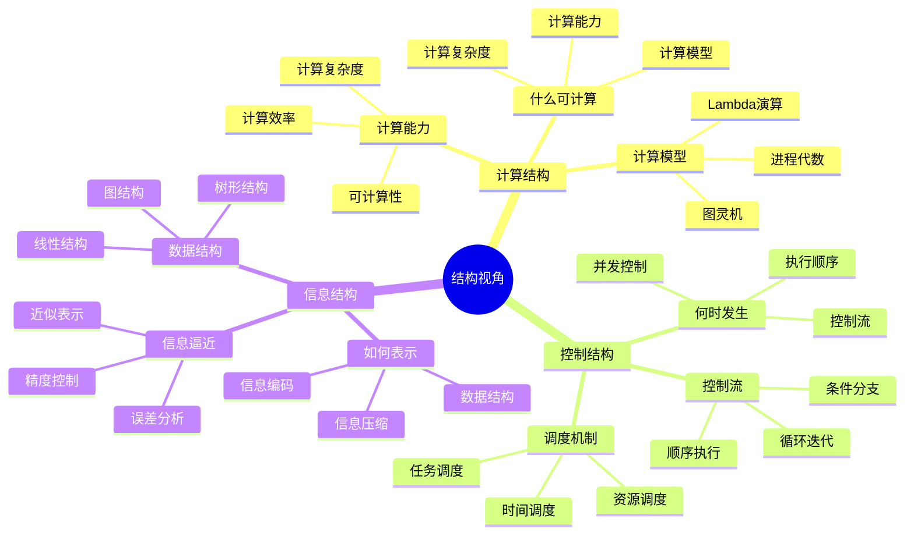
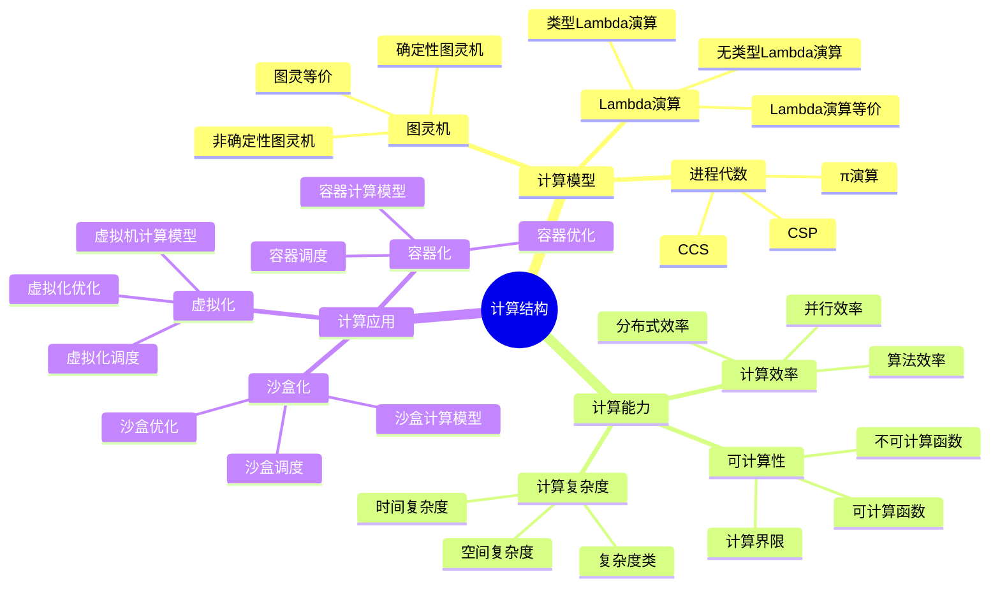
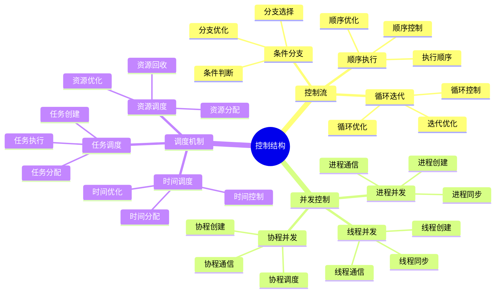
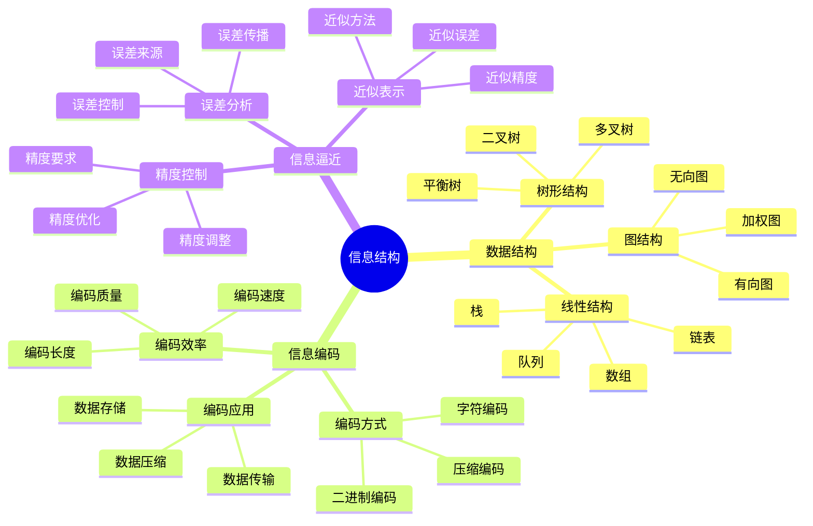

# 结构视角详细思维导图

## 📑 目录

- [结构视角详细思维导图](#结构视角详细思维导图)
  - [📑 目录](#-目录)
  - [1 结构视角核心概念](#1-结构视角核心概念)
  - [2 计算结构详解](#2-计算结构详解)
  - [3 控制结构详解](#3-控制结构详解)
  - [4 信息结构详解](#4-信息结构详解)
  - [5 结构视角应用示例](#5-结构视角应用示例)
  - [6 使用指南](#6-使用指南)
    - [6.1 快速开始](#61-快速开始)
    - [6.2 技术本质理解应用](#62-技术本质理解应用)
    - [6.3 架构设计应用](#63-架构设计应用)
  - [7 使用技巧](#7-使用技巧)
    - [7.1 结构分析技巧](#71-结构分析技巧)
    - [7.2 结构设计技巧](#72-结构设计技巧)
  - [8 实践案例](#8-实践案例)
    - [8.1 容器运行时结构分析案例](#81-容器运行时结构分析案例)
    - [8.2 微服务架构结构设计案例](#82-微服务架构结构设计案例)
  - [9 相关文档](#9-相关文档)

---

## 1 结构视角核心概念

---

## 2 计算结构详解

---

## 3 控制结构详解

---

## 4 信息结构详解

---

## 5 结构视角应用示例

| 应用场景 | 使用结构 | 输入 | 输出 | 效果 | 推荐度 |
|---------|---------|------|------|------|--------|
| **技术本质理解** | 三类结构 | 技术特征 | 结构分类 | 高 | ⭐⭐⭐⭐⭐ |
| **架构设计** | 结构框架 | 需求 | 架构设计 | 高 | ⭐⭐⭐⭐⭐ |
| **性能优化** | 计算结构 | 性能问题 | 优化方案 | 高 | ⭐⭐⭐⭐ |
| **并发控制** | 控制结构 | 并发需求 | 控制方案 | 高 | ⭐⭐⭐⭐ |
| **数据管理** | 信息结构 | 数据需求 | 数据结构 | 中 | ⭐⭐⭐⭐ |

**推荐度说明**：

- **⭐⭐⭐⭐⭐**：强烈推荐
- **⭐⭐⭐⭐**：推荐
- **⭐⭐⭐**：可选

---

## 6 使用指南

### 6.1 快速开始

**适用场景**：技术本质理解、架构设计、性能优化

**使用步骤**：

1. **理解三类结构**：理解计算结构、控制结构、信息结构的概念和特点
2. **结构分析**：使用三类结构分析技术或系统的结构
3. **结构设计**：根据结构分析结果进行架构设计或优化
4. **结构验证**：验证结构设计的正确性和有效性

**推荐度**：⭐⭐⭐⭐⭐

---

### 6.2 技术本质理解应用

**适用场景**：深入理解技术本质

**使用步骤**：

1. **技术特征分析**：分析技术的特征和属性
2. **结构分类**：使用三类结构对技术进行分类
3. **结构关系分析**：分析不同结构之间的关系
4. **本质理解**：深入理解技术的本质和原理

**推荐度**：⭐⭐⭐⭐⭐

---

### 6.3 架构设计应用

**适用场景**：实际项目中的架构设计

**使用步骤**：

1. **需求分析**：分析业务需求和功能需求
2. **结构设计**：使用三类结构进行架构设计
3. **结构优化**：优化架构结构，提高系统性能
4. **结构验证**：验证架构设计的正确性

**推荐度**：⭐⭐⭐⭐⭐

---

## 7 使用技巧

### 7.1 结构分析技巧

**技巧1：结构识别**:

- 准确识别技术或系统的结构类型
- 理解不同结构的特点和适用场景
- 避免结构混淆

**技巧2：结构关系**:

- 理解不同结构之间的关系
- 分析结构的依赖和影响
- 建立结构的整体视图

**推荐度**：⭐⭐⭐⭐⭐

---

### 7.2 结构设计技巧

**技巧1：结构组合**:

- 根据需求组合使用不同的结构
- 理解结构之间的组合关系
- 避免结构冲突

**技巧2：结构优化**:

- 优化结构设计，提高系统性能
- 减少结构的复杂度和开销
- 提高结构的可维护性

**推荐度**：⭐⭐⭐⭐⭐

---

## 8 实践案例

### 8.1 容器运行时结构分析案例

**场景**：深入理解容器运行时的技术本质

**分析过程**：

1. **技术特征分析**：
   - 计算结构：进程隔离、资源限制
   - 控制结构：生命周期管理、调度控制
   - 信息结构：镜像格式、配置数据

2. **结构分类**：
   - 计算结构：主要结构（进程隔离）
   - 控制结构：辅助结构（生命周期管理）
   - 信息结构：支撑结构（镜像格式）

3. **结构关系分析**：分析三类结构之间的关系和依赖

4. **本质理解**：深入理解容器运行时的本质是进程隔离和资源管理

**效果**：成功理解容器运行时的技术本质

**推荐度**：⭐⭐⭐⭐⭐

---

### 8.2 微服务架构结构设计案例

**场景**：使用结构视角设计微服务架构

**分析过程**：

1. **需求分析**：需要服务拆分、独立部署、高扩展性

2. **结构设计**：
   - 计算结构：服务独立计算、资源隔离
   - 控制结构：服务间通信控制、服务治理
   - 信息结构：服务配置、服务注册信息

3. **结构优化**：优化服务间通信结构、优化服务治理结构

4. **结构验证**：验证架构设计的正确性和有效性

**效果**：成功设计微服务架构，支持高扩展性

**推荐度**：⭐⭐⭐⭐⭐

---

## 9 相关文档

- **[理论视角思维导图](01-theoretical-perspectives-mindmap.md)** - 理论视角全景、结构视角概述
- **[理论视角对比矩阵](02-perspective-comparison-matrix.md)** - 视角功能对比、适用场景、复杂度
- **[理论视角应用案例](09-perspective-application-cases.md)** - 结构视角应用案例、实践案例
- **[理论视角集成指南](10-perspective-integration-guide.md)** - 理论视角集成全景、视角组合策略
- **[理论视角实践综合指南](11-perspective-practice-guide.md)** - 理论视角实践全景、结构视角实践

---

**最后更新**：2025-11-15
**文档状态**：✅ 完整 | 📊 包含结构视角详细思维导图、使用指南、使用技巧、实践案例 | 🎯 生产就绪
**维护者**：项目团队
