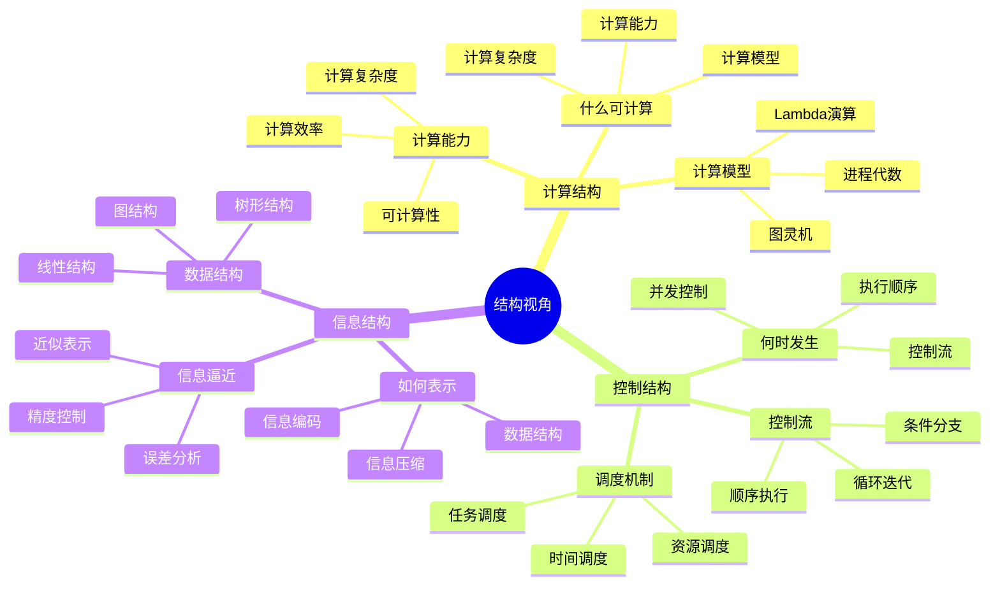
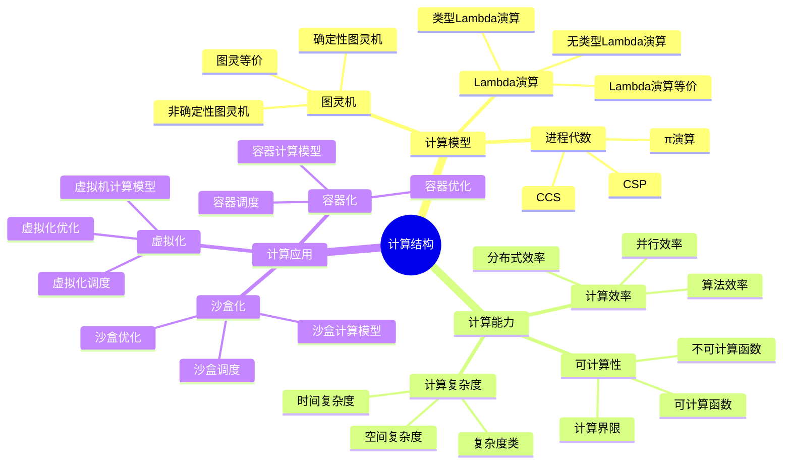
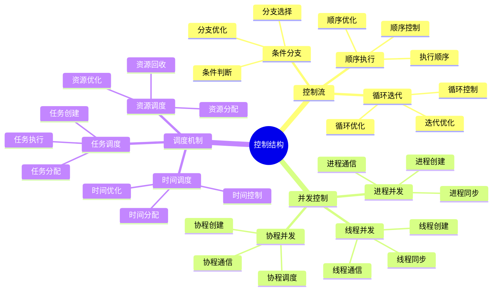
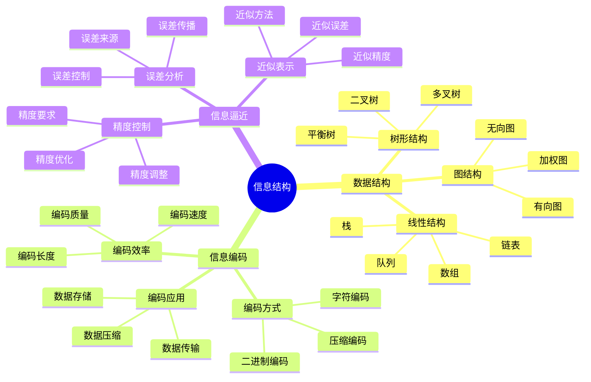

# 结构视角详细思维导图

## 📑 目录

- [结构视角详细思维导图](#结构视角详细思维导图)
  - [📑 目录](#-目录)
  - [1 结构视角核心概念](#1-结构视角核心概念)
  - [2 计算结构详解](#2-计算结构详解)
  - [3 控制结构详解](#3-控制结构详解)
  - [4 信息结构详解](#4-信息结构详解)

---

## 1 结构视角核心概念

---

## 2 计算结构详解

---

## 3 控制结构详解

---

## 4 信息结构详解

---

## 5 结构视角应用示例

| 应用场景 | 使用结构 | 输入 | 输出 | 效果 | 推荐度 |
|---------|---------|------|------|------|--------|
| **技术本质理解** | 三类结构 | 技术特征 | 结构分类 | 高 | ⭐⭐⭐⭐⭐ |
| **架构设计** | 结构框架 | 需求 | 架构设计 | 高 | ⭐⭐⭐⭐⭐ |
| **性能优化** | 计算结构 | 性能问题 | 优化方案 | 高 | ⭐⭐⭐⭐ |
| **并发控制** | 控制结构 | 并发需求 | 控制方案 | 高 | ⭐⭐⭐⭐ |
| **数据管理** | 信息结构 | 数据需求 | 数据结构 | 中 | ⭐⭐⭐⭐ |

**推荐度说明**：
- **⭐⭐⭐⭐⭐**：强烈推荐
- **⭐⭐⭐⭐**：推荐
- **⭐⭐⭐**：可选

---

**最后更新**：2025-11-07
**文档状态**：✅ 完整 | 📊 包含结构视角详细思维导图 | 🎯 生产就绪
**维护者**：项目团队
