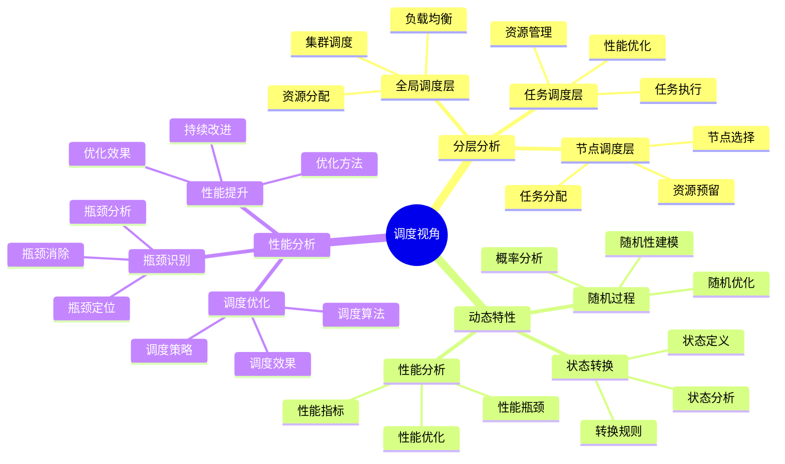
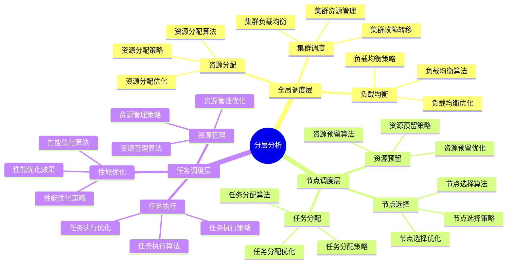
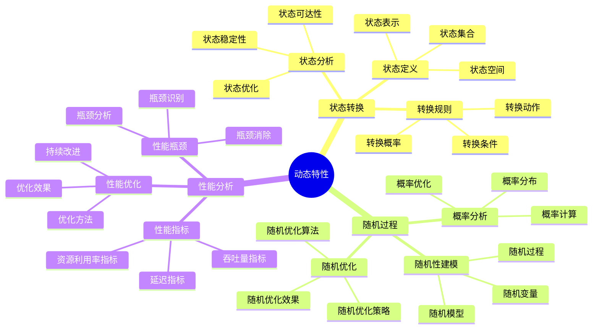
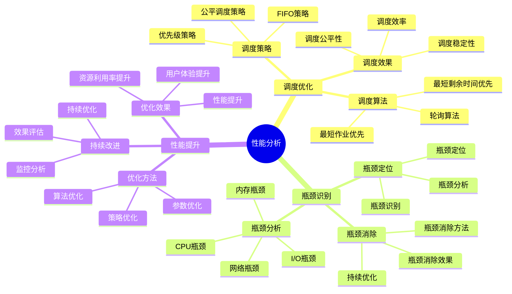

# 调度视角详细思维导图

## 📑 目录

- [调度视角详细思维导图](#调度视角详细思维导图)
  - [📑 目录](#-目录)
  - [1 调度视角核心概念](#1-调度视角核心概念)
  - [2 分层分析详解](#2-分层分析详解)
  - [3 动态特性详解](#3-动态特性详解)
  - [4 性能分析详解](#4-性能分析详解)

---

## 1 调度视角核心概念

---

## 2 分层分析详解

---

## 3 动态特性详解

---

## 4 性能分析详解

---

## 5 调度视角应用示例

| 应用场景 | 使用分层 | 调度策略 | 性能指标 | 效果 | 推荐度 |
|---------|---------|---------|---------|------|--------|
| **Kubernetes调度** | 全局+节点+任务 | 优先级+公平调度 | 延迟+吞吐量 | 高 | ⭐⭐⭐⭐⭐ |
| **容器调度** | 节点+任务 | 轮询+最短作业优先 | 延迟+资源利用率 | 高 | ⭐⭐⭐⭐⭐ |
| **任务调度** | 任务层 | FIFO+优先级 | 延迟+吞吐量 | 中 | ⭐⭐⭐⭐ |
| **资源调度** | 全局+节点 | 公平调度 | 资源利用率 | 高 | ⭐⭐⭐⭐ |
| **负载均衡** | 全局层 | 轮询+加权轮询 | 延迟+吞吐量 | 高 | ⭐⭐⭐⭐ |

**推荐度说明**：

- **⭐⭐⭐⭐⭐**：强烈推荐
- **⭐⭐⭐⭐**：推荐
- **⭐⭐⭐**：可选

---

**最后更新**：2025-11-07
**文档状态**：✅ 完整 | 📊 包含调度视角详细思维导图 | 🎯 生产就绪
**维护者**：项目团队
