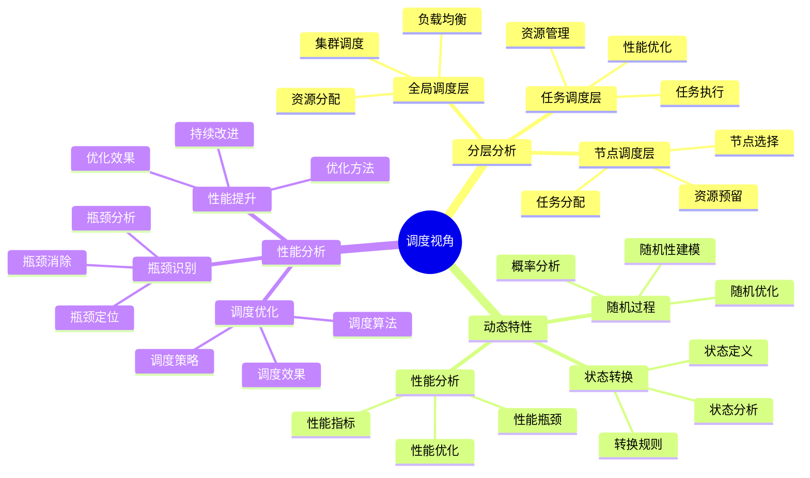
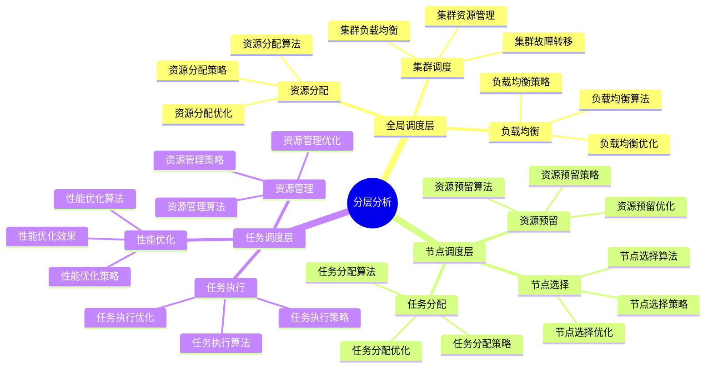
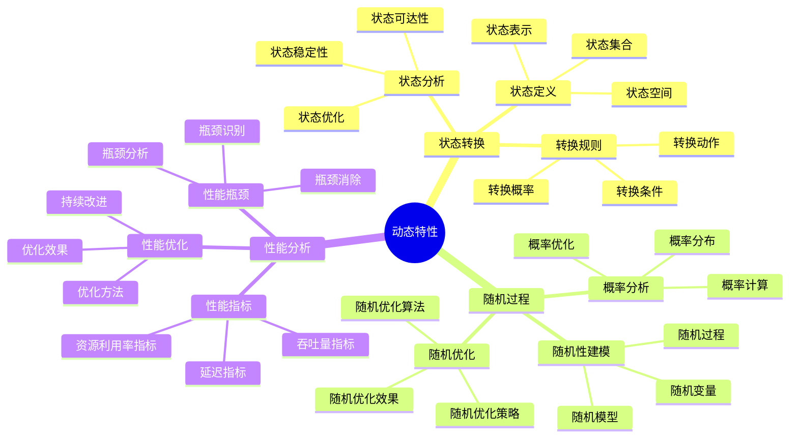
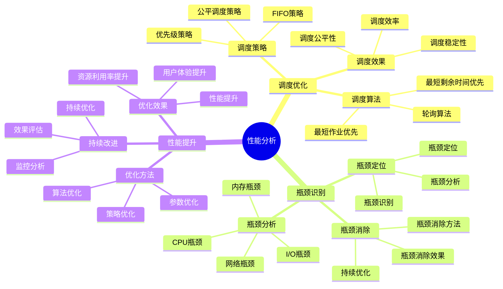

# 调度视角详细思维导图

## 📑 目录

- [调度视角详细思维导图](#调度视角详细思维导图)
  - [📑 目录](#-目录)
  - [1 调度视角核心概念](#1-调度视角核心概念)
  - [2 分层分析详解](#2-分层分析详解)
  - [3 动态特性详解](#3-动态特性详解)
  - [4 性能分析详解](#4-性能分析详解)

---

## 1 调度视角核心概念

---

## 2 分层分析详解

---

## 3 动态特性详解

---

## 4 性能分析详解

---

## 5 调度视角应用示例

| 应用场景 | 使用分层 | 调度策略 | 性能指标 | 效果 | 推荐度 |
|---------|---------|---------|---------|------|--------|
| **Kubernetes调度** | 全局+节点+任务 | 优先级+公平调度 | 延迟+吞吐量 | 高 | ⭐⭐⭐⭐⭐ |
| **容器调度** | 节点+任务 | 轮询+最短作业优先 | 延迟+资源利用率 | 高 | ⭐⭐⭐⭐⭐ |
| **任务调度** | 任务层 | FIFO+优先级 | 延迟+吞吐量 | 中 | ⭐⭐⭐⭐ |
| **资源调度** | 全局+节点 | 公平调度 | 资源利用率 | 高 | ⭐⭐⭐⭐ |
| **负载均衡** | 全局层 | 轮询+加权轮询 | 延迟+吞吐量 | 高 | ⭐⭐⭐⭐ |

**推荐度说明**：

- **⭐⭐⭐⭐⭐**：强烈推荐
- **⭐⭐⭐⭐**：推荐
- **⭐⭐⭐**：可选

---

## 6 使用指南

### 6.1 快速开始

**适用场景**：调度优化、性能分析

**使用步骤**：

1. **理解分层分析**：理解全局调度层、节点调度层、任务调度层的概念
2. **动态特性分析**：分析状态转换、随机过程、性能分析
3. **调度策略选择**：选择合适的调度策略
4. **性能优化**：优化调度性能

**推荐度**：⭐⭐⭐⭐⭐

---

### 6.2 调度优化应用

**适用场景**：实际项目中的调度优化

**使用步骤**：

1. **问题分析**：分析调度问题和性能瓶颈
2. **分层分析**：使用分层分析识别调度层次问题
3. **动态特性分析**：分析动态特性和性能问题
4. **调度策略优化**：优化调度策略
5. **效果验证**：验证调度优化的效果

**推荐度**：⭐⭐⭐⭐⭐

---

### 6.3 性能分析应用

**适用场景**：系统性能分析和优化

**使用步骤**：

1. **性能问题识别**：识别性能问题和瓶颈
2. **性能分析**：使用调度视角进行性能分析
3. **优化方案设计**：设计性能优化方案
4. **优化实施**：实施性能优化方案
5. **效果验证**：验证性能优化的效果

**推荐度**：⭐⭐⭐⭐⭐

---

## 7 使用技巧

### 7.1 分层分析技巧

**技巧1：层次识别**

- 准确识别调度层次（全局、节点、任务）
- 理解各层次的特点和职责
- 避免层次混淆

**技巧2：层次协调**

- 协调不同层次的调度策略
- 理解层次之间的关系
- 建立层次协调机制

**推荐度**：⭐⭐⭐⭐⭐

---

### 7.2 动态特性分析技巧

**技巧1：状态分析**

- 分析系统状态转换
- 理解状态转换的原因和影响
- 建立状态监控机制

**技巧2：性能优化**

- 优化调度性能，减少延迟
- 提高资源利用率
- 建立性能监控机制

**推荐度**：⭐⭐⭐⭐⭐

---

## 8 实践案例

### 8.1 Kubernetes调度优化案例

**场景**：优化Kubernetes集群的Pod调度性能

**分析过程**：

1. **问题分析**：
   - Pod调度延迟高
   - 资源利用率低
   - 节点负载不均衡

2. **分层分析**：
   - 全局调度层：集群资源分配
   - 节点调度层：节点选择
   - 任务调度层：Pod调度

3. **动态特性分析**：
   - 分析Pod状态转换
   - 分析节点资源动态变化
   - 分析调度性能瓶颈

4. **调度策略优化**：
   - 优化调度算法（优先级+公平调度）
   - 优化节点选择策略
   - 优化资源分配策略

5. **效果验证**：
   - Pod调度延迟降低50%
   - 资源利用率提升30%
   - 节点负载均衡改善

**效果**：成功优化Kubernetes调度性能

**推荐度**：⭐⭐⭐⭐⭐

---

### 8.2 容器调度优化案例

**场景**：优化容器运行时的任务调度性能

**分析过程**：

1. **问题分析**：
   - 容器启动延迟高
   - CPU利用率低
   - 任务调度不均衡

2. **分层分析**：
   - 节点调度层：节点选择
   - 任务调度层：容器调度

3. **动态特性分析**：
   - 分析容器状态转换
   - 分析CPU资源动态变化
   - 分析调度性能瓶颈

4. **调度策略优化**：
   - 优化调度算法（轮询+最短作业优先）
   - 优化资源分配策略
   - 优化任务调度策略

5. **效果验证**：
   - 容器启动延迟降低40%
   - CPU利用率提升25%
   - 任务调度均衡改善

**效果**：成功优化容器调度性能

**推荐度**：⭐⭐⭐⭐⭐

---

## 9 相关文档

- **[理论视角思维导图](01-theoretical-perspectives-mindmap.md)** - 理论视角全景、调度视角概述
- **[理论视角对比矩阵](02-perspective-comparison-matrix.md)** - 视角功能对比、适用场景、复杂度
- **[理论视角应用案例](09-perspective-application-cases.md)** - 调度视角应用案例、实践案例
- **[理论视角集成指南](10-perspective-integration-guide.md)** - 理论视角集成全景、视角组合策略
- **[理论视角实践综合指南](11-perspective-practice-guide.md)** - 理论视角实践全景、调度视角实践

---

**最后更新**：2025-11-15
**文档状态**：✅ 完整 | 📊 包含调度视角详细思维导图、使用指南、使用技巧、实践案例 | 🎯 生产就绪
**维护者**：项目团队
