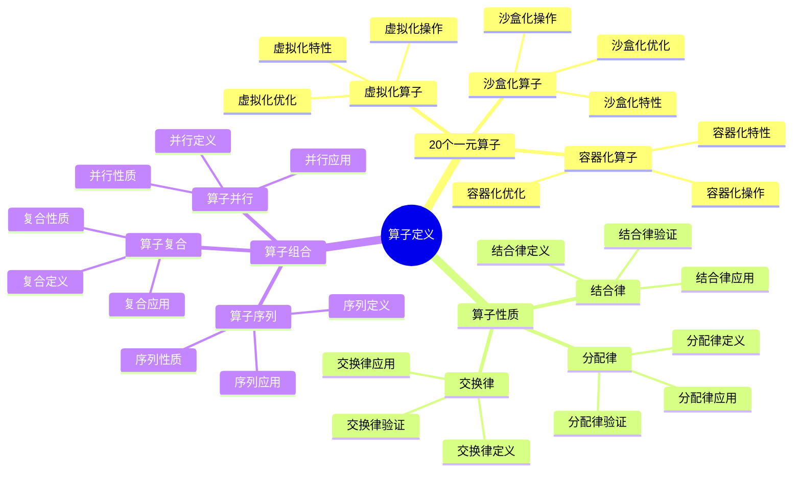
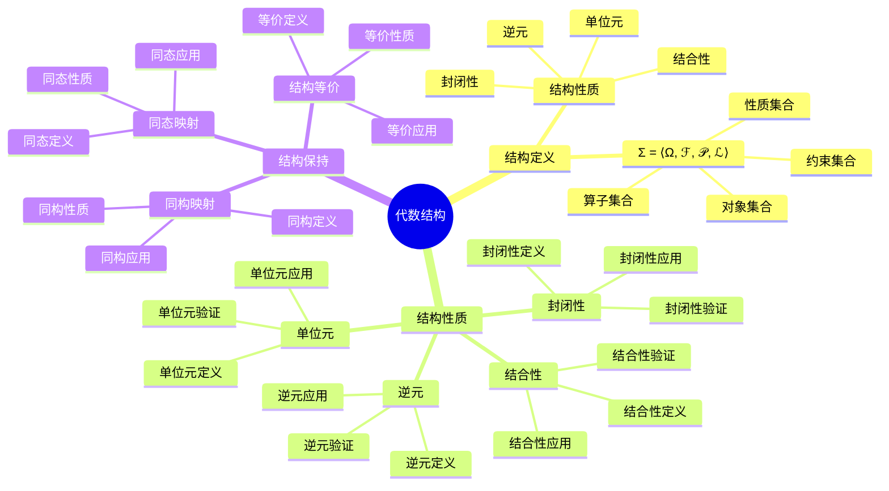
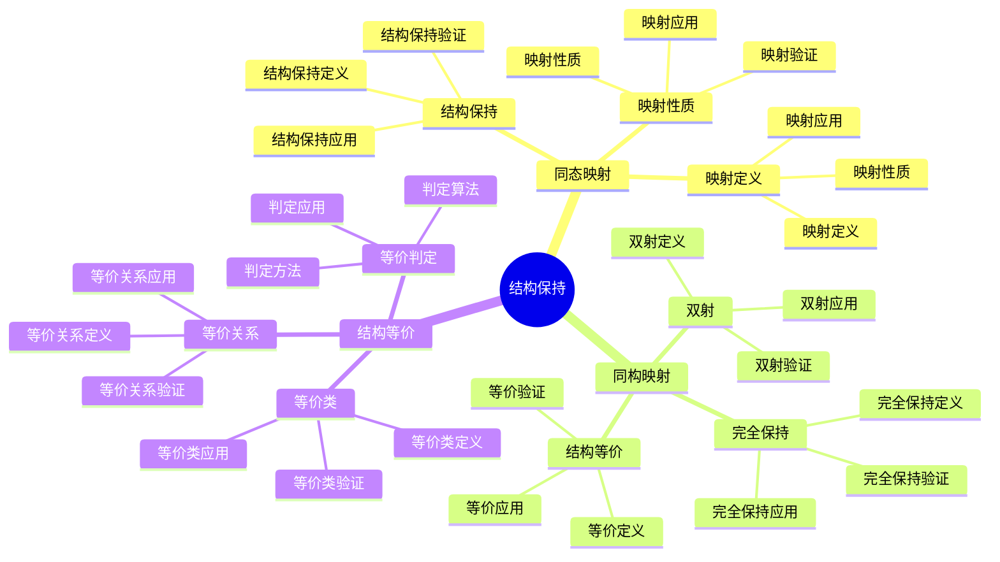
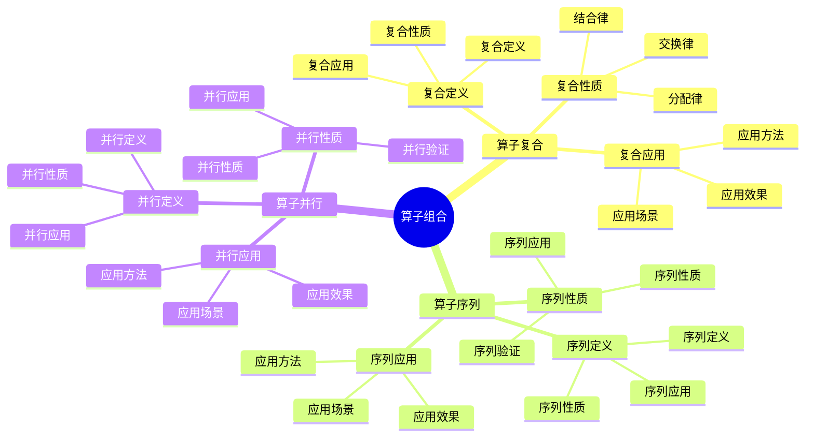

# 代数结构视角详细思维导图

## 📑 目录

- [代数结构视角详细思维导图](#代数结构视角详细思维导图)
  - [📑 目录](#-目录)
  - [1 算子定义详解](#1-算子定义详解)
  - [2 代数结构详解](#2-代数结构详解)
  - [3 结构保持详解](#3-结构保持详解)
  - [4 算子组合详解](#4-算子组合详解)
  - [5 代数结构视角应用示例](#5-代数结构视角应用示例)
  - [6 使用指南](#6-使用指南)
    - [6.1 快速开始](#61-快速开始)
    - [6.2 操作组合应用](#62-操作组合应用)
    - [6.3 结构保持应用](#63-结构保持应用)
  - [7 使用技巧](#7-使用技巧)
    - [7.1 算子应用技巧](#71-算子应用技巧)
    - [7.2 结构保持技巧](#72-结构保持技巧)
  - [8 实践案例](#8-实践案例)
    - [8.1 容器操作组合案例](#81-容器操作组合案例)
    - [8.2 服务网格操作组合案例](#82-服务网格操作组合案例)
  - [9 相关文档](#9-相关文档)
  - [10 2025 年最新实践](#10-2025-年最新实践)
    - [10.1 代数结构在云原生操作组合中的应用（2025）](#101-代数结构在云原生操作组合中的应用2025)
    - [10.2 代数结构在服务网格中的应用（2025）](#102-代数结构在服务网格中的应用2025)
  - [11 实际应用案例](#11-实际应用案例)
    - [案例 1：容器操作组合（2025）](#案例-1容器操作组合2025)
    - [案例 2：服务网格操作组合（2025）](#案例-2服务网格操作组合2025)
    - [案例 3：Kubernetes 资源操作组合（2025）](#案例-3kubernetes-资源操作组合2025)

---

## 1 算子定义详解



---

## 2 代数结构详解



---

## 3 结构保持详解



---

## 4 算子组合详解



---

## 5 代数结构视角应用示例

| 应用场景 | 使用算子 | 代数结构 | 结构保持 | 效果 | 推荐度 |
|---------|---------|---------|---------|------|--------|
| **操作组合** | 算子复合 | 代数结构 | 同态映射 | 高 | ⭐⭐⭐⭐⭐ |
| **结构分析** | 算子分析 | 代数结构 | 同构映射 | 高 | ⭐⭐⭐⭐⭐ |
| **结构转换** | 算子转换 | 代数结构 | 结构等价 | 高 | ⭐⭐⭐⭐ |
| **性能优化** | 算子优化 | 代数结构 | 结构保持 | 中 | ⭐⭐⭐⭐ |
| **系统设计** | 算子设计 | 代数结构 | 结构保持 | 高 | ⭐⭐⭐⭐ |

**推荐度说明**：

- **⭐⭐⭐⭐⭐**：强烈推荐
- **⭐⭐⭐⭐**：推荐
- **⭐⭐⭐**：可选

---

## 6 使用指南

### 6.1 快速开始

**适用场景**：操作组合、结构保持、系统设计

**使用步骤**：

1. **理解算子定义**：理解20个一元算子的定义和性质
2. **代数结构分析**：分析代数结构的定义和性质
3. **结构保持分析**：分析结构保持（同态、同构、等价）
4. **算子组合应用**：应用算子组合进行系统设计

**推荐度**：⭐⭐⭐⭐⭐

---

### 6.2 操作组合应用

**适用场景**：实际项目中的操作组合

**使用步骤**：

1. **操作识别**：识别系统中的操作和算子
2. **算子定义**：定义操作的算子表示
3. **算子组合**：使用算子组合进行操作组合
4. **结构保持验证**：验证操作组合的结构保持性
5. **效果评估**：评估操作组合的效果

**推荐度**：⭐⭐⭐⭐⭐

---

### 6.3 结构保持应用

**适用场景**：系统结构分析和设计

**使用步骤**：

1. **结构分析**：分析系统的代数结构
2. **结构保持分析**：分析结构保持（同态、同构、等价）
3. **结构设计**：基于结构保持进行系统设计
4. **结构验证**：验证结构设计的正确性

**推荐度**：⭐⭐⭐⭐⭐

---

## 7 使用技巧

### 7.1 算子应用技巧

**技巧1：算子选择**:

- 根据操作类型选择合适的算子
- 理解算子的性质和适用场景
- 避免算子滥用

**技巧2：算子组合**:

- 合理组合多个算子
- 理解算子组合的性质
- 建立算子组合模式

**推荐度**：⭐⭐⭐⭐⭐

---

### 7.2 结构保持技巧

**技巧1：同态映射**:

- 使用同态映射保持结构
- 理解同态映射的性质
- 建立同态映射机制

**技巧2：结构等价**:

- 使用结构等价简化系统
- 理解结构等价的条件
- 建立结构等价判定机制

**推荐度**：⭐⭐⭐⭐⭐

---

## 8 实践案例

### 8.1 容器操作组合案例

**场景**：使用代数结构视角组合容器操作

**分析过程**：

1. **操作识别**：
   - 容器创建操作
   - 容器启动操作
   - 容器停止操作
   - 容器删除操作

2. **算子定义**：
   - 创建算子：Create
   - 启动算子：Start
   - 停止算子：Stop
   - 删除算子：Delete

3. **算子组合**：
   - Create ∘ Start：创建并启动容器
   - Stop ∘ Delete：停止并删除容器
   - Start ∘ Stop：重启容器

4. **结构保持验证**：
   - 验证算子组合的结构保持性
   - 验证操作组合的正确性

5. **效果评估**：
   - 成功组合容器操作
   - 操作组合结构保持
   - 系统设计科学合理

**效果**：成功使用代数结构视角组合容器操作

**推荐度**：⭐⭐⭐⭐⭐

---

### 8.2 服务网格操作组合案例

**场景**：使用代数结构视角组合服务网格操作

**分析过程**：

1. **操作识别**：
   - 服务注册操作
   - 服务发现操作
   - 负载均衡操作
   - 服务治理操作

2. **算子定义**：
   - 注册算子：Register
   - 发现算子：Discover
   - 负载均衡算子：Balance
   - 治理算子：Govern

3. **算子组合**：
   - Register ∘ Discover：注册并发现服务
   - Discover ∘ Balance：发现并负载均衡
   - Balance ∘ Govern：负载均衡并治理

4. **结构保持验证**：
   - 验证算子组合的结构保持性
   - 验证操作组合的正确性

5. **效果评估**：
   - 成功组合服务网格操作
   - 操作组合结构保持
   - 系统设计科学合理

**效果**：成功使用代数结构视角组合服务网格操作

**推荐度**：⭐⭐⭐⭐⭐

---

## 9 相关文档

- **[理论视角思维导图](01-theoretical-perspectives-mindmap.md)** - 理论视角全景、代数结构视角概述
- **[理论视角对比矩阵](02-perspective-comparison-matrix.md)** - 视角功能对比、适用场景、复杂度
- **[理论视角应用案例](09-perspective-application-cases.md)** - 代数结构视角应用案例、实践案例
- **[理论视角集成指南](10-perspective-integration-guide.md)** - 理论视角集成全景、视角组合策略
- **[理论视角实践综合指南](11-perspective-practice-guide.md)** - 理论视角实践全景、代数结构视角实践

---

## 10 2025 年最新实践

### 10.1 代数结构在云原生操作组合中的应用（2025）

**2025 年趋势**：使用代数结构进行云原生操作组合

**实践要点**：

- **算子定义**：定义云原生操作的算子
- **算子组合**：使用算子组合实现复杂操作
- **结构保持**：确保操作组合的结构保持性

**代码示例**：

```python
# 2025 年代数结构操作组合工具
class CloudNativeOperator:
    def __init__(self):
        self.operators = {
            'create': self.create_operator,
            'start': self.start_operator,
            'stop': self.stop_operator,
            'delete': self.delete_operator
        }

    def compose_operators(self, op1, op2):
        """组合算子"""
        def composed(state):
            return op2(op1(state))
        return composed

    def create_and_start(self, resource):
        """创建并启动资源"""
        create_op = self.operators['create']
        start_op = self.operators['start']
        composed = self.compose_operators(create_op, start_op)
        return composed(resource)
```

### 10.2 代数结构在服务网格中的应用（2025）

**2025 年趋势**：使用代数结构进行服务网格操作组合

**实践要点**：

- **服务操作算子**：定义服务注册、发现、负载均衡等算子
- **操作组合**：组合服务操作实现复杂服务治理
- **结构验证**：验证操作组合的结构保持性

**代码示例**：

```python
# 服务网格操作组合
class ServiceMeshOperator:
    def register_and_discover(self, service):
        """注册并发现服务"""
        register_op = self.register_operator
        discover_op = self.discover_operator
        composed = self.compose_operators(register_op, discover_op)
        return composed(service)
```

## 11 实际应用案例

### 案例 1：容器操作组合（2025）

**场景**：使用代数结构组合容器操作

**实现方案**：

```python
# 容器操作组合
class ContainerOperator:
    def create_and_start_container(self, image, name):
        """创建并启动容器"""
        # 定义创建算子
        def create(state):
            return {'container_id': f'container_{name}', 'status': 'created'}

        # 定义启动算子
        def start(state):
            state['status'] = 'running'
            return state

        # 组合算子
        composed = self.compose_operators(create, start)
        return composed({'image': image, 'name': name})
```

**Docker 配置示例**：

```yaml
# Docker Compose 配置
version: '3.8'
services:
  app:
    image: app:latest
    container_name: app-container
    command: ["sh", "-c", "echo 'Container started'"]
    restart: unless-stopped
```

### 案例 2：服务网格操作组合（2025）

**场景**：使用代数结构组合服务网格操作

**实现方案**：

```yaml
# Istio 服务网格配置
apiVersion: networking.istio.io/v1beta1
kind: VirtualService
metadata:
  name: service-vs
spec:
  hosts:
  - service
  http:
  - match:
    - headers:
        version:
          exact: "v2"
    route:
    - destination:
        host: service
        subset: v2
      weight: 100
  - route:
    - destination:
        host: service
        subset: v1
      weight: 90
    - destination:
        host: service
        subset: v2
      weight: 10
---
apiVersion: networking.istio.io/v1beta1
kind: DestinationRule
metadata:
  name: service-dr
spec:
  host: service
  subsets:
  - name: v1
    labels:
      version: v1
  - name: v2
    labels:
      version: v2
```

**效果**：

- 服务注册和发现自动化
- 负载均衡策略灵活配置
- 服务治理操作组合优化

### 案例 3：Kubernetes 资源操作组合（2025）

**场景**：使用代数结构组合 Kubernetes 资源操作

**实现方案**：

```python
# Kubernetes 资源操作组合
class KubernetesOperator:
    def deploy_application(self, app_config):
        """部署应用"""
        # 定义创建 Deployment 算子
        def create_deployment(state):
            return {'deployment': 'created', 'replicas': app_config['replicas']}

        # 定义创建 Service 算子
        def create_service(state):
            return {**state, 'service': 'created'}

        # 组合算子
        composed = self.compose_operators(create_deployment, create_service)
        return composed(app_config)
```

**Kubernetes 配置示例**：

```yaml
# Deployment 和 Service 组合
apiVersion: apps/v1
kind: Deployment
metadata:
  name: app
spec:
  replicas: 3
  selector:
    matchLabels:
      app: app
  template:
    metadata:
      labels:
        app: app
    spec:
      containers:
      - name: app
        image: app:latest
---
apiVersion: v1
kind: Service
metadata:
  name: app
spec:
  selector:
    app: app
  ports:
  - port: 80
    targetPort: 8080
```

**效果**：

- 资源操作组合自动化
- 部署流程简化
- 操作结构保持性验证

---

**最后更新**：2025-11-15
**文档状态**：✅ 完整 | 📊 包含代数结构视角详细思维导图、使用指南、使用技巧、实践案例、2025年最新实践 | 🎯 生产就绪
**维护者**：项目团队
