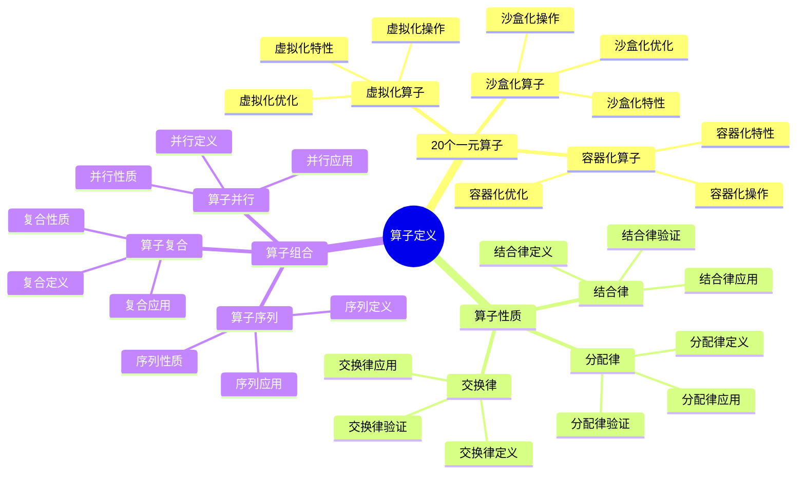
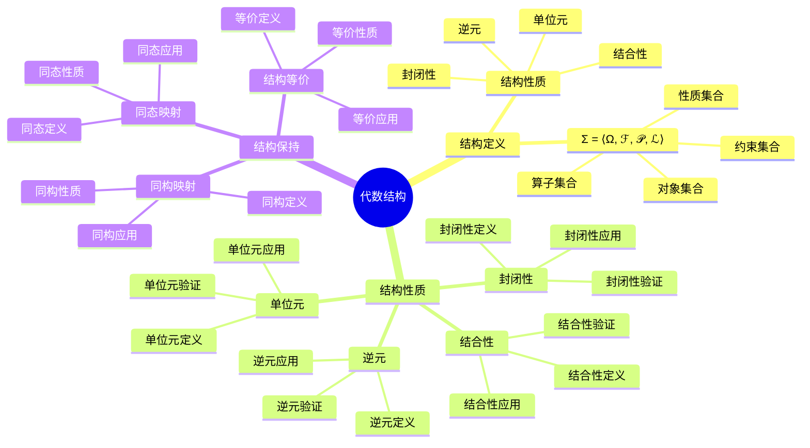
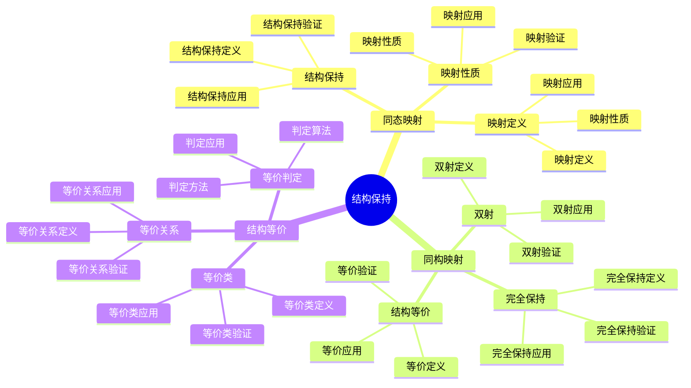
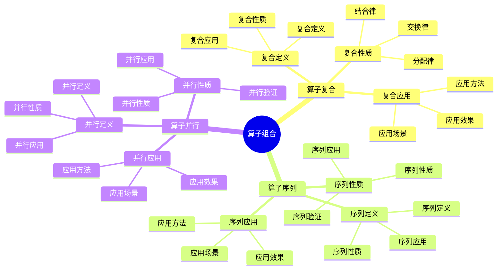

# 代数结构视角详细思维导图

## 📑 目录

- [代数结构视角详细思维导图](#代数结构视角详细思维导图)
  - [📑 目录](#-目录)
  - [1 算子定义详解](#1-算子定义详解)
  - [2 代数结构详解](#2-代数结构详解)
  - [3 结构保持详解](#3-结构保持详解)
  - [4 算子组合详解](#4-算子组合详解)

---

## 1 算子定义详解

---

## 2 代数结构详解

---

## 3 结构保持详解

---

## 4 算子组合详解

---

## 5 代数结构视角应用示例

| 应用场景 | 使用算子 | 代数结构 | 结构保持 | 效果 | 推荐度 |
|---------|---------|---------|---------|------|--------|
| **操作组合** | 算子复合 | 代数结构 | 同态映射 | 高 | ⭐⭐⭐⭐⭐ |
| **结构分析** | 算子分析 | 代数结构 | 同构映射 | 高 | ⭐⭐⭐⭐⭐ |
| **结构转换** | 算子转换 | 代数结构 | 结构等价 | 高 | ⭐⭐⭐⭐ |
| **性能优化** | 算子优化 | 代数结构 | 结构保持 | 中 | ⭐⭐⭐⭐ |
| **系统设计** | 算子设计 | 代数结构 | 结构保持 | 高 | ⭐⭐⭐⭐ |

**推荐度说明**：
- **⭐⭐⭐⭐⭐**：强烈推荐
- **⭐⭐⭐⭐**：推荐
- **⭐⭐⭐**：可选

---

**最后更新**：2025-11-07
**文档状态**：✅ 完整 | 📊 包含代数结构视角详细思维导图 | 🎯 生产就绪
**维护者**：项目团队
