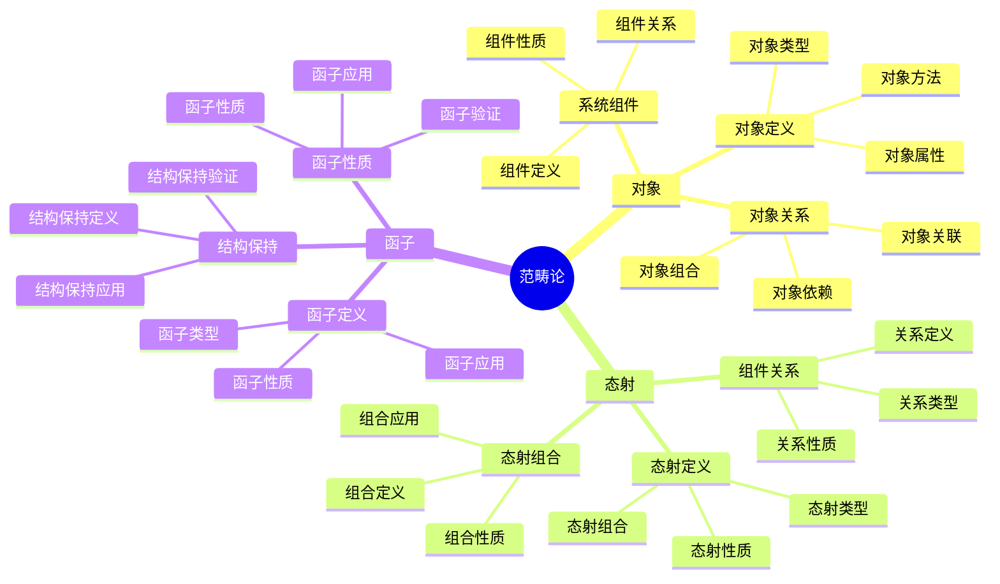
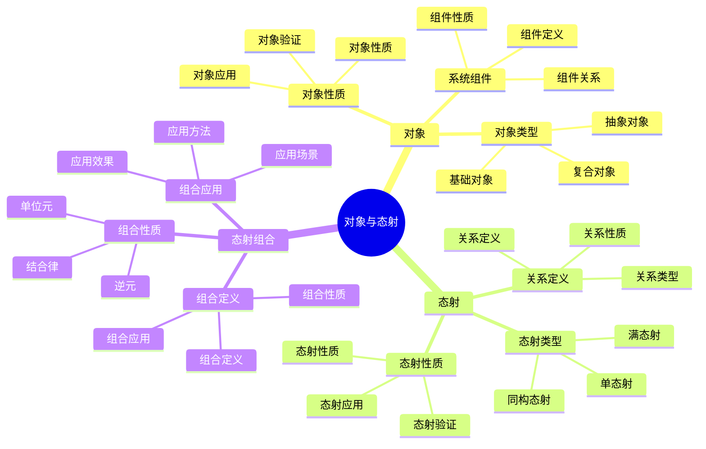
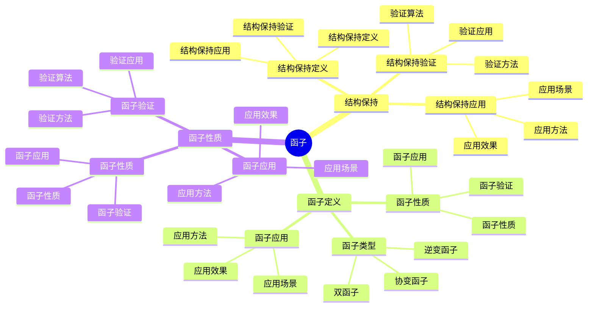
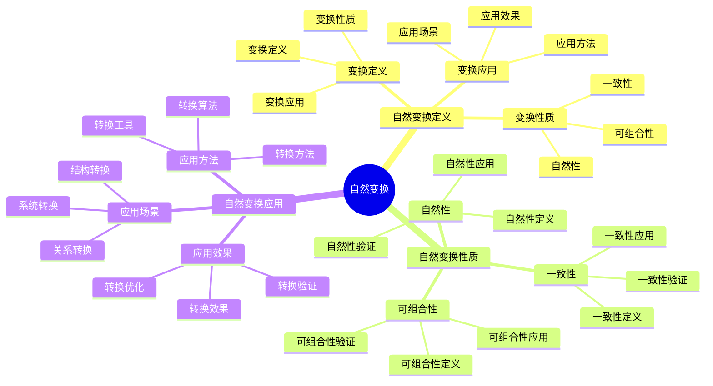

# 范畴论视角详细思维导图

## 📑 目录

- [范畴论视角详细思维导图](#范畴论视角详细思维导图)
  - [📑 目录](#-目录)
  - [1 范畴论核心概念](#1-范畴论核心概念)
  - [2 对象与态射详解](#2-对象与态射详解)
  - [3 函子详解](#3-函子详解)
  - [4 自然变换详解](#4-自然变换详解)

---

## 1 范畴论核心概念

---

## 2 对象与态射详解

---

## 3 函子详解

---

## 4 自然变换详解

---

## 5 范畴论视角应用示例

| 应用场景 | 使用对象 | 使用态射 | 使用函子 | 效果 | 推荐度 |
|---------|---------|---------|---------|------|--------|
| **系统结构分析** | 系统组件 | 组件关系 | 结构保持函子 | 高 | ⭐⭐⭐⭐⭐ |
| **系统转换** | 系统对象 | 转换态射 | 转换函子 | 高 | ⭐⭐⭐⭐⭐ |
| **关系分析** | 关系对象 | 关系态射 | 关系函子 | 高 | ⭐⭐⭐⭐ |
| **结构保持** | 结构对象 | 结构态射 | 结构保持函子 | 高 | ⭐⭐⭐⭐ |
| **系统抽象** | 抽象对象 | 抽象态射 | 抽象函子 | 中 | ⭐⭐⭐ |

**推荐度说明**：
- **⭐⭐⭐⭐⭐**：强烈推荐
- **⭐⭐⭐⭐**：推荐
- **⭐⭐⭐**：可选

---

**最后更新**：2025-11-07
**文档状态**：✅ 完整 | 📊 包含范畴论视角详细思维导图 | 🎯 生产就绪
**维护者**：项目团队
