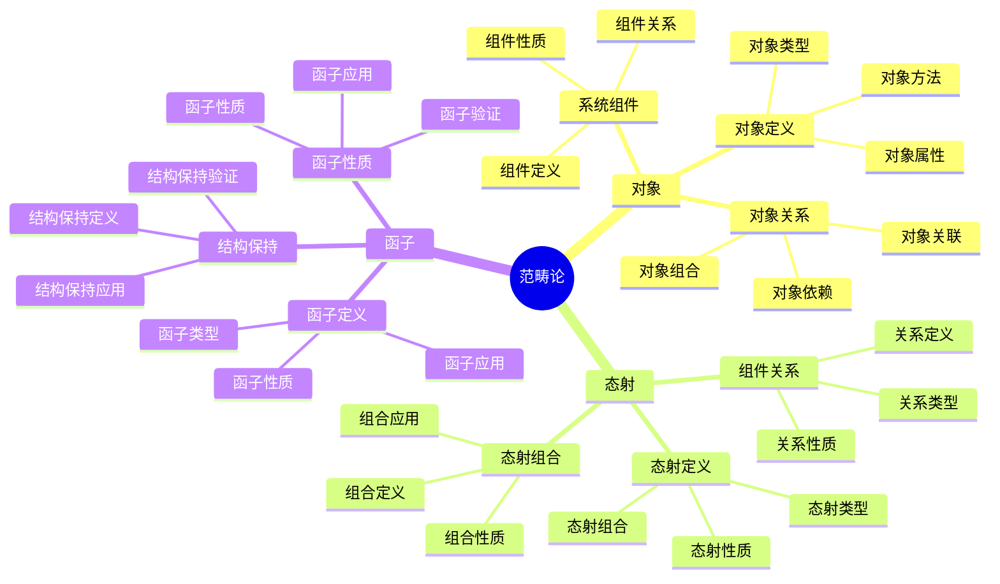
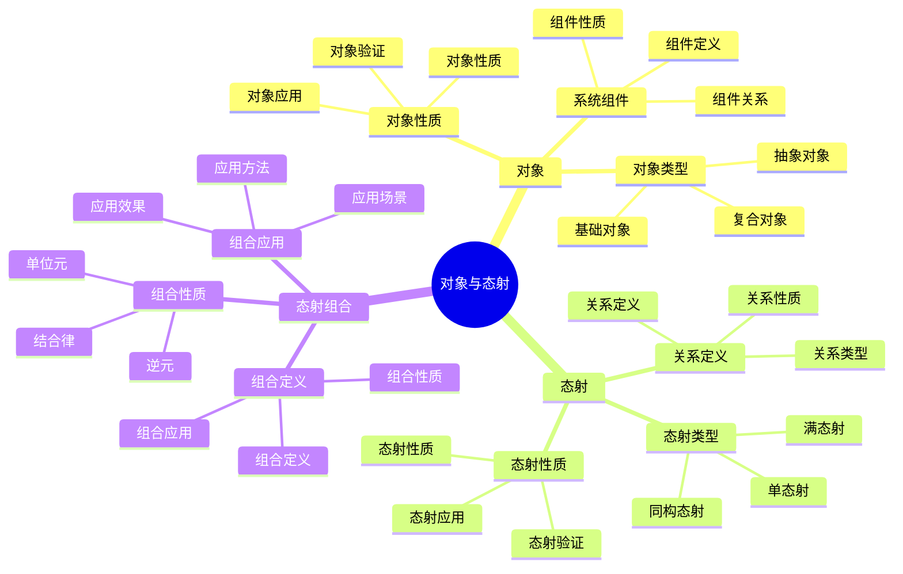
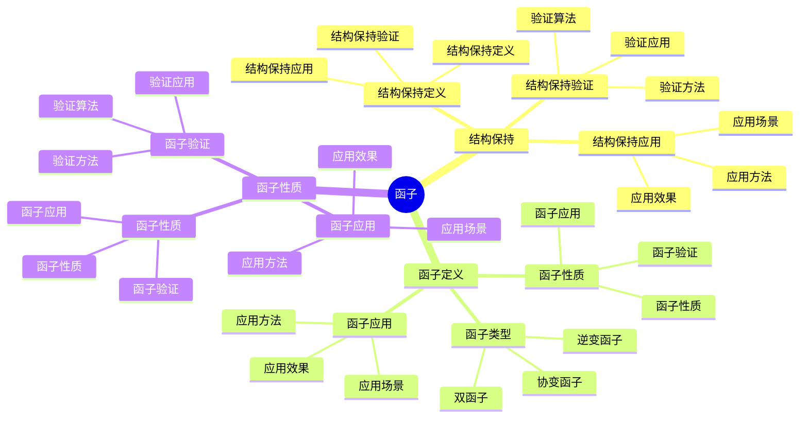
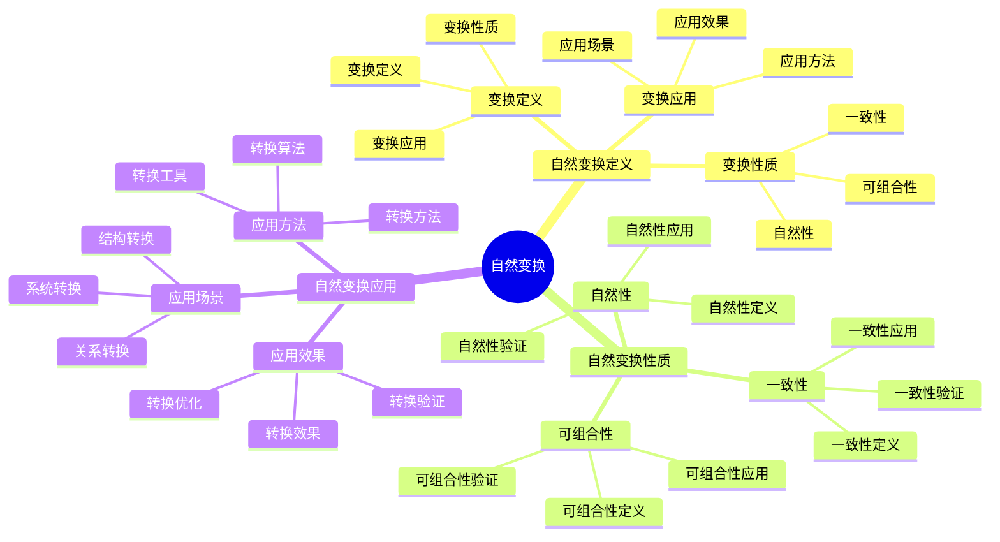

# 范畴论视角详细思维导图

## 📑 目录

- [范畴论视角详细思维导图](#范畴论视角详细思维导图)
  - [📑 目录](#-目录)
  - [1 范畴论核心概念](#1-范畴论核心概念)
  - [2 对象与态射详解](#2-对象与态射详解)
  - [3 函子详解](#3-函子详解)
  - [4 自然变换详解](#4-自然变换详解)

---

## 1 范畴论核心概念

---

## 2 对象与态射详解

---

## 3 函子详解

---

## 4 自然变换详解

---

## 5 范畴论视角应用示例

| 应用场景 | 使用对象 | 使用态射 | 使用函子 | 效果 | 推荐度 |
|---------|---------|---------|---------|------|--------|
| **系统结构分析** | 系统组件 | 组件关系 | 结构保持函子 | 高 | ⭐⭐⭐⭐⭐ |
| **系统转换** | 系统对象 | 转换态射 | 转换函子 | 高 | ⭐⭐⭐⭐⭐ |
| **关系分析** | 关系对象 | 关系态射 | 关系函子 | 高 | ⭐⭐⭐⭐ |
| **结构保持** | 结构对象 | 结构态射 | 结构保持函子 | 高 | ⭐⭐⭐⭐ |
| **系统抽象** | 抽象对象 | 抽象态射 | 抽象函子 | 中 | ⭐⭐⭐ |

**推荐度说明**：
- **⭐⭐⭐⭐⭐**：强烈推荐
- **⭐⭐⭐⭐**：推荐
- **⭐⭐⭐**：可选

---

## 6 使用指南

### 6.1 快速开始

**适用场景**：系统结构分析、关系分析、系统转换

**使用步骤**：

1. **理解核心概念**：理解对象、态射、函子的概念
2. **系统建模**：将系统建模为范畴（对象=组件，态射=关系）
3. **函子应用**：使用函子进行结构保持和转换
4. **关系分析**：分析系统组件之间的关系

**推荐度**：⭐⭐⭐⭐⭐

---

### 6.2 系统结构分析应用

**适用场景**：实际项目中的系统结构分析

**使用步骤**：

1. **系统建模**：将系统建模为范畴
2. **对象识别**：识别系统组件（对象）
3. **态射识别**：识别组件关系（态射）
4. **函子应用**：使用函子进行结构保持分析
5. **关系分析**：分析系统结构的性质

**推荐度**：⭐⭐⭐⭐⭐

---

### 6.3 系统转换应用

**适用场景**：系统架构转换、系统重构

**使用步骤**：

1. **源系统建模**：将源系统建模为范畴
2. **目标系统建模**：将目标系统建模为范畴
3. **转换函子定义**：定义转换函子
4. **转换实施**：使用转换函子进行系统转换
5. **转换验证**：验证转换的正确性

**推荐度**：⭐⭐⭐⭐⭐

---

## 7 使用技巧

### 7.1 范畴建模技巧

**技巧1：对象抽象**

- 合理抽象系统组件为对象
- 理解对象的粒度和层次
- 避免对象过度抽象或不足

**技巧2：态射定义**

- 准确定义组件之间的关系
- 理解态射的类型和性质
- 建立态射的组合规则

**推荐度**：⭐⭐⭐⭐⭐

---

### 7.2 函子应用技巧

**技巧1：函子选择**

- 根据应用场景选择合适的函子
- 理解函子的性质和适用场景
- 避免函子滥用

**技巧2：结构保持**

- 使用函子保持系统结构
- 理解结构保持的条件
- 建立结构保持验证机制

**推荐度**：⭐⭐⭐⭐⭐

---

## 8 实践案例

### 8.1 微服务架构结构分析案例

**场景**：使用范畴论视角分析微服务架构结构

**分析过程**：

1. **系统建模**：
   - 对象：微服务（Service A, Service B, Service C）
   - 态射：服务间调用关系
   - 范畴：微服务架构范畴

2. **对象识别**：
   - Service A：用户服务
   - Service B：订单服务
   - Service C：支付服务

3. **态射识别**：
   - Service A → Service B：用户下单
   - Service B → Service C：订单支付

4. **函子应用**：
   - 使用结构保持函子分析架构结构
   - 使用关系函子分析服务关系

5. **关系分析**：
   - 分析服务间的依赖关系
   - 分析架构的结构性质

**效果**：成功分析微服务架构结构，理解架构关系

**推荐度**：⭐⭐⭐⭐⭐

---

### 8.2 系统架构转换案例

**场景**：使用范畴论视角进行单体架构到微服务架构的转换

**分析过程**：

1. **源系统建模**：
   - 对象：单体应用模块
   - 态射：模块间调用关系
   - 范畴：单体架构范畴

2. **目标系统建模**：
   - 对象：微服务
   - 态射：服务间调用关系
   - 范畴：微服务架构范畴

3. **转换函子定义**：
   - 定义模块到服务的映射
   - 定义调用关系的转换规则

4. **转换实施**：
   - 使用转换函子进行架构转换
   - 保持系统结构的一致性

5. **转换验证**：
   - 验证转换的正确性
   - 验证结构保持性

**效果**：成功实现架构转换，结构保持正确

**推荐度**：⭐⭐⭐⭐⭐

---

## 9 相关文档

- **[理论视角思维导图](01-theoretical-perspectives-mindmap.md)** - 理论视角全景、范畴论视角概述
- **[理论视角对比矩阵](02-perspective-comparison-matrix.md)** - 视角功能对比、适用场景、复杂度
- **[理论视角应用案例](09-perspective-application-cases.md)** - 范畴论视角应用案例、实践案例
- **[理论视角集成指南](10-perspective-integration-guide.md)** - 理论视角集成全景、视角组合策略
- **[理论视角实践综合指南](11-perspective-practice-guide.md)** - 理论视角实践全景、范畴论视角实践

---

**最后更新**：2025-11-15
**文档状态**：✅ 完整 | 📊 包含范畴论视角详细思维导图、使用指南、使用技巧、实践案例 | 🎯 生产就绪
**维护者**：项目团队
