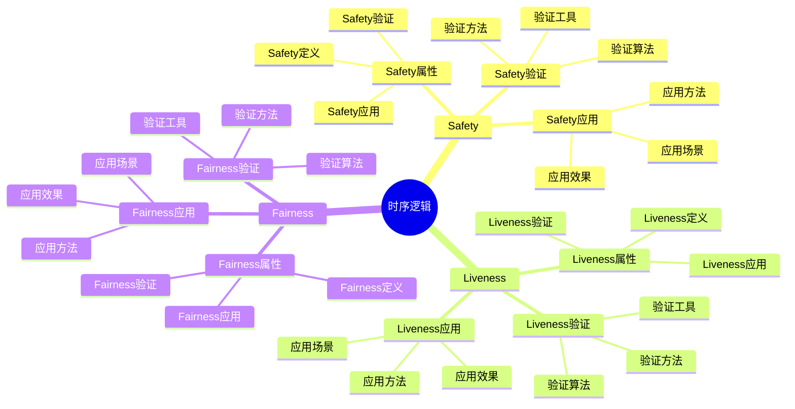
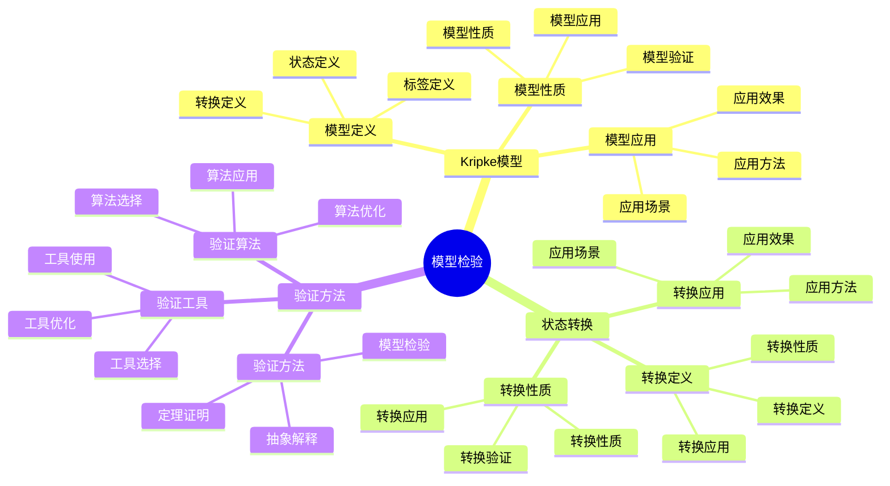
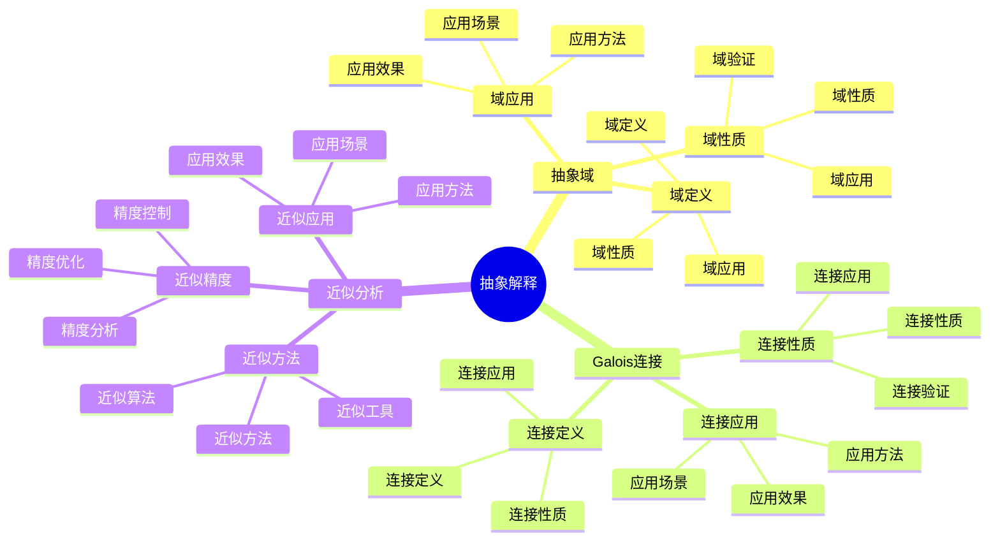
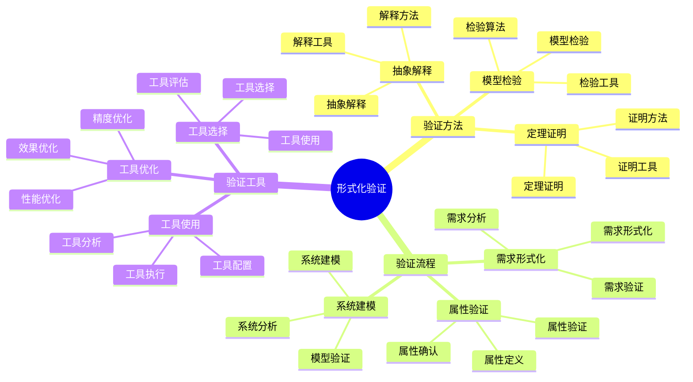

# 形式化理论视角详细思维导图

## 📑 目录

- [形式化理论视角详细思维导图](#形式化理论视角详细思维导图)
  - [📑 目录](#-目录)
  - [1 时序逻辑详解](#1-时序逻辑详解)
  - [2 模型检验详解](#2-模型检验详解)
  - [3 抽象解释详解](#3-抽象解释详解)
  - [4 形式化验证详解](#4-形式化验证详解)
  - [5 形式化理论视角应用示例](#5-形式化理论视角应用示例)
  - [6 使用指南](#6-使用指南)
    - [6.1 快速开始](#61-快速开始)
    - [6.2 系统验证应用](#62-系统验证应用)
    - [6.3 安全性验证应用](#63-安全性验证应用)
  - [7 使用技巧](#7-使用技巧)
    - [7.1 模型构建技巧](#71-模型构建技巧)
    - [7.2 验证技巧](#72-验证技巧)
  - [8 实践案例](#8-实践案例)
    - [8.1 并发系统正确性验证案例](#81-并发系统正确性验证案例)
    - [8.2 安全协议验证案例](#82-安全协议验证案例)
  - [9 相关文档](#9-相关文档)
  - [10 2025 年最新实践](#10-2025-年最新实践)
    - [10.1 形式化理论在云原生系统验证中的应用（2025）](#101-形式化理论在云原生系统验证中的应用2025)
    - [10.2 形式化理论在安全协议验证中的应用（2025）](#102-形式化理论在安全协议验证中的应用2025)
  - [11 实际应用案例](#11-实际应用案例)
    - [案例 1：Kubernetes 调度器正确性验证（2025）](#案例-1kubernetes-调度器正确性验证2025)
    - [案例 2：服务网格安全协议验证（2025）](#案例-2服务网格安全协议验证2025)
    - [案例 3：容器运行时安全验证（2025）](#案例-3容器运行时安全验证2025)

---

## 1 时序逻辑详解



---

## 2 模型检验详解



---

## 3 抽象解释详解



---

## 4 形式化验证详解



---

## 5 形式化理论视角应用示例

| 应用场景 | 使用逻辑 | 使用模型 | 使用验证 | 效果 | 推荐度 |
|---------|---------|---------|---------|------|--------|
| **系统正确性验证** | 时序逻辑 | Kripke模型 | 模型检验 | 高 | ⭐⭐⭐⭐⭐ |
| **安全性验证** | Safety逻辑 | 安全模型 | 模型检验 | 高 | ⭐⭐⭐⭐⭐ |
| **并发系统验证** | 时序逻辑 | 并发模型 | 模型检验 | 高 | ⭐⭐⭐⭐ |
| **性能分析** | 时序逻辑 | 性能模型 | 抽象解释 | 中 | ⭐⭐⭐⭐ |
| **系统优化** | 时序逻辑 | 优化模型 | 抽象解释 | 中 | ⭐⭐⭐ |

**推荐度说明**：

- **⭐⭐⭐⭐⭐**：强烈推荐
- **⭐⭐⭐⭐**：推荐
- **⭐⭐⭐**：可选

---

## 6 使用指南

### 6.1 快速开始

**适用场景**：系统正确性验证、安全性验证、并发系统验证

**使用步骤**：

1. **理解时序逻辑**：理解Safety、Liveness、Fairness等时序逻辑概念
2. **系统建模**：将系统建模为Kripke模型
3. **性质定义**：定义系统的时序性质
4. **模型检验**：使用模型检验验证系统性质

**推荐度**：⭐⭐⭐⭐⭐

---

### 6.2 系统验证应用

**适用场景**：实际项目中的系统验证

**使用步骤**：

1. **系统建模**：将系统建模为形式化模型
2. **性质定义**：定义系统的正确性和安全性性质
3. **模型检验**：使用模型检验工具验证性质
4. **结果分析**：分析验证结果
5. **问题修复**：修复发现的问题

**推荐度**：⭐⭐⭐⭐⭐

---

### 6.3 安全性验证应用

**适用场景**：系统安全性验证

**使用步骤**：

1. **安全性质定义**：定义系统的安全性质
2. **安全模型构建**：构建系统的安全模型
3. **安全验证**：使用模型检验验证安全性质
4. **漏洞分析**：分析发现的安全漏洞
5. **安全修复**：修复安全漏洞

**推荐度**：⭐⭐⭐⭐⭐

---

## 7 使用技巧

### 7.1 模型构建技巧

**技巧1：模型抽象**:

- 合理抽象系统为形式化模型
- 平衡模型的精确性和可处理性
- 避免模型过度复杂或过度简化

**技巧2：性质定义**:

- 准确定义系统的时序性质
- 理解性质的类型和含义
- 建立性质验证机制

**推荐度**：⭐⭐⭐⭐⭐

---

### 7.2 验证技巧

**技巧1：工具选择**:

- 选择合适的模型检验工具
- 理解工具的使用方法和限制
- 提高验证效率

**技巧2：结果解释**:

- 正确解释验证结果
- 理解反例的含义
- 建立问题修复机制

**推荐度**：⭐⭐⭐⭐⭐

---

## 8 实践案例

### 8.1 并发系统正确性验证案例

**场景**：验证分布式锁系统的正确性

**分析过程**：

1. **系统建模**：
   - 将分布式锁系统建模为Kripke模型
   - 定义状态和状态转换

2. **性质定义**：
   - Safety性质：互斥性（同一时间只有一个进程持有锁）
   - Liveness性质：无死锁（进程最终能获得锁）

3. **模型检验**：
   - 使用模型检验工具（如SPIN）验证性质
   - 检查Safety和Liveness性质

4. **结果分析**：
   - 发现潜在的竞态条件
   - 发现可能的死锁场景

5. **问题修复**：
   - 修复竞态条件
   - 修复死锁问题

**效果**：成功验证系统正确性，发现并修复问题

**推荐度**：⭐⭐⭐⭐⭐

---

### 8.2 安全协议验证案例

**场景**：验证TLS握手协议的安全性

**分析过程**：

1. **安全性质定义**：
   - 保密性：通信内容不被窃听
   - 完整性：通信内容不被篡改
   - 认证性：通信双方身份认证

2. **安全模型构建**：
   - 构建TLS握手协议的安全模型
   - 定义攻击者模型

3. **安全验证**：
   - 使用模型检验工具验证安全性质
   - 检查是否存在安全漏洞

4. **漏洞分析**：
   - 分析发现的安全漏洞
   - 评估漏洞的影响

5. **安全修复**：
   - 修复安全漏洞
   - 重新验证安全性

**效果**：成功验证协议安全性，发现并修复安全漏洞

**推荐度**：⭐⭐⭐⭐⭐

---

## 9 相关文档

- **[理论视角思维导图](01-theoretical-perspectives-mindmap.md)** - 理论视角全景、形式化理论视角概述
- **[理论视角对比矩阵](02-perspective-comparison-matrix.md)** - 视角功能对比、适用场景、复杂度
- **[理论视角应用案例](09-perspective-application-cases.md)** - 形式化理论视角应用案例、实践案例
- **[理论视角集成指南](10-perspective-integration-guide.md)** - 理论视角集成全景、视角组合策略
- **[理论视角实践综合指南](11-perspective-practice-guide.md)** - 理论视角实践全景、形式化理论视角实践

---

## 10 2025 年最新实践

### 10.1 形式化理论在云原生系统验证中的应用（2025）

**2025 年趋势**：使用形式化理论进行云原生系统验证

**实践要点**：

- **系统建模**：使用形式化方法建模云原生系统
- **性质验证**：使用模型检验验证系统性质
- **自动化验证**：使用自动化工具进行系统验证

**代码示例**：

```python
# 2025 年形式化系统验证工具
class FormalSystemVerifier:
    def __init__(self):
        self.model_checker = ModelChecker()
        self.property_spec = PropertySpecification()

    def verify_system(self, system_model, properties):
        """验证系统"""
        # 构建系统模型
        model = self.build_model(system_model)

        # 验证性质
        results = {}
        for prop in properties:
            result = self.model_checker.check(model, prop)
            results[prop] = result

        return results
```

### 10.2 形式化理论在安全协议验证中的应用（2025）

**2025 年趋势**：使用形式化理论进行安全协议验证

**实践要点**：

- **协议建模**：使用形式化方法建模安全协议
- **安全性质定义**：定义安全性质的形式化规范
- **自动化验证**：使用自动化工具验证安全性质

**代码示例**：

```python
# 安全协议验证工具
class SecurityProtocolVerifier:
    def verify_tls_handshake(self, protocol_model):
        """验证 TLS 握手协议"""
        # 定义安全性质
        properties = {
            'confidentiality': self.define_confidentiality(),
            'integrity': self.define_integrity(),
            'authentication': self.define_authentication()
        }

        # 验证性质
        results = {}
        for prop_name, prop in properties.items():
            result = self.model_checker.check(protocol_model, prop)
            results[prop_name] = result

        return results
```

## 11 实际应用案例

### 案例 1：Kubernetes 调度器正确性验证（2025）

**场景**：使用形式化理论验证 Kubernetes 调度器的正确性

**实现方案**：

```python
# Kubernetes 调度器验证
class KubernetesSchedulerVerifier:
    def verify_scheduler(self, scheduler_model):
        """验证调度器"""
        # 定义调度性质
        properties = {
            'fairness': self.define_fairness_property(),
            'resource_constraints': self.define_resource_constraints(),
            'deadlock_freedom': self.define_deadlock_freedom()
        }

        # 验证性质
        results = {}
        for prop_name, prop in properties.items():
            result = self.model_checker.check(scheduler_model, prop)
            results[prop_name] = result

        return results
```

**Kubernetes 配置示例**：

```yaml
# 调度器配置验证
apiVersion: kubescheduler.config.k8s.io/v1
kind: KubeSchedulerConfiguration
profiles:
- schedulerName: default-scheduler
  plugins:
    score:
      enabled:
      - name: NodeResourcesFit
        weight: 1
      - name: NodeAffinity
        weight: 1
    filter:
      enabled:
      - name: NodeResourcesFit
      - name: NodeAffinity
```

### 案例 2：服务网格安全协议验证（2025）

**场景**：使用形式化理论验证服务网格安全协议

**实现方案**：

```yaml
# Istio 安全策略配置
apiVersion: security.istio.io/v1beta1
kind: PeerAuthentication
metadata:
  name: default
spec:
  mtls:
    mode: STRICT
---
apiVersion: security.istio.io/v1beta1
kind: AuthorizationPolicy
metadata:
  name: service-authz
spec:
  selector:
    matchLabels:
      app: service
  action: ALLOW
  rules:
  - from:
    - source:
        principals: ["cluster.local/ns/default/sa/service-account"]
    to:
    - operation:
        methods: ["GET", "POST"]
```

**效果**：

- 安全协议正确性验证
- 安全漏洞自动发现
- 安全性质保证

### 案例 3：容器运行时安全验证（2025）

**场景**：使用形式化理论验证容器运行时的安全性

**实现方案**：

```python
# 容器运行时安全验证
class ContainerRuntimeSecurityVerifier:
    def verify_runtime_security(self, runtime_model):
        """验证运行时安全性"""
        # 定义安全性质
        properties = {
            'isolation': self.define_isolation_property(),
            'resource_limits': self.define_resource_limits(),
            'capability_restrictions': self.define_capability_restrictions()
        }

        # 验证性质
        results = {}
        for prop_name, prop in properties.items():
            result = self.model_checker.check(runtime_model, prop)
            results[prop_name] = result

        return results
```

**效果**：

- 容器运行时安全性验证
- 隔离性保证
- 资源限制验证

---

**最后更新**：2025-11-15
**文档状态**：✅ 完整 | 📊 包含形式化理论视角详细思维导图、使用指南、使用技巧、实践案例、2025年最新实践 | 🎯 生产就绪
**维护者**：项目团队
