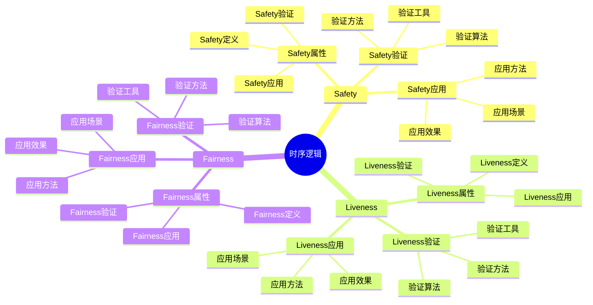
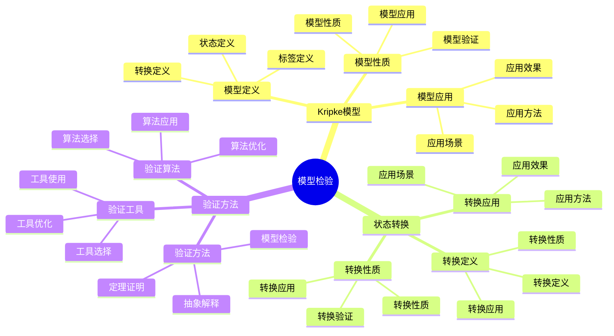
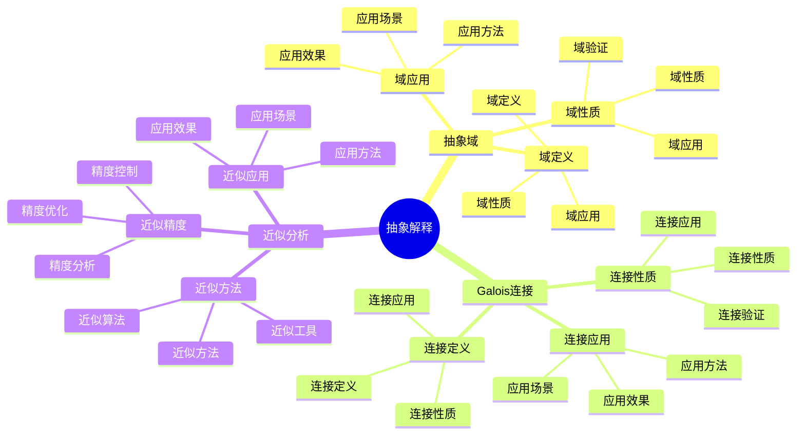
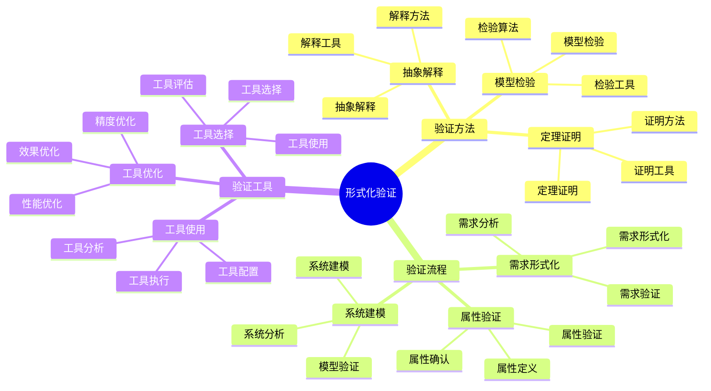

# 形式化理论视角详细思维导图

## 📑 目录

- [形式化理论视角详细思维导图](#形式化理论视角详细思维导图)
  - [📑 目录](#-目录)
  - [1 时序逻辑详解](#1-时序逻辑详解)
  - [2 模型检验详解](#2-模型检验详解)
  - [3 抽象解释详解](#3-抽象解释详解)
  - [4 形式化验证详解](#4-形式化验证详解)

---

## 1 时序逻辑详解

---

## 2 模型检验详解

---

## 3 抽象解释详解

---

## 4 形式化验证详解

---

## 5 形式化理论视角应用示例

| 应用场景 | 使用逻辑 | 使用模型 | 使用验证 | 效果 | 推荐度 |
|---------|---------|---------|---------|------|--------|
| **系统正确性验证** | 时序逻辑 | Kripke模型 | 模型检验 | 高 | ⭐⭐⭐⭐⭐ |
| **安全性验证** | Safety逻辑 | 安全模型 | 模型检验 | 高 | ⭐⭐⭐⭐⭐ |
| **并发系统验证** | 时序逻辑 | 并发模型 | 模型检验 | 高 | ⭐⭐⭐⭐ |
| **性能分析** | 时序逻辑 | 性能模型 | 抽象解释 | 中 | ⭐⭐⭐⭐ |
| **系统优化** | 时序逻辑 | 优化模型 | 抽象解释 | 中 | ⭐⭐⭐ |

**推荐度说明**：
- **⭐⭐⭐⭐⭐**：强烈推荐
- **⭐⭐⭐⭐**：推荐
- **⭐⭐⭐**：可选

---

**最后更新**：2025-11-07
**文档状态**：✅ 完整 | 📊 包含形式化理论视角详细思维导图 | 🎯 生产就绪
**维护者**：项目团队
