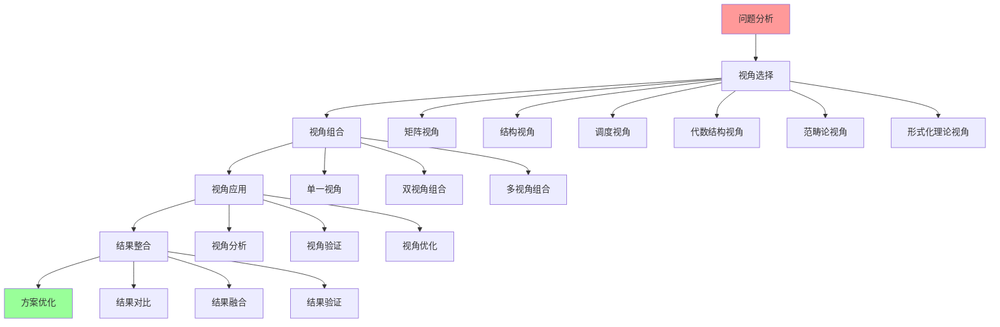
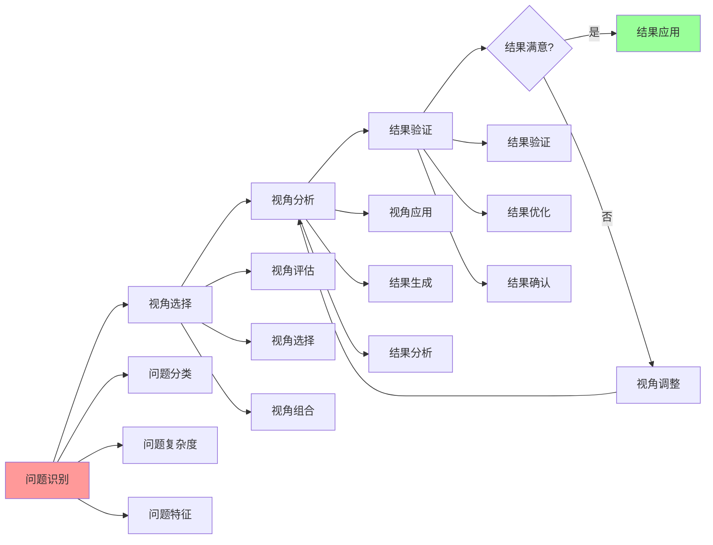

# 理论视角集成指南

## 📑 目录

- [理论视角集成指南](#理论视角集成指南)
  - [📑 目录](#-目录)
  - [1 理论视角集成全景](#1-理论视角集成全景)
  - [2 视角组合策略](#2-视角组合策略)
  - [3 视角应用流程](#3-视角应用流程)
  - [4 视角集成检查清单](#4-视角集成检查清单)

---

## 1 理论视角集成全景

---

## 2 视角组合策略

| 组合类型 | 组合描述 | 适用场景 | 预期效果 | 推荐度 |
|---------|---------|---------|---------|--------|
| **矩阵+结构** | 矩阵视角分析结构关系 | 技术选型、架构设计 | 全面分析 | ⭐⭐⭐⭐⭐ |
| **结构+调度** | 结构视角分析调度问题 | 性能优化、资源调度 | 深度分析 | ⭐⭐⭐⭐⭐ |
| **矩阵+调度** | 矩阵视角分析调度决策 | 调度优化、决策分析 | 决策支持 | ⭐⭐⭐⭐ |
| **代数+范畴** | 代数结构视角结合范畴论 | 理论分析、形式化验证 | 理论深度 | ⭐⭐⭐⭐ |
| **形式化+结构** | 形式化理论结合结构视角 | 系统验证、理论证明 | 理论严谨 | ⭐⭐⭐⭐ |
| **多视角组合** | 三个以上视角组合 | 复杂问题、系统分析 | 全面深入 | ⭐⭐⭐⭐ |

**推荐度说明**：
- **⭐⭐⭐⭐⭐**：强烈推荐
- **⭐⭐⭐⭐**：推荐
- **⭐⭐⭐**：可选

---

## 3 视角应用流程

---

## 4 视角集成检查清单

| 检查项 | 检查内容 | 重要性 | 推荐度 |
|--------|---------|--------|--------|
| **问题分析** | 问题识别、问题分类、问题特征 | 极高 | ⭐⭐⭐⭐⭐ |
| **视角选择** | 视角评估、视角选择、视角组合 | 高 | ⭐⭐⭐⭐⭐ |
| **视角应用** | 视角应用、结果生成、结果分析 | 高 | ⭐⭐⭐⭐⭐ |
| **结果整合** | 结果对比、结果融合、结果验证 | 高 | ⭐⭐⭐⭐⭐ |
| **方案优化** | 方案设计、方案优化、方案验证 | 中 | ⭐⭐⭐⭐ |

**推荐度说明**：
- **⭐⭐⭐⭐⭐**：强烈推荐
- **⭐⭐⭐⭐**：推荐
- **⭐⭐⭐**：可选

---

## 5 使用指南

### 5.1 快速开始

**适用场景**：多视角分析、复杂问题解决

**使用步骤**：

1. **问题分析**：分析问题的特征和复杂度
2. **视角选择**：选择合适的理论视角组合
3. **视角应用**：应用视角组合进行分析
4. **结果整合**：整合各视角的分析结果

**推荐度**：⭐⭐⭐⭐⭐

---

### 5.2 视角集成应用

**适用场景**：实际项目中的多视角分析

**使用步骤**：

1. **问题识别**：识别问题的类型和特征
2. **视角选择**：根据视角组合策略选择合适的视角组合
3. **视角分析**：使用视角组合进行问题分析
4. **结果生成**：生成各视角的分析结果
5. **结果整合**：整合各视角的分析结果
6. **方案优化**：基于整合结果优化解决方案

**推荐度**：⭐⭐⭐⭐⭐

---

## 6 使用技巧

### 6.1 视角组合技巧

**技巧1：组合策略**

- 根据问题特征选择合适的视角组合策略
- 理解视角组合的逻辑和效果
- 避免视角过度组合

**技巧2：结果整合**

- 对比不同视角的分析结果
- 融合各视角的洞察
- 验证整合结果的正确性

**推荐度**：⭐⭐⭐⭐⭐

---

## 7 实践案例

### 7.1 矩阵+结构视角组合案例

**场景**：使用矩阵视角和结构视角进行技术选型

**应用过程**：

1. **问题识别**：需要选择容器运行时技术

2. **视角选择**：
   - 矩阵视角：技术对比分析
   - 结构视角：技术本质理解

3. **视角分析**：
   - 矩阵视角：使用关系矩阵和属性矩阵对比技术
   - 结构视角：分析技术的计算结构、控制结构、信息结构

4. **结果生成**：
   - 矩阵视角：技术对比结果
   - 结构视角：技术本质分析结果

5. **结果整合**：
   - 综合矩阵对比和结构分析结果
   - 选择最适合的技术

**效果**：成功使用视角组合进行技术选型，决策科学合理

**推荐度**：⭐⭐⭐⭐⭐

---

## 8 相关文档

- **[理论视角思维导图](01-theoretical-perspectives-mindmap.md)** - 理论视角全景、矩阵视角、结构视角、调度视角
- **[理论视角对比矩阵](02-perspective-comparison-matrix.md)** - 视角功能对比、适用场景、复杂度
- **[理论视角应用案例](09-perspective-application-cases.md)** - 矩阵视角应用案例、结构视角应用案例、调度视角应用案例

---

**最后更新**：2025-11-15
**文档状态**：✅ 完整 | 📊 包含理论视角集成指南、使用指南、使用技巧、实践案例 | 🎯 生产就绪
**维护者**：项目团队
