# 理论视角集成指南

## 📑 目录

- [理论视角集成指南](#理论视角集成指南)
  - [📑 目录](#-目录)
  - [1 理论视角集成全景](#1-理论视角集成全景)
  - [2 视角组合策略](#2-视角组合策略)
  - [3 视角应用流程](#3-视角应用流程)
  - [4 视角集成检查清单](#4-视角集成检查清单)
  - [5 使用指南](#5-使用指南)
    - [5.1 快速开始](#51-快速开始)
    - [5.2 视角集成应用](#52-视角集成应用)
  - [6 使用技巧](#6-使用技巧)
    - [6.1 视角组合技巧](#61-视角组合技巧)
  - [7 实践案例](#7-实践案例)
    - [7.1 矩阵+结构视角组合案例](#71-矩阵结构视角组合案例)
  - [8 相关文档](#8-相关文档)
  - [9 2025 年最新实践](#9-2025-年最新实践)
    - [9.1 多视角集成在云原生技术选型中的应用（2025）](#91-多视角集成在云原生技术选型中的应用2025)
    - [9.2 多视角集成在架构设计中的应用（2025）](#92-多视角集成在架构设计中的应用2025)
  - [10 实际应用案例](#10-实际应用案例)
    - [案例 1：容器运行时技术选型（2025）](#案例-1容器运行时技术选型2025)
    - [案例 2：微服务架构设计（2025）](#案例-2微服务架构设计2025)
    - [案例 3：边缘计算架构设计（2025）](#案例-3边缘计算架构设计2025)

---

## 1 理论视角集成全景

```mermaid
graph TB
    A[问题分析] --> B[视角选择]
    B --> C[视角组合]
    C --> D[视角应用]
    D --> E[结果整合]
    E --> F[方案优化]

    B --> B1[矩阵视角]
    B --> B2[结构视角]
    B --> B3[调度视角]
    B --> B4[代数结构视角]
    B --> B5[范畴论视角]
    B --> B6[形式化理论视角]

    C --> C1[单一视角]
    C --> C2[双视角组合]
    C --> C3[多视角组合]

    D --> D1[视角分析]
    D --> D2[视角验证]
    D --> D3[视角优化]

    E --> E1[结果对比]
    E --> E2[结果融合]
    E --> E3[结果验证]

    style A fill:#ff9999
    style F fill:#99ff99
```



---

## 2 视角组合策略

| 组合类型 | 组合描述 | 适用场景 | 预期效果 | 推荐度 |
|---------|---------|---------|---------|--------|
| **矩阵+结构** | 矩阵视角分析结构关系 | 技术选型、架构设计 | 全面分析 | ⭐⭐⭐⭐⭐ |
| **结构+调度** | 结构视角分析调度问题 | 性能优化、资源调度 | 深度分析 | ⭐⭐⭐⭐⭐ |
| **矩阵+调度** | 矩阵视角分析调度决策 | 调度优化、决策分析 | 决策支持 | ⭐⭐⭐⭐ |
| **代数+范畴** | 代数结构视角结合范畴论 | 理论分析、形式化验证 | 理论深度 | ⭐⭐⭐⭐ |
| **形式化+结构** | 形式化理论结合结构视角 | 系统验证、理论证明 | 理论严谨 | ⭐⭐⭐⭐ |
| **多视角组合** | 三个以上视角组合 | 复杂问题、系统分析 | 全面深入 | ⭐⭐⭐⭐ |

**推荐度说明**：

- **⭐⭐⭐⭐⭐**：强烈推荐
- **⭐⭐⭐⭐**：推荐
- **⭐⭐⭐**：可选

---

## 3 视角应用流程

```mermaid
graph LR
    A[问题识别] --> B[视角选择]
    B --> C[视角分析]
    C --> D[结果验证]
    D --> E{结果满意?}
    E -->|是| F[结果应用]
    E -->|否| G[视角调整]
    G --> C

    A --> A1[问题分类]
    A --> A2[问题复杂度]
    A --> A3[问题特征]

    B --> B1[视角评估]
    B --> B2[视角选择]
    B --> B3[视角组合]

    C --> C1[视角应用]
    C --> C2[结果生成]
    C --> C3[结果分析]

    D --> D1[结果验证]
    D --> D2[结果优化]
    D --> D3[结果确认]

    style A fill:#ff9999
    style F fill:#99ff99
```



---

## 4 视角集成检查清单

| 检查项 | 检查内容 | 重要性 | 推荐度 |
|--------|---------|--------|--------|
| **问题分析** | 问题识别、问题分类、问题特征 | 极高 | ⭐⭐⭐⭐⭐ |
| **视角选择** | 视角评估、视角选择、视角组合 | 高 | ⭐⭐⭐⭐⭐ |
| **视角应用** | 视角应用、结果生成、结果分析 | 高 | ⭐⭐⭐⭐⭐ |
| **结果整合** | 结果对比、结果融合、结果验证 | 高 | ⭐⭐⭐⭐⭐ |
| **方案优化** | 方案设计、方案优化、方案验证 | 中 | ⭐⭐⭐⭐ |

**推荐度说明**：

- **⭐⭐⭐⭐⭐**：强烈推荐
- **⭐⭐⭐⭐**：推荐
- **⭐⭐⭐**：可选

---

## 5 使用指南

### 5.1 快速开始

**适用场景**：多视角分析、复杂问题解决

**使用步骤**：

1. **问题分析**：分析问题的特征和复杂度
2. **视角选择**：选择合适的理论视角组合
3. **视角应用**：应用视角组合进行分析
4. **结果整合**：整合各视角的分析结果

**推荐度**：⭐⭐⭐⭐⭐

---

### 5.2 视角集成应用

**适用场景**：实际项目中的多视角分析

**使用步骤**：

1. **问题识别**：识别问题的类型和特征
2. **视角选择**：根据视角组合策略选择合适的视角组合
3. **视角分析**：使用视角组合进行问题分析
4. **结果生成**：生成各视角的分析结果
5. **结果整合**：整合各视角的分析结果
6. **方案优化**：基于整合结果优化解决方案

**推荐度**：⭐⭐⭐⭐⭐

---

## 6 使用技巧

### 6.1 视角组合技巧

**技巧1：组合策略**:

- 根据问题特征选择合适的视角组合策略
- 理解视角组合的逻辑和效果
- 避免视角过度组合

**技巧2：结果整合**:

- 对比不同视角的分析结果
- 融合各视角的洞察
- 验证整合结果的正确性

**推荐度**：⭐⭐⭐⭐⭐

---

## 7 实践案例

### 7.1 矩阵+结构视角组合案例

**场景**：使用矩阵视角和结构视角进行技术选型

**应用过程**：

1. **问题识别**：需要选择容器运行时技术

2. **视角选择**：
   - 矩阵视角：技术对比分析
   - 结构视角：技术本质理解

3. **视角分析**：
   - 矩阵视角：使用关系矩阵和属性矩阵对比技术
   - 结构视角：分析技术的计算结构、控制结构、信息结构

4. **结果生成**：
   - 矩阵视角：技术对比结果
   - 结构视角：技术本质分析结果

5. **结果整合**：
   - 综合矩阵对比和结构分析结果
   - 选择最适合的技术

**效果**：成功使用视角组合进行技术选型，决策科学合理

**推荐度**：⭐⭐⭐⭐⭐

---

## 8 相关文档

- **[理论视角思维导图](01-theoretical-perspectives-mindmap.md)** - 理论视角全景、矩阵视角、结构视角、调度视角
- **[理论视角对比矩阵](02-perspective-comparison-matrix.md)** - 视角功能对比、适用场景、复杂度
- **[理论视角应用案例](09-perspective-application-cases.md)** - 矩阵视角应用案例、结构视角应用案例、调度视角应用案例

---

## 9 2025 年最新实践

### 9.1 多视角集成在云原生技术选型中的应用（2025）

**2025 年趋势**：使用多视角集成进行云原生技术选型

**实践要点**：

- **视角组合**：使用矩阵视角和结构视角组合进行技术选型
- **结果整合**：整合不同视角的分析结果
- **决策支持**：基于多视角分析结果进行技术决策

**代码示例**：

```python
# 2025 年多视角技术选型工具
class MultiPerspectiveTechSelector:
    def __init__(self):
        self.matrix_analyzer = MatrixPerspectiveAnalyzer()
        self.structure_analyzer = StructurePerspectiveAnalyzer()
        self.scheduler_analyzer = SchedulerPerspectiveAnalyzer()

    def select_technology(self, requirements, perspectives=['matrix', 'structure']):
        """使用多视角选择技术"""
        results = {}

        if 'matrix' in perspectives:
            results['matrix'] = self.matrix_analyzer.analyze(requirements)

        if 'structure' in perspectives:
            results['structure'] = self.structure_analyzer.analyze(requirements)

        if 'scheduler' in perspectives:
            results['scheduler'] = self.scheduler_analyzer.analyze(requirements)

        # 整合结果
        integrated_result = self.integrate_results(results)

        return integrated_result
```

### 9.2 多视角集成在架构设计中的应用（2025）

**2025 年趋势**：使用多视角集成进行架构设计

**实践要点**：

- **架构分析**：使用结构视角和调度视角分析架构
- **性能优化**：使用调度视角和矩阵视角优化性能
- **架构验证**：使用形式化理论视角验证架构

**代码示例**：

```python
# 多视角架构设计工具
class MultiPerspectiveArchitectureDesigner:
    def design_architecture(self, requirements):
        """使用多视角设计架构"""
        # 结构视角分析
        structure_analysis = self.structure_analyzer.analyze(requirements)

        # 调度视角分析
        scheduler_analysis = self.scheduler_analyzer.analyze(requirements)

        # 整合分析结果
        architecture = self.integrate_analyses(
            structure_analysis, scheduler_analysis
        )

        return architecture
```

## 10 实际应用案例

### 案例 1：容器运行时技术选型（2025）

**场景**：使用矩阵视角和结构视角组合选择容器运行时

**实现方案**：

```python
# 容器运行时技术选型
class ContainerRuntimeSelector:
    def select_runtime(self, requirements):
        """选择容器运行时"""
        # 矩阵视角分析
        matrix_result = self.matrix_analyzer.compare_runtimes(requirements)

        # 结构视角分析
        structure_result = self.structure_analyzer.analyze_runtimes(requirements)

        # 整合结果
        selected_runtime = self.integrate_results(
            matrix_result, structure_result
        )

        return selected_runtime
```

**Kubernetes 配置示例**：

```yaml
# 容器运行时配置
apiVersion: node.k8s.io/v1
kind: RuntimeClass
metadata:
  name: wasmedge
handler: wasmedge
---
apiVersion: v1
kind: Pod
metadata:
  name: wasm-pod
spec:
  runtimeClassName: wasmedge
  containers:
  - name: wasm-container
    image: wasm-app:latest
```

### 案例 2：微服务架构设计（2025）

**场景**：使用结构视角和调度视角组合设计微服务架构

**实现方案**：

```yaml
# 微服务架构配置
apiVersion: apps/v1
kind: Deployment
metadata:
  name: user-service
spec:
  replicas: 3
  selector:
    matchLabels:
      app: user-service
  template:
    metadata:
      labels:
        app: user-service
    spec:
      containers:
      - name: user-service
        image: user-service:latest
        resources:
          requests:
            cpu: "200m"
            memory: "256Mi"
          limits:
            cpu: "500m"
            memory: "512Mi"
---
apiVersion: v1
kind: Service
metadata:
  name: user-service
spec:
  selector:
    app: user-service
  ports:
  - port: 80
    targetPort: 8080
```

**效果**：

- 架构设计科学化
- 性能优化自动化
- 技术选型合理化

### 案例 3：边缘计算架构设计（2025）

**场景**：使用多视角组合设计边缘计算架构

**实现方案**：

```yaml
# 边缘计算架构配置
apiVersion: apps/v1
kind: Deployment
metadata:
  name: edge-app
spec:
  replicas: 3
  selector:
    matchLabels:
      app: edge-app
  template:
    metadata:
      labels:
        app: edge-app
    spec:
      runtimeClassName: wasmedge
      nodeSelector:
        node-type: edge
      containers:
      - name: edge-app
        image: edge-app:latest
        resources:
          requests:
            cpu: "100m"
            memory: "128Mi"
          limits:
            cpu: "200m"
            memory: "256Mi"
```

**效果**：

- 边缘计算架构优化
- 资源利用效率提升
- 架构设计规范化

---

**最后更新**：2025-11-15
**文档状态**：✅ 完整 | 📊 包含理论视角集成指南、使用指南、使用技巧、实践案例、2025年最新实践 | 🎯 生产就绪
**维护者**：项目团队
