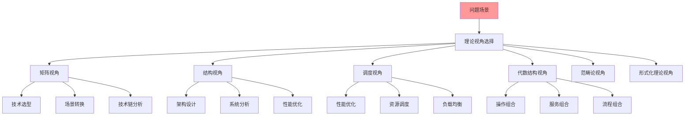

# 理论视角实践综合指南

## 📑 目录

- [理论视角实践综合指南](#理论视角实践综合指南)
  - [📑 目录](#-目录)
  - [1 理论视角实践全景](#1-理论视角实践全景)
  - [2 矩阵视角实践](#2-矩阵视角实践)
    - [2.1 实践场景](#21-实践场景)
    - [2.2 实践步骤](#22-实践步骤)
  - [3 结构视角实践](#3-结构视角实践)
    - [3.1 实践场景](#31-实践场景)
    - [3.2 实践步骤](#32-实践步骤)
  - [4 调度视角实践](#4-调度视角实践)
    - [4.1 实践场景](#41-实践场景)
    - [4.2 实践步骤](#42-实践步骤)
  - [5 代数结构视角实践](#5-代数结构视角实践)
    - [5.1 实践场景](#51-实践场景)
    - [5.2 实践步骤](#52-实践步骤)
  - [6 理论视角实践检查清单](#6-理论视角实践检查清单)
  - [7 使用指南](#7-使用指南)
    - [7.1 快速开始](#71-快速开始)
    - [7.2 理论视角实践应用](#72-理论视角实践应用)
  - [8 使用技巧](#8-使用技巧)
    - [8.1 视角选择技巧](#81-视角选择技巧)
    - [8.2 方法应用技巧](#82-方法应用技巧)
  - [9 实践案例](#9-实践案例)
    - [9.1 矩阵视角技术选型案例](#91-矩阵视角技术选型案例)
    - [9.2 结构视角架构设计案例](#92-结构视角架构设计案例)
  - [10 相关文档](#10-相关文档)

---

## 1 理论视角实践全景

---

## 2 矩阵视角实践

### 2.1 实践场景

| 场景 | 问题 | 矩阵应用 | 预期效果 | 推荐度 |
|------|------|---------|---------|--------|
| **技术选型** | 多技术方案选择 | 关系矩阵、属性矩阵 | 科学选型 | ⭐⭐⭐⭐⭐ |
| **场景转换** | 场景迁移、技术迁移 | 场景变换矩阵 | 场景转换优化 | ⭐⭐⭐⭐⭐ |
| **技术链分析** | 技术依赖、技术链优化 | 技术链序列矩阵 | 技术链优化 | ⭐⭐⭐⭐ |
| **操作变换** | 操作优化、操作组合 | 操作变换矩阵 | 操作优化 | ⭐⭐⭐⭐ |

**推荐度说明**：

- **⭐⭐⭐⭐⭐**：强烈推荐
- **⭐⭐⭐⭐**：推荐
- **⭐⭐⭐**：可选

### 2.2 实践步骤

1. **问题识别**：识别问题类型、问题特征
2. **矩阵构建**：构建关系矩阵、属性矩阵
3. **矩阵分析**：分析矩阵特征、矩阵关系
4. **决策制定**：基于矩阵分析制定决策
5. **效果验证**：验证决策效果、优化决策

---

## 3 结构视角实践

### 3.1 实践场景

| 场景 | 问题 | 结构应用 | 预期效果 | 推荐度 |
|------|------|---------|---------|--------|
| **架构设计** | 架构设计、架构优化 | 计算结构、控制结构、信息结构 | 架构优化 | ⭐⭐⭐⭐⭐ |
| **系统分析** | 系统分析、系统优化 | 三类结构分析 | 系统优化 | ⭐⭐⭐⭐⭐ |
| **性能优化** | 性能瓶颈、性能优化 | 结构优化 | 性能提升 | ⭐⭐⭐⭐ |
| **技术本质理解** | 技术理解、技术分析 | 结构分析 | 深入理解 | ⭐⭐⭐⭐⭐ |

**推荐度说明**：

- **⭐⭐⭐⭐⭐**：强烈推荐
- **⭐⭐⭐⭐**：推荐
- **⭐⭐⭐**：可选

### 3.2 实践步骤

1. **结构识别**：识别计算结构、控制结构、信息结构
2. **结构分析**：分析结构特征、结构关系
3. **结构优化**：优化结构设计、结构实现
4. **效果验证**：验证优化效果、持续优化

---

## 4 调度视角实践

### 4.1 实践场景

| 场景 | 问题 | 调度应用 | 预期效果 | 推荐度 |
|------|------|---------|---------|--------|
| **性能优化** | 性能瓶颈、性能优化 | 分层分析、动态特性 | 性能提升 | ⭐⭐⭐⭐⭐ |
| **资源调度** | 资源分配、资源优化 | 调度策略、调度优化 | 资源优化 | ⭐⭐⭐⭐⭐ |
| **负载均衡** | 负载不均、负载优化 | 调度分析、负载分析 | 负载均衡优化 | ⭐⭐⭐⭐ |
| **任务调度** | 任务调度、任务优化 | 调度策略、调度算法 | 任务调度优化 | ⭐⭐⭐⭐ |

**推荐度说明**：

- **⭐⭐⭐⭐⭐**：强烈推荐
- **⭐⭐⭐⭐**：推荐
- **⭐⭐⭐**：可选

### 4.2 实践步骤

1. **调度分析**：分析调度层次、调度特性
2. **调度策略**：设计调度策略、调度算法
3. **调度优化**：优化调度性能、调度效率
4. **效果验证**：验证调度效果、持续优化

---

## 5 代数结构视角实践

### 5.1 实践场景

| 场景 | 问题 | 代数应用 | 预期效果 | 推荐度 |
|------|------|---------|---------|--------|
| **操作组合** | 操作组合、操作优化 | 算子定义、算子组合 | 操作优化 | ⭐⭐⭐⭐⭐ |
| **服务组合** | 服务组合、服务优化 | 代数结构、结构保持 | 服务组合优化 | ⭐⭐⭐⭐ |
| **流程组合** | 流程组合、流程优化 | 算子组合、结构保持 | 流程优化 | ⭐⭐⭐⭐ |

**推荐度说明**：

- **⭐⭐⭐⭐⭐**：强烈推荐
- **⭐⭐⭐⭐**：推荐
- **⭐⭐⭐**：可选

### 5.2 实践步骤

1. **算子定义**：定义算子、算子特性
2. **结构分析**：分析代数结构、结构特性
3. **组合设计**：设计算子组合、结构保持
4. **效果验证**：验证组合效果、持续优化

---

## 6 理论视角实践检查清单

| 检查项 | 检查内容 | 重要性 | 推荐度 |
|--------|---------|--------|--------|
| **问题识别** | 问题分析、问题分类、问题特征 | 极高 | ⭐⭐⭐⭐⭐ |
| **视角选择** | 视角评估、视角选择、视角验证 | 高 | ⭐⭐⭐⭐⭐ |
| **方法应用** | 方法应用、方法验证、方法优化 | 高 | ⭐⭐⭐⭐⭐ |
| **效果评估** | 效果测量、效果分析、效果报告 | 中 | ⭐⭐⭐⭐ |

**推荐度说明**：

- **⭐⭐⭐⭐⭐**：强烈推荐
- **⭐⭐⭐⭐**：推荐
- **⭐⭐⭐**：可选

---

## 7 使用指南

### 7.1 快速开始

**适用场景**：理论视角实践、问题解决

**使用步骤**：

1. **问题识别**：识别问题类型和特征
2. **视角选择**：根据问题类型选择合适的理论视角
3. **方法应用**：应用视角的实践方法
4. **效果验证**：验证实践效果

**推荐度**：⭐⭐⭐⭐⭐

---

### 7.2 理论视角实践应用

**适用场景**：实际项目中的理论视角实践

**使用步骤**：

1. **问题识别**：识别问题类型、问题特征
2. **视角选择**：根据实践场景选择合适的理论视角
3. **方法应用**：按照实践步骤应用视角方法
4. **效果验证**：验证实践效果，持续优化

**推荐度**：⭐⭐⭐⭐⭐

---

## 8 使用技巧

### 8.1 视角选择技巧

**技巧1：问题匹配**:

- 根据问题类型匹配合适的视角
- 理解视角的适用场景
- 避免视角选择错误

**技巧2：视角组合**:

- 根据问题复杂度组合多个视角
- 理解视角组合的逻辑
- 发挥视角组合的优势

**推荐度**：⭐⭐⭐⭐⭐

---

### 8.2 方法应用技巧

**技巧1：步骤执行**:

- 严格按照实践步骤执行
- 确保每个步骤的质量
- 及时进行效果验证

**技巧2：持续优化**:

- 根据实践效果优化方法
- 积累实践经验
- 形成实践模式

**推荐度**：⭐⭐⭐⭐⭐

---

## 9 实践案例

### 9.1 矩阵视角技术选型案例

**场景**：使用矩阵视角进行容器运行时技术选型

**实践过程**：

1. **问题识别**：
   - 问题类型：技术选型
   - 问题特征：多技术方案选择

2. **矩阵构建**：
   - 构建关系矩阵：对比containerd、CRI-O、Docker的关系
   - 构建属性矩阵：对比功能、性能、稳定性等属性

3. **矩阵分析**：
   - 分析矩阵特征：识别各技术的优势和劣势
   - 分析矩阵关系：理解技术之间的关系

4. **决策制定**：
   - 基于矩阵分析选择containerd
   - 理由：功能完整、稳定可靠、Kubernetes集成好

5. **效果验证**：
   - 验证containerd的稳定性和性能
   - 效果：满足需求，系统稳定

**效果**：成功使用矩阵视角进行技术选型，决策科学合理

**推荐度**：⭐⭐⭐⭐⭐

---

### 9.2 结构视角架构设计案例

**场景**：使用结构视角设计微服务架构

**实践过程**：

1. **结构识别**：
   - 计算结构：服务计算逻辑
   - 控制结构：服务调用控制
   - 信息结构：服务数据流

2. **结构分析**：
   - 分析计算结构：服务拆分和组合
   - 分析控制结构：服务调用和治理
   - 分析信息结构：数据流和存储

3. **结构优化**：
   - 优化计算结构：合理拆分服务
   - 优化控制结构：使用服务网格
   - 优化信息结构：数据分离和缓存

4. **效果验证**：
   - 验证架构的可扩展性和性能
   - 效果：架构设计优秀，满足需求

**效果**：成功使用结构视角设计微服务架构，架构设计科学合理

**推荐度**：⭐⭐⭐⭐⭐

---

## 10 相关文档

- **[理论视角思维导图](01-theoretical-perspectives-mindmap.md)** - 理论视角全景、矩阵视角、结构视角、调度视角
- **[理论视角对比矩阵](02-perspective-comparison-matrix.md)** - 视角功能对比、适用场景、复杂度
- **[理论视角应用案例](09-perspective-application-cases.md)** - 矩阵视角应用案例、结构视角应用案例、调度视角应用案例
- **[理论视角集成指南](10-perspective-integration-guide.md)** - 理论视角集成全景、视角组合策略、视角应用流程

---

**最后更新**：2025-11-15
**文档状态**：✅ 完整 | 📊 包含理论视角实践综合指南、使用指南、使用技巧、实践案例 | 🎯 生产就绪
**维护者**：项目团队
