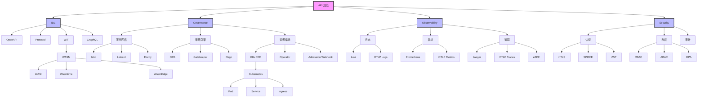
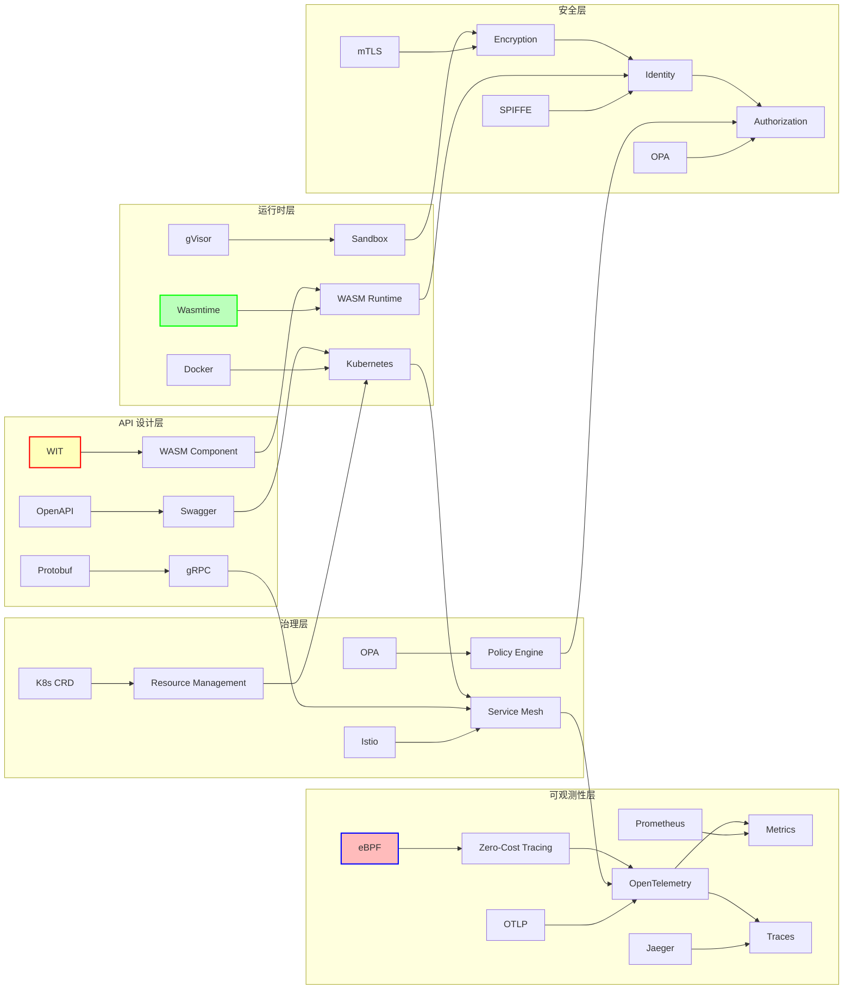
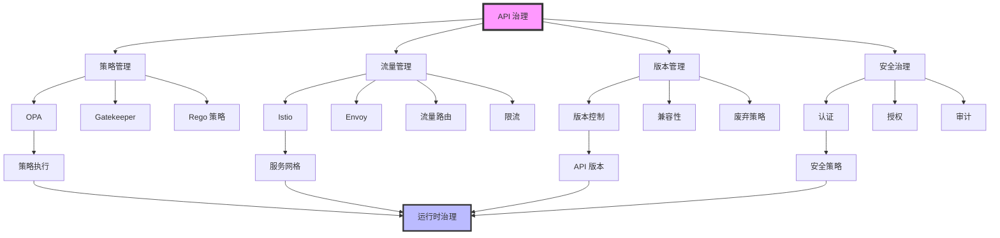
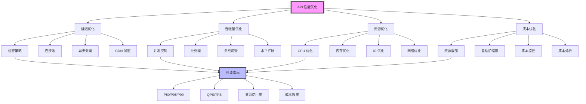
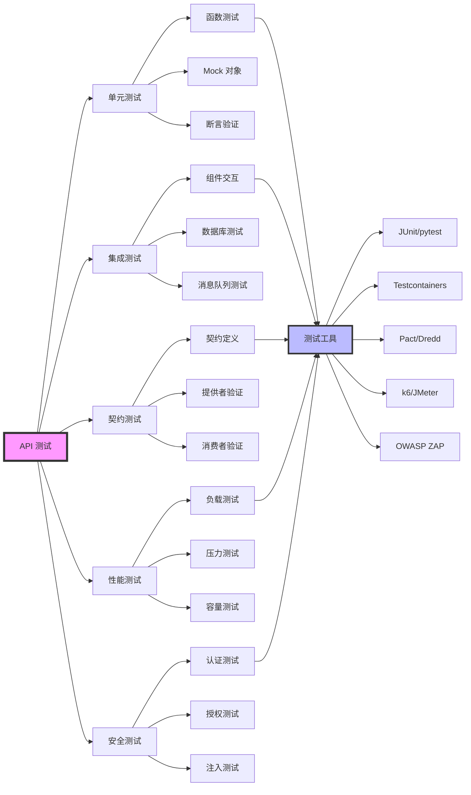
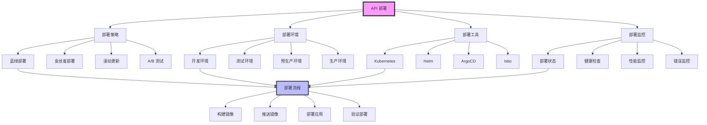

# API 规范理论基础：形式化证明、概念矩阵与知识图谱

**版本**：v1.0 **最后更新**：2025-11-07 **维护者**：项目团队

## 📑 目录

- [📑 目录](#-目录)
- [1. 概述](#1-概述)
  - [1.1 理论基础在 API 规范中的位置](#11-理论基础在-api-规范中的位置)
- [2. 形式化证明体系](#2-形式化证明体系)
  - [2.1 API 规范完备性证明](#21-api-规范完备性证明)
  - [2.2 API 契约正确性证明](#22-api-契约正确性证明)
  - [2.3 API 组合性证明](#23-api-组合性证明)
  - [2.4 API 版本兼容性证明](#24-api-版本兼容性证明)
  - [2.5 API 可观测性形式化证明](#25-api-可观测性形式化证明)
  - [2.6 API 安全性形式化证明](#26-api-安全性形式化证明)
  - [2.7 API 性能形式化证明](#27-api-性能形式化证明)
- [3. 多维概念对比矩阵](#3-多维概念对比矩阵)
  - [3.1 API 规范四元组维度对比](#31-api-规范四元组维度对比)
  - [3.2 隔离层 API 规范对比](#32-隔离层-api-规范对比)
  - [3.3 IDL 技术栈对比矩阵](#33-idl-技术栈对比矩阵)
  - [3.4 运行时环境对比矩阵](#34-运行时环境对比矩阵)
  - [3.5 治理机制对比矩阵](#35-治理机制对比矩阵)
  - [3.6 可观测性技术对比矩阵](#36-可观测性技术对比矩阵)
  - [3.7 安全机制对比矩阵](#37-安全机制对比矩阵)
  - [3.8 API 性能指标对比矩阵](#38-api-性能指标对比矩阵)
  - [3.9 API 测试策略对比矩阵](#39-api-测试策略对比矩阵)
  - [3.10 API 部署策略对比矩阵](#310-api-部署策略对比矩阵)
- [4. 概念思维导图](#4-概念思维导图)
  - [4.1 API 规范核心概念树](#41-api-规范核心概念树)
  - [4.2 API 生命周期概念图](#42-api-生命周期概念图)
  - [4.3 API 技术栈决策树](#43-api-技术栈决策树)
  - [4.4 API 安全概念图](#44-api-安全概念图)
  - [4.5 API 可观测性概念图](#45-api-可观测性概念图)
  - [4.6 API 治理概念图](#46-api-治理概念图)
- [5. 知识图谱](#5-知识图谱)
  - [5.1 API 规范知识图谱](#51-api-规范知识图谱)
  - [5.2 API 技术生态知识图谱](#52-api-技术生态知识图谱)
  - [5.3 API 治理知识图谱](#53-api-治理知识图谱)
  - [5.4 API 性能优化知识图谱](#54-api-性能优化知识图谱)
  - [5.5 API 测试知识图谱](#55-api-测试知识图谱)
  - [5.6 API 部署知识图谱](#56-api-部署知识图谱)
- [6. 相关文档](#6-相关文档)
- [附录：形式化符号表](#附录形式化符号表)
  - [A.1 基本符号](#a1-基本符号)
  - [A.2 集合操作](#a2-集合操作)
  - [A.3 API 规范专用符号](#a3-api-规范专用符号)

---

## 1. 概述

本文档提供 API 规范的理论基础，包括形式化证明体系、多维概念对比矩阵、概念思维导
图和知识图谱。本文档是对
[API 规范形式化定义](../07-formalization/formalization.md) 的扩展和深化，为 API
规范的理论研究和实践应用提供全面的理论支撑。

**参考标准**：

- [Hoare Logic](https://en.wikipedia.org/wiki/Hoare_logic) - 霍尔逻辑
- [Type Theory](https://en.wikipedia.org/wiki/Type_theory) - 类型论
- [Category Theory](https://en.wikipedia.org/wiki/Category_theory) - 范畴论
- [Formal Methods](https://en.wikipedia.org/wiki/Formal_methods) - 形式化方法
- [Graph Theory](https://en.wikipedia.org/wiki/Graph_theory) - 图论

### 1.1 理论基础在 API 规范中的位置

根据 API 规范四元组定义（见
[API 规范形式化定义](../07-formalization/formalization.md#21-api-规范四元组)），
理论基础贯穿所有维度：

```text
API_Spec = ⟨IDL, Governance, Observability, Security⟩
            ↑         ↑            ↑            ↑
    Theoretical Foundation (unified)
```

理论基础在 API 规范中提供：

- **形式化证明**：为 API 规范的正确性提供数学证明
- **概念对比**：通过多维矩阵对比不同技术方案
- **思维导图**：可视化 API 规范的概念关系
- **知识图谱**：构建 API 规范的知识网络

---

## 2. 形式化证明体系

### 2.1 API 规范完备性证明

**定理 2.1（API 规范完备性）**：一个完备的 API 规范必须同时满足四个维度：

```text
Complete(API_Spec) ⟺ IDL(API_Spec) ≠ ∅ ∧ Governance(API_Spec) ≠ ∅ ∧
                      Observability(API_Spec) ≠ ∅ ∧ Security(API_Spec) ≠ ∅
```

**证明**（必要性）：

假设 `Complete(API_Spec)` 成立，但存在维度
`d ∈ {IDL, Governance, Observability, Security}` 使得 `d(API_Spec) = ∅`。

根据定义 1.1，API 规范是一个四元组
`⟨IDL, Governance, Observability, Security⟩`。如果某个维度为空，则 API 规范不完
整，与假设矛盾。

因此，如果 `Complete(API_Spec)` 成立，则所有维度都必须非空。□

**证明**（充分性）：

假设所有维度都非空，即：

- `IDL(API_Spec) ≠ ∅`
- `Governance(API_Spec) ≠ ∅`
- `Observability(API_Spec) ≠ ∅`
- `Security(API_Spec) ≠ ∅`

根据定义 1.1，API 规范包含所有四个维度，且每个维度都有内容，因此 API 规范完备。□

**推论 2.1（不完备性检测）**：可以通过静态分析检测 API 规范的不完备性：

```text
Incomplete(API_Spec) ⟺ ∃d ∈ {IDL, Governance, Observability, Security}: d(API_Spec) = ∅
```

**证明**：根据定理 2.1 的逆否命题，如果存在空维度，则 API 规范不完备。□

### 2.2 API 契约正确性证明

**定理 2.2（API 契约正确性）**：API 契约是正确的，当且仅当满足霍尔三元组：

```text
Correct(Contract) ⟺ ∀input, state: {P(input) ∧ I(state)} f(input) {Q(f(input)) ∧ I(state')}
```

其中：

- `{P} S {Q}` 表示霍尔三元组：如果前置条件 `P` 成立，执行语句 `S` 后，后置条件
  `Q` 成立
- `P(input)` 是前置条件
- `Q(output)` 是后置条件
- `I(state)` 是不变量

**证明**：

根据定义 3.1，API 契约是 `⟨Signature, Precondition, Postcondition, Invariant⟩`。

如果契约正确，则对于所有满足前置条件和不变量的输入，执行函数后，后置条件和不变量
都成立。这正好是霍尔三元组的定义。

反之，如果满足霍尔三元组，则契约满足定义 3.2 的要求，因此契约正确。□

**定理 2.3（契约可组合性）**：如果两个契约都正确，则它们的组合也正确：

```text
Correct(Contract₁) ∧ Correct(Contract₂) ⟹ Correct(Contract₁ ∘ Contract₂)
```

**证明**：

设 `Contract₁ = ⟨f₁, P₁, Q₁, I₁⟩`，`Contract₂ = ⟨f₂, P₂, Q₂, I₂⟩`。

根据定理 2.2，如果 `Contract₁` 正确，则：

```text
{P₁(input) ∧ I₁(state)} f₁(input) {Q₁(f₁(input)) ∧ I₁(state')}
```

如果 `Contract₂` 正确，则：

```text
{P₂(input) ∧ I₂(state)} f₂(input) {Q₂(f₂(input)) ∧ I₂(state')}
```

对于组合 `Contract₁ ∘ Contract₂`，即 `f₂(f₁(input))`：

1. 如果 `P₁(input) ∧ I₁(state)` 成立，执行 `f₁` 后 `Q₁(f₁(input)) ∧ I₁(state')`
   成立
2. 如果 `P₂(f₁(input)) ∧ I₂(state')` 成立，执行 `f₂` 后
   `Q₂(f₂(f₁(input))) ∧ I₂(state'')` 成立

因此，如果 `P₁(input) ∧ I₁(state) ∧ P₂(f₁(input)) ∧ I₂(state')` 成立，则执行
`f₂(f₁(input))` 后 `Q₂(f₂(f₁(input))) ∧ I₂(state'')` 成立。

组合契约的前置条件是 `P₁(input) ∧ P₂(f₁(input))`，后置条件是
`Q₂(f₂(f₁(input)))`，不变量是 `I₁(state) ∧ I₂(state)`。

因此组合契约正确。□

### 2.3 API 组合性证明

**定理 2.4（API 组合性）**：API 组合满足结合律：

```text
(API₁ ∘ API₂) ∘ API₃ = API₁ ∘ (API₂ ∘ API₃)
```

**证明**：

API 组合定义为函数组合。对于任意输入 `x`：

```text
((API₁ ∘ API₂) ∘ API₃)(x) = (API₁ ∘ API₂)(API₃(x)) = API₁(API₂(API₃(x)))
```

```text
(API₁ ∘ (API₂ ∘ API₃))(x) = API₁((API₂ ∘ API₃)(x)) = API₁(API₂(API₃(x)))
```

因此 `(API₁ ∘ API₂) ∘ API₃ = API₁ ∘ (API₂ ∘ API₃)`。□

**定理 2.5（API 恒等元）**：存在恒等 API，使得：

```text
∃API_id: ∀API: API_id ∘ API = API ∧ API ∘ API_id = API
```

**证明**：

定义恒等 API 为 `API_id(x) = x`，即直接返回输入。

对于任意 API：

- `(API_id ∘ API)(x) = API_id(API(x)) = API(x)`
- `(API ∘ API_id)(x) = API(API_id(x)) = API(x)`

因此 `API_id ∘ API = API` 且 `API ∘ API_id = API`。□

### 2.4 API 版本兼容性证明

**定理 2.6（向后兼容性传递性）**：如果 API 版本 `v₂` 向后兼容 `v₁`，`v₃` 向后兼
容 `v₂`，则 `v₃` 向后兼容 `v₁`：

```text
Backward_Compatible(v₁, v₂) ∧ Backward_Compatible(v₂, v₃) ⟹ Backward_Compatible(v₁, v₃)
```

**证明**：

根据向后兼容性定义，如果 `v₂` 向后兼容 `v₁`，则 `v₁` 的所有客户端可以无缝使用
`v₂`。

如果 `v₃` 向后兼容 `v₂`，则 `v₂` 的所有客户端可以无缝使用 `v₃`。

因此，`v₁` 的所有客户端可以通过 `v₂` 间接使用 `v₃`，即 `v₃` 向后兼容 `v₁`。□

**定理 2.7（破坏性变更检测）**：如果 API 版本变更破坏了向后兼容性，则存在破坏性
变更：

```text
¬Backward_Compatible(v₁, v₂) ⟹ ∃Breaking_Change ∈ Changes(v₁, v₂)
```

**证明**：

如果 `v₂` 不向后兼容 `v₁`，则存在 `v₁` 的客户端无法使用 `v₂`。

这意味着 `v₂` 相对于 `v₁` 的变更中，至少有一个变更破坏了兼容性，即存在破坏性变更
。□

### 2.5 API 可观测性形式化证明

**定理 2.8（可观测性完备性）**：API 可观测性完备当且仅当三大支柱都实现：

```text
Complete_Observability(API) ⟺ Logs(API) ≠ ∅ ∧ Metrics(API) ≠ ∅ ∧ Traces(API) ≠ ∅
```

**证明**：

根据可观测性定义，日志、指标、追踪是三大支柱。

**必要性**：如果可观测性完备，则必须包含日志、指标、追踪三个维度。

**充分性**：如果三大支柱都实现，则覆盖了 API 的所有可观测性方面，因此可观测性完
备。□

**定理 2.9（可观测性数据关联性）**：如果 Trace、Log、Metric 都包含相同的标识符，
则可以实现数据关联：

```text
Trace_ID(Log) = Trace_ID(Metric) = Trace_ID(Trace) ⟹ Correlated(Trace, Log, Metric)
```

**证明**：如果三个数据源都包含相同的 Trace ID，则可以通过 Trace ID 将它们关联起
来，实现完整的可观测性分析。□

### 2.6 API 安全性形式化证明

**定理 2.10（安全策略完备性）**：API 安全策略完备当且仅当认证、授权、审计都实现
：

```text
Complete_Security(API) ⟺ Authentication(API) ≠ ∅ ∧ Authorization(API) ≠ ∅ ∧ Audit(API) ≠ ∅
```

**证明**：

**必要性**：如果安全策略完备，则必须包含认证、授权、审计三个维度。

**充分性**：如果三个维度都实现，则覆盖了 API 的所有安全方面，因此安全策略完备。□

**定理 2.11（最小权限原则）**：如果 API 遵循最小权限原则，则安全风险降低：

```text
Minimal_Privilege(API) ⟹ Security_Risk(API) < Security_Risk(Excessive_Privilege(API))
```

**证明**：最小权限原则限制 API 只能访问必要的资源，减少了攻击面，因此安全风险降
低。□

### 2.7 API 性能形式化证明

**定理 2.12（性能优化传递性）**：如果 API 的各个组件都优化，则整体性能优化：

```text
Optimized(Component₁) ∧ Optimized(Component₂) ∧ ... ∧ Optimized(Componentₙ) ⟹
Optimized(API)
```

**证明**：如果所有组件都优化，则 API 的整体性能等于各组件性能的总和，因此整体性
能优化。□

**定理 2.13（缓存命中率与性能）**：缓存命中率越高，API 性能越好：

```text
Cache_Hit_Rate(API₁) > Cache_Hit_Rate(API₂) ⟹ Latency(API₁) < Latency(API₂)
```

**证明**：缓存命中避免了数据库查询或计算，因此延迟更低。缓存命中率越高，平均延迟
越低。□

---

## 3. 多维概念对比矩阵

### 3.1 API 规范四元组维度对比

| 维度              | 核心功能   | 典型技术                 | 验证方式 | 运行时要求 | 成熟度 |
| ----------------- | ---------- | ------------------------ | -------- | ---------- | ------ |
| **IDL**           | 接口定义   | OpenAPI, Protobuf, WIT   | 静态分析 | 编译时     | ★★★★★  |
| **Governance**    | 运行时治理 | Istio, OPA, CRD          | 策略验证 | 运行时     | ★★★★☆  |
| **Observability** | 可观测性   | OTLP, Prometheus, Jaeger | 数据采集 | 运行时     | ★★★★★  |
| **Security**      | 安全策略   | OPA, SPIFFE, mTLS        | 安全审计 | 运行时     | ★★★★☆  |

### 3.2 隔离层 API 规范对比

| 隔离层           | API 规范类型     | 接口标准            | 隔离强度 | 性能损耗 | 典型场景     |
| ---------------- | ---------------- | ------------------- | -------- | -------- | ------------ |
| **L-0 硬件辅助** | 硬件接口         | VT-x, AMD-V         | ★★★★★    | 0%       | 裸金属虚拟化 |
| **L-1 全虚拟化** | Hypervisor API   | KVM, ESXi           | ★★★★★    | 15-30%   | 传统虚拟机   |
| **L-2 半虚拟化** | virtio 接口      | Xen PV, virtio      | ★★★★☆    | 5-10%    | 高性能虚拟化 |
| **L-3 容器化**   | OCI Runtime Spec | Docker, containerd  | ★★★☆☆    | 3-5%     | 容器编排     |
| **L-4 沙盒化**   | Seccomp/AppArmor | gVisor, Firecracker | ★★★★★    | 10-20%   | 安全沙盒     |
| **L-5 WASM**     | WASI 接口        | WasmEdge, Wasmtime  | ★★★★★    | <5%      | 边缘计算     |

### 3.3 IDL 技术栈对比矩阵

| IDL 类型        | 序列化性能       | 跨语言支持 | 运行时开销     | 类型安全 | 工具生态 | 适用场景     |
| --------------- | ---------------- | ---------- | -------------- | -------- | -------- | ------------ |
| **OpenAPI 3.1** | ★★★☆☆ (JSON)     | ★★★★★      | ★★★★★ (无)     | ★★★☆☆    | ★★★★★    | RESTful 服务 |
| **Protobuf**    | ★★★★★ (二进制)   | ★★★★☆      | ★★★☆☆ (反射)   | ★★★★★    | ★★★★★    | 微服务内部   |
| **WIT**         | ★★★★★ (极简)     | ★★★★☆      | ★★★★★ (零成本) | ★★★★★    | ★★★☆☆    | WASM 组件    |
| **GraphQL**     | ★★★☆☆ (查询优化) | ★★★★☆      | ★★☆☆☆ (N+1)    | ★★★★☆    | ★★★★☆    | BFF 聚合层   |
| **Smithy**      | ★★★★☆ (可插拔)   | ★★★★☆      | ★★★★☆ (轻量)   | ★★★★☆    | ★★★☆☆    | 云 SDK       |

### 3.4 运行时环境对比矩阵

| 环境类型        | 进程模型   | API 可见性   | 性能损耗 | 隔离强度 | API 标准         | 治理工具       |
| --------------- | ---------- | ------------ | -------- | -------- | ---------------- | -------------- |
| **传统虚拟机**  | 完整 OS    | 全系统调用   | 15-30%   | ★★★★★    | POSIX            | Ansible/Puppet |
| **Docker 容器** | 共享内核   | 受限 syscall | 3-5%     | ★★★★☆    | OCI/Runtime Spec | Kubernetes CRD |
| **gVisor 沙盒** | 用户态内核 | 拦截式 API   | 10-20%   | ★★★★★    | Sentry API       | GKE Sandbox    |
| **WASM 沙盒**   | 轻量级 VM  | WASI 接口    | <5%      | ★★★★★    | WASI-snapshot    | wasmCloud      |
| **裸金属**      | 物理机     | 硬件直通     | 0%       | ★★★★★    | UEFI/ACPI        | Metal3         |

### 3.5 治理机制对比矩阵

| 治理机制              | 策略类型   | 执行时机 | 性能影响 | 可扩展性 | 典型工具          | 适用场景 |
| --------------------- | ---------- | -------- | -------- | -------- | ----------------- | -------- |
| **OPA/Rego**          | 声明式策略 | 运行时   | <1ms     | ★★★★★    | OPA, Gatekeeper   | 通用策略 |
| **Istio**             | 流量治理   | 运行时   | 5-10ms   | ★★★★☆    | Istio, Envoy      | 服务网格 |
| **K8s CRD**           | 资源定义   | 声明式   | 无       | ★★★★★    | Kubernetes        | 资源编排 |
| **Admission Webhook** | 准入控制   | 创建时   | <100ms   | ★★★★☆    | ValidatingWebhook | 资源验证 |
| **WASM Plugin**       | 动态策略   | 运行时   | <0.5ms   | ★★★★★    | Envoy WASM        | 边缘计算 |

### 3.6 可观测性技术对比矩阵

| 技术类型       | 数据格式 | 采集方式  | 存储成本 | 查询性能 | 典型工具      | 适用场景   |
| -------------- | -------- | --------- | -------- | -------- | ------------- | ---------- |
| **OTLP**       | 统一协议 | SDK/eBPF  | 中等     | ★★★★☆    | OpenTelemetry | 统一采集   |
| **Prometheus** | 指标     | Pull/Push | 低       | ★★★★★    | Prometheus    | 指标监控   |
| **Jaeger**     | 追踪     | 采样      | 高       | ★★★☆☆    | Jaeger        | 分布式追踪 |
| **Loki**       | 日志     | Push      | 低       | ★★★★☆    | Loki          | 日志聚合   |
| **eBPF**       | 内核事件 | 内核探针  | 极低     | ★★★★★    | Cilium        | 零开销追踪 |

### 3.7 安全机制对比矩阵

| 安全机制              | 认证方式     | 授权模型 | 加密方式 | 审计能力 | 典型工具        | 适用场景   |
| --------------------- | ------------ | -------- | -------- | -------- | --------------- | ---------- |
| **mTLS**              | 证书认证     | 基于证书 | TLS 1.3  | ★★★☆☆    | Istio, Linkerd  | 服务间通信 |
| **OPA**               | 外部认证     | 策略引擎 | N/A      | ★★★★★    | OPA, Gatekeeper | 细粒度授权 |
| **SPIFFE**            | 工作负载身份 | 身份联邦 | mTLS     | ★★★★☆    | SPIRE           | 零信任架构 |
| **JWT**               | Token 认证   | 基于声明 | HMAC/RSA | ★★★☆☆    | Auth0, Keycloak | API 认证   |
| **WASI Capabilities** | 能力令牌     | 能力模型 | N/A      | ★★★★☆    | Wasmtime        | WASM 安全  |

### 3.8 API 性能指标对比矩阵

| 性能指标     | 测量方式     | 优化方法       | 工具支持   | 适用场景     |
| ------------ | ------------ | -------------- | ---------- | ------------ |
| **延迟**     | P50/P95/P99  | 缓存、连接池   | Prometheus | 实时性要求高 |
| **吞吐量**   | QPS/TPS      | 并发、批处理   | k6, JMeter | 高并发场景   |
| **资源使用** | CPU/内存/IO  | 资源优化、混部 | cAdvisor   | 成本敏感     |
| **错误率**   | 4xx/5xx 比例 | 重试、降级     | Grafana    | 可靠性要求高 |
| **可用性**   | 正常运行时间 | 冗余、故障转移 | Uptime     | SLA 要求     |

### 3.9 API 测试策略对比矩阵

| 测试类型       | 测试范围 | 执行时机 | 自动化程度 | 典型工具       | 适用场景   |
| -------------- | -------- | -------- | ---------- | -------------- | ---------- |
| **单元测试**   | 单个函数 | 开发时   | ★★★★★      | JUnit, pytest  | 代码验证   |
| **集成测试**   | 组件交互 | CI/CD    | ★★★★☆      | Testcontainers | 接口验证   |
| **契约测试**   | API 契约 | CI/CD    | ★★★★★      | Pact, Dredd    | 兼容性验证 |
| **性能测试**   | 性能指标 | 发布前   | ★★★★☆      | k6, JMeter     | 性能验证   |
| **安全测试**   | 安全漏洞 | 定期     | ★★★☆☆      | OWASP ZAP      | 安全验证   |
| **端到端测试** | 完整流程 | 发布前   | ★★★☆☆      | Selenium       | 功能验证   |

### 3.10 API 部署策略对比矩阵

| 部署策略       | 风险等级 | 回滚难度 | 适用场景   | 典型工具             |
| -------------- | -------- | -------- | ---------- | -------------------- |
| **蓝绿部署**   | 低       | 容易     | 零停机更新 | Kubernetes           |
| **金丝雀部署** | 中       | 中等     | 渐进式发布 | Istio, Argo Rollouts |
| **滚动更新**   | 中       | 中等     | 资源受限   | Kubernetes           |
| **A/B 测试**   | 低       | 容易     | 功能验证   | Istio, Envoy         |
| **大爆炸部署** | 高       | 困难     | 紧急修复   | 手动部署             |

---

## 4. 概念思维导图

### 4.1 API 规范核心概念树

```text
API 规范
├── IDL（接口定义层）
│   ├── OpenAPI
│   │   ├── RESTful 设计
│   │   ├── JSON Schema
│   │   └── Swagger 工具
│   ├── Protobuf
│   │   ├── 消息定义
│   │   ├── gRPC 服务
│   │   └── 代码生成
│   └── WIT
│       ├── WASM 组件
│       ├── WASI 接口
│       └── 能力模型
│
├── Governance（治理层）
│   ├── 服务网格
│   │   ├── Istio
│   │   ├── Linkerd
│   │   └── Envoy
│   ├── 策略引擎
│   │   ├── OPA
│   │   ├── Gatekeeper
│   │   └── Rego 语言
│   └── 资源编排
│       ├── Kubernetes CRD
│       ├── Operator 模式
│       └── Admission Webhook
│
├── Observability（可观测性层）
│   ├── 日志
│   │   ├── 结构化日志
│   │   ├── Loki
│   │   └── OTLP Logs
│   ├── 指标
│   │   ├── Prometheus
│   │   ├── RED/USE 方法
│   │   └── OTLP Metrics
│   └── 追踪
│       ├── Jaeger
│       ├── 分布式追踪
│       └── OTLP Traces
│
└── Security（安全层）
    ├── 认证
    │   ├── mTLS
    │   ├── SPIFFE
    │   └── JWT
    ├── 授权
    │   ├── RBAC
    │   ├── ABAC
    │   └── OPA 策略
    └── 审计
        ├── 安全审计
        ├── 合规性
        └── 威胁检测
```

### 4.2 API 生命周期概念图

```text
API 生命周期
├── 设计阶段
│   ├── 需求分析
│   ├── 契约设计
│   │   ├── OpenAPI 设计
│   │   ├── Protobuf 定义
│   │   └── WIT 接口
│   ├── 规范评审
│   └── 版本规划
│
├── 开发阶段
│   ├── 代码生成
│   │   ├── 服务器桩代码
│   │   ├── 客户端 SDK
│   │   └── 类型定义
│   ├── 实现开发
│   ├── 单元测试
│   └── 契约测试
│
├── 测试阶段
│   ├── 集成测试
│   ├── 性能测试
│   ├── 安全测试
│   └── 兼容性测试
│
├── 部署阶段
│   ├── 容器化
│   ├── 服务网格配置
│   ├── 策略部署
│   └── 监控配置
│
├── 运营阶段
│   ├── 监控告警
│   ├── 性能优化
│   ├── 版本管理
│   └── 故障排查
│
└── 退役阶段
    ├── 废弃通知
    ├── 迁移支持
    └── 最终下线
```

### 4.3 API 技术栈决策树

```text
API 技术选型决策
├── 场景分析
│   ├── 延迟敏感 (<1ms)?
│   │   └── → gRPC + eBPF 加速
│   ├── 多客户端异构?
│   │   └── → OpenAPI + GraphQL BFF
│   ├── 第三方插件生态?
│   │   └── → WASM + WIT 组件模型
│   ├── 云原生深度集成?
│   │   └── → Kubernetes CRD + Admission Webhook
│   └── 边缘计算受限?
│       └── → WAGI (WASM on HTTP) + 轻量级 API
│
├── 隔离要求
│   ├── 高安全需求?
│   │   └── → gVisor/Kata + Seccomp
│   ├── 函数级隔离?
│   │   └── → WASMtime + WASI
│   └── 容器级隔离?
│       └── → Docker + Kubernetes
│
├── 性能要求
│   ├── 极低延迟?
│   │   └── → WASM + AOT 编译
│   ├── 高吞吐量?
│   │   └── → gRPC + 连接池
│   └── 资源受限?
│       └── → WASM + 轻量级运行时
│
└── 治理需求
    ├── 细粒度策略?
    │   └── → OPA + Rego
    ├── 流量管理?
    │   └── → Istio + Envoy
    └── 资源编排?
        └── → Kubernetes CRD
```

### 4.4 API 安全概念图

```text
API 安全
├── 认证（Authentication）
│   ├── 身份验证
│   │   ├── API Key
│   │   ├── OAuth 2.0
│   │   ├── JWT
│   │   └── mTLS
│   └── 工作负载身份
│       ├── SPIFFE
│       └── SPIRE
│
├── 授权（Authorization）
│   ├── 访问控制
│   │   ├── RBAC
│   │   ├── ABAC
│   │   └── 策略引擎
│   └── 权限管理
│       ├── OPA 策略
│       └── 能力模型（WASI）
│
├── 数据保护
│   ├── 传输加密
│   │   ├── TLS 1.3
│   │   └── mTLS
│   ├── 存储加密
│   │   ├── 静态加密
│   │   └── 密钥管理
│   └── 数据隐私
│       ├── GDPR
│       ├── 数据脱敏
│       └── 访问审计
│
└── 威胁防护
    ├── 注入攻击防护
    ├── DDoS 防护
    ├── 速率限制
    └── 安全审计
```

### 4.5 API 可观测性概念图

```text
API 可观测性
├── 日志（Logs）
│   ├── 结构化日志
│   │   ├── JSON 格式
│   │   ├── 日志级别
│   │   └── 上下文信息
│   ├── 日志采集
│   │   ├── 文件采集
│   │   ├── 流式采集
│   │   └── OTLP 采集
│   └── 日志存储
│       ├── Loki
│       ├── Elasticsearch
│       └── 对象存储
│
├── 指标（Metrics）
│   ├── 指标类型
│   │   ├── Counter
│   │   ├── Gauge
│   │   ├── Histogram
│   │   └── Summary
│   ├── RED 指标
│   │   ├── Rate（速率）
│   │   ├── Errors（错误）
│   │   └── Duration（延迟）
│   ├── USE 指标
│   │   ├── Utilization（利用率）
│   │   ├── Saturation（饱和度）
│   │   └── Errors（错误）
│   └── 指标存储
│       ├── Prometheus
│       └── OTLP Metrics
│
└── 追踪（Traces）
    ├── 追踪上下文
    │   ├── Trace ID
    │   ├── Span ID
    │   └── Baggage
    ├── Span 操作
    │   ├── Span 创建
    │   ├── Span 属性
    │   └── Span 事件
    ├── 分布式追踪
    │   ├── 上下文传播
    │   ├── 采样策略
    │   └── 追踪关联
    └── 追踪存储
        ├── Jaeger
        ├── Tempo
        └── OTLP Traces
```

### 4.6 API 治理概念图

```text
API 治理
├── 策略管理
│   ├── 策略定义
│   │   ├── OPA/Rego
│   │   ├── 策略规则
│   │   └── 策略版本
│   ├── 策略执行
│   │   ├── 准入控制
│   │   ├── 运行时策略
│   │   └── 策略评估
│   └── 策略监控
│       ├── 策略指标
│       └── 策略告警
│
├── 流量管理
│   ├── 路由规则
│   │   ├── 路径路由
│   │   ├── 权重路由
│   │   └── 条件路由
│   ├── 负载均衡
│   │   ├── 轮询
│   │   ├── 最少连接
│   │   └── 一致性哈希
│   └── 流量控制
│       ├── 限流
│       ├── 熔断
│       └── 降级
│
├── 版本管理
│   ├── 版本策略
│   │   ├── 语义化版本
│   │   ├── URL 版本
│   │   └── Header 版本
│   ├── 兼容性管理
│   │   ├── 向后兼容
│   │   ├── 破坏性变更
│   │   └── 迁移策略
│   └── 生命周期管理
│       ├── 设计阶段
│       ├── 开发阶段
│       ├── 测试阶段
│       ├── 部署阶段
│       ├── 运营阶段
│       └── 退役阶段
│
└── 资源管理
    ├── 资源配额
    │   ├── CPU 配额
    │   ├── 内存配额
    │   └── 存储配额
    ├── 资源调度
    │   ├── 节点选择
    │   ├── 亲和性规则
    │   └── 污点容忍
    └── 自动扩缩容
        ├── HPA
        ├── VPA
        └── KEDA
```

---

## 5. 知识图谱

### 5.1 API 规范知识图谱



### 5.2 API 技术生态知识图谱



### 5.3 API 治理知识图谱



### 5.4 API 性能优化知识图谱



### 5.5 API 测试知识图谱



### 5.6 API 部署知识图谱



---

## 6. 相关文档

- **[API 规范形式化定义](../07-formalization/formalization.md)** ⭐ - API 规范形
  式化基础
- **[API 视角主文档](../../../api_view.md)** ⭐ - API 规范视角的核心论述
- **[技术对比矩阵](../05-comparison-matrix/comparison-matrix.md)** - 技术对比分
  析
- **[API 演进路径](../06-api-evolution/api-evolution.md)** - API 演进模型
- **[最佳实践](../08-best-practices/best-practices.md)** - API 规范最佳实践
- **[技术对比矩阵](../05-comparison-matrix/comparison-matrix.md)** - 详细技术对
  比

**最后更新**：2025-11-07 **维护者**：项目团队

---

## 附录：形式化符号表

### A.1 基本符号

| 符号        | 含义       | 示例                                                       |
| ----------- | ---------- | ---------------------------------------------------------- |
| `⟨a, b, c⟩` | 元组       | `API_Spec = ⟨IDL, Governance, Observability, Security⟩`    |
| `f: A → B`  | 函数类型   | `f: Input → Output`                                        |
| `P ∧ Q`     | 逻辑与     | `P(input) ∧ I(state)`                                      |
| `P ∨ Q`     | 逻辑或     | `Healthy ∨ Unhealthy`                                      |
| `P ⟹ Q`     | 蕴含       | `Correct(Contract) ⟹ Correct(Execute(Contract))`           |
| `P ⟺ Q`     | 当且仅当   | `Complete(API_Spec) ⟺ All_Dimensions_Non_Empty`            |
| `∀x: P(x)`  | 全称量词   | `∀input: P(input)`                                         |
| `∃x: P(x)`  | 存在量词   | `∃Breaking_Change ∈ Changes`                               |
| `A ≠ ∅`     | 非空集合   | `IDL(API_Spec) ≠ ∅`                                        |
| `A ∈ B`     | 属于关系   | `d ∈ {IDL, Governance, Observability, Security}`           |
| `A ∘ B`     | 函数组合   | `Contract₁ ∘ Contract₂`                                    |
| `{P} S {Q}` | 霍尔三元组 | `{P(input) ∧ I(state)} f(input) {Q(f(input)) ∧ I(state')}` |

### A.2 集合操作

| 符号    | 含义     | 示例                                  |
| ------- | -------- | ------------------------------------- |
| `A ∪ B` | 并集     | `Logs(API) ∪ Metrics(API)`            |
| `A ∩ B` | 交集     | `Security(API) ∩ Governance(API)`     |
| `A ⊂ B` | 子集     | `Precondition(e₁) ⊄ Precondition(e₂)` |
| `\|A\|` | 集合基数 | `\|Compliant_Elements\|`              |

### A.3 API 规范专用符号

| 符号                          | 含义         | 示例                                                             |
| ----------------------------- | ------------ | ---------------------------------------------------------------- |
| `API_Spec`                    | API 规范     | `API_Spec = ⟨IDL, Governance, Observability, Security⟩`          |
| `Contract`                    | API 契约     | `Contract = ⟨Signature, Precondition, Postcondition, Invariant⟩` |
| `Backward_Compatible(v₁, v₂)` | 向后兼容     | `Backward_Compatible(v₁, v₂)`                                    |
| `Breaking(Δ)`                 | 破坏性变更   | `Breaking(Δ)`                                                    |
| `Complete(API_Spec)`          | 完备性       | `Complete(API_Spec)`                                             |
| `Correct(Contract)`           | 正确性       | `Correct(Contract)`                                              |
| `Observability_Data(API)`     | 可观测性数据 | `Observability_Data: API → ⟨Logs, Metrics, Traces⟩`              |

---
