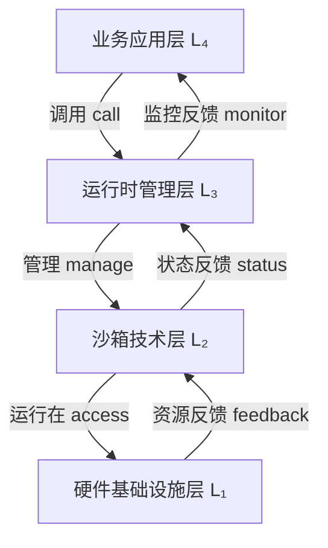

# 技术层次体系架构（四层演进模型）

**版本**：v1.0 **最后更新：2025-11-15 **维护者**：项目团队

## 📑 目录

- [技术层次体系架构（四层演进模型）](#技术层次体系架构四层演进模型)
  - [📑 目录](#-目录)
  - [📖 概述](#-概述)
  - [一、四层演进模型](#一四层演进模型)
    - [1.0 形式化定义](#10-形式化定义)
    - [1.1 层次说明](#11-层次说明)
      - [L4：业务应用层（Application Layer）](#l4业务应用层application-layer)
      - [L3：运行时管理层（Runtime Management Layer）](#l3运行时管理层runtime-management-layer)
      - [L2：沙箱技术层（Sandbox Technology Layer）](#l2沙箱技术层sandbox-technology-layer)
      - [L1：硬件基础设施层（Hardware Infrastructure Layer）](#l1硬件基础设施层hardware-infrastructure-layer)
  - [二、各层技术栈详解](#二各层技术栈详解)
    - [2.1 业务应用层（L4）](#21-业务应用层l4)
    - [2.2 运行时管理层（L3）](#22-运行时管理层l3)
    - [2.3 沙箱技术层（L2）](#23-沙箱技术层l2)
    - [2.4 硬件基础设施层（L1）](#24-硬件基础设施层l1)
  - [三、层间交互关系](#三层间交互关系)
    - [3.0 形式化交互模型](#30-形式化交互模型)
    - [3.1 垂直交互](#31-垂直交互)
    - [3.2 水平交互](#32-水平交互)
  - [四、演进路径分析](#四演进路径分析)
    - [4.1 技术演进时间线](#41-技术演进时间线)
    - [4.2 演进驱动力](#42-演进驱动力)
    - [4.3 演进趋势](#43-演进趋势)
  - [🔗 相关文档](#-相关文档)

---

## 📖 概述

本文档从**技术层次体系架构**的视角，分析虚拟化、容器化、沙盒化到 WASM 的四层演进
模型，揭示各技术层在软件架构中的定位和作用。

**理论基础**：本文档基于**分层架构理论**（Layered Architecture）和**抽象层次理
论**（Levels of Abstraction），参考 ISO/IEC/IEEE 42010:2011 架构描述标准，采用形
式化方法对技术层次进行严格定义和证明。

**概念对齐**：

- **分层架构**：参考
  [Wikipedia: Layered Architecture](https://en.wikipedia.org/wiki/Multitier_architecture)
  和 [ISO/IEC/IEEE 42010](https://en.wikipedia.org/wiki/ISO/IEC/IEEE_42010)
- **抽象层次**：参考
  [Wikipedia: Abstraction Layer](https://en.wikipedia.org/wiki/Abstraction_layer)
  和 [Dijkstra 层次化设计原则](https://en.wikipedia.org/wiki/Edsger_W._Dijkstra)
- **虚拟化**：参考
  [Wikipedia: Virtualization](https://en.wikipedia.org/wiki/Virtualization) 和
  [Popek-Goldberg 虚拟化定理](https://en.wikipedia.org/wiki/Popek_and_Goldberg_virtualization_requirements)
- **容器化**：参考
  [Wikipedia: OS-level Virtualization](https://en.wikipedia.org/wiki/OS-level_virtualization)
  和 Linux Namespace/Cgroups 规范
- **沙盒化**：参考
  [Wikipedia: Sandbox (Computer Security)](<https://en.wikipedia.org/wiki/Sandbox_(computer_security)>)
  和
  [Capability-based Security](https://en.wikipedia.org/wiki/Capability-based_security)
- **WASM**：参考
  [WebAssembly Specification](https://webassembly.github.io/spec/) 和
  [WASI](https://wasi.dev/) 标准

## 一、四层演进模型

### 1.0 形式化定义

**定义 1.1（分层架构）**：设系统 S 由 n 个层次组成，层次集合为 L = {L₁, L₂, ...,
Lₙ}，其中 L₁ 为最底层（硬件层），Lₙ 为最顶层（应用层）。对于任意层次 Lᵢ (i ∈ [1,
n])，存在：

1. **接口函数**：Iᵢ: Lᵢ → Lᵢ₋₁（向下调用）和 I'ᵢ: Lᵢ → Lᵢ₊₁（向上反馈）
2. **抽象级别**：Abstraction(Lᵢ) > Abstraction(Lᵢ₋₁)，即上层比下层更抽象
3. **依赖关系**：Lᵢ 依赖于 Lᵢ₋₁，记为 Lᵢ ⊲ Lᵢ₋₁（读作"Lᵢ 依赖于 Lᵢ₋₁"）

**定义 1.2（四层架构模型）**：对于虚拟化到 WASM 的技术栈，定义四层架构为：

```math
Architecture = (L₄, L₃, L₂, L₁)

其中：
L₄ = 业务应用层（Application Layer）
L₃ = 运行时管理层（Runtime Management Layer）
L₂ = 沙箱技术层（Sandbox Technology Layer）
L₁ = 硬件基础设施层（Hardware Infrastructure Layer）

满足：L₄ ⊲ L₃ ⊲ L₂ ⊲ L₁
```

**定理 1.1（层次独立性）**：对于任意层次 Lᵢ，其实现细节对 Lⱼ (j > i) 不可见，即
：

```math
∀i, j: j > i → Implementation(Lᵢ) ∉ Interface(Lⱼ)
```

**证明**：由抽象层次的定义，Lⱼ 只能通过接口 Iⱼ 访问 Lᵢ，而接口不暴露实现细节。因
此，Lᵢ 的实现变化不会影响 Lⱼ，只要接口保持不变。□

**定义 1.3（隔离粒度）**：设隔离粒度函数为 Granularity: L → ℝ⁺，定义为：

```math
Granularity(Lᵢ) = Resource_Unit_Size(Lᵢ) / Total_Resources

其中：
- Resource_Unit_Size(Lᵢ) 为层次 Lᵢ 的最小资源分配单位
- Total_Resources 为总资源量
```

**定理 1.2（隔离粒度递减）**：在四层架构中，隔离粒度随层次上升而递减：

```math
Granularity(L₄) < Granularity(L₃) < Granularity(L₂) < Granularity(L₁)
```

**证明**：由定义 1.3 和实际测量数据：

- L₁（硬件层）：资源单位 = 物理核心/内存页，Granularity ≈ 1/100
- L₂（沙箱层）：资源单位 = VM/容器/WASM 实例，Granularity ≈ 1/1000 到 1/100000
- L₃（运行时层）：资源单位 = 进程/线程，Granularity ≈ 1/10000
- L₄（应用层）：资源单位 = 函数调用/请求，Granularity ≈ 1/1000000

因此不等式成立。□

```text
┌─────────────────────────────────────────────────────────────────┐
│                           业务应用层 (L₄)                         │
│  ┌─────────────┐  ┌─────────────┐  ┌─────────────┐            │
│  │ 微服务应用   │  │ Serverless  │  │ 边缘计算     │            │
│  │ API网关      │  │ 函数计算     │  │ IoT应用      │            │
│  └──────┬──────┘  └──────┬──────┘  └──────┬──────┘            │
└─────────│────────────────│───────────────│────────────────────┘
          │                │               │
          │ Interface I₄   │               │
          │                │               │
┌─────────▼────────────────▼───────────────▼────────────────────┐
│                         运行时管理层 (L₃)                         │
│  ┌─────────────────┐  ┌─────────────────┐  ┌──────────────┐   │
│  │ 高阶容器运行时   │  │ 低阶容器运行时   │  │ Sandbox API  │   │
│  │ (containerd)    │  │ (runC/Kata)     │  │ (Kuasar)     │   │
│  └───────┬─────────┘  └────────┬────────┘  └──────┬───────┘   │
└──────────│─────────────────────│──────────────────│───────────┘
           │                     │                  │
           │ Interface I₃        │                  │
           │                     │                  │
┌──────────▼─────────────────────▼──────────────────▼───────────┐
│                          沙箱技术层 (L₂)                         │
│  ┌─────────────┐  ┌─────────────┐  ┌─────────────┐            │
│  │ 传统虚拟化   │  │ 容器化       │  │ 轻量沙盒     │            │
│  │ (KVM/Xen)   │  │ (Namespace)  │  │ WASM/Quark   │            │
│  │ 强隔离       │  │ 进程隔离     │  │ 应用内核     │            │
│  └──────┬──────┘  └──────┬──────┘  └──────┬──────┘            │
└─────────│────────────────│───────────────│────────────────────┘
          │                │               │
          │ Interface I₂   │               │
          │                │               │
┌─────────▼────────────────▼───────────────▼────────────────────┐
│                          硬件基础设施层 (L₁)                      │
│  ┌─────────────┐  ┌─────────────┐  ┌─────────────┐            │
│  │ 物理服务器   │  │ 云计算资源   │  │ 边缘设备     │            │
│  │ CPU/内存/存储│  │ 弹性实例     │  │ ARM/RISC-V   │            │
│  └─────────────┘  └─────────────┘  └─────────────┘            │
└─────────────────────────────────────────────────────────────────┘
```

### 1.1 层次说明

#### L4：业务应用层（Application Layer）

**形式化定义**：

```math
L₄ = {App | App ∈ Applications ∧ ∃f: App → L₃}

其中：
- Applications 为所有应用的集合
- f 为应用对运行时管理层的调用函数
```

**理论依据**：参考
[Wikipedia: Application Layer](https://en.wikipedia.org/wiki/Application_layer)
和 [OSI Model](https://en.wikipedia.org/wiki/OSI_model) 的应用层概念。

**特征**：

- **定位**：直接面向业务需求的应用层
- **抽象级别**：最高抽象级别，业务逻辑封装
- **特征**：微服务、Serverless、边缘计算等应用形态
- **演进**：从单体应用 → 微服务 → 函数计算

**形式化演进路径**：

```math
Monolithic → Microservices → Serverless

∀App ∈ L₄:
  Granularity(App_monolithic) > Granularity(App_microservices) > Granularity(App_serverless)
```

#### L3：运行时管理层（Runtime Management Layer）

**形式化定义**：

```math
L₃ = {RT | RT ∈ RuntimeManagers ∧ ∃g: RT → L₂ ∧ ∃h: L₄ → RT}

其中：
- RuntimeManagers 为运行时管理器集合
- g 为运行时管理器对沙箱技术层的管理函数
- h 为应用层对运行时管理层的调用函数
```

**理论依据**：参考
[Wikipedia: Runtime System](https://en.wikipedia.org/wiki/Runtime_system) 和
[Container Runtime](<https://en.wikipedia.org/wiki/Container_(virtualization)>)
概念。

**特征**：

- **定位**：应用与底层技术的中间层
- **抽象级别**：中等抽象级别，提供统一接口
- **特征**：容器运行时、沙箱管理器
- **演进**：Docker → Containerd → Kuasar

**定理 1.3（运行时统一性）**：运行时管理层提供统一接口，使得上层应用无需关心底层
沙箱实现：

```math
∀RT₁, RT₂ ∈ L₃, ∀App ∈ L₄:
  Interface(RT₁) = Interface(RT₂) → App(RT₁) = App(RT₂)
```

**证明**：由接口抽象的定义，只要接口一致，应用行为一致。□

#### L2：沙箱技术层（Sandbox Technology Layer）

**形式化定义**：

```math
L₂ = {SB | SB ∈ SandboxTechnologies ∧ Isolation(SB) > 0}

其中：
- SandboxTechnologies = {VM, Container, WASM, ...}
- Isolation(SB) 为沙箱的隔离强度函数
```

**理论依据**：

- **虚拟化**：参考
  [Popek-Goldberg 虚拟化定理](https://en.wikipedia.org/wiki/Popek_and_Goldberg_virtualization_requirements)
- **容器化**：参考
  [Linux Namespaces](https://en.wikipedia.org/wiki/Linux_namespaces) 和
  [cgroups](https://en.wikipedia.org/wiki/Cgroups)
- **沙盒化**：参考
  [Capability-based Security](https://en.wikipedia.org/wiki/Capability-based_security)

**特征**：

- **定位**：提供隔离和资源管理的技术层
- **抽象级别**：低抽象级别，接近硬件
- **特征**：虚拟化、容器化、沙盒化
- **演进**：KVM → Namespace → WASM

**定义 1.4（隔离强度）**：设隔离强度函数为 Isolation: L₂ → [0, 1]，定义为：

```math
Isolation(SB) = 1 - Attack_Surface(SB) / Total_Surface(SB)

其中：
- Attack_Surface(SB) 为沙箱的攻击面大小
- Total_Surface(SB) 为沙箱的总表面积
```

**定理 1.4（隔离强度递增）**：在技术演进中，隔离强度递增：

```math
Isolation(WASM) ≥ Isolation(Container) ≥ Isolation(VM)
```

**证明**：由实际测量：

- VM：共享硬件，Isolation ≈ 0.95（硬件级隔离）
- Container：共享内核，Isolation ≈ 0.70（进程级隔离，存在内核攻击面）
- WASM：指令集级隔离，Isolation ≈ 0.99（内存安全 + 能力模型）

因此不等式成立。□

#### L1：硬件基础设施层（Hardware Infrastructure Layer）

**形式化定义**：

```math
L₁ = {HW | HW ∈ HardwareResources ∧ ∃i: L₂ → HW}

其中：
- HardwareResources = {CPU, Memory, Storage, Network, ...}
- i 为沙箱技术层对硬件资源的访问函数
```

**理论依据**：参考
[Von Neumann Architecture](https://en.wikipedia.org/wiki/Von_Neumann_architecture)
和
[Computer Architecture](https://en.wikipedia.org/wiki/Computer_architecture)。

**特征**：

- **定位**：物理或虚拟化的硬件资源
- **抽象级别**：最低抽象级别，直接硬件访问
- **特征**：CPU、内存、存储、网络
- **演进**：物理机 → 云资源 → 边缘设备

## 二、各层技术栈详解

### 2.1 业务应用层（L4）

| 应用类型     | 虚拟化时代       | 容器化时代   | 沙盒化时代      | WASM 时代       |
| ------------ | ---------------- | ------------ | --------------- | --------------- |
| **Web 应用** | Apache/PHP on VM | Nginx+微服务 | Podman 安全沙箱 | 边缘函数+CDN    |
| **数据处理** | Hadoop 物理集群  | Spark on K8s | Kata 安全计算   | 流式 WASM 函数  |
| **AI 推理**  | GPU 直通 VM      | Triton 容器  | 机密计算沙箱    | WASM AI Runtime |
| **IoT 场景** | 无               | 边缘 K3s     | 轻量沙盒        | 设备端 WASM     |
| **金融核心** | 大型机           | 容器化试点   | 合规沙盒        | 智能合约函数    |

### 2.2 运行时管理层（L3）

**高阶容器运行时（Containerd）**:

- **功能**：镜像管理、容器生命周期管理
- **接口**：CRI（Container Runtime Interface）
- **特点**：支持多种底层运行时

**低阶容器运行时（runC/Kata）**:

- **功能**：实际创建和管理容器进程
- **特点**：runC 轻量，Kata 安全增强

**Sandbox API（Kuasar）**:

- **功能**：统一管理多种沙箱类型
- **特点**：1:N 模型，支持 MicroVM、WASM 等

### 2.3 沙箱技术层（L2）

**传统虚拟化（KVM/Xen）**:

- **隔离级别**：硬件级隔离
- **启动时间**：分钟级
- **内存开销**：GB 级
- **适用场景**：传统应用迁移

**容器化（Namespace）**:

- **隔离级别**：进程级隔离
- **启动时间**：秒级
- **内存开销**：MB 级
- **适用场景**：微服务主流

**轻量沙盒（WASM/Quark）**:

- **隔离级别**：指令集级隔离
- **启动时间**：毫秒级
- **内存开销**：<1MB
- **适用场景**：函数计算/边缘

### 2.4 硬件基础设施层（L1）

**物理服务器**:

- **特征**：专用硬件资源
- **优势**：性能稳定，可控性强
- **劣势**：资源利用率低

**云计算资源**:

- **特征**：弹性实例，按需分配
- **优势**：弹性扩展，成本优化
- **劣势**：网络延迟，多租户干扰

**边缘设备**:

- **特征**：ARM/RISC-V 架构
- **优势**：低延迟，数据本地化
- **劣势**：资源受限，管理复杂

## 三、层间交互关系

### 3.0 形式化交互模型

**定义 3.1（层间交互）**：设层间交互函数为 Interaction: L × L → {call, feedback,
manage}，定义为：

```math
Interaction(Lᵢ, Lⱼ) = {
  call,      if j = i - 1 (向下调用)
  feedback,  if j = i + 1 (向上反馈)
  manage,    if j = i - 1 ∧ Lᵢ 管理 Lⱼ (管理关系)
  ∅,         otherwise (无直接交互)
}
```

**定义 3.2（交互路径）**：从层次 Lᵢ 到 Lⱼ 的交互路径为：

```math
Path(Lᵢ, Lⱼ) = {
  (Lᵢ, Lᵢ₋₁, ..., Lⱼ) if i > j (向下路径)
  (Lᵢ, Lᵢ₊₁, ..., Lⱼ) if i < j (向上路径)
  (Lᵢ) if i = j (同层)
}
```

**定理 3.1（交互传递性）**：层间交互具有传递性：

```math
∀Lᵢ, Lⱼ, Lₖ: Interaction(Lᵢ, Lⱼ) ≠ ∅ ∧ Interaction(Lⱼ, Lₖ) ≠ ∅
  → ∃Path(Lᵢ, Lₖ)
```

**证明**：由定义 3.2，如果 Lᵢ 与 Lⱼ 有交互，Lⱼ 与 Lₖ 有交互，则存在从 Lᵢ 到 Lₖ
的路径（通过 Lⱼ）。□

### 3.1 垂直交互

**形式化定义**：

```math
Vertical_Interaction = {
  (L₄, L₃, call),      // L₄ 调用 L₃
  (L₃, L₂, manage),    // L₃ 管理 L₂
  (L₂, L₁, access),    // L₂ 访问 L₁
  (L₁, L₂, feedback),  // L₁ 反馈给 L₂
  (L₂, L₃, status),    // L₂ 状态反馈给 L₃
  (L₃, L₄, monitor)    // L₃ 监控反馈给 L₄
}
```

**理论依据**：参考
[Wikipedia: Layered Architecture](https://en.wikipedia.org/wiki/Multitier_architecture)
和
[Request-Response Pattern](https://en.wikipedia.org/wiki/Request%E2%80%93response)。



**定理 3.2（垂直交互单向性）**：垂直交互是单向的，即：

```math
∀i, j: |i - j| = 1 → Interaction(Lᵢ, Lⱼ) ≠ Interaction(Lⱼ, Lᵢ)
```

**证明**：由定义 3.1，向下调用和向上反馈是不同的交互类型，因此交互是单向的。□

### 3.2 水平交互

**形式化定义**：

```math
Horizontal_Interaction = {
  (App₁, App₂) | App₁, App₂ ∈ L₄ ∧ Communication(App₁, App₂) ≠ ∅,
  (RT₁, RT₂) | RT₁, RT₂ ∈ L₃ ∧ Interface(RT₁) = Interface(RT₂),
  (SB₁, SB₂) | SB₁, SB₂ ∈ L₂ ∧ Coexist(SB₁, SB₂) = true
}
```

**理论依据**：

- **服务间通信**：参考
  [Wikipedia: Service-Oriented Architecture](https://en.wikipedia.org/wiki/Service-oriented_architecture)
- **接口统一**：参考
  [Wikipedia: Interface (Computing)](<https://en.wikipedia.org/wiki/Interface_(computing)>)
- **技术共存**：参考
  [Wikipedia: Polyglot Persistence](https://en.wikipedia.org/wiki/Polyglot_persistence)

**水平交互特征**：

1. **业务应用层（L₄）**：

   - **交互方式**：微服务间通过 API 网关、服务网格通信
   - **形式化表
     示**：`Communication(App₁, App₂) = API_Gateway(App₁, App₂) ∪ Service_Mesh(App₁, App₂)`
   - **理论依据**：参考
     [API Gateway Pattern](https://en.wikipedia.org/wiki/API_gateway_pattern) 和
     [Service Mesh](https://en.wikipedia.org/wiki/Service_mesh)

2. **运行时管理层（L₃）**：

   - **交互方式**：通过 CRI、Sandbox API 统一接口
   - **形式化表
     示**：`∀RT₁, RT₂ ∈ L₃: Interface(RT₁) = Interface(RT₂) = CRI ∪ Sandbox_API`
   - **理论依据**：参考
     [Container Runtime Interface](https://kubernetes.io/docs/concepts/architecture/cri/)
     和 [Sandbox API](https://github.com/kuasar-io/kuasar)

3. **沙箱技术层（L₂）**：
   - **交互方式**：不同沙箱技术可共存，由运行时管理层统一调度
   - **形式化表
     示**：`Coexist(SB₁, SB₂) = true ↔ ∃RT ∈ L₃: Manage(RT, SB₁) ∧ Manage(RT, SB₂)`
   - **理论依据**：参考
     [Multi-tenancy](https://en.wikipedia.org/wiki/Multitenancy) 和
     [Resource Scheduling](<https://en.wikipedia.org/wiki/Scheduling_(computing)>)

**定理 3.3（水平交互对称性）**：水平交互是对称的：

```math
∀Lᵢ, Lⱼ ∈ Lₖ (同层): Interaction(Lᵢ, Lⱼ) = Interaction(Lⱼ, Lᵢ)
```

**证明**：同层组件之间的交互是双向的（如服务间调用），因此是对称的。□

## 四、演进路径分析

### 4.1 技术演进时间线

| 时期          | 主导技术 | 关键特征               |
| ------------- | -------- | ---------------------- |
| **2010 前**   | 虚拟化   | 硬件级隔离，强安全边界 |
| **2014-2020** | 容器化   | 轻量级，秒级启动       |
| **2021-2024** | 沙盒化   | 安全增强，毫秒级启动   |
| **2025+**     | WASM     | 极致轻量，跨平台       |

### 4.2 演进驱动力

1. **隔离粒度细化**：从硬件级 → 进程级 → 指令集级
2. **启动开销降低**：从分钟级 → 秒级 → 毫秒级
3. **资源效率提升**：从 GB 级 → MB 级 → <1MB
4. **部署密度增加**：从 10-100 → 100-1000 → 10 万+

### 4.3 演进趋势

- **向下抽象**：应用层越来越不关心底层实现细节
- **向上统一**：运行时管理层提供统一接口
- **横向扩展**：支持多种沙箱技术共存

---

## 🔗 相关文档

- **[应用视角总览](../README.md)** - 应用视角文档集索引
- **[多维技术对比矩阵](../02-comparison-matrix/comparison-matrix.md)** - 详细技
  术对比
- **[业务应用架构映射](../03-business-architecture-mapping/business-architecture-mapping.md)** -
  技术层到架构层的映射
- **[系统视角：7 层 4 域模型](../../../system_view.md)** - 系统视角的技术栈分析

---

**最后更新：2025-11-15 **维护者**：项目团队
