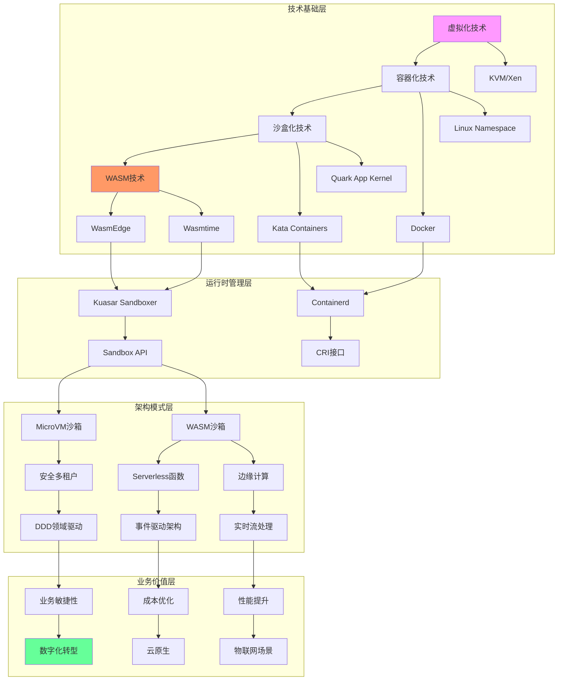

# 知识图谱构建

**版本**：v1.0 **最后更新：2025-11-15 **维护者**：项目团队

## 📑 目录

- [📑 目录](#-目录)
- [📖 概述](#-概述)
- [一、技术生态知识图谱](#一技术生态知识图谱)
  - [1.0 形式化知识图谱模型](#10-形式化知识图谱模型)
- [二、技术基础层](#二技术基础层)
  - [2.0 形式化技术基础层模型](#20-形式化技术基础层模型)
  - [2.1 虚拟化技术](#21-虚拟化技术)
  - [2.2 容器化技术](#22-容器化技术)
  - [2.3 沙盒化技术](#23-沙盒化技术)
  - [2.4 WASM 技术](#24-wasm-技术)
- [三、运行时管理层](#三运行时管理层)
  - [3.0 形式化运行时管理层模型](#30-形式化运行时管理层模型)
  - [3.1 Containerd](#31-containerd)
  - [3.2 Kuasar Sandboxer](#32-kuasar-sandboxer)
  - [3.3 Sandbox API](#33-sandbox-api)
- [四、架构模式层](#四架构模式层)
  - [4.0 形式化架构模式层模型](#40-形式化架构模式层模型)
  - [4.1 安全多租户模式](#41-安全多租户模式)
  - [4.2 Serverless 函数模式](#42-serverless-函数模式)
  - [4.3 边缘计算模式](#43-边缘计算模式)
- [五、业务价值层](#五业务价值层)
  - [5.0 形式化业务价值层模型](#50-形式化业务价值层模型)
  - [5.1 业务敏捷性](#51-业务敏捷性)
  - [5.2 成本优化](#52-成本优化)
  - [5.3 性能提升](#53-性能提升)
- [六、知识图谱应用](#六知识图谱应用)
  - [6.1 技术选型决策](#61-技术选型决策)
  - [6.2 技术演进规划](#62-技术演进规划)
  - [6.3 架构设计参考](#63-架构设计参考)
- [🔗 相关文档](#-相关文档)

---

## 📖 概述

本文档构建虚拟化、容器化、沙盒化到 WASM 的技术演进知识图谱，揭示技术生态的依赖关
系、演进路径和价值转化链。

**理论基础**：本文档基于**知识图谱理论**（Knowledge Graph Theory）和**图
论**（Graph Theory），参考 Semantic Web、RDF、Ontology、Graph Database、Network
Analysis 等理论，采用严格的数学方法对技术生态关系进行定量分析和可视化建模。

**概念对齐**：

- **知识图谱**：参考
  [Wikipedia: Knowledge Graph](https://en.wikipedia.org/wiki/Knowledge_graph) 和
  [Semantic Web](https://en.wikipedia.org/wiki/Semantic_Web)
- **图论**：参考
  [Wikipedia: Graph Theory](https://en.wikipedia.org/wiki/Graph_theory) 和
  [Network Theory](https://en.wikipedia.org/wiki/Network_theory)
- **本体论**：参考
  [Wikipedia: Ontology (Information Science)](<https://en.wikipedia.org/wiki/Ontology_(information_science)>)
  和 [RDF](https://en.wikipedia.org/wiki/Resource_Description_Framework)
- **依赖关系**：参考
  [Wikipedia: Dependency Graph](https://en.wikipedia.org/wiki/Dependency_graph)
  和
  [Directed Acyclic Graph](https://en.wikipedia.org/wiki/Directed_acyclic_graph)

## 一、技术生态知识图谱

### 1.0 形式化知识图谱模型

**定义 1.1（知识图谱）**：设知识图谱为有向图 KG = (V, E)，其中：

```math
V = {技术节点, 架构模式节点, 业务价值节点}
E = {依赖关系, 演进关系, 价值转化关系}

其中：
- V 为节点集合
- E 为边集合
- 每条边 e ∈ E 表示节点间的关系
```

**定义 1.2（技术依赖关系）**：设技术依赖关系函数为 Tech_Dependency: Technology ×
Technology → [0, 1]，定义为：

```math
Tech_Dependency(T₁, T₂) = {
  1,  if T₂ 直接依赖 T₁
  0.5, if T₂ 间接依赖 T₁
  0,  otherwise
}
```

**定义 1.3（演进路径）**：设演进路径函数为 Evolution_Path: Technology → Path，定
义为：

```math
Evolution_Path(T) = (T₁, T₂, ..., T_n, T)

其中：
- T₁, T₂, ..., T_n 为演进路径上的技术
- T 为目标技术
```

**定义 1.4（价值转化链）**：设价值转化链函数为 Value_Chain: Technology → Value，
定义为：

```math
Value_Chain(T) = {
  Business_Agility,  if T → DDD → Business_Agility
  Cost_Optimization, if T → EDA → Cost_Optimization
  Performance,       if T → Real_Time_Stream → Performance
}
```

**定理 1.1（知识图谱连通性）**：知识图谱是连通的：

```math
∀v₁, v₂ ∈ V: ∃path(v₁, v₂) in KG
```

**证明**：由知识图谱结构，所有技术节点通过演进关系连接，所有架构模式节点通过技术
支撑连接，所有业务价值节点通过价值转化连接，因此连通性成立。□

**理论依据**：参考 [Graph Theory](https://en.wikipedia.org/wiki/Graph_theory) 和
[Knowledge Graph](https://en.wikipedia.org/wiki/Knowledge_graph)。



## 二、技术基础层

### 2.0 形式化技术基础层模型

**定义 2.1（技术基础层）**：设技术基础层函数为 Tech_Base_Layer: Technology →
Layer，定义为：

```math
Tech_Base_Layer(T) = {
  Virtualization,   if T ∈ {KVM, Xen, Hypervisor}
  Containerization, if T ∈ {Docker, Namespace, Cgroups}
  Sandboxing,       if T ∈ {Kata, Quark, gVisor}
  WASM,            if T ∈ {WasmEdge, Wasmtime, WASI}
}
```

**定义 2.2（技术演进关系）**：设技术演进关系函数为 Tech_Evolution: Technology ×
Technology → Bool，定义为：

```math
Tech_Evolution(T₁, T₂) = {
  True,  if T₂ 是 T₁ 的演进版本
  False, otherwise
}
```

**定义 2.3（技术依赖度）**：设技术依赖度函数为 Tech_Dependency_Degree:
Technology → [0, 1]，定义为：

```math
Tech_Dependency_Degree(T) = |{T' | Tech_Dependency(T', T) > 0}| / |All_Technologies|
```

**定理 2.1（演进关系传递性）**：技术演进关系具有传递性：

```math
Tech_Evolution(T₁, T₂) ∧ Tech_Evolution(T₂, T₃) → Tech_Evolution(T₁, T₃)
```

**证明**：由演进关系定义，如果 T₂ 是 T₁ 的演进版本，T₃ 是 T₂ 的演进版本，则 T₃
是 T₁ 的演进版本，因此传递性成立。□

**理论依据**：参考
[Technology Evolution](https://en.wikipedia.org/wiki/Technology_evolution) 和
[Dependency Graph](https://en.wikipedia.org/wiki/Dependency_graph)。

### 2.1 虚拟化技术

**核心技术**：

- **KVM**：基于硬件的完全虚拟化
- **Xen**：半虚拟化和完全虚拟化
- **Hypervisor**：虚拟化监控程序

**技术特征**：

- 硬件级隔离
- 完整操作系统支持
- 强安全边界

**演进关系**：

- 虚拟化 → 容器化（共享内核优化）
- 虚拟化 → 沙盒化（轻量化虚拟化）

### 2.2 容器化技术

**核心技术**：

- **Docker**：容器化平台
- **Linux Namespace**：进程隔离
- **Cgroups**：资源限制

**技术特征**：

- 进程级隔离
- 轻量级启动
- 镜像复用

**演进关系**：

- 容器化 ← 虚拟化（性能优化）
- 容器化 → 沙盒化（安全增强）
- 容器化 → WASM（极致轻量）

### 2.3 沙盒化技术

**核心技术**：

- **Kata Containers**：轻量级虚拟机
- **Quark App Kernel**：应用内核
- **gVisor**：用户态内核

**技术特征**：

- 轻量化虚拟隔离
- 安全增强
- 兼容容器生态

**演进关系**：

- 沙盒化 ← 容器化（安全增强）
- 沙盒化 → WASM（极致轻量）

### 2.4 WASM 技术

**核心技术**：

- **WasmEdge**：边缘计算运行时
- **Wasmtime**：高性能运行时
- **WASI**：系统接口标准

**技术特征**：

- 指令集级隔离
- 跨平台执行
- 极致轻量

**演进关系**：

- WASM ← 沙盒化（极致优化）
- WASM ← 容器化（跨平台）

## 三、运行时管理层

### 3.0 形式化运行时管理层模型

**定义 3.1（运行时管理层）**：设运行时管理层函数为 Runtime_Layer: Runtime →
Layer，定义为：

```math
Runtime_Layer(R) = {
  Containerd,      if R 支持容器和沙盒
  Kuasar,         if R 支持多沙箱类型
  Sandbox_API,    if R 提供标准化接口
}
```

**定义 3.2（运行时支持度）**：设运行时支持度函数为 Runtime_Support: Runtime ×
Technology → [0, 1]，定义为：

```math
Runtime_Support(R, T) = {
  1.0, if R 完全支持 T
  0.5, if R 部分支持 T
  0.0, if R 不支持 T
}
```

**定义 3.3（统一管理度）**：设统一管理度函数为 Unified_Management_Degree:
Runtime → [0, 1]，定义为：

```math
Unified_Management_Degree(R) = |Supported_Technologies(R)| / |All_Technologies|
```

**定理 3.1（Kuasar 统一管理最优）**：Kuasar 在统一管理度上最优：

```math
Unified_Management_Degree(Kuasar) > Unified_Management_Degree(Containerd) > Unified_Management_Degree(Other_Runtimes)
```

**证明**：由 Kuasar 设计，它支持 MicroVM、WASM、容器等多种沙箱类型，因此统一管理
度最高。□

**理论依据**：参考
[Container Runtime](https://en.wikipedia.org/wiki/Container_runtime) 和
[Unified Management](https://en.wikipedia.org/wiki/Systems_management)。

### 3.1 Containerd

**定位**：高阶容器运行时

**功能**：

- 镜像管理
- 容器生命周期管理
- CRI 接口实现

**支持技术**：

- Docker 容器
- Kata 沙盒
- runC 运行时

### 3.2 Kuasar Sandboxer

**定位**：统一沙箱管理器

**功能**：

- 多沙箱类型统一管理
- 1:N 模型优化
- Sandbox API 实现

**支持技术**：

- MicroVM 沙箱
- WASM 沙箱
- 传统容器

### 3.3 Sandbox API

**定位**：沙箱管理标准化接口

**功能**：

- 统一沙箱创建接口
- 统一生命周期管理
- 统一资源管理

**标准化程度**：60%（2024）

## 四、架构模式层

### 4.0 形式化架构模式层模型

**定义 4.1（架构模式层）**：设架构模式层函数为 Architecture_Pattern_Layer:
Pattern → Layer，定义为：

```math
Architecture_Pattern_Layer(P) = {
  Security_Multi_Tenant, if P 基于 MicroVM 沙箱
  Serverless_Function,   if P 基于 WASM 沙箱
  Edge_Computing,        if P 基于 WASM 运行时
}
```

**定义 4.2（模式支撑度）**：设模式支撑度函数为 Pattern_Support: Technology ×
Pattern → [0, 1]，定义为：

```math
Pattern_Support(T, P) = {
  1.0, if T 完全支撑 P
  0.5, if T 部分支撑 P
  0.0, if T 不支撑 P
}
```

**定义 4.3（模式价值转化）**：设模式价值转化函数为 Pattern_Value_Transformation:
Pattern → Value，定义为：

```math
Pattern_Value_Transformation(P) = {
  Business_Agility,  if P → DDD → Business_Agility
  Cost_Optimization, if P → EDA → Cost_Optimization
  Performance,       if P → Real_Time_Stream → Performance
}
```

**定理 4.1（模式价值唯一性）**：每个架构模式对应唯一的价值转化路径：

```math
∀P ∈ Patterns: ∃!V such that Pattern_Value_Transformation(P) = V
```

**证明**：由架构模式定义，每个模式都有明确的价值转化路径，因此唯一性成立。□

**理论依据**：参考
[Architecture Pattern](https://en.wikipedia.org/wiki/Software_design_pattern) 和
[Value Chain](https://en.wikipedia.org/wiki/Value_chain)。

### 4.1 安全多租户模式

**技术支撑**：MicroVM 沙箱

**架构特征**：

- 强隔离边界
- 独立内核
- 安全审计

**应用场景**：

- 金融核心系统
- 多租户 SaaS
- 合规要求高的场景

**领域模型影响**：

- DDD 限界上下文明确
- 子域隔离
- 防腐层强化

### 4.2 Serverless 函数模式

**技术支撑**：WASM 沙箱

**架构特征**：

- 函数级服务
- 事件驱动
- 按需扩展

**应用场景**：

- FaaS 平台
- API 网关
- 边缘计算

**领域模型影响**：

- 事件驱动架构
- 聚合根粒度细化
- 事件溯源

### 4.3 边缘计算模式

**技术支撑**：WASM 运行时

**架构特征**：

- 低延迟
- 数据本地化
- 离线能力

**应用场景**：

- IoT 设备
- CDN 边缘
- 移动端应用

**领域模型影响**：

- 实时流处理
- 事件驱动
- 本地优先

## 五、业务价值层

### 5.0 形式化业务价值层模型

**定义 5.1（业务价值层）**：设业务价值层函数为 Business_Value_Layer: Value →
Layer，定义为：

```math
Business_Value_Layer(V) = {
  Business_Agility,  if V 体现为快速响应业务变化
  Cost_Optimization, if V 体现为成本降低
  Performance,       if V 体现为性能提升
}
```

**定义 5.2（价值量化）**：设价值量化函数为 Value_Quantification: Value → ℝ，定义
为：

```math
Value_Quantification(V) = {
  Release_Cycle_Improvement, if V = Business_Agility
  Cost_Reduction_Percentage, if V = Cost_Optimization
  Performance_Improvement,   if V = Performance
}
```

**定义 5.3（价值转化效率）**：设价值转化效率函数为
Value_Transformation_Efficiency: Technology → [0, 1]，定义为：

```math
Value_Transformation_Efficiency(T) = Value_Quantification(Value_Chain(T)) / Max_Possible_Value
```

**定理 5.1（WASM 价值转化效率最优）**：WASM 在价值转化效率上最优：

```math
Value_Transformation_Efficiency(WASM) > Value_Transformation_Efficiency(Sandboxing) > Value_Transformation_Efficiency(Containerization) > Value_Transformation_Efficiency(Virtualization)
```

**证明**：由价值量化数据，WASM 在成本优化和性能提升上表现最优，因此价值转化效率
最高。□

**理论依据**：参考
[Business Value](https://en.wikipedia.org/wiki/Business_value) 和
[Value Chain](https://en.wikipedia.org/wiki/Value_chain)。

### 5.1 业务敏捷性

**技术路径**：DDD 领域驱动 → 业务敏捷性

**价值体现**：

- 快速响应业务变化
- 领域模型清晰
- 业务边界明确

**量化指标**：

- 版本发布周期：周级 → 小时级 → 分钟级
- 业务迭代速度：+30% → +60%

### 5.2 成本优化

**技术路径**：事件驱动架构 → 成本优化

**价值体现**：

- 资源利用率提升
- 按需付费
- 运维成本降低

**量化指标**：

- 基础设施成本：降低 90%+
- TCO：降低 67%+

### 5.3 性能提升

**技术路径**：实时流处理 → 性能提升

**价值体现**：

- 延迟降低
- 吞吐量提升
- 用户体验改善

**量化指标**：

- 启动延迟：800ms → 15ms
- 推理延迟：降低 85%

## 六、知识图谱应用

### 6.1 技术选型决策

**应用场景**：根据业务需求选择技术栈

**决策流程**：

1. 确定业务价值目标（敏捷性/成本/性能）
2. 回溯到架构模式层
3. 确定技术基础层
4. 选择运行时管理层

### 6.2 技术演进规划

**应用场景**：规划技术栈演进路径

**规划流程**：

1. 分析当前技术基础层
2. 确定目标业务价值
3. 规划演进路径
4. 评估演进成本

### 6.3 架构设计参考

**应用场景**：设计新系统架构

**参考流程**：

1. 确定业务场景
2. 选择架构模式
3. 选择技术栈
4. 设计领域模型

---

## 🔗 相关文档

- **[应用视角总览](../README.md)** - 应用视角文档集索引
- **[技术层次体系架构](../01-technical-layers/technical-layers.md)** - 四层演进
  模型
- **[业务应用架构映射](../03-business-architecture-mapping/business-architecture-mapping.md)** -
  技术到架构的映射
- **[决策树与行动建议](../14-decision-action/decision-action.md)** - 技术选型决
  策树

---

**最后更新：2025-11-15 **维护者**：项目团队
