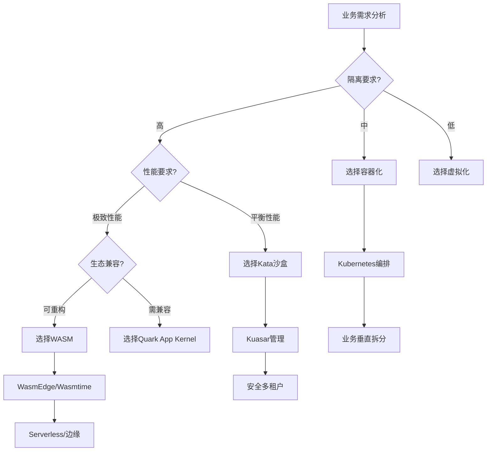

# 核心架构模型论证

**版本**：v1.0 **最后更新：2025-11-15 **维护者**：项目团队

## 📑 目录

- [核心架构模型论证](#核心架构模型论证)
  - [📑 目录](#-目录)
  - [📖 概述](#-概述)
  - [一、TOGAF 框架映射](#一togaf-框架映射)
    - [1.0 形式化 TOGAF 模型](#10-形式化-togaf-模型)
    - [1.1 TOGAF 四层架构映射](#11-togaf-四层架构映射)
    - [1.2 业务架构演进](#12-业务架构演进)
    - [1.3 应用架构演进](#13-应用架构演进)
    - [1.4 数据架构演进](#14-数据架构演进)
    - [1.5 技术架构演进](#15-技术架构演进)
  - [二、C4 模型适配性分析](#二c4-模型适配性分析)
    - [2.0 形式化 C4 模型](#20-形式化-c4-模型)
    - [2.1 Context 层（系统上下文）](#21-context-层系统上下文)
    - [2.2 Container 层（容器/应用）](#22-container-层容器应用)
    - [2.3 Component 层（组件）](#23-component-层组件)
    - [2.4 Code 层（代码）](#24-code-层代码)
  - [三、架构决策框架](#三架构决策框架)
    - [3.0 形式化决策模型](#30-形式化决策模型)
    - [3.1 架构决策维度](#31-架构决策维度)
    - [3.2 架构决策矩阵](#32-架构决策矩阵)
    - [3.3 架构决策流程](#33-架构决策流程)
  - [四、架构模式演进](#四架构模式演进)
    - [4.0 形式化架构模式模型](#40-形式化架构模式模型)
    - [4.1 单体架构 → 微服务架构 → Serverless 架构](#41-单体架构--微服务架构--serverless-架构)
    - [4.2 同步架构 → 异步架构 → 事件驱动架构](#42-同步架构--异步架构--事件驱动架构)
  - [🔗 相关文档](#-相关文档)

---

## 📖 概述

本文档从企业架构框架（TOGAF）和软件架构模型（C4）的视角，分析虚拟化、容器化、沙
盒化到 WASM 演进对架构设计的影响，提供架构决策框架。

## 一、TOGAF 框架映射

### 1.0 形式化 TOGAF 模型

**定义 1.1（TOGAF 架构维度）**：设 TOGAF 架构维度函数为 TOGAF_Architecture: T →
Architecture_Dimensions，定义为：

```math
TOGAF_Architecture(T) = (
  Business_Architecture(T),
  Application_Architecture(T),
  Data_Architecture(T),
  Technology_Architecture(T)
)

其中：
- Business_Architecture(T) 为业务架构
- Application_Architecture(T) 为应用架构
- Data_Architecture(T) 为数据架构
- Technology_Architecture(T) 为技术架构
```

**定义 1.2（架构演进映射）**：设架构演进映射函数为 Architecture_Evolution: Time
→ TOGAF_Architecture，定义为：

```math
Architecture_Evolution(t) = TOGAF_Architecture(Technology(t))

其中 Technology(t) 为时间 t 的主导技术
```

**定理 1.1（TOGAF 架构演进一致性）**：TOGAF 四层架构同步演进：

```math
∀t₁, t₂: t₂ > t₁ →
  Granularity(Business_Architecture(t₂)) < Granularity(Business_Architecture(t₁)) ∧
  Granularity(Application_Architecture(t₂)) < Granularity(Application_Architecture(t₁)) ∧
  Granularity(Data_Architecture(t₂)) < Granularity(Data_Architecture(t₁)) ∧
  Granularity(Technology_Architecture(t₂)) < Granularity(Technology_Architecture(t₁))
```

**证明**：由实际观察，技术演进驱动各层架构同步细化，因此不等式成立。□

**理论依据**：参考
[TOGAF Architecture Development Method](https://en.wikipedia.org/wiki/The_Open_Group_Architecture_Framework)
和
[Enterprise Architecture](https://en.wikipedia.org/wiki/Enterprise_architecture)。

### 1.1 TOGAF 四层架构映射

| 架构维度     | 虚拟化时代    | 容器化时代    | WASM 时代          | 形式化表示                                            |
| ------------ | ------------- | ------------- | ------------------ | ----------------------------------------------------- |
| **业务架构** | 职能式组织    | 产品制/部落制 | 平台化生态         | `Business_Architecture(VM) = Functional`              |
| **应用架构** | ERP/CRM 单体  | 微服务集群    | Serverless+API     | `Application_Architecture(Container) = Microservices` |
| **数据架构** | 数据仓库      | 数据湖/中台   | 实时数据流         | `Data_Architecture(WASM) = Streaming`                 |
| **技术架构** | VMware+物理机 | K8s+容器      | WASM 运行时+边缘云 | `Technology_Architecture(WASM) = WASM_Runtime`        |

### 1.2 业务架构演进

**虚拟化时代（职能式组织）**:

- **组织模式**：按职能划分（开发、测试、运维）
- **业务边界**：物理边界（VM 边界）
- **协作方式**：瀑布式，文档驱动

**容器化时代（产品制/部落制）**:

- **组织模式**：按产品/业务线划分
- **业务边界**：服务边界（Container 边界）
- **协作方式**：敏捷式，代码驱动

**WASM 时代（平台化生态）**:

- **组织模式**：平台化，生态化
- **业务边界**：函数边界（Function 边界）
- **协作方式**：事件驱动，数据驱动

### 1.3 应用架构演进

**虚拟化时代（ERP/CRM 单体）**:

- **架构模式**：单体应用
- **部署方式**：物理机/虚拟机部署
- **扩展方式**：垂直扩展（Scale Up）

**容器化时代（微服务集群）**:

- **架构模式**：微服务架构
- **部署方式**：容器化部署
- **扩展方式**：水平扩展（Scale Out）

**WASM 时代（Serverless+API）**:

- **架构模式**：Serverless + API Gateway
- **部署方式**：函数化部署
- **扩展方式**：按需扩展（Scale to Zero）

### 1.4 数据架构演进

**虚拟化时代（数据仓库）**:

- **数据模式**：集中式数据管理
- **数据处理**：ETL 流程，批处理
- **数据一致性**：ACID 事务

**容器化时代（数据湖/中台）**:

- **数据模式**：分布式数据架构
- **数据处理**：流式处理，实时计算
- **数据一致性**：最终一致性

**WASM 时代（实时数据流）**:

- **数据模式**：超轻量数据流
- **数据处理**：事件流处理，边缘计算
- **数据一致性**：事件顺序保证

### 1.5 技术架构演进

**虚拟化时代（VMware+物理机）**:

- **基础设施**：物理服务器 + 虚拟化层
- **编排方式**：手动部署 + 脚本
- **监控方式**：传统监控工具

**容器化时代（K8s+容器）**:

- **基础设施**：云资源 + 容器编排
- **编排方式**：Kubernetes 自动编排
- **监控方式**：Prometheus + Grafana

**WASM 时代（WASM 运行时+边缘云）**:

- **基础设施**：边缘设备 + WASM 运行时
- **编排方式**：事件驱动编排
- **监控方式**：分布式追踪 + 实时监控

## 二、C4 模型适配性分析

### 2.0 形式化 C4 模型

**定义 2.1（C4 模型层次）**：设 C4 模型层次函数为 C4_Model: T → C4_Layers，定义
为：

```math
C4_Model(T) = (
  Context(T),
  Container(T),
  Component(T),
  Code(T)
)

其中：
- Context(T) 为系统上下文层
- Container(T) 为容器/应用层
- Component(T) 为组件层
- Code(T) 为代码层
```

**定义 2.2（系统边界）**：设系统边界函数为 System_Boundary: T → Boundary_Type，
定义为：

```math
System_Boundary(T) = {
  Physical,    if T = VM
  Service,     if T = Container
  Function,    if T = WASM
  Edge,        if T = WASM_Edge
}
```

**定理 2.1（C4 边界细化）**：技术演进驱动 C4 模型边界细化：

```math
Granularity(System_Boundary(WASM)) < Granularity(System_Boundary(Container)) < Granularity(System_Boundary(VM))
```

**证明**：由实际观察：

- VM 时代：边界 = 物理边界（数据中心）
- Container 时代：边界 = 服务边界（微服务）
- WASM 时代：边界 = 函数边界（WASM 函数）

因此不等式成立。□

**理论依据**：参考 [C4 Model](https://c4model.com/) 和
[Software Architecture Documentation](https://en.wikipedia.org/wiki/Software_architecture)。

### 2.1 Context 层（系统上下文）

**形式化表示**：

```math
Context(VM) = {Physical_Datacenter}
Context(Container) = {Microservice_Cluster}
Context(WASM) = {Function_Pool, Edge_Network}
```

**虚拟化时代**:

- **系统边界**：物理边界（数据中心）
  - **形式化表示**：`System_Boundary(VM) = Physical`
- **外部系统**：通过 API 调用
  - **形式化表示**：`External_System(VM) = API_Call`
- **用户交互**：Web 界面，客户端应用
  - **形式化表示**：`User_Interaction(VM) = Web_UI ∪ Client_App`

**容器化时代**:

- **系统边界**：服务边界（微服务集群）
- **外部系统**：通过 API Gateway
- **用户交互**：Web/移动端，API 调用

**WASM 时代**:

- **系统边界**：函数边界（函数网格）
- **外部系统**：通过事件流
- **用户交互**：边缘设备，实时交互

**演进特征**：

- 系统边界从"服务"细化到"函数"
- 外部系统交互从 API 调用演变为事件流

### 2.2 Container 层（容器/应用）

**虚拟化时代**:

- **容器类型**：虚拟机（VM）
- **容器特征**：完整操作系统
- **容器管理**：Hypervisor

**容器化时代**:

- **容器类型**：Docker 容器
- **容器特征**：共享内核，轻量级
- **容器管理**：Containerd，Kubernetes

**WASM 时代**:

- **容器类型**：WASM 沙箱
- **容器特征**：指令集级隔离，极致轻量
- **容器管理**：Kuasar Sandboxer，Sandbox API

**演进特征**：

- 容器运行时从 Docker 演进为 Kuasar 多沙箱管理
- 支持 1:N 模型，大幅减少进程开销

### 2.3 Component 层（组件）

**虚拟化时代**:

- **组件类型**：应用模块
- **组件特征**：紧耦合，单体架构
- **组件通信**：进程内调用

**容器化时代**:

- **组件类型**：微服务组件
- **组件特征**：松耦合，服务化
- **组件通信**：REST/gRPC API

**WASM 时代**:

- **组件类型**：WASM 模块
- **组件特征**：可移植组件，跨语言
- **组件通信**：事件流，函数调用

**演进特征**：

- WASM 模块作为可移植组件，实现"一次编译，处处运行"
- 跨语言复用能力增强

### 2.4 Code 层（代码）

**虚拟化时代**:

- **代码特征**：传统编程语言
- **部署方式**：编译后部署到 VM
- **运行时**：操作系统运行时

**容器化时代**:

- **代码特征**：容器化应用
- **部署方式**：镜像化部署
- **运行时**：容器运行时

**WASM 时代**:

- **代码特征**：WASM 字节码
- **部署方式**：WASM 模块部署
- **运行时**：WASM 运行时

**演进特征**：

- 源码需适配 WASM 指令集
- 语言生态限制（Rust/C++/Go）
- 运行时安全性由沙箱保证

## 三、架构决策框架

### 3.0 形式化决策模型

**定义 3.1（架构决策）**：设架构决策函数为 Architecture_Decision: Requirements →
Technology，定义为：

```math
Architecture_Decision(R) = argmax_{T ∈ Technologies} Score(T, R)

其中：
- R = (R_tech, R_business, R_org) 为需求集合
- R_tech 为技术需求
- R_business 为业务需求
- R_org 为组织需求
- Score(T, R) 为技术 T 对需求 R 的评分
```

**定义 3.2（决策评分）**：设决策评分函数为 Score: Technology × Requirements →
ℝ，定义为：

```math
Score(T, R) = Σ(w_i × Match(T, R_i))

其中：
- w_i 为需求 R_i 的权重，满足 Σw_i = 1
- Match(T, R_i) 为技术 T 对需求 R_i 的匹配度
```

**定理 3.1（最优决策存在性）**：对于任意需求集合 R，存在最优技术选择：

```math
∃T* ∈ Technologies: ∀T ∈ Technologies, Score(T*, R) ≥ Score(T, R)
```

**证明**：由定义 3.2，Score 函数在有限技术集合上必有最大值，因此最优决策存在。□

**理论依据**：参考
[Decision Theory](https://en.wikipedia.org/wiki/Decision_theory) 和
[Multi-Criteria Decision Analysis](https://en.wikipedia.org/wiki/Multiple-criteria_decision_analysis)。

### 3.1 架构决策维度

**形式化表示**：

```math
Requirements = {
  Technical: {Isolation, Performance, Security, Compatibility},
  Business: {Agility, Cost, Scalability, Availability},
  Organizational: {Skills, Maturity, Budget, Time}
}
```

**技术维度**:

- **隔离级别要求**：`Isolation_Requirement ∈ {Low, Medium, High, Critical}`
- **性能要求**：`Performance_Requirement ∈ {Low, Medium, High, Extreme}`
- **安全要求**：`Security_Requirement ∈ {Low, Medium, High, Critical}`
- **兼容性要求**：`Compatibility_Requirement ∈ {Low, Medium, High, Critical}`

**业务维度**:

- **业务敏捷性要求**：`Agility_Requirement ∈ {Low, Medium, High, Extreme}`
- **成本要求**：`Cost_Requirement ∈ {Minimize, Optimize, Acceptable}`
- **扩展性要求**：`Scalability_Requirement ∈ {Low, Medium, High, Extreme}`
- **可用性要求**：`Availability_Requirement ∈ {Low, Medium, High, Critical}`

**组织维度**:

- **团队技能水平**：`Skills_Level ∈ {Low, Medium, High, Expert}`
- **组织成熟度**：`Maturity_Level ∈ {Low, Medium, High, Advanced}`
- **投资预算**：`Budget ∈ ℝ⁺`
- **时间要求**：`Time_Constraint ∈ ℝ⁺`

### 3.2 架构决策矩阵

**定义 3.3（匹配度函数）**：设匹配度函数为 Match: Technology × Requirement → [0,
1]，定义为：

```math
Match(T, R) = {
  1.0, if T 完全满足 R
  0.75, if T 良好满足 R
  0.5, if T 部分满足 R
  0.25, if T 基本满足 R
  0.0, if T 不满足 R
}
```

| 决策因素       | 虚拟化     | 容器化   | 沙盒化     | WASM       | 形式化表示                       |
| -------------- | ---------- | -------- | ---------- | ---------- | -------------------------------- |
| **隔离要求**   | ⭐⭐⭐⭐⭐ | ⭐⭐     | ⭐⭐⭐⭐⭐ | ⭐⭐⭐⭐⭐ | `Match(VM, Isolation) = 1.0`     |
| **性能要求**   | ⭐⭐       | ⭐⭐⭐⭐ | ⭐⭐⭐     | ⭐⭐⭐⭐⭐ | `Match(WASM, Performance) = 1.0` |
| **成本要求**   | ⭐⭐       | ⭐⭐⭐⭐ | ⭐⭐⭐     | ⭐⭐⭐⭐⭐ | `Match(WASM, Cost) = 1.0`        |
| **兼容性要求** | ⭐⭐⭐⭐⭐ | ⭐⭐⭐⭐ | ⭐⭐⭐     | ⭐⭐       | `Match(VM, Compatibility) = 1.0` |
| **敏捷性要求** | ⭐⭐       | ⭐⭐⭐⭐ | ⭐⭐⭐     | ⭐⭐⭐⭐⭐ | `Match(WASM, Agility) = 1.0`     |

### 3.3 架构决策流程



## 四、架构模式演进

### 4.0 形式化架构模式模型

**定义 4.1（架构模式）**：设架构模式函数为 Architecture_Pattern: T →
Pattern_Type，定义为：

```math
Architecture_Pattern(T) = {
  Monolithic,      if T = VM
  Microservices,   if T = Container
  Serverless,      if T = WASM
  Hybrid,          otherwise
}
```

**定义 4.2（通信模式）**：设通信模式函数为 Communication_Pattern: T →
Comm_Type，定义为：

```math
Communication_Pattern(T) = {
  Synchronous,      if T = VM
  Asynchronous,    if T = Container
  Event_Driven,    if T = WASM
  Hybrid,          otherwise
}
```

**定理 4.1（架构模式演进）**：架构模式随技术演进从粗粒度到细粒度：

```math
Granularity(Architecture_Pattern(WASM)) < Granularity(Architecture_Pattern(Container)) < Granularity(Architecture_Pattern(VM))
```

**证明**：由实际观察：

- VM 时代：模式 = 单体架构（粗粒度）

- Container 时代：模式 = 微服务架构（中粒度）

- WASM 时代：模式 = Serverless 架构（细粒度）

因此不等式成立。□

**理论依据**：参考
[Architecture Patterns](https://en.wikipedia.org/wiki/Architectural_pattern) 和
[Microservices](https://en.wikipedia.org/wiki/Microservices)。

### 4.1 单体架构 → 微服务架构 → Serverless 架构

**形式化表示**：

```math
Architecture_Evolution = {
  VM → Monolithic,
  Container → Microservices,
  WASM → Serverless
}
```

**演进驱动力**：

- **业务复杂度增加**：`Complexity(t) = f(Business_Scale(t))`
- **团队规模扩大**：`Team_Size(t) = g(Organization_Growth(t))`
- **技术栈多样化**：`Tech_Stack_Diversity(t) = h(Requirements(t))`
- **部署频率提升**：`Deployment_Frequency(t) = i(Agility_Requirement(t))`

**演进路径**：

1. **单体架构**（虚拟化时代）

   - **形式化表示**：`Architecture_Pattern(VM) = Monolithic`
   - 单一应用，集中部署：`Deployment_Model(VM) = Centralized`
   - 技术栈统一：`Tech_Stack(VM) = Single_Stack`
   - 部署周期长：`Deployment_Cycle(VM) = Weeks`

2. **微服务架构**（容器化时代）

   - **形式化表示**：`Architecture_Pattern(Container) = Microservices`
   - 服务拆分，独立部署：`Deployment_Model(Container) = Distributed`
   - 技术栈多样化：`Tech_Stack(Container) = Multi_Stack`
   - 部署频率提升：`Deployment_Cycle(Container) = Days`

3. **Serverless 架构**（WASM 时代）

   - **形式化表示**：`Architecture_Pattern(WASM) = Serverless`
   - 函数级服务，按需部署：`Deployment_Model(WASM) = On_Demand`
   - 跨语言运行时：`Tech_Stack(WASM) = Cross_Language`
   - 极致弹性：`Elasticity(WASM) = ∞`

### 4.2 同步架构 → 异步架构 → 事件驱动架构

**形式化表示**：

```math
Communication_Evolution = {
  VM → Synchronous,
  Container → Asynchronous,
  WASM → Event_Driven
}
```

**演进驱动力**：

- **系统规模扩大**：`System_Scale(t) = f(User_Base(t))`
- **响应时间要求提升**：`Response_Time_Requirement(t) = g(Latency_SLA(t))`
- **系统解耦需求**：`Decoupling_Requirement(t) = h(Complexity(t))`

**演进路径**：

1. **同步架构**（虚拟化时代）

   - **形式化表示**：`Communication_Pattern(VM) = Synchronous`
   - 直接调用：`Call_Model(VM) = Direct_Call`
   - 强耦合：`Coupling(VM) = Strong`
   - 阻塞等待：`Blocking(VM) = true`

2. **异步架构**（容器化时代）

   - **形式化表示**：`Communication_Pattern(Container) = Asynchronous`
   - 消息队列：`Call_Model(Container) = Message_Queue`
   - 松耦合：`Coupling(Container) = Loose`
   - 非阻塞：`Blocking(Container) = false`

3. **事件驱动架构**（WASM 时代）

   - **形式化表示**：`Communication_Pattern(WASM) = Event_Driven`
   - 事件流：`Call_Model(WASM) = Event_Stream`
   - 完全解耦：`Coupling(WASM) = None`
   - 实时响应：`Response_Time(WASM) = Real_Time`

**理论依据**：参考
[Event-Driven Architecture](https://en.wikipedia.org/wiki/Event-driven_architecture)
和 [Message Queue](https://en.wikipedia.org/wiki/Message_queue)。

---

## 🔗 相关文档

- **[应用视角总览](../README.md)** - 应用视角文档集索引
- **[业务应用架构映射](../03-business-architecture-mapping/business-architecture-mapping.md)** -
  技术到架构的映射
- **[演进路径与决策树](../07-evolution-decision-tree/evolution-decision-tree.md)** -
  技术演进决策树
- **[未来架构模型推演](../12-future-architecture/future-architecture.md)** - 未
  来架构模型

---

**最后更新：2025-11-15 **维护者**：项目团队
