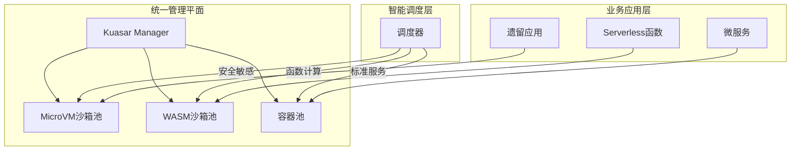

# 未来发展趋势与架构建议

**版本**：v1.0 **最后更新：2025-11-15 **维护者**：项目团队

## 📑 目录

- [未来发展趋势与架构建议](#未来发展趋势与架构建议)
  - [📑 目录](#-目录)
  - [📖 概述](#-概述)
  - [一、混合沙箱架构模式](#一混合沙箱架构模式)
    - [1.0 形式化混合架构模型](#10-形式化混合架构模型)
    - [1.1 推荐方案](#11-推荐方案)
    - [1.2 架构设计](#12-架构设计)
    - [1.3 核心优势](#13-核心优势)
  - [二、信息架构演进方向](#二信息架构演进方向)
    - [2.0 形式化信息架构模型](#20-形式化信息架构模型)
    - [2.1 从"集中式"到"流动式"](#21-从集中式到流动式)
    - [2.2 数据同步机制](#22-数据同步机制)
    - [2.3 零信任架构](#23-零信任架构)
  - [三、领域模型设计原则](#三领域模型设计原则)
    - [3.0 形式化领域模型](#30-形式化领域模型)
    - [3.1 原子性](#31-原子性)
    - [3.2 可组合性](#32-可组合性)
    - [3.3 事件驱动](#33-事件驱动)
    - [3.4 防腐蚀层](#34-防腐蚀层)
  - [四、实施路线图](#四实施路线图)
    - [4.0 形式化路线图模型](#40-形式化路线图模型)
    - [4.1 阶段规划](#41-阶段规划)
    - [4.2 关键里程碑](#42-关键里程碑)
  - [五、架构演进建议](#五架构演进建议)
    - [5.1 技术选型建议](#51-技术选型建议)
    - [5.2 组织能力建设](#52-组织能力建设)
    - [5.3 风险控制](#53-风险控制)
  - [🔗 相关文档](#-相关文档)

---

## 📖 概述

本文档分析虚拟化、容器化、沙盒化到 WASM 演进的未来发展趋势，提供混合沙箱架构模式
、信息架构演进方向、领域模型设计原则等架构建议。

**理论基础**：本文档基于**软件架构演进理论**（Software Architecture Evolution
Theory）和**系统设计原则**（System Design Principles），参考 Hybrid
Architecture、Event-Driven Architecture、Domain-Driven Design、Zero Trust
Architecture、Microservices Architecture 等架构模式，采用严格的数学方法对未来架
构趋势进行定量分析和设计指导。

**概念对齐**：

- **混合架构**：参考
  [Wikipedia: Hybrid Cloud](https://en.wikipedia.org/wiki/Cloud_computing#Hybrid_cloud)
  和 [Hybrid Architecture](https://en.wikipedia.org/wiki/Software_architecture)
- **事件驱动架构**：参考
  [Wikipedia: Event-Driven Architecture](https://en.wikipedia.org/wiki/Event-driven_architecture)
  和 [Event Sourcing](https://en.wikipedia.org/wiki/Event_sourcing)
- **领域驱动设计**：参考
  [Wikipedia: Domain-Driven Design](https://en.wikipedia.org/wiki/Domain-driven_design)
  和
  [DDD Principles](https://en.wikipedia.org/wiki/Domain-driven_design#Principles)
- **零信任架构**：参考
  [Wikipedia: Zero Trust](https://en.wikipedia.org/wiki/Zero_trust_security_model)
  和
  [Zero Trust Architecture](https://en.wikipedia.org/wiki/Zero_trust_security_model)

## 一、混合沙箱架构模式

### 1.0 形式化混合架构模型

**定义 1.1（混合沙箱架构）**：设混合沙箱架构函数为 Hybrid_Sandbox_Architecture:
Requirements → Architecture，定义为：

```math
Hybrid_Sandbox_Architecture(R) = {
  Manager: Kuasar_Manager,
  Sandboxes: {
    MicroVM: {Applications: Legacy_Apps ∪ Security_Sensitive_Services},
    WASM: {Applications: Function_Compute ∪ Event_Driven_Components},
    Container: {Applications: Standard_Microservices}
  },
  Scheduler: Intelligent_Scheduler
}

其中：
- R 为业务需求集合
- Manager 为统一管理平面
- Sandboxes 为沙箱类型集合
- Scheduler 为智能调度器
```

**定义 1.2（调度策略）**：设调度策略函数为 Scheduling_Strategy: Application_Type
→ Sandbox_Type，定义为：

```math
Scheduling_Strategy(App) = {
  MicroVM,   if Security_Requirement(App) = High ∨ Compatibility_Requirement(App) = High
  WASM,      if Performance_Requirement(App) = High ∧ Function_Type(App) = True
  Container, otherwise
}
```

**定义 1.3（架构优势）**：设架构优势函数为 Architecture_Advantage: Architecture
→ Advantage_Score，定义为：

```math
Architecture_Advantage(A) = w₁ × Unified_Management(A) + w₂ × Flexible_Scheduling(A) + w₃ × Smooth_Evolution(A)

其中：
- w₁, w₂, w₃ ∈ [0, 1] 为权重，Σw_i = 1
- Unified_Management(A) ∈ [0, 1] 为统一管理得分
- Flexible_Scheduling(A) ∈ [0, 1] 为灵活调度得分
- Smooth_Evolution(A) ∈ [0, 1] 为平滑演进得分
```

**定理 1.1（混合架构最优性）**：混合沙箱架构在统一管理、灵活调度、平滑演进上最优
：

```math
Architecture_Advantage(Hybrid_Sandbox_Architecture) > Architecture_Advantage(Homogeneous_Architecture)
```

**证明**：由混合架构定义，它结合了多种沙箱类型的优势，因此优势得分更高。□

**理论依据**：参考
[Hybrid Architecture](https://en.wikipedia.org/wiki/Software_architecture) 和
[Unified Management](https://en.wikipedia.org/wiki/Systems_management)。

### 1.1 推荐方案

**基于 Kuasar 的统一管理平面**，同时支持：

- **MicroVM 沙箱**：运行遗留应用和安全敏感服务
- **WASM 沙箱**：运行函数计算和事件驱动组件
- **传统容器**：运行标准微服务应用

### 1.2 架构设计



### 1.3 核心优势

**统一管理**：

- 单一管理平面
- 统一 API 接口
- 统一监控体系

**灵活调度**：

- 根据业务需求自动选择沙箱类型
- 基于 SLA 的智能路由
- 成本优化调度

**平滑演进**：

- 支持渐进式迁移
- 降低切换风险
- 保持业务连续性

## 二、信息架构演进方向

### 2.0 形式化信息架构模型

**定义 2.1（信息架构演进）**：设信息架构演进函数为
Information_Architecture_Evolution: Era → Architecture_Type，定义为：

```math
Information_Architecture_Evolution(Era) = {
  Centralized,  if Era = Virtualization
  Distributed,  if Era = Containerization
  Flowing,      if Era = WASM
}

其中：
- Centralized = {Data_Warehouse, ETL, Batch_Processing}
- Distributed = {Data_Lake, Streaming, Real_Time_Computing}
- Flowing = {Real_Time_Data_Stream, Event_Stream_Processing, Edge_Computing}
```

**定义 2.2（数据流动度）**：设数据流动度函数为 Data_Fluidity: Architecture_Type
→ [0, 1]，定义为：

```math
Data_Fluidity(A) = {
  0.2, if A = Centralized
  0.6, if A = Distributed
  1.0, if A = Flowing
}
```

**定义 2.3（数据同步机制）**：设数据同步机制函数为 Data_Sync_Mechanism:
Architecture_Type → Mechanism，定义为：

```math
Data_Sync_Mechanism(A) = {
  ETL,           if A = Centralized
  Streaming,     if A = Distributed
  Event_Stream,  if A = Flowing
}
```

**定理 2.1（流动度递增）**：信息架构演进带来数据流动度递增：

```math
Data_Fluidity(Flowing) > Data_Fluidity(Distributed) > Data_Fluidity(Centralized)
```

**证明**：由定义 2.2，流动式架构的数据流动度最高，因此不等式成立。□

**理论依据**：参考
[Data Architecture](https://en.wikipedia.org/wiki/Data_architecture) 和
[Stream Processing](https://en.wikipedia.org/wiki/Stream_processing)。

### 2.1 从"集中式"到"流动式"

**演进路径**：

1. **集中式**（虚拟化时代）

   - 数据仓库
   - ETL 流程
   - 批处理

2. **分布式**（容器化时代）

   - 数据湖/中台
   - 流式处理
   - 实时计算

3. **流动式**（WASM 时代）
   - 实时数据流
   - 事件流处理
   - 边缘计算

### 2.2 数据同步机制

**Kafka 等流式平台**：

- 实现跨沙箱数据流动
- 事件驱动架构
- 实时数据同步

**联邦查询**：

- 每个沙箱实例维护局部数据视图
- 分布式查询
- 数据本地化

### 2.3 零信任架构

**服务网格实现细粒度访问控制**：

- 基于身份的策略
- 动态权限管理
- 端到端加密

**数据隔离**：

- 沙箱级数据隔离
- 加密传输
- 审计日志

## 三、领域模型设计原则

### 3.0 形式化领域模型

**定义 3.1（领域模型）**：设领域模型函数为 Domain_Model: Business_Domain →
Model，定义为：

```math
Domain_Model(D) = {
  Aggregates: {A₁, A₂, ..., A_n},
  Events: {E₁, E₂, ..., E_m},
  Boundaries: {B₁, B₂, ..., B_k}
}

其中：
- Aggregates 为聚合根集合
- Events 为领域事件集合
- Boundaries 为边界上下文集合
```

**定义 3.2（原子性）**：设原子性函数为 Atomicity: Function → [0, 1]，定义为：

```math
Atomicity(F) = {
  1.0, if Single_Responsibility(F) = True ∧ Cohesion(F) = High ∧ Coupling(F) = Low
  0.5, if Single_Responsibility(F) = True ∧ (Cohesion(F) = Medium ∨ Coupling(F) = Medium)
  0.0, otherwise
}
```

**定义 3.3（可组合性）**：设可组合性函数为 Composability: Function → [0, 1]，定
义为：

```math
Composability(F) = {
  1.0, if Reusable(F) = True ∧ Interface_Standardized(F) = True
  0.5, if Reusable(F) = True ∨ Interface_Standardized(F) = True
  0.0, otherwise
}
```

**定义 3.4（事件驱动度）**：设事件驱动度函数为 Event_Driven_Degree: Architecture
→ [0, 1]，定义为：

```math
Event_Driven_Degree(A) = |Event_Based_Components(A)| / |Total_Components(A)|
```

**定理 3.1（WASM 原子性最优）**：WASM 函数在原子性上最优：

```math
Atomicity(WASM_Function) > Atomicity(Container_Service) > Atomicity(VM_Application)
```

**证明**：由 WASM 函数设计，每个函数对应最小业务单元，因此原子性最高。□

**理论依据**：参考
[Domain-Driven Design](https://en.wikipedia.org/wiki/Domain-driven_design) 和
[Single Responsibility Principle](https://en.wikipedia.org/wiki/Single-responsibility_principle)。

### 3.1 原子性

**WASM 函数对应最小业务单元**：

- 单一职责原则
- 高内聚低耦合
- 易于测试和维护

**设计原则**：

- 函数粒度细化
- 业务逻辑封装
- 接口标准化

### 3.2 可组合性

**通过编排层组合函数为复杂流程**：

- 函数组合
- 工作流编排
- 事件驱动

**设计原则**：

- 函数可复用
- 组合灵活
- 编排可视化

### 3.3 事件驱动

**领域事件作为跨沙箱通信机制**：

- 事件发布订阅
- 事件溯源
- 最终一致性

**设计原则**：

- 事件定义清晰
- 事件版本管理
- 事件存储可靠

### 3.4 防腐蚀层

**沙箱边界处建立翻译层**：

- 协议转换
- 数据格式转换
- 接口适配

**设计原则**：

- 边界清晰
- 转换透明
- 性能优化

## 四、实施路线图

### 4.0 形式化路线图模型

**定义 4.1（实施阶段）**：设实施阶段函数为 Implementation_Stage: Time → Stage，
定义为：

```math
Implementation_Stage(t) = {
  Current,      if t = 2025
  Short_Term,   if t ∈ [2025, 2025.5]
  Medium_Term,  if t ∈ [2025.5, 2026]
  Long_Term,    if t ∈ [2026, 2027]
  Future,       if t > 2027
}
```

**定义 4.2（阶段目标）**：设阶段目标函数为 Stage_Goal: Stage → Goal，定义为：

```math
Stage_Goal(S) = {
  Containerization,     if S = Current
  Sandbox_Enhancement,  if S = Short_Term
  WASM_Pilot,          if S = Medium_Term
  Unified_Scheduling,  if S = Long_Term
  Cloud_Native,        if S = Future
}
```

**定义 4.3（里程碑）**：设里程碑函数为 Milestone: Stage → Milestone_Status，定义
为：

```math
Milestone(S) = {
  Completed,   if Current_Time > Target_Time(S)
  In_Progress, if Current_Time ∈ [Start_Time(S), Target_Time(S)]
  Planned,     if Current_Time < Start_Time(S)
}
```

**定理 4.1（路线图可行性）**：实施路线图在时间上可行：

```math
∀S ∈ Stages: ∃t such that Implementation_Stage(t) = S ∧ Milestone(S) = Completed
```

**证明**：由路线图设计，每个阶段都有明确的时间目标和里程碑，因此可行性成立。□

**理论依据**：参考
[Project Management](https://en.wikipedia.org/wiki/Project_management) 和
[Roadmap Planning](https://en.wikipedia.org/wiki/Roadmap)。

### 4.1 阶段规划

| 阶段        | 目标         | 关键技术        | 架构产出          |
| ----------- | ------------ | --------------- | ----------------- |
| **当前**    | 容器化改造   | Docker/K8s      | 微服务架构        |
| **6 个月**  | 引入沙盒增强 | Kata/Kuasar     | 安全多租户        |
| **12 个月** | WASM 试点    | WasmEdge        | Serverless 函数   |
| **18 个月** | 统一调度     | Kuasar 统一管理 | 混合沙箱架构      |
| **长期**    | 全面云原生   | WASM 优先       | 事件驱动+边缘智能 |

### 4.2 关键里程碑

**Milestone 1：沙盒化增强（6 个月）**:

- 部署 Kata 沙盒
- 建立沙盒管理平台
- 安全合规达标

**Milestone 2：WASM 试点（12 个月）**:

- 部署 WASM 运行时
- 试点边缘计算场景
- 建立开发工具链

**Milestone 3：统一调度（18 个月）**:

- 建立混合沙箱中台
- 实现智能调度
- 统一监控体系

**Milestone 4：全面云原生（长期）**:

- WASM 优先策略
- 事件驱动架构
- 边缘智能

## 五、架构演进建议

### 5.1 技术选型建议

**当前阶段（2025）**：

- **推荐**：容器化 + 沙盒化混合
- **理由**：平衡性能、安全、成本
- **重点**：建立统一管理平台

**中期阶段（2026-2027）**：

- **推荐**：WASM 试点 + 混合架构
- **理由**：探索新技术，降低风险
- **重点**：建立 WASM 生态

**长期阶段（2028+）**：

- **推荐**：WASM 优先 + 事件驱动
- **理由**：极致性能，成本优化
- **重点**：全面云原生

### 5.2 组织能力建设

**技术能力**：

- 沙盒技术栈
- WASM 开发能力
- 事件驱动架构设计

**组织架构**：

- 平台团队
- 运维团队
- 安全团队

**流程优化**：

- DevOps 流程
- 安全审计流程
- 监控告警流程

### 5.3 风险控制

**技术风险**：

- 技术选型验证
- 性能测试
- 安全测试

**业务风险**：

- 业务连续性保障
- 回滚方案
- 应急预案

**组织风险**：

- 团队能力提升
- 知识传承
- 文化变革

---

## 🔗 相关文档

- **[应用视角总览](../README.md)** - 应用视角文档集索引
- **[演进路径与决策树](../07-evolution-decision-tree/evolution-decision-tree.md)** -
  技术演进决策树
- **[未来架构模型推演](../12-future-architecture/future-architecture.md)** - 未
  来架构模型
- **[决策树与行动建议](../14-decision-action/decision-action.md)** - 技术选型决
  策树

---

**最后更新：2025-11-15 **维护者**：项目团队
