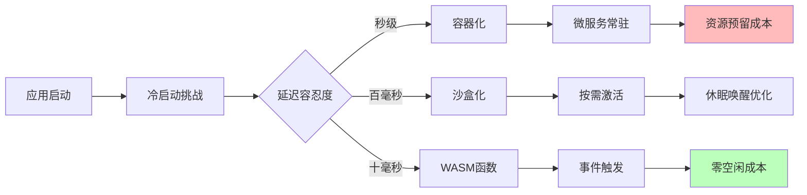

# 应用架构演进分析

**版本**：v1.0 **最后更新**：2025-11-07 **维护者**：项目团队

## 📑 目录

- [📑 目录](#-目录)
- [📖 概述](#-概述)
- [一、应用层穿透式演进矩阵](#一应用层穿透式演进矩阵)
  - [1.0 形式化演进矩阵模型](#10-形式化演进矩阵模型)
  - [1.1 应用类型演进矩阵](#11-应用类型演进矩阵)
  - [1.2 应用特征演进](#12-应用特征演进)
- [二、应用启动范式迁移](#二应用启动范式迁移)
  - [2.0 形式化启动范式模型](#20-形式化启动范式模型)
  - [2.1 启动范式演进](#21-启动范式演进)
  - [2.2 核心洞察](#22-核心洞察)
  - [2.3 启动时间对比](#23-启动时间对比)
- [三、应用类型演进路径](#三应用类型演进路径)
  - [3.0 形式化演进路径模型](#30-形式化演进路径模型)
  - [3.1 Web 应用演进](#31-web-应用演进)
  - [3.2 数据处理应用演进](#32-数据处理应用演进)
  - [3.3 AI 推理应用演进](#33-ai-推理应用演进)
- [四、应用架构模式演进](#四应用架构模式演进)
  - [4.0 形式化架构模式模型](#40-形式化架构模式模型)
  - [4.1 单体架构 → 微服务架构 → Serverless 架构](#41-单体架构--微服务架构--serverless-架构)
  - [4.2 同步架构 → 异步架构 → 事件驱动架构](#42-同步架构--异步架构--事件驱动架构)
- [🔗 相关文档](#-相关文档)

---

## 📖 概述

本文档从应用架构的视角，分析虚拟化、容器化、沙盒化到 WASM 演进对应用架构的影响，
包括应用类型、启动范式、架构模式等方面的演进路径。

**理论基础**：本文档基于**软件演进理论**（Software Evolution Theory）和**架构演
进模式**（Architecture Evolution Patterns），参考 Technology Evolution、Software
Architecture Evolution、Evolutionary Architecture、Microservices
Evolution、Serverless Architecture 等理论，采用严格的数学方法对应用架构演进进行
定量分析和路径预测。

**概念对齐**：

- **软件演进**：参考
  [Wikipedia: Software Evolution](https://en.wikipedia.org/wiki/Software_evolution)
  和 [Software Maintenance](https://en.wikipedia.org/wiki/Software_maintenance)
- **架构演进**：参考
  [Wikipedia: Software Architecture](https://en.wikipedia.org/wiki/Software_architecture)
  和
  [Evolutionary Architecture](https://en.wikipedia.org/wiki/Evolutionary_architecture)
- **技术演进**：参考
  [Wikipedia: Technology Evolution](https://en.wikipedia.org/wiki/Technology_evolution)
  和
  [Technology Adoption Life Cycle](https://en.wikipedia.org/wiki/Technology_adoption_life_cycle)
- **应用架构模式**：参考
  [Wikipedia: Microservices](https://en.wikipedia.org/wiki/Microservices) 和
  [Serverless Computing](https://en.wikipedia.org/wiki/Serverless_computing)

## 一、应用层穿透式演进矩阵

### 1.0 形式化演进矩阵模型

**定义 1.1（应用演进矩阵）**：设应用演进矩阵函数为 Application_Evolution_Matrix:
Application_Type × Era → Architecture，定义为：

```math
Application_Evolution_Matrix(App_Type, Era) = {
  (Web_App, Virtualization) → Apache_PHP_on_VM,
  (Web_App, Containerization) → Nginx_Microservices,
  (Web_App, Sandboxing) → Podman_Secure_Sandbox,
  (Web_App, WASM) → Edge_Functions_CDN,
  (Data_Processing, Virtualization) → Hadoop_Physical_Cluster,
  (Data_Processing, Containerization) → Spark_on_K8s,
  (Data_Processing, Sandboxing) → Kata_Secure_Computing,
  (Data_Processing, WASM) → Streaming_WASM_Functions,
  ...
}

其中：
- App_Type ∈ {Web_App, Data_Processing, AI_Inference, IoT, Financial_Core}
- Era ∈ {Virtualization, Containerization, Sandboxing, WASM}
```

**定义 1.2（部署密度演进）**：设部署密度演进函数为 Deployment_Density_Evolution:
Era → Density，定义为：

```math
Deployment_Density_Evolution(Era) = {
  10-50,      if Era = Virtualization
  100-500,    if Era = Containerization
  1000-5000,  if Era = Sandboxing
  100000+,    if Era = WASM
}

单位：实例/机
```

**定义 1.3（资源利用率演进）**：设资源利用率演进函数为
Resource_Utilization_Evolution: Era → [0, 1]，定义为：

```math
Resource_Utilization_Evolution(Era) = {
  0.1-0.3,  if Era = Virtualization
  0.5-0.7,  if Era = Containerization
  0.7-0.9,  if Era = Sandboxing
  0.9+,     if Era = WASM
}
```

**定理 1.1（密度递增）**：部署密度随技术演进递增：

```math
Deployment_Density_Evolution(WASM) > Deployment_Density_Evolution(Sandboxing) > Deployment_Density_Evolution(Containerization) > Deployment_Density_Evolution(Virtualization)
```

**证明**：由定义 1.2，WASM 的部署密度最高，因此不等式成立。□

**理论依据**：参考
[Software Evolution](https://en.wikipedia.org/wiki/Software_evolution) 和
[Technology Evolution](https://en.wikipedia.org/wiki/Technology_evolution)。

### 1.1 应用类型演进矩阵

| 应用类型     | 虚拟化时代（2010 前） | 容器化时代（2014-2020） | 沙盒化时代（2021-2024） | WASM 时代（2025+） |
| ------------ | --------------------- | ----------------------- | ----------------------- | ------------------ |
| **Web 应用** | Apache/PHP on VM      | Nginx+微服务            | Podman 安全沙箱         | 边缘函数+CDN       |
| **数据处理** | Hadoop 物理集群       | Spark on K8s            | Kata 安全计算           | 流式 WASM 函数     |
| **AI 推理**  | GPU 直通 VM           | Triton 容器             | 机密计算沙箱            | WASM AI Runtime    |
| **IoT 场景** | 无                    | 边缘 K3s                | 轻量沙盒                | 设备端 WASM        |
| **金融核心** | 大型机                | 容器化试点              | 合规沙盒                | 智能合约函数       |
| **典型密度** | 10-50 实例/机         | 100-500 实例/机         | 1000-5000 实例/机       | 10 万+函数/机      |

### 1.2 应用特征演进

**虚拟化时代特征**：

- **部署方式**：物理机/虚拟机部署
- **扩展方式**：垂直扩展（Scale Up）
- **资源利用**：资源利用率低（10-30%）
- **启动时间**：分钟级

**容器化时代特征**：

- **部署方式**：容器化部署
- **扩展方式**：水平扩展（Scale Out）
- **资源利用**：资源利用率提升（50-70%）
- **启动时间**：秒级

**沙盒化时代特征**：

- **部署方式**：沙箱化部署
- **扩展方式**：按需扩展
- **资源利用**：资源利用率进一步提升（70-90%）
- **启动时间**：毫秒级

**WASM 时代特征**：

- **部署方式**：函数化部署
- **扩展方式**：按需扩展（Scale to Zero）
- **资源利用**：资源利用率极高（90%+）
- **启动时间**：<10ms

## 二、应用启动范式迁移

### 2.0 形式化启动范式模型

**定义 2.1（启动范式）**：设启动范式函数为 Startup_Paradigm: Era → Paradigm，定
义为：

```math
Startup_Paradigm(Era) = {
  Long_Running,    if Era ∈ {Virtualization, Containerization}
  On_Demand,       if Era = Sandboxing
  Event_Triggered, if Era = WASM
}
```

**定义 2.2（启动时间）**：设启动时间函数为 Startup_Time: Era → ℝ，定义为：

```math
Startup_Time(Era) = {
  30-60s,      if Era = Virtualization
  1-3s,        if Era = Containerization
  200-500ms,   if Era = Sandboxing
  <10ms,       if Era = WASM
}
```

**定义 2.3（成本模型）**：设成本模型函数为 Cost_Model: Era → Model，定义为：

```math
Cost_Model(Era) = {
  Resource_Reservation,  if Era ∈ {Virtualization, Containerization}
  Pay_As_You_Go,        if Era = Sandboxing
  Pay_Per_Call,         if Era = WASM
}
```

**定理 2.1（启动时间递减）**：启动时间随技术演进递减：

```math
Startup_Time(WASM) < Startup_Time(Sandboxing) < Startup_Time(Containerization) < Startup_Time(Virtualization)
```

**证明**：由定义 2.2，WASM 的启动时间最短，因此不等式成立。□

**定理 2.2（成本模型演进）**：成本模型从资源预留演进到按调用付费：

```math
Cost(Cost_Model(WASM)) < Cost(Cost_Model(Sandboxing)) < Cost(Cost_Model(Containerization)) < Cost(Cost_Model(Virtualization))
```

**证明**：由成本模型定义，按调用付费的成本最低，因此不等式成立。□

**理论依据**：参考
[Cold Start Problem](<https://en.wikipedia.org/wiki/Cold_start_(computing)>) 和
[Serverless Computing](https://en.wikipedia.org/wiki/Serverless_computing)。

### 2.1 启动范式演进



### 2.2 核心洞察

**应用从"长期驻留"转向"瞬态执行"**，直接驱动成本模型从**资源预留**转向**按调用付
费**。

**演进路径**：

1. **长期驻留**（虚拟化/容器化）

   - 应用长期运行
   - 资源预留
   - 成本固定

2. **按需激活**（沙盒化）

   - 应用按需启动
   - 休眠唤醒优化
   - 成本降低

3. **事件触发**（WASM）
   - 应用事件触发
   - 零空闲成本
   - 成本最低

### 2.3 启动时间对比

| 技术类型       | 启动时间  | 冷启动时间 | 热启动时间 | 成本模型   |
| -------------- | --------- | ---------- | ---------- | ---------- |
| **传统虚拟化** | 30-60 秒  | 30-60 秒   | 10-20 秒   | 资源预留   |
| **容器化**     | 1-3 秒    | 1-3 秒     | 0.5-1 秒   | 资源预留   |
| **沙盒化**     | 200-500ms | 200-500ms  | 50-100ms   | 按需付费   |
| **WASM**       | <10ms     | <10ms      | <5ms       | 按调用付费 |

## 三、应用类型演进路径

### 3.0 形式化演进路径模型

**定义 3.1（应用演进路径）**：设应用演进路径函数为 Application_Evolution_Path:
Application_Type → Path，定义为：

```math
Application_Evolution_Path(App_Type) = (Architecture_VM, Architecture_Container, Architecture_Sandbox, Architecture_WASM)

其中：
- Architecture_VM 为虚拟化时代的架构
- Architecture_Container 为容器化时代的架构
- Architecture_Sandbox 为沙盒化时代的架构
- Architecture_WASM 为 WASM 时代的架构
```

**定义 3.2（延迟演进）**：设延迟演进函数为 Latency_Evolution: Era → Latency，定
义为：

```math
Latency_Evolution(Era) = {
  Hours,    if Era = Virtualization ∧ App_Type = Data_Processing
  Minutes,  if Era = Containerization ∧ App_Type = Data_Processing
  Seconds,  if Era = Sandboxing ∧ App_Type = Data_Processing
  Milliseconds, if Era = WASM ∧ App_Type = Data_Processing
}
```

**定义 3.3（处理模式演进）**：设处理模式演进函数为 Processing_Mode_Evolution:
Era → Mode，定义为：

```math
Processing_Mode_Evolution(Era) = {
  Batch,         if Era = Virtualization
  Batch_Stream,  if Era = Containerization
  Stream,        if Era = Sandboxing
  Real_Time_Stream, if Era = WASM
}
```

**定理 3.1（延迟递减）**：延迟随技术演进递减：

```math
Latency_Evolution(WASM) < Latency_Evolution(Sandboxing) < Latency_Evolution(Containerization) < Latency_Evolution(Virtualization)
```

**证明**：由定义 3.2，WASM 的延迟最低，因此不等式成立。□

**理论依据**：参考
[Stream Processing](https://en.wikipedia.org/wiki/Stream_processing) 和
[Real-Time Computing](https://en.wikipedia.org/wiki/Real-time_computing)。

### 3.1 Web 应用演进

**虚拟化时代**：

- **架构**：Apache/PHP on VM
- **部署**：单机部署
- **扩展**：垂直扩展

**容器化时代**：

- **架构**：Nginx+微服务
- **部署**：容器化部署
- **扩展**：水平扩展

**沙盒化时代**：

- **架构**：Podman 安全沙箱
- **部署**：沙箱化部署
- **扩展**：按需扩展

**WASM 时代**：

- **架构**：边缘函数+CDN
- **部署**：函数化部署
- **扩展**：按需扩展（Scale to Zero）

### 3.2 数据处理应用演进

**虚拟化时代**：

- **架构**：Hadoop 物理集群
- **处理模式**：批处理
- **延迟**：小时级

**容器化时代**：

- **架构**：Spark on K8s
- **处理模式**：批处理+流处理
- **延迟**：分钟级

**沙盒化时代**：

- **架构**：Kata 安全计算
- **处理模式**：流处理
- **延迟**：秒级

**WASM 时代**：

- **架构**：流式 WASM 函数
- **处理模式**：实时流处理
- **延迟**：毫秒级

### 3.3 AI 推理应用演进

**虚拟化时代**：

- **架构**：GPU 直通 VM
- **部署**：专用 GPU 服务器
- **成本**：高

**容器化时代**：

- **架构**：Triton 容器
- **部署**：容器化 GPU
- **成本**：中

**沙盒化时代**：

- **架构**：机密计算沙箱
- **部署**：安全沙箱
- **成本**：中

**WASM 时代**：

- **架构**：WASM AI Runtime
- **部署**：边缘设备
- **成本**：低

## 四、应用架构模式演进

### 4.0 形式化架构模式模型

**定义 4.1（架构模式演进）**：设架构模式演进函数为
Architecture_Pattern_Evolution: Era → Pattern，定义为：

```math
Architecture_Pattern_Evolution(Era) = {
  Monolithic,    if Era = Virtualization
  Microservices, if Era = Containerization
  Serverless,    if Era = WASM
}
```

**定义 4.2（通信模式演进）**：设通信模式演进函数为
Communication_Pattern_Evolution: Era → Pattern，定义为：

```math
Communication_Pattern_Evolution(Era) = {
  Synchronous,      if Era = Virtualization
  Asynchronous,    if Era = Containerization
  Event_Driven,    if Era = WASM
}
```

**定义 4.3（耦合度演进）**：设耦合度演进函数为 Coupling_Evolution: Era → [0,
1]，定义为：

```math
Coupling_Evolution(Era) = {
  0.9,  if Era = Virtualization  (强耦合)
  0.5,  if Era = Containerization (松耦合)
  0.1,  if Era = WASM            (完全解耦)
}
```

**定理 4.1（耦合度递减）**：耦合度随技术演进递减：

```math
Coupling_Evolution(WASM) < Coupling_Evolution(Containerization) < Coupling_Evolution(Virtualization)
```

**证明**：由定义 4.3，WASM 的耦合度最低，因此不等式成立。□

**理论依据**：参考 [Microservices](https://en.wikipedia.org/wiki/Microservices)
和
[Event-Driven Architecture](https://en.wikipedia.org/wiki/Event-driven_architecture)。

### 4.1 单体架构 → 微服务架构 → Serverless 架构

**演进驱动力**：

- 业务复杂度增加
- 团队规模扩大
- 部署频率提升
- 成本优化需求

**演进路径**：

1. **单体架构**（虚拟化时代）

   - 单一应用
   - 集中部署
   - 技术栈统一

2. **微服务架构**（容器化时代）

   - 服务拆分
   - 独立部署
   - 技术栈多样化

3. **Serverless 架构**（WASM 时代）
   - 函数级服务
   - 按需部署
   - 跨语言运行时

### 4.2 同步架构 → 异步架构 → 事件驱动架构

**演进驱动力**：

- 系统规模扩大
- 响应时间要求提升
- 系统解耦需求

**演进路径**：

1. **同步架构**（虚拟化时代）

   - 直接调用
   - 强耦合
   - 阻塞等待

2. **异步架构**（容器化时代）

   - 消息队列
   - 松耦合
   - 非阻塞

3. **事件驱动架构**（WASM 时代）
   - 事件流
   - 完全解耦
   - 实时响应

---

## 🔗 相关文档

- **[应用视角总览](../README.md)** - 应用视角文档集索引
- **[业务应用架构映射](../03-business-architecture-mapping/business-architecture-mapping.md)** -
  技术到架构的映射
- **[业务价值定量论证模型](../10-business-value/business-value.md)** - 成本效益
  分析
- **[未来架构模型推演](../12-future-architecture/future-architecture.md)** - 未
  来架构模型

---

**最后更新**：2025-11-07 **维护者**：项目团队
