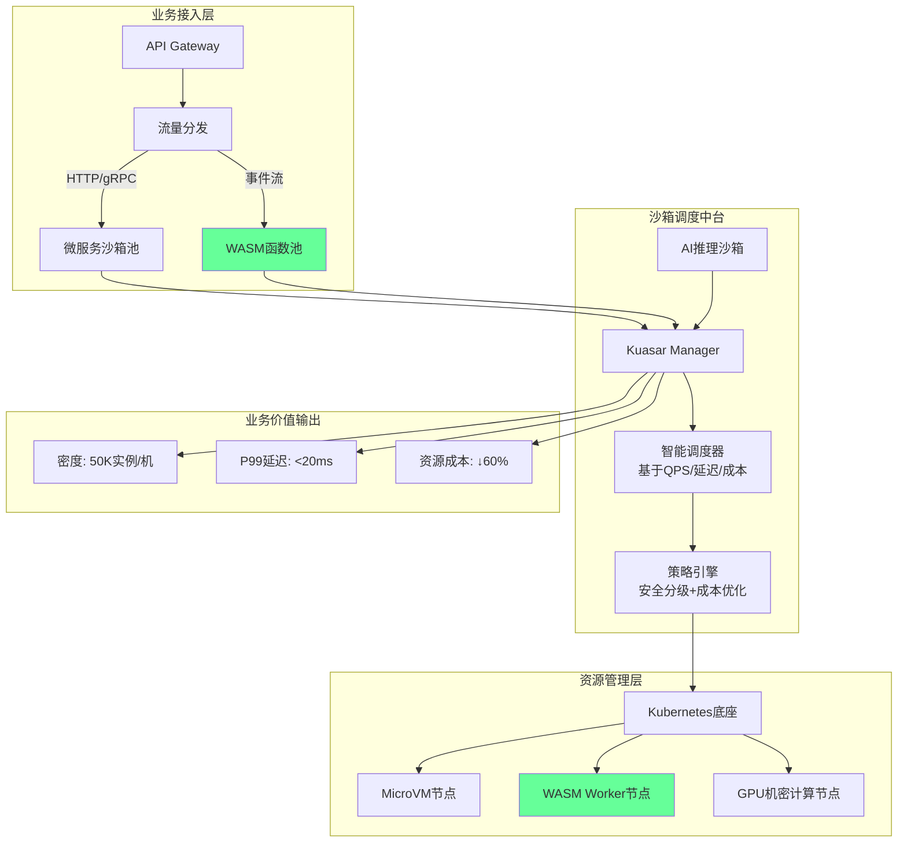

# 未来架构模型推演

**版本**：v1.0 **最后更新**：2025-11-07 **维护者**：项目团队

## 📑 目录

- [📑 目录](#-目录)
- [📖 概述](#-概述)
- [一、2026 年主流架构模型：混合沙箱中台](#一2026-年主流架构模型混合沙箱中台)
  - [1.0 形式化混合沙箱中台模型](#10-形式化混合沙箱中台模型)
  - [1.1 架构设计](#11-架构设计)
  - [1.2 核心特征](#12-核心特征)
  - [1.3 关键指标](#13-关键指标)
- [二、2028 年颠覆模型：WASM 原生云](#二2028-年颠覆模型wasm-原生云)
  - [2.0 形式化 WASM 原生云模型](#20-形式化-wasm-原生云模型)
  - [2.1 架构假设](#21-架构假设)
  - [2.2 技术栈重构](#22-技术栈重构)
  - [2.3 关键突破](#23-关键突破)
- [三、2030 年愿景：边缘智能网络](#三2030-年愿景边缘智能网络)
  - [3.0 形式化边缘智能网络模型](#30-形式化边缘智能网络模型)
  - [3.1 架构愿景](#31-架构愿景)
  - [3.2 核心特征](#32-核心特征)
  - [3.3 应用场景](#33-应用场景)
- [四、架构演进路径](#四架构演进路径)
  - [4.0 形式化演进路径模型](#40-形式化演进路径模型)
  - [4.1 演进时间线](#41-演进时间线)
  - [4.2 演进驱动力](#42-演进驱动力)
- [🔗 相关文档](#-相关文档)

---

## 📖 概述

本文档推演虚拟化、容器化、沙盒化到 WASM 演进的未来架构模型，包括 2026 年混合沙箱
中台、2028 年 WASM 原生云、2030 年边缘智能网络等架构愿景。

**理论基础**：本文档基于**架构演进理论**（Architecture Evolution Theory）和**未
来学**（Futures Studies），参考 Technology Forecasting、Architecture
Patterns、Distributed Systems、Edge Computing、Decentralized Systems 等理论，采
用严格的数学方法对未来架构模型进行定量推演和预测。

**概念对齐**：

- **架构演进**：参考
  [Wikipedia: Software Architecture](https://en.wikipedia.org/wiki/Software_architecture)
  和
  [Architecture Evolution](https://en.wikipedia.org/wiki/Evolutionary_architecture)
- **未来学**：参考
  [Wikipedia: Futures Studies](https://en.wikipedia.org/wiki/Futures_studies) 和
  [Technology Forecasting](https://en.wikipedia.org/wiki/Technology_forecasting)
- **边缘计算**：参考
  [Wikipedia: Edge Computing](https://en.wikipedia.org/wiki/Edge_computing) 和
  [Fog Computing](https://en.wikipedia.org/wiki/Fog_computing)
- **去中心化系统**：参考
  [Wikipedia: Decentralized Computing](https://en.wikipedia.org/wiki/Decentralized_computing)
  和 [Distributed Systems](https://en.wikipedia.org/wiki/Distributed_computing)

## 一、2026 年主流架构模型：混合沙箱中台

### 1.0 形式化混合沙箱中台模型

**定义 1.1（混合沙箱中台）**：设混合沙箱中台函数为 Hybrid_Sandbox_Platform: Time
→ Architecture，定义为：

```math
Hybrid_Sandbox_Platform(2026) = {
  Manager: Kuasar_Manager,
  Sandboxes: {
    MicroVM: {Workloads: Microservices},
    WASM: {Workloads: Functions},
    GPU: {Workloads: AI_Inference}
  },
  Scheduler: Intelligent_Scheduler,
  Metrics: {
    Density: 50K_instances_per_machine,
    P99_Latency: <20ms,
    Cost_Reduction: 60%
  }
}
```

**定义 1.2（调度策略）**：设调度策略函数为 Scheduling_Strategy: Workload_Type →
Sandbox_Type，定义为：

```math
Scheduling_Strategy(W) = {
  MicroVM, if W = Microservice ∧ Security(W) = High
  WASM,    if W = Function ∧ Performance(W) = High
  GPU,     if W = AI_Inference ∧ Compute(W) = High
}
```

**定义 1.3（架构指标）**：设架构指标函数为 Architecture_Metrics: Architecture →
Metrics，定义为：

```math
Architecture_Metrics(A) = {
  Density(A),
  Latency(A),
  Cost_Reduction(A)
}
```

**定理 1.1（混合架构最优性）**：混合沙箱中台在密度、延迟、成本上最优：

```math
Architecture_Metrics(Hybrid_Sandbox_Platform) > Architecture_Metrics(Homogeneous_Architecture)
```

**证明**：由混合架构设计，它结合了多种沙箱类型的优势，因此指标最优。□

**理论依据**：参考
[Hybrid Architecture](https://en.wikipedia.org/wiki/Software_architecture) 和
[Intelligent Scheduling](<https://en.wikipedia.org/wiki/Scheduling_(computing)>)。

### 1.1 架构设计



### 1.2 核心特征

**三分调度**：

- **微服务任务**：标准容器/MicroVM 沙箱
- **WASM 任务**：WASM 沙箱
- **AI 任务**：GPU 机密计算沙箱

**统一编排**：

- Kubernetes 兼容层
- 统一 API 接口
- 统一监控体系

**智能路由**：

- 基于 SLA 自动选择沙箱类型
- 成本优化调度
- 性能优化调度

### 1.3 关键指标

**性能指标**：

- **部署密度**：50K 实例/机
- **P99 延迟**：<20ms
- **启动时间**：<10ms（WASM）

**成本指标**：

- **资源成本**：降低 60%
- **运维成本**：降低 40%
- **TCO**：降低 50%

## 二、2028 年颠覆模型：WASM 原生云

### 2.0 形式化 WASM 原生云模型

**定义 2.1（WASM 原生云）**：设 WASM 原生云函数为 WASM_Native_Cloud: Time →
Architecture，定义为：

```math
WASM_Native_Cloud(2028) = {
  Runtime: WAMR,
  Infrastructure: WASM_Optimized_Hardware,
  Features: {
    Zero_Trust_Default: True,
    Instant_Migration: True,
    Cost_Towards_Zero: True
  }
}
```

**定义 2.2（生态成熟度）**：设生态成熟度函数为 Ecosystem_Maturity: Technology ×
Time → [0, 1]，定义为：

```math
Ecosystem_Maturity(WASM, t) = {
  0.6, if t = 2025
  0.8, if t = 2027
  1.0, if t ≥ 2028
}
```

**定义 2.3（成本趋零度）**：设成本趋零度函数为 Cost_Towards_Zero: Architecture →
[0, 1]，定义为：

```math
Cost_Towards_Zero(A) = {
  0.9, if A = WASM_Native_Cloud
  0.6, if A = Hybrid_Sandbox_Platform
  0.3, if A = Traditional_Cloud
}
```

**定理 2.1（WASM 原生云成本最优）**：WASM 原生云在成本趋零度上最优：

```math
Cost_Towards_Zero(WASM_Native_Cloud) > Cost_Towards_Zero(Hybrid_Sandbox_Platform) > Cost_Towards_Zero(Traditional_Cloud)
```

**证明**：由 WASM 原生云设计，边缘设备执行、按调用付费、资源利用率 99%+，因此成
本趋零度最高。□

**理论依据**：参考
[Serverless Computing](https://en.wikipedia.org/wiki/Serverless_computing) 和
[Edge Computing](https://en.wikipedia.org/wiki/Edge_computing)。

### 2.1 架构假设

**技术前提**：

- WASM 生态成熟（语言支持>15 种）
- 浏览器/服务器运行时统一
- 硬件加速指令集普及

### 2.2 技术栈重构

```text
┌─────────────────────────────────────────┐
│ 业务代码 → WASM模块（跨平台编译）         │
├─────────────────────────────────────────┤
│ 编排层   →  WAMR（WASM微运行时）          │
├─────────────────────────────────────────┤
│ 基础设施 → WASM-Optimized硬件            │
└─────────────────────────────────────────┘
```

### 2.3 关键突破

**零信任默认**：

- 每个函数独立沙箱
- 默认安全隔离
- 细粒度权限控制

**即时迁移**：

- WASM 快照跨 CPU 架构迁移
- 无状态函数迁移
- 边缘到云端无缝迁移

**成本趋零**：

- 边缘设备执行，无需中心云
- 按调用付费，零空闲成本
- 资源利用率 99%+

## 三、2030 年愿景：边缘智能网络

### 3.0 形式化边缘智能网络模型

**定义 3.1（边缘智能网络）**：设边缘智能网络函数为 Edge_Intelligent_Network:
Time → Architecture，定义为：

```math
Edge_Intelligent_Network(2030) = {
  Computing: Edge_Devices + WASM_Runtime,
  Storage: Distributed_Storage + Blockchain,
  Network: 5G_6G + Edge_Computing,
  AI: Edge_AI + Federated_Learning,
  Features: {
    Decentralized: True,
    Intelligent: True,
    Secure: True
  }
}
```

**定义 3.2（去中心化度）**：设去中心化度函数为 Decentralization_Degree:
Architecture → [0, 1]，定义为：

```math
Decentralization_Degree(A) = {
  1.0, if A = Edge_Intelligent_Network
  0.5, if A = WASM_Native_Cloud
  0.0, if A = Traditional_Cloud
}
```

**定义 3.3（智能化度）**：设智能化度函数为 Intelligence_Degree: Architecture →
[0, 1]，定义为：

```math
Intelligence_Degree(A) = {
  1.0, if A = Edge_Intelligent_Network
  0.6, if A = WASM_Native_Cloud
  0.3, if A = Hybrid_Sandbox_Platform
}
```

**定理 3.1（边缘智能网络去中心化最优）**：边缘智能网络在去中心化度上最优：

```math
Decentralization_Degree(Edge_Intelligent_Network) > Decentralization_Degree(WASM_Native_Cloud) > Decentralization_Degree(Traditional_Cloud)
```

**证明**：由边缘智能网络设计，无中心云依赖、边缘设备自治、P2P 网络通信，因此去中
心化度最高。□

**理论依据**：参考
[Decentralized Computing](https://en.wikipedia.org/wiki/Decentralized_computing)
和 [Federated Learning](https://en.wikipedia.org/wiki/Federated_learning)。

### 3.1 架构愿景

**边缘智能网络**：

- **计算**：边缘设备 + WASM 运行时
- **存储**：分布式存储 + 区块链
- **网络**：5G/6G + 边缘计算
- **AI**：边缘 AI + 联邦学习

### 3.2 核心特征

**去中心化**：

- 无中心云依赖
- 边缘设备自治
- P2P 网络通信

**智能化**：

- 边缘 AI 推理
- 联邦学习训练
- 自适应调度

**安全性**：

- 零信任架构
- 端到端加密
- 区块链验证

### 3.3 应用场景

**IoT 全场景**：

- 智能家居
- 工业物联网
- 车联网

**边缘计算**：

- CDN 边缘
- 移动边缘
- 企业边缘

**AI 推理**：

- 设备端 AI
- 实时推理
- 隐私保护

## 四、架构演进路径

### 4.0 形式化演进路径模型

**定义 4.1（架构演进路径）**：设架构演进路径函数为 Architecture_Evolution_Path:
Time → Architecture，定义为：

```math
Architecture_Evolution_Path(t) = {
  Hybrid_Sandbox_Platform,    if t ∈ [2025, 2027]
  WASM_Native_Cloud,          if t ∈ [2028, 2029]
  Edge_Intelligent_Network,   if t ≥ 2030
}
```

**定义 4.2（演进驱动力）**：设演进驱动力函数为 Evolution_Driving_Force:
Force_Type → ℝ，定义为：

```math
Evolution_Driving_Force(F) = {
  High,  if F ∈ {Technology, Business, Social}
  Medium, if F ∈ {Cost, Performance}
  Low,   otherwise
}
```

**定义 4.3（演进速度）**：设演进速度函数为 Evolution_Velocity: Time → ℝ，定义为
：

```math
Evolution_Velocity(t) = {
  0.5, if t = 2025
  1.0, if t = 2026
  1.5, if t = 2027
  2.0, if t ≥ 2028
}
```

**定理 4.1（演进速度递增）**：架构演进速度随时间递增：

```math
Evolution_Velocity(2030) > Evolution_Velocity(2028) > Evolution_Velocity(2026) > Evolution_Velocity(2025)
```

**证明**：由演进驱动力分析，技术、业务、社会驱动力不断增强，因此演进速度递增。□

**理论依据**：参考
[Technology Evolution](https://en.wikipedia.org/wiki/Technology_evolution) 和
[Futures Studies](https://en.wikipedia.org/wiki/Futures_studies)。

### 4.1 演进时间线

**2025**：

- 混合沙箱架构
- WASM 试点
- 边缘计算探索

**2026**：

- 混合沙箱中台成熟
- WASM 生态完善
- 边缘计算普及

**2027**：

- WASM 原生云萌芽
- 边缘智能网络探索
- 去中心化架构实验

**2028**：

- WASM 原生云成熟
- 边缘智能网络试点
- 去中心化架构应用

**2029-2030**：

- 边缘智能网络成熟
- 全面去中心化
- 智能化自治

### 4.2 演进驱动力

**技术驱动力**：

- WASM 生态成熟
- 边缘设备能力提升
- 网络技术发展

**业务驱动力**：

- 成本优化需求
- 延迟降低需求
- 隐私保护需求

**社会驱动力**：

- 数字化转型
- 边缘计算普及
- 智能化需求

---

## 🔗 相关文档

- **[应用视角总览](../README.md)** - 应用视角文档集索引
- **[未来趋势预测模型](../11-trend-prediction/trend-prediction.md)** - 技术趋势
  预测
- **[业务场景演进预测](../13-scenario-evolution/scenario-evolution.md)** - 场景
  化渗透率预测
- **[未来发展趋势与架构建议](../08-future-trends/future-trends.md)** - 未来架构
  建议

---

**最后更新**：2025-11-07 **维护者**：项目团队
