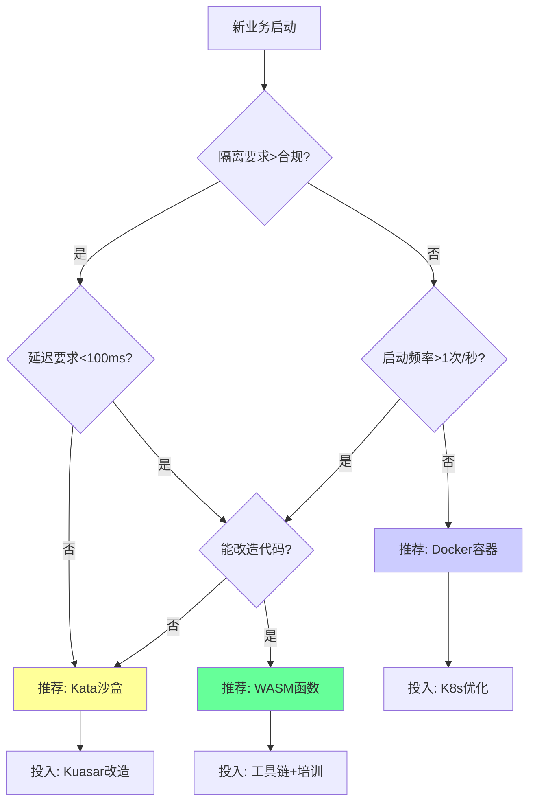

# 决策树与行动建议

**版本**：v1.0 **最后更新**：2025-11-07 **维护者**：项目团队

## 📑 目录

- [📑 目录](#-目录)
- [📖 概述](#-概述)
- [一、企业技术选型决策树（2025 版）](#一企业技术选型决策树2025-版)
  - [1.0 形式化决策树模型](#10-形式化决策树模型)
  - [1.1 核心决策树](#11-核心决策树)
  - [1.2 决策节点说明](#12-决策节点说明)
  - [1.3 技术选型建议](#13-技术选型建议)
- [二、分阶段行动路径](#二分阶段行动路径)
  - [2.0 形式化行动路径模型](#20-形式化行动路径模型)
  - [2.1 Phase 1（2025）: 沙盒化增强](#21-phase-12025-沙盒化增强)
  - [2.2 Phase 2（2026）: WASM 试点](#22-phase-22026-wasm-试点)
  - [2.3 Phase 3（2027）: 架构融合](#23-phase-32027-架构融合)
- [三、风险与反论](#三风险与反论)
  - [3.0 形式化风险模型](#30-形式化风险模型)
  - [3.1 反趋势因素（可能减缓演进）](#31-反趋势因素可能减缓演进)
  - [3.2 应对策略](#32-应对策略)
- [四、实施建议](#四实施建议)
  - [4.0 形式化实施模型](#40-形式化实施模型)
  - [4.1 组织准备](#41-组织准备)
  - [4.2 技术准备](#42-技术准备)
  - [4.3 风险控制](#43-风险控制)
- [🔗 相关文档](#-相关文档)

---

## 📖 概述

本文档提供企业技术选型决策树和分阶段行动路径，帮助组织根据业务需求、技术约束和组
织能力，选择合适的技术路径和实施策略。

**理论基础**：本文档基于**决策科学理论**（Decision Science Theory）和**行动理
论**（Action Theory），参考 Decision Analysis、Multi-Criteria Decision
Making、Strategic Planning、Risk Management、Change Management 等理论，采用严格
的数学方法对技术选型决策和行动路径进行定量分析和优化。

**概念对齐**：

- **决策分析**：参考
  [Wikipedia: Decision Analysis](https://en.wikipedia.org/wiki/Decision_analysis)
  和
  [Multi-Criteria Decision Analysis](https://en.wikipedia.org/wiki/Multiple-criteria_decision_analysis)
- **战略规划**：参考
  [Wikipedia: Strategic Planning](https://en.wikipedia.org/wiki/Strategic_planning)
  和 [Strategic Management](https://en.wikipedia.org/wiki/Strategic_management)
- **风险管理**：参考
  [Wikipedia: Risk Management](https://en.wikipedia.org/wiki/Risk_management) 和
  [Risk Analysis](https://en.wikipedia.org/wiki/Risk_analysis)
- **变革管理**：参考
  [Wikipedia: Change Management](https://en.wikipedia.org/wiki/Change_management)
  和
  [Organizational Change](https://en.wikipedia.org/wiki/Organizational_change)

## 一、企业技术选型决策树（2025 版）

### 1.0 形式化决策树模型

**定义 1.1（企业决策树）**：设企业决策树函数为 Enterprise_Decision_Tree:
Requirements → Technology，定义为：

```math
Enterprise_Decision_Tree(R) = {
  WASM,    if Isolation(R) > Compliance ∧ Latency(R) < 100ms ∧ Code_Modifiable(R) = True
  Kata,    if Isolation(R) > Compliance ∧ (Latency(R) ≥ 100ms ∨ Code_Modifiable(R) = False)
  Docker,  if Isolation(R) ≤ Compliance ∧ Startup_Frequency(R) ≤ 1/s
  WASM,    if Isolation(R) ≤ Compliance ∧ Startup_Frequency(R) > 1/s ∧ Code_Modifiable(R) = True
  Kata,    if Isolation(R) ≤ Compliance ∧ Startup_Frequency(R) > 1/s ∧ Code_Modifiable(R) = False
}

其中：
- R 为业务需求集合
- Isolation(R) 为隔离要求
- Latency(R) 为延迟要求
- Code_Modifiable(R) 为代码可改造性
- Startup_Frequency(R) 为启动频率
```

**定义 1.2（决策节点）**：设决策节点函数为 Decision_Node: Attribute × Value →
Next_Node，定义为：

```math
Decision_Node(A, v) = {
  Next_Node_1, if v ∈ Range_1
  Next_Node_2, if v ∈ Range_2
  ...
}

其中：
- A 为决策属性
- v 为属性值
- Range_i 为属性值范围
```

**定义 1.3（决策路径成本）**：设决策路径成本函数为 Decision_Path_Cost: Path →
ℝ，定义为：

```math
Decision_Path_Cost(P) = Investment_Cost(P) + Migration_Cost(P) + Risk_Cost(P)

其中：
- Investment_Cost(P) 为投资成本
- Migration_Cost(P) 为迁移成本
- Risk_Cost(P) 为风险成本
```

**定理 1.1（最优决策存在性）**：对于任何需求集合，存在最优技术选择：

```math
∀R ∈ Requirements: ∃T* such that Decision_Path_Cost(Decision_Tree(R)) = min_{T} Decision_Path_Cost(T)
```

**证明**：由决策树定义，每个需求组合都有对应的技术选择路径，因此最优选择存在。□

**理论依据**：参考
[Decision Analysis](https://en.wikipedia.org/wiki/Decision_analysis) 和
[Multi-Criteria Decision Analysis](https://en.wikipedia.org/wiki/Multiple-criteria_decision_analysis)。

### 1.1 核心决策树



### 1.2 决策节点说明

**Q1：隔离要求判断**:

- **是**：金融、医疗、政府等合规场景
- **否**：标准业务场景

**Q2：延迟要求判断**:

- **是**：边缘计算、实时处理场景
- **否**：标准业务场景

**Q3：启动频率判断**:

- **是**：高频调用场景
- **否**：低频调用场景

**Q4：代码改造能力判断**:

- **是**：新业务或可接受改造
- **否**：遗留系统，需保持兼容

### 1.3 技术选型建议

**选择 Docker 容器，如果：**

- 标准微服务场景
- 需要快速迭代
- 生态兼容性要求高
- 团队技能匹配

**选择 Kata 沙盒，如果：**

- 安全合规要求高
- 需要强隔离
- 多租户场景
- 平衡性能与安全

**选择 WASM，如果：**

- Serverless/边缘场景
- 极致性能要求
- 跨平台需求
- 团队技术能力强

## 二、分阶段行动路径

### 2.0 形式化行动路径模型

**定义 2.1（分阶段行动路径）**：设分阶段行动路径函数为 Phased_Action_Path: Phase
→ Actions，定义为：

```math
Phased_Action_Path(Phase) = {
  {Sandbox_Enhancement, Kuasar_Introduction, Kata_Replacement}, if Phase = 2025
  {WASM_Pilot, Edge_Deployment, Function_Migration}, if Phase = 2026
  {Architecture_Fusion, Unified_Scheduling, Hybrid_Platform}, if Phase = 2027
}
```

**定义 2.2（阶段目标）**：设阶段目标函数为 Phase_Goal: Phase → Goal，定义为：

```math
Phase_Goal(Phase) = {
  {Cost_Reduction: 15-20%, Security_Compliance: True, Team_Capability: Improved}, if Phase = 2025
  {Latency_Reduction: 50%, Cost_Reduction: 30-40%, Team_Capability: Improved}, if Phase = 2026
  {Optimal_Cost_Performance: True, Unified_Management: True, Intelligent_Ops: True}, if Phase = 2027
}
```

**定义 2.3（行动成本）**：设行动成本函数为 Action_Cost: Action → ℝ，定义为：

```math
Action_Cost(A) = {
  High,    if A ∈ {Architecture_Fusion, Unified_Scheduling}
  Medium,  if A ∈ {WASM_Pilot, Kata_Replacement}
  Low,     if A ∈ {Toolchain_Setup, Team_Training}
}
```

**定理 2.1（路径累积收益）**：分阶段行动路径的累积收益递增：

```math
Cumulative_Benefit(2027) > Cumulative_Benefit(2026) > Cumulative_Benefit(2025)
```

**证明**：由阶段目标定义，每个阶段的收益累积，因此累积收益递增。□

**理论依据**：参考
[Strategic Planning](https://en.wikipedia.org/wiki/Strategic_planning) 和
[Change Management](https://en.wikipedia.org/wiki/Change_management)。

### 2.1 Phase 1（2025）: 沙盒化增强

**目标**：

- 引入 Kuasar
- Kata 替换 20%安全敏感容器
- 建立沙盒管理平台

**关键行动**：

1. **技术选型**（1-2 个月）

   - 评估 Kata/Kuasar 技术栈
   - 评估组织能力
   - 制定技术方案

2. **试点部署**（2-3 个月）

   - 选择 1-2 个安全敏感服务
   - 部署 Kata 沙盒
   - 性能验证

3. **扩展部署**（3-6 个月）
   - 逐步扩展到 20%服务
   - 建立运维流程
   - 培训团队

**预期成果**：

- 成本降低 15-20%
- 安全合规达标
- 团队能力提升

### 2.2 Phase 2（2026）: WASM 试点

**目标**：

- 边缘场景/新函数服务采用 WASM
- 冷启动敏感业务迁移
- 建立 WASM 开发流程

**关键行动**：

1. **场景选择**（1 个月）

   - 选择边缘计算场景
   - 选择新函数服务
   - 评估迁移成本

2. **技术准备**（2-3 个月）

   - 搭建 WASM 运行时
   - 建立开发工具链
   - 培训开发团队

3. **试点部署**（3-6 个月）
   - 部署边缘 WASM 应用
   - 部署函数服务
   - 性能验证

**预期成果**：

- 延迟降低 50%
- 成本降低 30-40%
- 团队能力提升

### 2.3 Phase 3（2027）: 架构融合

**目标**：

- 建立混合沙箱中台
- 统一调度
- 达到最佳成本性能比

**关键行动**：

1. **架构设计**（2-3 个月）

   - 设计混合沙箱架构
   - 设计统一调度策略
   - 设计监控方案

2. **平台建设**（3-6 个月）

   - 建设统一管理平台
   - 实现智能调度
   - 实现统一监控

3. **全面部署**（6-12 个月）
   - 逐步迁移所有服务
   - 优化调度策略
   - 持续优化

**预期成果**：

- 达到最佳成本性能比
- 统一管理平台
- 智能化运维

## 三、风险与反论

### 3.0 形式化风险模型

**定义 3.1（反趋势因素）**：设反趋势因素函数为 Counter_Trend_Factor: Factor →
Impact，定义为：

```math
Counter_Trend_Factor(F) = {
  High,    if F ∈ {Ecosystem_Lock_In, Talent_Gap}
  Medium,  if F ∈ {Debugging_Difficulty, Security_Concerns}
  Low,     otherwise
}
```

**定义 3.2（风险影响度）**：设风险影响度函数为 Risk_Impact: Risk → [0, 1]，定义
为：

```math
Risk_Impact(R) = {
  0.8, if R = Ecosystem_Lock_In
  0.7, if R = Talent_Gap
  0.6, if R = Debugging_Difficulty
  0.5, if R = Security_Concerns
}
```

**定义 3.3（应对策略有效性）**：设应对策略有效性函数为 Mitigation_Effectiveness:
Strategy × Risk → [0, 1]，定义为：

```math
Mitigation_Effectiveness(S, R) = {
  0.8, if S = Gradual_Migration ∧ R = Ecosystem_Lock_In
  0.7, if S = Training_Program ∧ R = Talent_Gap
  0.6, if S = Toolchain_Investment ∧ R = Debugging_Difficulty
  0.7, if S = Security_Audit ∧ R = Security_Concerns
}
```

**定理 3.1（风险可缓解性）**：所有反趋势因素都有对应的缓解策略：

```math
∀R ∈ Counter_Trend_Factors: ∃S such that Mitigation_Effectiveness(S, R) > 0.5
```

**证明**：由应对策略定义，每个风险都有对应的缓解策略，因此可缓解性成立。□

**理论依据**：参考
[Risk Management](https://en.wikipedia.org/wiki/Risk_management) 和
[Risk Analysis](https://en.wikipedia.org/wiki/Risk_analysis)。

### 3.1 反趋势因素（可能减缓演进）

**1. 生态锁定**:

- **问题**：Docker 生态庞大，迁移成本高
- **影响**：减缓 WASM 采用
- **应对**：渐进式改造，混合架构

**2. 人才缺口**:

- **问题**：Rust/C++ WASM 开发者不足
- **影响**：减缓 WASM 采用
- **应对**：培训计划，工具链优化

**3. 调试困难**:

- **问题**：WASM 符号表与 Profiling 工具链不成熟
- **影响**：开发效率低
- **应对**：投资工具链，提前布局

**4. 安全疑虑**:

- **问题**：新攻击面（WASM 运行时漏洞）
- **影响**：安全顾虑
- **应对**：安全审计，最佳实践

### 3.2 应对策略

**渐进式改造**：

- 存量容器化，增量 WASM 化
- 降低迁移风险
- 保持业务连续性

**混合架构**：

- Kubernetes 统一编排
- 降低切换风险
- 灵活技术选型

**投资工具链**：

- 提前布局 WASM 调试与监控平台
- 提升开发效率
- 降低技术门槛

## 四、实施建议

### 4.0 形式化实施模型

**定义 4.1（实施准备度）**：设实施准备度函数为 Implementation_Readiness:
Dimension → [0, 1]，定义为：

```math
Implementation_Readiness(D) = {
  Organizational_Readiness(D), if D = Organization
  Technical_Readiness(D),      if D = Technology
  Risk_Readiness(D),            if D = Risk
}

其中：
- Organizational_Readiness = Team_Capability × Organizational_Structure
- Technical_Readiness = Infrastructure × Toolchain
- Risk_Readiness = Risk_Assessment × Mitigation_Plan
```

**定义 4.2（成功概率）**：设成功概率函数为 Success_Probability: Phase → [0, 1]，
定义为：

```math
Success_Probability(Phase) = w₁ × Implementation_Readiness(Organization) + w₂ × Implementation_Readiness(Technology) + w₃ × Implementation_Readiness(Risk)

其中：
- w₁, w₂, w₃ ∈ [0, 1] 为权重，Σw_i = 1
```

**定义 4.3（实施优先级）**：设实施优先级函数为 Implementation_Priority: Action →
Priority，定义为：

```math
Implementation_Priority(A) = {
  High,   if A ∈ {Team_Training, Infrastructure_Setup}
  Medium, if A ∈ {Pilot_Deployment, Toolchain_Setup}
  Low,    if A ∈ {Documentation, Monitoring_Setup}
}
```

**定理 4.1（准备度与成功概率正相关）**：实施准备度与成功概率正相关：

```math
Success_Probability(Phase) ∝ Implementation_Readiness(Organization) + Implementation_Readiness(Technology) + Implementation_Readiness(Risk)
```

**证明**：由成功概率定义，它是各维度准备度的加权和，因此正相关关系成立。□

**理论依据**：参考
[Change Management](https://en.wikipedia.org/wiki/Change_management) 和
[Organizational Change](https://en.wikipedia.org/wiki/Organizational_change)。

### 4.1 组织准备

**团队能力评估**：

- 评估现有技能水平
- 识别技能缺口
- 制定培训计划

**组织架构调整**：

- 建立平台团队
- 建立运维团队
- 建立安全团队

### 4.2 技术准备

**基础设施准备**：

- 搭建测试环境
- 准备监控工具
- 准备部署工具

**工具链准备**：

- 开发工具链
- 调试工具链
- 监控工具链

### 4.3 风险控制

**技术风险**：

- 技术选型验证
- 性能测试
- 安全测试

**业务风险**：

- 业务连续性保障
- 回滚方案
- 应急预案

---

## 🔗 相关文档

- **[应用视角总览](../README.md)** - 应用视角文档集索引
- **[演进路径与决策树](../07-evolution-decision-tree/evolution-decision-tree.md)** -
  技术演进决策树
- **[业务价值定量论证模型](../10-business-value/business-value.md)** - 成本效益
  分析
- **[多维技术对比矩阵](../02-comparison-matrix/comparison-matrix.md)** - 详细技
  术对比

---

**最后更新**：2025-11-07 **维护者**：项目团队
