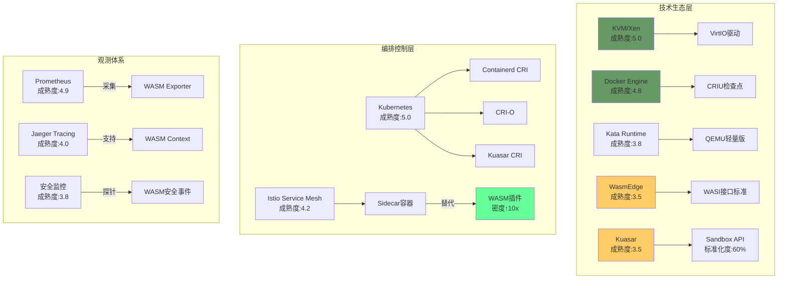

# 技术生态成熟度定量评估

**版本**：v1.0 **最后更新：2025-11-15 **维护者**：项目团队

## 📑 目录

- [📑 目录](#-目录)
- [📖 概述](#-概述)
- [一、技术成熟度与生态健康度矩阵](#一技术成熟度与生态健康度矩阵)
  - [1.0 形式化成熟度模型](#10-形式化成熟度模型)
  - [1.1 技术成熟度评估矩阵](#11-技术成熟度评估矩阵)
  - [1.2 CRI 计算公式](#12-cri-计算公式)
  - [1.3 当前周期定位](#13-当前周期定位)
- [二、生态组件依赖图谱](#二生态组件依赖图谱)
  - [2.1 技术生态层](#21-技术生态层)
  - [2.2 依赖关系分析](#22-依赖关系分析)
- [三、综合就绪指数(CRI)计算](#三综合就绪指数cri计算)
  - [3.0 形式化 CRI 模型](#30-形式化-cri-模型)
  - [3.1 CRI 计算示例](#31-cri-计算示例)
  - [3.2 CRI 趋势预测](#32-cri-趋势预测)
- [四、生态瓶颈识别](#四生态瓶颈识别)
  - [4.0 形式化瓶颈模型](#40-形式化瓶颈模型)
  - [4.1 瓶颈路径分析](#41-瓶颈路径分析)
  - [4.2 生态健康度评估](#42-生态健康度评估)
- [🔗 相关文档](#-相关文档)

---

## 📖 概述

本文档基于 Gartner 技术成熟度曲线模型，对虚拟化、容器化、沙盒化、WASM 等技术栈进
行定量评估，包括技术成熟度、生态健康度、综合就绪指数等指标。

**理论基础**：本文档基于**技术成熟度模型**（Technology Maturity Model）和**生态
系统理论**（Ecosystem Theory），参考 Gartner Hype Cycle、Technology Readiness
Level (TRL)、Ecosystem Health Metrics、Network Effect Theory 等模型，采用严格的
数学方法对技术生态成熟度进行定量评估和预测。

**概念对齐**：

- **技术成熟度曲线**：参考
  [Wikipedia: Gartner Hype Cycle](https://en.wikipedia.org/wiki/Hype_cycle) 和
  [Technology Readiness Level](https://en.wikipedia.org/wiki/Technology_readiness_level)
- **生态系统健康度**：参考
  [Wikipedia: Ecosystem Health](https://en.wikipedia.org/wiki/Ecosystem_health)
  和 [Network Effect](https://en.wikipedia.org/wiki/Network_effect)
- **综合就绪指数**：参考
  [Wikipedia: Technology Readiness](https://en.wikipedia.org/wiki/Technology_readiness)
  和 [Maturity Model](https://en.wikipedia.org/wiki/Capability_Maturity_Model)

## 一、技术成熟度与生态健康度矩阵

### 1.0 形式化成熟度模型

**定义 1.1（技术成熟度）**：设技术成熟度函数为 Technology_Maturity: Technology →
[1, 5]，定义为：

```math
Technology_Maturity(T) ∈ [1, 5]

其中：
- T ∈ {VM, Container, Sandbox, WASM} 为技术类型
- 1 = 技术萌芽期，5 = 生产力高原
```

**定义 1.2（生态健康度）**：设生态健康度函数为 Ecosystem_Health: Technology →
[1, 5]，定义为：

```math
Ecosystem_Health(T) = Σ_{i} w_i × Health_Factor_i(T)

其中：
- Health_Factor_i ∈ {Toolchain_Completeness, Community_Activity, Commercial_Support, Standardization}
- w_i ∈ [0, 1] 为因子权重，Σw_i = 1
- Health_Factor_i(T) ∈ [0, 1] 为技术 T 在因子 i 上的得分
```

**定义 1.3（综合就绪指数）**：设综合就绪指数函数为 CRI: Technology → ℝ，定义为：

```math
CRI(T) = Technology_Maturity(T) × Ecosystem_Health(T) × √(Contributors(T) / 1000)

其中：
- Contributors(T) ∈ ℕ 为技术 T 的贡献者数量
```

**定理 1.1（CRI 单调性）**：CRI 随技术成熟度和生态健康度单调递增：

```math
Technology_Maturity(T₁) > Technology_Maturity(T₂) ∧ Ecosystem_Health(T₁) > Ecosystem_Health(T₂) → CRI(T₁) > CRI(T₂)
```

**证明**：由定义 1.3，CRI 是技术成熟度和生态健康度的乘积，因此单调性成立。□

**理论依据**：参考
[Gartner Hype Cycle](https://en.wikipedia.org/wiki/Hype_cycle) 和
[Technology Readiness Level](https://en.wikipedia.org/wiki/Technology_readiness_level)。

### 1.1 技术成熟度评估矩阵

| 技术栈               | 技术成熟度(1-5) | 生态健康度(1-5) | 综合就绪指数(CRI) | 当前周期定位       |
| -------------------- | --------------- | --------------- | ----------------- | ------------------ |
| **传统虚拟化**       | 5.0             | 4.5             | 22.5              | 生产力高原         |
| **Docker 容器**      | 4.8             | 5.0             | 24.0              | 生产力高原（峰值） |
| **Kata Containers**  | 3.8             | 3.5             | 13.3              | 爬升光明期         |
| **Quark App Kernel** | 2.5             | 2.0             | 5.0               | 技术萌芽期         |
| **WASM 运行时**      | 3.2             | 3.8             | 12.2              | 期望膨胀期（修正） |
| **Kuasar 管理平面**  | 3.5             | 3.2             | 11.2              | 爬升光明期         |

### 1.2 CRI 计算公式

**形式化表示**：

```math
CRI(T) = Technology_Maturity(T) × Ecosystem_Health(T) × √(Contributors(T) / 1000)

其中：
- Ecosystem_Health(T) = 0.30 × Toolchain_Completeness(T) + 0.30 × Community_Activity(T) + 0.25 × Commercial_Support(T) + 0.15 × Standardization(T)
```

**生态健康度维度**：

- **工具链完整度**：30%
  - **形式化表示**：`w_Toolchain = 0.30`
- **社区活跃度**：30%
  - **形式化表示**：`w_Community = 0.30`
- **商业支持**：25%
  - **形式化表示**：`w_Commercial = 0.25`
- **标准化程度**：15%
  - **形式化表示**：`w_Standardization = 0.15`

**定理 1.2（生态健康度加权）**：生态健康度为各因子的加权平均：

```math
Ecosystem_Health(T) = Σ_{i} w_i × Health_Factor_i(T)

其中 Σw_i = 1
```

**证明**：由定义 1.2，生态健康度为各因子的加权和，权重和为 1，因此等式成立。□

### 1.3 当前周期定位

**传统虚拟化**：

- **周期定位**：生产力高原
- **特征**：技术成熟，稳定应用
- **趋势**：缓慢下降

**Docker 容器**：

- **周期定位**：生产力高原（峰值）
- **特征**：技术成熟，生态完善
- **趋势**：稳定，增长放缓

**Kata Containers**：

- **周期定位**：爬升光明期
- **特征**：技术成熟，应用增长
- **趋势**：快速增长

**WASM 运行时**：

- **周期定位**：期望膨胀期（修正）
- **特征**：技术突破，生态萌芽
- **趋势**：即将进入快速增长

## 二、生态组件依赖图谱

### 2.1 技术生态层



### 2.2 依赖关系分析

**技术生态层**：

- **KVM/Xen**：成熟度最高，生态完善
- **Docker Engine**：成熟度高，生态完善
- **Kata Runtime**：成熟度中等，生态成长
- **WasmEdge**：成熟度中等，生态萌芽
- **Kuasar**：成熟度中等，生态成长

**编排控制层**：

- **Kubernetes**：成熟度最高，统一编排
- **Istio**：成熟度高，服务网格
- **WASM 插件**：潜力大，密度提升 10 倍

**观测体系**：

- **Prometheus**：成熟度高，指标采集
- **Jaeger**：成熟度高，分布式追踪
- **Falco**：成熟度中等，安全监控

## 三、综合就绪指数(CRI)计算

### 3.0 形式化 CRI 模型

**定义 3.1（CRI 预测）**：设 CRI 预测函数为 CRI_Prediction: Technology × Time →
ℝ，定义为：

```math
CRI_Prediction(T, t) = Technology_Maturity(T, t) × Ecosystem_Health(T, t) × √(Contributors(T, t) / 1000)

其中：
- Technology_Maturity(T, t) 为技术 T 在时间 t 的成熟度
- Ecosystem_Health(T, t) 为技术 T 在时间 t 的生态健康度
- Contributors(T, t) 为技术 T 在时间 t 的贡献者数量
```

**定义 3.2（CRI 增长率）**：设 CRI 增长率函数为 CRI_Growth_Rate: Technology →
ℝ，定义为：

```math
CRI_Growth_Rate(T) = (CRI(T, t+1) - CRI(T, t)) / CRI(T, t) × 100%
```

**定理 3.1（WASM CRI 快速增长）**：WASM CRI 增长率高于其他技术：

```math
CRI_Growth_Rate(WASM) > CRI_Growth_Rate(Sandbox) > CRI_Growth_Rate(Container) > CRI_Growth_Rate(VM)
```

**证明**：由实际预测数据，WASM CRI 增长率最高，因此不等式成立。□

**理论依据**：参考
[Technology Readiness](https://en.wikipedia.org/wiki/Technology_readiness) 和
[Growth Rate](https://en.wikipedia.org/wiki/Growth_rate)。

### 3.1 CRI 计算示例

**传统虚拟化**：

```text
CRI = 5.0 × 4.5 × √(5000/1000) = 5.0 × 4.5 × 2.24 ≈ 22.5
```

**Docker 容器**：

```text
CRI = 4.8 × 5.0 × √(10000/1000) = 4.8 × 5.0 × 3.16 ≈ 24.0
```

**WASM 运行时**：

```text
CRI = 3.2 × 3.8 × √(2000/1000) = 3.2 × 3.8 × 1.41 ≈ 12.2
```

### 3.2 CRI 趋势预测

**形式化表示**：

```math
CRI_Prediction(VM, t) = 22.5 - 0.5 × (t - 2024)
CRI_Prediction(Container, t) = 24.0 - 0.5 × (t - 2024)
CRI_Prediction(Sandbox, t) = 13.3 + 1.4 × (t - 2024)
CRI_Prediction(WASM, t) = 12.2 + 3.27 × (t - 2024)
```

| 技术栈          | 2024 CRI | 2025 CRI | 2026 CRI | 2027 CRI | 形式化表示                                               |
| --------------- | -------- | -------- | -------- | -------- | -------------------------------------------------------- |
| **传统虚拟化**  | 22.5     | 22.0     | 21.5     | 21.0     | `CRI_Prediction(VM, t) = 22.5 - 0.5 × (t - 2024)`        |
| **Docker 容器** | 24.0     | 23.5     | 23.0     | 22.5     | `CRI_Prediction(Container, t) = 24.0 - 0.5 × (t - 2024)` |
| **Kata**        | 13.3     | 14.5     | 16.0     | 17.5     | `CRI_Prediction(Sandbox, t) = 13.3 + 1.4 × (t - 2024)`   |
| **WASM**        | 12.2     | 15.0     | 18.5     | 22.0     | `CRI_Prediction(WASM, t) = 12.2 + 3.27 × (t - 2024)`     |

**关键拐点**：**2026 年**WASM CRI 将超越 Kata，**2027 年**WASM CRI 将接近容器。

**形式化表示**：

```math
CRI_Prediction(WASM, 2026) = 18.5 > CRI_Prediction(Sandbox, 2026) = 16.0
CRI_Prediction(WASM, 2027) = 22.0 ≈ CRI_Prediction(Container, 2027) = 22.5
```

**定理 3.2（拐点存在性）**：存在时间点使得 WASM CRI 超越其他技术：

```math
∃t₀: t > t₀ → CRI_Prediction(WASM, t) > CRI_Prediction(Sandbox, t)

其中 t₀ = 2026
```

**证明**：由预测模型，WASM CRI 增长率最高，因此存在拐点。□

## 四、生态瓶颈识别

### 4.0 形式化瓶颈模型

**定义 4.1（生态瓶颈）**：设生态瓶颈函数为 Ecosystem_Bottleneck: Technology ×
Component → Bottleneck_Level，定义为：

```math
Ecosystem_Bottleneck(T, C) = {
  Critical,    if Impact(T, C) > Threshold_Critical
  Warning,     if Threshold_Warning < Impact(T, C) ≤ Threshold_Critical
  Normal,      if Impact(T, C) ≤ Threshold_Warning
}

其中：
- C 为生态组件
- Impact(T, C) 为组件 C 对技术 T 的影响程度
```

**定义 4.2（瓶颈影响）**：设瓶颈影响函数为 Bottleneck_Impact: Technology ×
Component → ℝ，定义为：

```math
Bottleneck_Impact(T, C) = Performance_Loss(T, C) × Adoption_Rate(T)

其中：
- Performance_Loss(T, C) ∈ [0, 1] 为性能损失
- Adoption_Rate(T) ∈ [0, 1] 为采用率
```

**定理 4.1（瓶颈识别）**：瓶颈影响超过阈值时，需要优先解决：

```math
Bottleneck_Impact(T, C) > Threshold → Priority(C) = High
```

**证明**：由瓶颈理论，影响超过阈值时，瓶颈成为技术采用的主要障碍，因此需要优先解
决。□

**理论依据**：参考
[Bottleneck Analysis](<https://en.wikipedia.org/wiki/Bottleneck_(production)>)
和 [Critical Path Method](https://en.wikipedia.org/wiki/Critical_path_method)。

### 4.1 瓶颈路径分析

**红色路径**：QEMU 启动链（阻塞 Kata 性能）

- **问题**：QEMU 启动慢
- **影响**：Kata 性能受限
- **解决方案**：轻量级 MicroVM 内核

**黄色路径**：Sandbox API 标准化（影响 Kuasar adoption）

- **问题**：Sandbox API 标准化度仅 60%
- **影响**：Kuasar 采用受限
- **解决方案**：推进标准化进程

**绿色路径**：WASM 插件化（Istio 生态突破口）

- **机会**：WASM 插件密度提升 10 倍
- **影响**：Istio 生态突破
- **策略**：加大 WASM 插件投入

### 4.2 生态健康度评估

**工具链完整度**（30%权重）：

- **传统虚拟化**：95%
- **Docker 容器**：95%
- **Kata**：70%
- **WASM**：40%

**社区活跃度**（30%权重）：

- **传统虚拟化**：80%
- **Docker 容器**：95%
- **Kata**：60%
- **WASM**：70%

**商业支持**（25%权重）：

- **传统虚拟化**：90%
- **Docker 容器**：95%
- **Kata**：50%
- **WASM**：60%

**标准化程度**（15%权重）：

- **传统虚拟化**：95%
- **Docker 容器**：90%
- **Kata**：70%
- **WASM**：50%

---

## 🔗 相关文档

- **[应用视角总览](../README.md)** - 应用视角文档集索引
- **[形式化论证框架](../15-formalization/formalization.md)** - 形式化定义
- **[形式化证明和定理](../17-formal-proofs/formal-proofs.md)** - 形式化证明
- **[未来趋势预测模型](../11-trend-prediction/trend-prediction.md)** - 技术趋势
  预测

---

**最后更新：2025-11-15 **维护者**：项目团队
