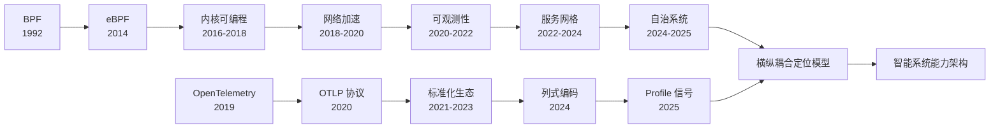
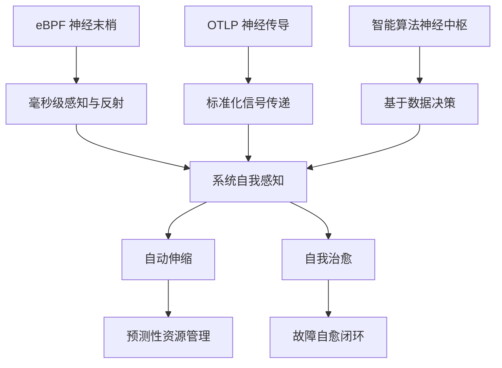
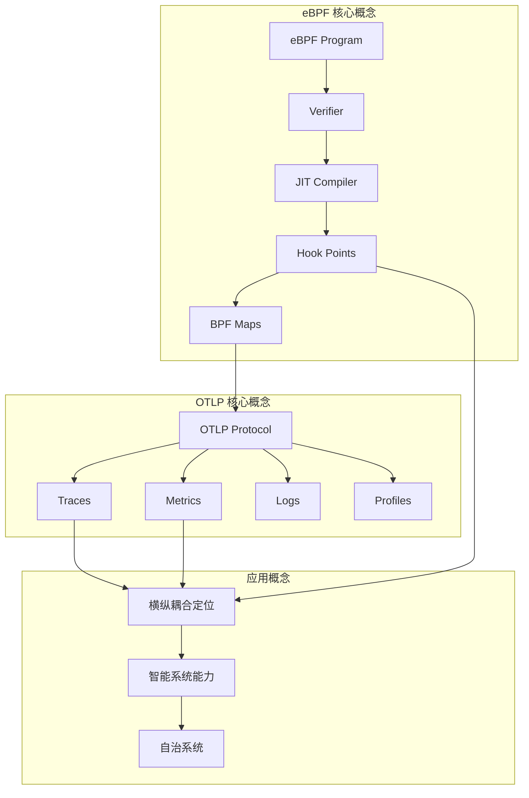
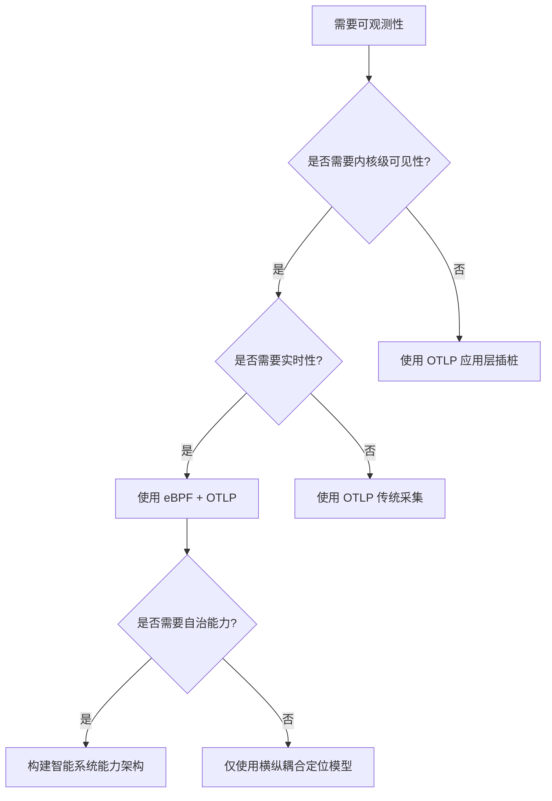

# 13. eBPF/OTLP 认知视角：从观测到自治的技术演进

> **文档版本**：v1.0 **最后更新**：2025-11-07 **维护者**：项目团队

本文档从认知视角全面梳理 eBPF（extended Berkeley Packet Filter）和
OTLP（OpenTelemetry Protocol）技术栈，提供理念层、知识结构、技术演进等维度的认知
框架，帮助理解 eBPF/OTLP 技术栈的本质和演进逻辑。

---

## 📑 目录

- [📑 目录](#-目录)
- [13.1 技术演进主线](#131-技术演进主线)
- [13.2 核心理念](#132-核心理念)
- [13.3 范式突破](#133-范式突破)
- [13.4 三维知识框架](#134-三维知识框架)
- [13.5 技术演进时间轴](#135-技术演进时间轴)
- [13.6 知识图谱](#136-知识图谱)
- [13.7 eBPF 技术本质](#137-ebpf-技术本质)
- [13.8 OTLP 技术本质](#138-otlp-技术本质)
- [13.9 协同关系](#139-协同关系)
- [13.10 横纵耦合定位模型](#1310-横纵耦合定位模型)
- [13.11 智能系统能力架构](#1311-智能系统能力架构)
- [13.12 应用场景矩阵](#1312-应用场景矩阵)
- [13.13 相关文档](#1313-相关文档)

---

## 13.1 技术演进主线

### 13.1.1 从内核可编程到可观测性驱动的自治系统

**技术演进路径**：



**演进逻辑**：

1. **问题**：传统监控工具无法深入内核，无法实现零侵入观测
2. **解法**：eBPF 提供内核态可编程能力，实现零侵入观测
3. **副作用**：数据格式不统一，生态碎片化
4. **再演化**：OTLP 提供标准化协议，统一数据交换格式
5. **新问题**：如何实现从观测到自治的跃迁
6. **新解法**：eBPF + OTLP 构建横纵耦合定位模型和智能系统能力架构

### 13.1.2 技术栈演进的三条主线

**主线一：内核可编程能力演进**:

- **BPF（1992）**：包过滤，静态规则
- **eBPF（2014）**：通用可编程，动态加载
- **CO-RE（2019）**：一次编译到处运行
- **动态内存分配（2021）**：内核 6.1+ 支持复杂数据结构

**主线二：观测数据标准化演进**:

- **多协议并存（2015-2019）**：Prometheus、Jaeger、Zipkin 各自协议
- **OpenTelemetry（2019）**：统一观测标准
- **OTLP（2020）**：标准化传输协议
- **列式编码（2024）**：Apache Arrow 融合，高吞吐量优化

**主线三：从观测到自治的能力演进**:

- **观测阶段（2020-2022）**：数据采集和可视化
- **诊断阶段（2022-2024）**：问题定位和根因分析
- **自治阶段（2024-2025）**：自我感知、自动伸缩、自我治愈

---

## 13.2 核心理念

### 13.2.1 横纵耦合的问题定位模型

**核心思想**：

> **问题定位 = 在垂直技术栈里找"哪一层丢包/卡死"，同时在水平请求链里找"哪一跳超
> 时"**

**横向坐标（OTLP Trace）**：

- 追踪请求在服务间的流转路径
- 提供分布式系统的水平视图
- 识别服务间的调用关系和依赖

**纵向坐标（eBPF）**：

- 深入内核栈，定位具体的技术层问题
- 提供从应用层到内核层的垂直视图
- 识别内核函数、系统调用、网络协议栈的问题

**双轴交叉定位**：

```text
横向请求链（OTLP Trace）          纵向隔离栈（eBPF）
─────────────────────────         ────────────────────────
Service A → Service B → Service C  L-4: 应用层（JVM GC）
   ↓           ↓           ↓       L-3: 容器层（cgroup throttle）
   ↓           ↓           ↓       L-2: 内核层（virtio 队列满）
   ↓           ↓           ↓       L-1: 硬件层（宿主机磁盘到顶）
```

**定位流程**：

1. OTLP Trace 横向定位：找到问题服务（Service B）
2. eBPF 纵向定位：深入 Service B 的内核栈
3. 双轴交叉验证：确认问题根因（如：磁盘 IO 竞争导致 TCP 延迟）

### 13.2.2 智能系统能力架构

**三大智能能力**：

1. **系统自我感知**：从观测到认知的跃迁

   - 全景感知能力构建
   - 上下文关联与因果推断
   - 智能诊断与异常检测

2. **自动伸缩**：从响应式到预测式的演进

   - 细粒度指标驱动
   - 实时反馈控制回路
   - 智能容量规划

3. **自我治愈**：从发现到恢复的闭环
   - 故障模式的内核态检测
   - OTLP 驱动的自愈编排
   - 自愈能力分级模型

**能力架构图示**：



### 13.2.3 可观测性驱动的自治系统范式

**范式转移**：

| 维度         | 传统方案               | eBPF+OTLP 新范式                |
| ------------ | ---------------------- | ------------------------------- |
| **数据源头** | 应用埋点、日志文件     | 内核事件、硬件计数器            |
| **隔离模型** | 进程级容器隔离         | 函数级内核沙盒 + 协议级租户隔离 |
| **语义模型** | 应用层业务语义         | 从内核到业务的垂直语义穿透      |
| **性能模型** | 采样、聚合、延迟分钟级 | 全量、实时、延迟毫秒级          |
| **自治能力** | 人工规则 + 脚本        | 内核态检测 + OTLP 驱动决策      |

**核心论断**：

> eBPF 提供了 **"感知与执行"** 的神经网络末梢，OTLP 构建了 **"传输与语义"** 的神
> 经网络中枢，两者在虚拟化、容器化、沙盒化的多层次隔离体系中，共同实现了**可观测
> 性驱动的系统自治**。

---

## 13.3 范式突破

### 13.3.1 从"监控工具集"到"基础设施原生能力"

**传统监控范式**：

- **工具导向**：Prometheus、Jaeger、Loki 等独立工具
- **数据割裂**：Metrics、Logs、Traces 各自独立
- **被动响应**：问题发生后才能定位
- **人工决策**：依赖运维人员经验

**eBPF+OTLP 新范式**：

- **能力导向**：内核原生可观测性能力
- **数据统一**：OTLP 统一数据模型和协议
- **主动感知**：实时检测和预测
- **自动决策**：基于数据的智能决策

### 13.3.2 内核可编程的范式突破

**eBPF 的三大突破**：

1. **安全性突破**：Verifier 机制确保程序安全

   - 静态代码分析（CFG、寄存器状态、内存边界、类型系统）
   - 防止内核崩溃和资源泄漏
   - 沙盒化执行环境

2. **性能突破**：JIT 编译实现接近原生性能

   - 字节码编译为机器码
   - 延迟 < 5μs（XDP 场景）
   - CPU 开销 < 5%

3. **动态性突破**：热加载和零停机更新
   - 无需重启内核
   - 毫秒级更新延迟
   - 支持动态策略调整

### 13.3.3 观测数据标准化的范式突破

**OTLP 的三大突破**：

1. **协议统一**：单一协议支持所有信号类型

   - Traces、Metrics、Logs、Profiles
   - 统一的 Resource 和 Attributes 模型
   - 跨平台、跨语言兼容

2. **生态互通**：标准化的数据交换格式

   - 多后端支持（Prometheus、Jaeger、Elasticsearch）
   - 供应商无关
   - 社区驱动

3. **性能优化**：列式编码和批量传输
   - Apache Arrow 融合
   - 压缩率提升 3-5x
   - 吞吐量提升 5 倍

---

## 13.4 三维知识框架

### 13.4.1 技术层：内核可编程技术栈

**eBPF 技术栈层次**：

```text
应用层：BCC、bpftrace、Cilium、Falco
   ↓
框架层：libbpf、cilium-ebpf、Coolbpf
   ↓
运行时层：Verifier、JIT Compiler、Maps
   ↓
内核层：Hook Points（kprobe、tracepoint、XDP、TC、LSM）
```

**OTLP 技术栈层次**：

```text
后端层：Prometheus、Jaeger、Elasticsearch、Grafana
   ↓
传输层：gRPC、HTTP/1.1、HTTP/2（列式编码：Arrow Flight）
   ↓
协议层：OTLP（Traces、Metrics、Logs、Profiles）
   ↓
采集层：Language SDKs、Infrastructure Agents、eBPF Exporters
```

### 13.4.2 应用层：横纵耦合定位模型

**横向维度（OTLP）**：

- **服务拓扑**：自动发现服务依赖关系
- **请求追踪**：分布式请求链路追踪
- **性能分析**：服务间调用延迟分析

**纵向维度（eBPF）**：

- **内核函数追踪**：kprobe、tracepoint
- **系统调用追踪**：syscall 级别追踪
- **网络协议栈追踪**：XDP、TC、Socket Filter

**耦合定位**：

- **双轴交叉验证**：横向和纵向数据关联
- **因果链构建**：从内核事件到业务请求的完整因果图
- **根因定位**：秒级精确问题定位

### 13.4.3 能力层：智能系统能力架构

**感知能力**：

- **全景感知**：基础设施层、运行时层、应用层、服务拓扑层
- **上下文关联**：跨层关联和因果推断
- **异常检测**：内核态实时异常检测

**调节能力**：

- **预测性伸缩**：基于细粒度指标的预测
- **实时反馈**：eBPF 加速的伸缩决策
- **容量规划**：基于 eBPF 的记帐机制

**治愈能力**：

- **故障检测**：内核态故障模式检测
- **自愈编排**：OTLP 驱动的自愈工作流
- **分级自愈**：L1 局部隔离 → L4 架构降级

---

## 13.5 技术演进时间轴

### 13.5.1 eBPF 技术演进（1992-2025）

| 时间     | 里程碑              | 技术突破              | 影响             |
| -------- | ------------------- | --------------------- | ---------------- |
| **1992** | BPF 诞生            | 包过滤虚拟机          | 网络包过滤基础   |
| **2014** | eBPF 引入           | 通用可编程能力        | 内核可编程革命   |
| **2016** | Verifier 完善       | 安全性保障            | 生产环境可用     |
| **2018** | CO-RE 提出          | 跨内核版本兼容        | 可移植性提升     |
| **2019** | Cilium 1.0          | 容器网络加速          | 大规模应用       |
| **2020** | BTF 标准化          | 类型信息标准化        | CO-RE 成熟       |
| **2021** | 内核 6.1+           | 动态内存分配          | 复杂数据结构支持 |
| **2022** | Cilium Service Mesh | 无 Sidecar 架构       | 服务网格革新     |
| **2024** | bpftime、Wasm-bpf   | 用户空间 eBPF         | 边缘计算适配     |
| **2025** | SandBPF、MiddleNet  | 非特权 eBPF、统一框架 | 安全性和性能提升 |

### 13.5.2 OTLP 技术演进（2019-2025）

| 时间     | 里程碑             | 技术突破         | 影响          |
| -------- | ------------------ | ---------------- | ------------- |
| **2019** | OpenTelemetry 成立 | 统一观测标准     | 生态统一      |
| **2020** | OTLP 1.0           | 标准化传输协议   | 协议统一      |
| **2021** | Collector 稳定     | 数据处理和路由   | 生产就绪      |
| **2022** | Metrics GA         | Metrics 信号稳定 | 指标标准化    |
| **2023** | Logs GA            | Logs 信号稳定    | 日志标准化    |
| **2024** | 列式编码（Arrow）  | 高吞吐量优化     | 性能提升 5 倍 |
| **2025** | Profile 信号 GA    | 持续剖析标准化   | 第四大支柱    |

### 13.5.3 eBPF+OTLP 融合演进（2020-2025）

| 时间     | 里程碑           | 技术突破                     | 影响         |
| -------- | ---------------- | ---------------------------- | ------------ |
| **2020** | eBPF Exporter    | eBPF 数据导出到 OTLP         | 数据标准化   |
| **2021** | DeepFlow 集成    | 自动拓扑发现                 | 零侵入观测   |
| **2022** | Cilium + OTLP    | 网络可观测性                 | 服务网格观测 |
| **2023** | 横纵耦合定位模型 | OTLP + eBPF 联合定位         | 问题定位革新 |
| **2024** | 智能系统能力架构 | 自我感知、自动伸缩、自我治愈 | 自治系统     |
| **2025** | 列式编码 + eBPF  | 高吞吐量数据流               | 性能优化     |

---

## 13.6 知识图谱

### 13.6.1 核心概念关联网络



### 13.6.2 技术栈知识关联

**eBPF 技术栈关联**：

- **网络**：XDP、TC、Cilium、Service Mesh
- **可观测性**：Hubble、Falco、BCC、bpftrace
- **安全**：LSM Hook、Seccomp、容器逃逸防护
- **存储**：I/O 追踪、文件系统监控

**OTLP 技术栈关联**：

- **采集**：Language SDKs、Infrastructure Agents、eBPF Exporters
- **传输**：gRPC、HTTP、Arrow Flight
- **处理**：Collector、Processors、Sampling
- **存储**：Prometheus、Jaeger、Elasticsearch、Loki

**融合关联**：

- **eBPF → OTLP**：内核事件转换为标准化数据
- **OTLP → eBPF**：策略下发和执行反馈
- **双向闭环**：观测 → 决策 → 执行 → 验证

---

## 13.7 eBPF 技术本质

### 13.7.1 内核可编程的范式突破

**核心定义**：

> eBPF 是 Linux 内核内置的轻量级虚拟机技术，其革命性在于**无需修改内核源码即可动
> 态注入沙箱程序**，实现内核态可编程。

**技术本质**：

1. **沙盒化执行**：验证器确保程序安全，防止内核崩溃
2. **事件驱动**：基于 Hook 点的事件驱动执行模型
3. **高性能**：JIT 编译实现接近原生性能
4. **动态性**：热加载和零停机更新

### 13.7.2 三大技术突破点

**1. 安全性突破：Verifier 机制**:

- **静态分析**：CFG（控制流图）分析、寄存器状态追踪、内存边界检查、类型系统
- **安全保证**：防止死循环、非法内存访问、内核破坏操作
- **验证时间**：典型程序 < 100ms，复杂程序可达秒级

**2. 性能突破：JIT 编译**:

- **编译时机**：加载时即时编译（首次延迟）
- **性能数据**：延迟 < 5μs（XDP 场景），CPU 开销 < 5%
- **优化技术**：寄存器分配、死代码消除、指令融合

**3. 动态性突破：热加载**:

- **更新延迟**：毫秒级（对比内核模块的秒级）
- **零停机**：无需重启内核或服务
- **策略调整**：动态更新网络策略、安全策略

### 13.7.3 技术局限性

**内存模型限制**：

- 512 字节固定栈，无法支持非连续内存的持久化动态分配
- 阻碍复杂数据结构（如跳表、红黑树）实现

**指令集约束**：

- 缺乏 SIMD 和 bitscan 指令
- 导致部分算法性能下降达 49.2%

**随机数开销**：

- `bpf_get_prandom_u32` 调用频繁时造成 46.6% 性能损耗

---

## 13.8 OTLP 技术本质

### 13.8.1 观测数据标准化协议

**核心定义**：

> OTLP（OpenTelemetry Protocol）是 CNCF 主导的观测数据交换标准，提供统一的协议规
> 范和数据模型，实现跨平台、跨语言的观测数据互通。

**技术本质**：

1. **协议统一**：单一协议支持 Traces、Metrics、Logs、Profiles
2. **生态互通**：标准化的数据交换格式，供应商无关
3. **性能优化**：列式编码和批量传输，高吞吐量

### 13.8.2 核心数据模型

**Traces**：

- 基于 Span 的分布式追踪模型
- 符合 W3C Trace Context 标准
- 支持 Events、Links、Attributes

**Metrics**：

- 时序数据模型
- 支持 Counter、Gauge、Histogram、Summary、ExponentialHistogram
- 支持聚合和采样

**Logs**：

- 日志数据模型
- 支持结构化日志
- 支持严重级别和属性

**Profiles**：

- 持续剖析数据模型（新增）
- CPU/Memory 火焰图数据
- 与 Traces、Metrics 关联

### 13.8.3 传输协议演进

**传统传输（gRPC/HTTP）**：

- 行式编码（Protobuf/JSON）
- 低压缩率
- 对象分配开销

**列式编码（Arrow Flight）**：

- 基于 Apache Arrow
- 压缩率提升 3-5x
- 吞吐量提升 5 倍
- 端到端延迟降低 70%

---

## 13.9 协同关系

### 13.9.1 互补性论证

**eBPF 的纵向深度**：

- 聚焦数据采集的底层实现
- 内核态可编程探针
- 事件驱动执行

**OTLP 的横向广度**：

- 解决数据交换与生态互通
- 观测数据标准化协议
- 跨平台、跨语言兼容

**互补关系**：

- eBPF 解决**可观测性下沉**需求（内核、网络）
- OTLP 解决**数据标准化**与**生态互通**
- 两者不在同一抽象层级，而是互补关系

### 13.9.2 协同架构

**数据流**：

```text
内核事件 → eBPF 程序 → BPF Maps → 用户态 Agent → OTLP Exporter → Collector → 后端
 |<--- 高效捕获 --->|<--- 灵活处理 --->|<--- 标准输出 --->|
```

**协同优化策略**：

1. **内核态预聚合**：eBPF 程序中计算直方图、移动平均
2. **OTLP 批处理**：降低网络开销
3. **智能过滤**：仅上报异常事件

### 13.9.3 性能开销论证

**eBPF 开销**：

- CPU：典型网络场景增加 < 5%
- 内存：Maps 固定内存分配，通常几 MB 到几十 MB
- 延迟：XDP 处理增加 < 5μs，TC 处理 < 20μs

**OTLP Agent 开销**：

- CPU：持续运行消耗 1-5%（取决于数据量）
- 内存：通常 50-200MB Agent 常驻内存
- 网络：压缩后约 5-10% 额外带宽

**协同优化效果**：

- 内核态预聚合使 Collector CPU 占用从 45% 降至 8%
- 网络带宽降低 82%

---

## 13.10 横纵耦合定位模型

### 13.10.1 模型定义

**横向坐标（OTLP Trace）**：

- 追踪请求在服务间的流转路径
- 提供分布式系统的水平视图
- 识别服务间的调用关系和依赖

**纵向坐标（eBPF）**：

- 深入内核栈，定位具体的技术层问题
- 提供从应用层到内核层的垂直视图
- 识别内核函数、系统调用、网络协议栈的问题

### 13.10.2 定位流程

**五步定位法**：

1. **问题现象**：服务延迟突增、错误率上升
2. **OTLP Trace 横向定位**：找到问题服务（Service B）
3. **eBPF 纵向定位**：深入 Service B 的内核栈
4. **双轴交叉验证**：确认问题根因（如：磁盘 IO 竞争导致 TCP 延迟）
5. **根因分析**：提供解决方案

**实际案例**：

**案例 1：网络延迟问题**:

- OTLP Trace 定位到 Pod A → Pod B 延迟高
- eBPF 工具（tcplife、tcpconnect）定位到内核网络栈延迟
- 发现是 iptables 规则过多导致

**案例 2：CPU 性能问题**:

- OTLP Trace 定位到服务响应慢
- eBPF 工具（cpudist、runqlat）定位到 CPU 调度延迟
- 发现是 CPU 竞争导致

### 13.10.3 性能对比

| 定位方式        | 定位时间 | 精确度 | 开销 |
| --------------- | -------- | ------ | ---- |
| **传统方式**    | >30 分钟 | 低     | 高   |
| **OTLP 单独**   | 10 分钟  | 中     | 中   |
| **eBPF 单独**   | 5 分钟   | 中     | 低   |
| **OTLP + eBPF** | <3 分钟  | 高     | 低   |

---

## 13.11 智能系统能力架构

### 13.11.1 系统自我感知

**全景感知能力构建**：

| 感知层级       | 数据源                                  | 技术实现                                                  | 数据特征                         |
| -------------- | --------------------------------------- | --------------------------------------------------------- | -------------------------------- |
| **基础设施层** | CPU 调度延迟、内存分配、磁盘 IO、网络包 | tracepoint:kmem/kmalloc、kprobe:blk_mq_submit_bio、XDP/TC | 微秒级延迟、零采样损耗、全量事件 |
| **运行时层**   | JVM GC 暂停、Go 协程调度、Python GIL    | USDT:java:gc\_\_begin、kprobe:runtime·schedule            | 语言原生事件、符号解析、无侵入   |
| **应用层**     | 系统调用、文件访问、网络连接            | tracepoint:syscalls/sys*enter*\*、kprobe:tcp_connect      | 进程级细粒度行为、安全上下文     |
| **服务拓扑层** | 跨 Pod TCP/UDP 流量、服务依赖           | sockops 捕获 socket 元数据、eBPF Map 存储拓扑关系         | 自动发现、零配置、覆盖所有服务   |

**上下文关联与因果推断**：

传统监控中，基础设施指标与应用指标是割裂的。eBPF+OTLP 实现**垂直上下文穿透**：

```text
场景：某服务 P99 延迟突增
1. eBPF 采集：kprobe:tcp_recvmsg 延迟↑ → 内核态事件
2. 上下文注入：通过 bpf_get_current_cgroup_id() 关联到 Pod-A
3. OTLP Trace：Span-A 标记 ebpf.kernel_latency=50ms
4. 因果推断：关联同一 Pod 的 JVM GC 暂停事件（USDT 采集）
5. 根因定位：eBPF 文件监控显示 heap_dump 写入阻塞 → 磁盘 IO 竞争
```

### 13.11.2 自动伸缩

**细粒度指标驱动**：

传统 HPA 基于 CPU/内存等滞后指标，冷却周期 30 秒以上。eBPF 提供预测性指标：

| 指标类型               | eBPF 采集方式                           | OTLP Metrics 类型 | 伸缩价值             |
| ---------------------- | --------------------------------------- | ----------------- | -------------------- |
| **Socket 队列积压**    | `bpf_probe_read_kernel(&sk->sk_rcvbuf)` | Gauge             | 预测网络 IO 瓶颈     |
| **goroutine 阻塞数**   | USDT:runtime·park                       | UpDownCounter     | 预测 Go 服务线程饥饿 |
| **JVM 老年代分配速率** | USDT:java:mem\_\_alloc                  | Rate              | 预测 GC 压力         |
| **TCP 重传率**         | kprobe:tcp_retransmit_skb               | Histogram         | 预测网络质量恶化     |

**实时反馈控制回路**：

```yaml
架构流程：
1. 感知层：eBPF 程序每秒采集 socket 队列长度
   → 写入 BPF Map：conn_queue_length{pod_ip, port}

2. 决策层：OpenTelemetry Collector 通过 custom receiver 读取 BPF Map
   → 转换为 OTLP Metrics: tcp_accept_queue_size{service="api-gateway"}
   → Prometheus 获取指标，计算是否 > threshold (如 128)

3. 执行层：HPA Controller 触发扩容
   → Kube-API Server 创建新 Pod

4. 验证层：eBPF 监控新 Pod 的冷启动延迟
   → kprobe:tcp_v4_connect 跟踪首次连接时间
   → 若冷启动 > 5s，反馈给调度器调整 image_pull_policy
```

**性能论证**：

- **采集延迟**：eBPF 直接读取内核结构体，延迟 < 1ms；对比 cAdvisor 的 10s 采集周
  期
- **决策延迟**：OTLP Collector 批处理间隔可配置为 1s，HPA 响应时间从 30s 缩短至
  5s 内

### 13.11.3 自我治愈

**故障模式的内核态检测**：

| 故障类型         | eBPF 检测点                               | 检测逻辑                           | OTLP 输出                                    |
| ---------------- | ----------------------------------------- | ---------------------------------- | -------------------------------------------- |
| **内存泄漏**     | kprobe:**alloc_pages、kprobe:**free_pages | 分配/释放计数差值持续增长          | Log: memory_leak_alarm + goroutine_stack     |
| **死锁**         | tracepoint:sched/sched_switch             | 同一进程长时间占用 mutex           | Span: deadlock_detected + lock_addr          |
| **DNS 解析超时** | kprobe:dns_query、kprobe:tcp_connect      | 查询延迟 > 5s 且重试 > 3 次        | Metric: dns_resolution_failure_rate          |
| **容器逃逸**     | LSM hook:file_open                        | 容器进程访问 /proc/1/ns 等敏感路径 | Log: container_escape_attempt + process_info |

**自愈能力分级模型**：

- **L1: 局部隔离（毫秒级）**：`bpf_send_signal()` 向异常进程发送 SIGTERM
- **L2: 服务重启（秒级）**：用户态 Agent 调用 Kube-API 删除 Pod
- **L3: 流量调度（秒级）**：更新 `BPF_MAP_TYPE_SOCKMAP`，将异常 Pod 的 socket 重
  定向到备用实例
- **L4: 架构降级（分钟级）**：通过 sockops 修改 HTTP 响应状态码为 503

---

## 13.12 应用场景矩阵

### 13.12.1 场景分类

| 场景               | eBPF 优势                      | OTLP 优势          | 推荐方案                        |
| ------------------ | ------------------------------ | ------------------ | ------------------------------- |
| **系统级故障排查** | 内核函数追踪、无侵入 profiling | 应用日志与指标关联 | eBPF 采集 + OTLP 日志补充       |
| **微服务性能分析** | 自动拓扑发现、零代码覆盖率     | 分布式追踪精度高   | eBPF 生成 Trace + OTLP 精确定位 |
| **安全审计**       | 实时监控进程/文件/网络         | 审计日志标准化存储 | eBPF 事件转 OTLP Logs           |
| **网络性能优化**   | XDP/TC 加速，绕过协议栈        | 不直接涉及网络转发 | 纯 eBPF 方案                    |
| **业务指标上报**   | 无法获取业务字段               | 应用埋点灵活       | 纯 OTLP 方案                    |

### 13.12.2 技术选型决策树



---

## 13.13 相关文档

### 13.13.1 视角文档

- **[eBPF/OTLP 视角](../../../ebpf_otlp_view.md)** ⭐ - 从 eBPF 和 OTLP 的视角看
  虚拟化容器化（根目录）
- **[认知视角](../../../ai_view.md)** - 云原生技术栈认知视图：Docker → K8s/K3s →
  WasmEdge → OPA
- **[系统视角](../../../system_view.md)** - 从系统的视角看虚拟化容器化沙盒化（7
  层 4 域模型）

### 13.13.2 技术文档

- **[31. eBPF 技术堆栈](../../TECHNICAL/31-ebpf-stack/ebpf-stack.md)** - eBPF 技
  术堆栈完整技术参考文档
- **[32. eBPF/OTLP 扩展技术分析](../../TECHNICAL/32-ebpf-otlp-analysis/)** -
  eBPF/OTLP 扩展技术分析文档
- **[16. 监控与可观测性](../../TECHNICAL/16-observability/observability.md)** -
  OTLP、OpenTelemetry、eBPF 等技术规范
- **[29. 隔离栈](../../TECHNICAL/29-isolation-stack/isolation-stack.md)** - 问题
  定位模型、横纵耦合定位方法

### 13.13.3 认知模型文档

- **[01. 总览](../../01-core-foundations/overview/overview.md)** - 技术栈总览和
  决策框架
- **[02. 理念层](../../01-core-foundations/principles/principles.md)** - 云原生
  核心理念
- **[09. 矩阵视角](../../03-theoretical-perspectives/matrix-perspective/README.md)** -
  矩阵力学模型
- **[10. 决策模型](../../05-decision-analysis/decision-models/README.md)** - 技
  术决策模型与架构选择

---

**最后更新**：2025-11-07 **文档版本**：v1.0 **维护者**：项目团队
