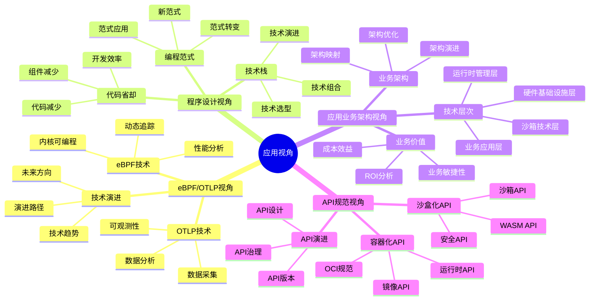
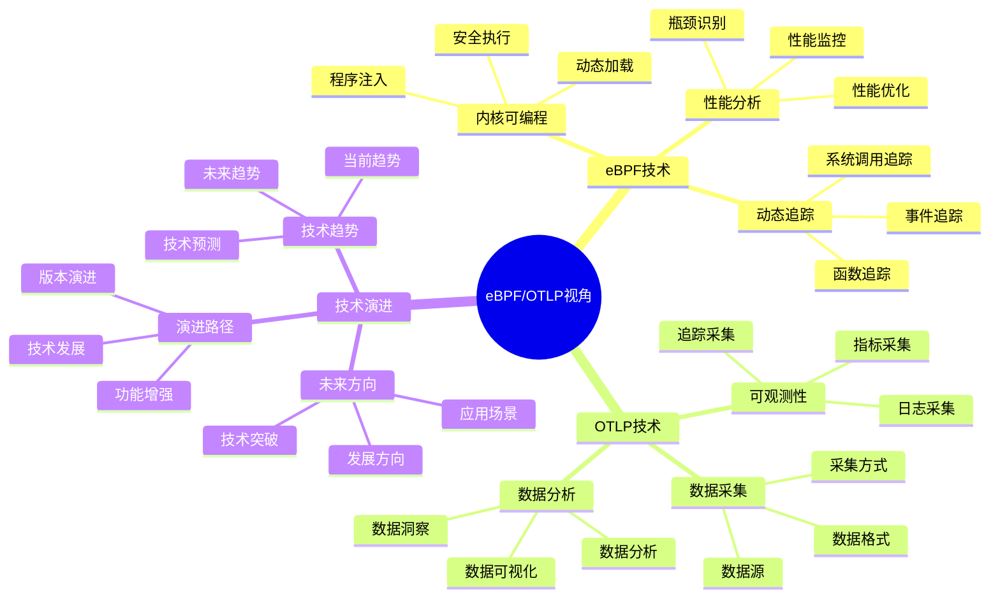
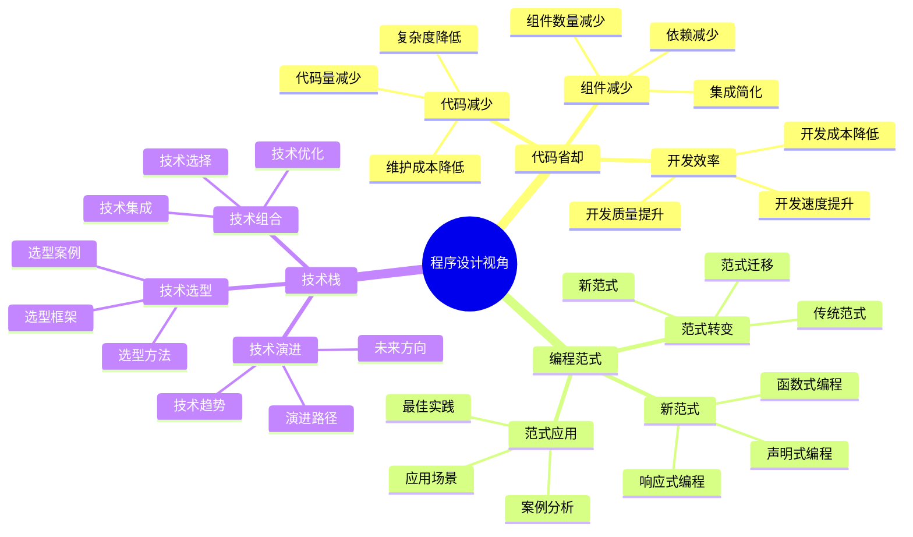
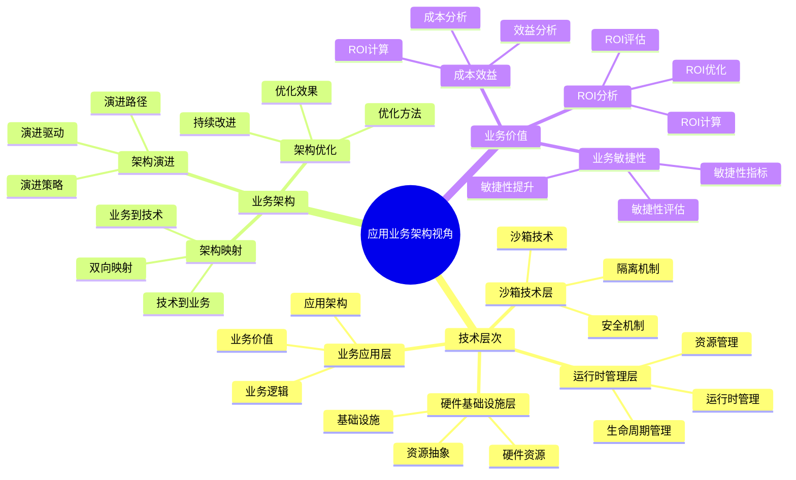
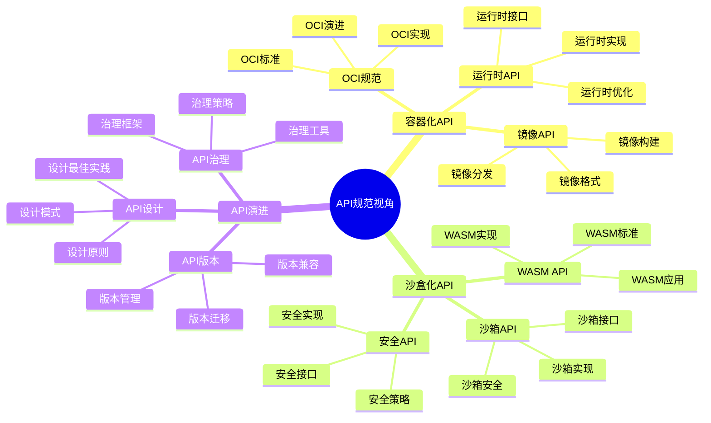

# 应用视角思维导图

## 📑 目录

- [应用视角思维导图](#应用视角思维导图)
  - [📑 目录](#-目录)
  - [1 应用视角全景](#1-应用视角全景)
  - [2 eBPF/OTLP视角思维导图](#2-ebpfotlp视角思维导图)
  - [3 程序设计视角思维导图](#3-程序设计视角思维导图)
  - [4 应用业务架构视角思维导图](#4-应用业务架构视角思维导图)
  - [5 API规范视角思维导图](#5-api规范视角思维导图)
  - [6 使用指南](#6-使用指南)
    - [6.1 快速开始](#61-快速开始)
    - [6.2 视角选择应用](#62-视角选择应用)
    - [6.3 实践应用](#63-实践应用)
  - [7 使用技巧](#7-使用技巧)
    - [7.1 视角选择技巧](#71-视角选择技巧)
    - [7.2 视角应用技巧](#72-视角应用技巧)
  - [8 2025 年最新实践](#8-2025-年最新实践)
    - [8.1 应用视角思维导图应用最佳实践（2025）](#81-应用视角思维导图应用最佳实践2025)
  - [9 实际应用案例](#9-实际应用案例)
    - [案例 1：应用视角思维导图应用（2025）](#案例-1应用视角思维导图应用2025)
  - [10 相关文档](#10-相关文档)

---

## 1 应用视角全景



---

## 2 eBPF/OTLP视角思维导图



---

## 3 程序设计视角思维导图



---

## 4 应用业务架构视角思维导图



---

## 5 API规范视角思维导图



---

## 6 使用指南

### 6.1 快速开始

**适用场景**：应用视角入门、快速了解应用视角

**使用步骤**：

1. **理解应用视角**：从"应用视角全景"开始，理解各个应用视角的核心概念
2. **选择视角**：根据应用场景选择合适的应用视角
3. **深入学习**：深入学习所选视角的详细内容
4. **应用实践**：在实际应用中应用视角和认知模型

**推荐度**：⭐⭐⭐⭐⭐

---

### 6.2 视角选择应用

**适用场景**：技术演进、业务架构、API演进、编程范式

**使用步骤**：

1. **场景识别**：识别应用场景的类型和特征
2. **视角选择**：
   - **可观测性设计** → eBPF/OTLP视角
   - **应用开发** → 程序设计视角
   - **API设计** → API规范视角
   - **业务架构** → 应用业务架构视角
3. **视角应用**：使用相应的认知模型进行分析
4. **综合多视角**：结合多个视角进行全面分析

**推荐度**：⭐⭐⭐⭐⭐

---

### 6.3 实践应用

**适用场景**：实际应用开发、架构设计

**使用步骤**：

1. **视角核心理解**：深入理解每个应用视角的核心思想
2. **分析方法掌握**：掌握视角的分析方法和工具
3. **应用实践**：在实际应用中应用视角和认知模型
4. **技术集成**：参考技术集成指南进行技术集成

**推荐度**：⭐⭐⭐⭐⭐

---

## 7 使用技巧

### 7.1 视角选择技巧

**技巧1：场景导向**

- 根据应用场景的类型和特征选择视角
- 避免盲目选择视角
- 理解各视角的适用场景

**技巧2：多视角结合**

- 结合多个视角进行全面分析
- 避免单一视角的局限性
- 建立多视角分析框架

**技巧3：视角切换**

- 根据应用需要灵活切换视角
- 理解视角之间的关系
- 建立视角切换机制

**推荐度**：⭐⭐⭐⭐⭐

---

### 7.2 视角应用技巧

**技巧1：认知模型应用**

- 使用相应的认知模型进行分析
- 根据场景选择合适的认知模型
- 避免模型滥用

**技巧2：技术集成**

- 参考技术集成指南进行技术集成
- 理解技术之间的关系
- 建立技术集成框架

**技巧3：实践验证**

- 在实际应用中验证视角的有效性
- 积累实践经验
- 持续改进应用方法

**推荐度**：⭐⭐⭐⭐⭐

---

## 8 2025 年最新实践

### 8.1 应用视角思维导图应用最佳实践（2025）

**2025 年趋势**：应用视角思维导图在应用开发、技术选型、架构设计中的深度应用

**实践要点**：

- **视角选择**：根据应用场景选择合适的应用视角
- **视角应用**：系统化应用应用视角进行分析
- **技术集成**：基于视角进行技术集成
- **持续优化**：基于实践效果优化视角应用

**代码示例**：

```python
# 2025 年应用视角思维导图工具
class ApplicationPerspectivesMindmapTool:
    def __init__(self):
        self.selector = PerspectiveSelector()
        self.applicator = PerspectiveApplicator()
        self.integrator = TechnologyIntegrator()
        self.optimizer = PerspectiveOptimizer()

    def select_perspective(self, scenario, requirements):
        """视角选择"""
        return self.selector.select(scenario, requirements)

    def apply_perspective(self, perspective, context):
        """视角应用"""
        return self.applicator.apply(perspective, context)

    def integrate_technologies(self, perspective, technologies):
        """技术集成"""
        return self.integrator.integrate(perspective, technologies)
```

## 9 实际应用案例

### 案例 1：应用视角思维导图应用（2025）

**场景**：使用应用视角思维导图进行云原生应用开发

**实现方案**：

```python
# 应用视角思维导图应用
tool = ApplicationPerspectivesMindmapTool()

# 视角选择
scenario = Scenario(type="cloud_native", domain="microservices")
requirements = Requirements(scale="high", observability="high")
perspective = tool.select_perspective(scenario, requirements)

# 视角应用
context = Context(team="devops", stack="kubernetes")
analysis = tool.apply_perspective(perspective, context)

# 技术集成
technologies = [Technology(name="containerd"), Technology(name="istio")]
integration = tool.integrate_technologies(perspective, technologies)
```

**效果**：

- 视角选择：基于场景选择合适视角，提高视角适用性
- 视角应用：系统化应用视角，保证分析质量
- 技术集成：基于视角集成技术，提高集成效率

---

## 10 相关文档

- **[应用场景认知矩阵](02-application-scenarios-matrix.md)** - 技术演进场景、业务架构场景、API演进场景、编程范式场景
- **[eBPF/OTLP视角详细思维导图](03-ebpf-otlp-detailed-mindmap.md)** - eBPF技术详解、OTLP技术详解、可观测性体系
- **[程序设计视角详细思维导图](04-programming-perspective-detailed.md)** - 代码省却详解、编程范式转变、技术栈演进
- **[API规范视角详细思维导图](05-api-perspective-detailed.md)** - API规范核心概念、容器化API详解、沙盒化API详解
- **[实际应用案例矩阵](06-practical-cases-matrix.md)** - 云原生应用案例、边缘计算案例、AI推理案例
- **[真实世界场景矩阵](07-real-world-scenarios-matrix.md)** - 企业级场景、创业公司场景、政府机构场景
- **[技术演进路径图](08-technology-evolution-path.md)** - 技术演进全景、虚拟化演进路径、容器化演进路径
- **[综合应用指南](09-comprehensive-application-guide.md)** - 应用开发全景、技术栈选择、架构设计、部署运维
- **[实践案例详细矩阵](10-practical-cases-detailed.md)** - 电商平台案例、金融系统案例、边缘计算案例
- **[技术集成综合指南](11-technology-integration-guide.md)** - 技术集成全景、容器化技术集成、可观测性技术集成
- **[真实世界实施案例详解](12-real-world-implementation-cases.md)** - 案例全景、电商平台案例、金融系统案例

---

**最后更新**：2025-11-15
**文档状态**：✅ 完整 | 📊 包含应用视角思维导图、使用指南、使用技巧 | 🎯 生产就绪
**维护者**：项目团队
