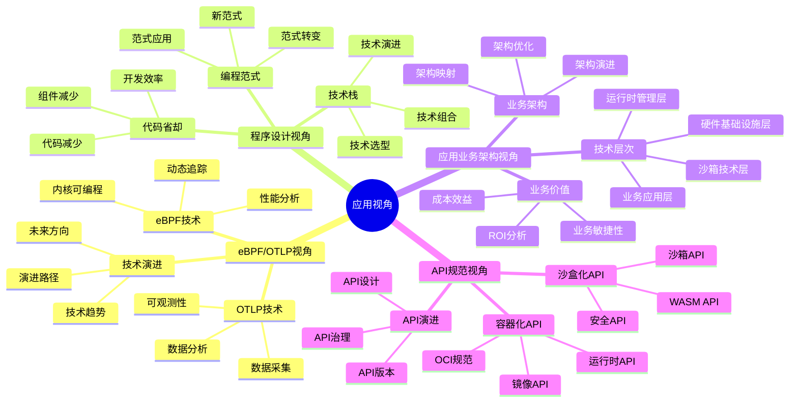
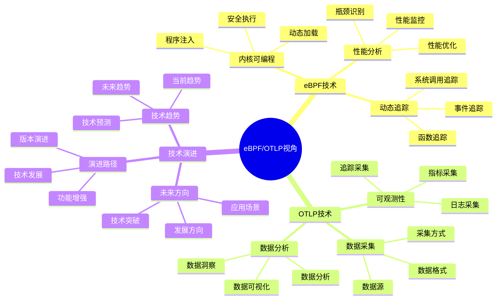
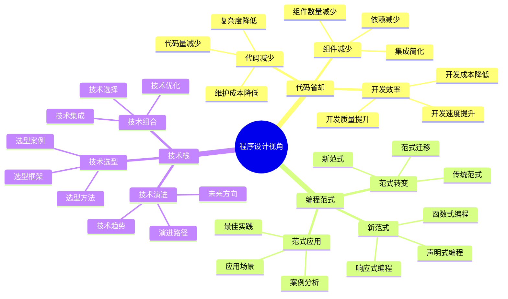
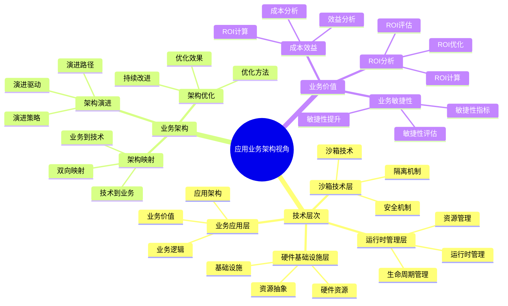
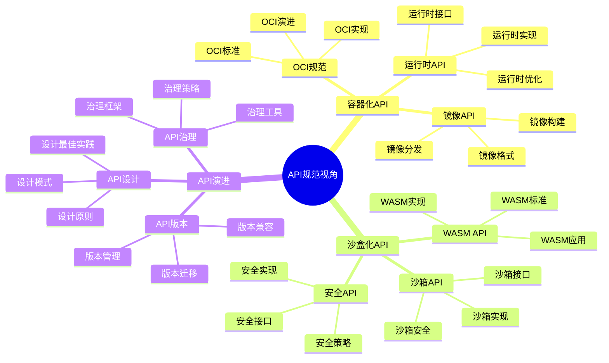

# 应用视角思维导图

## 📑 目录

- [应用视角思维导图](#应用视角思维导图)
  - [📑 目录](#-目录)
  - [1 应用视角全景](#1-应用视角全景)
  - [2 eBPF/OTLP视角思维导图](#2-ebpfotlp视角思维导图)
  - [3 程序设计视角思维导图](#3-程序设计视角思维导图)
  - [4 应用业务架构视角思维导图](#4-应用业务架构视角思维导图)
  - [5 API规范视角思维导图](#5-api规范视角思维导图)

---

## 1 应用视角全景

---

## 2 eBPF/OTLP视角思维导图

---

## 3 程序设计视角思维导图

---

## 4 应用业务架构视角思维导图

---

## 5 API规范视角思维导图

---

**最后更新**：2025-11-07
**文档状态**：✅ 完整 | 📊 包含应用视角思维导图 | 🎯 生产就绪
**维护者**：项目团队
