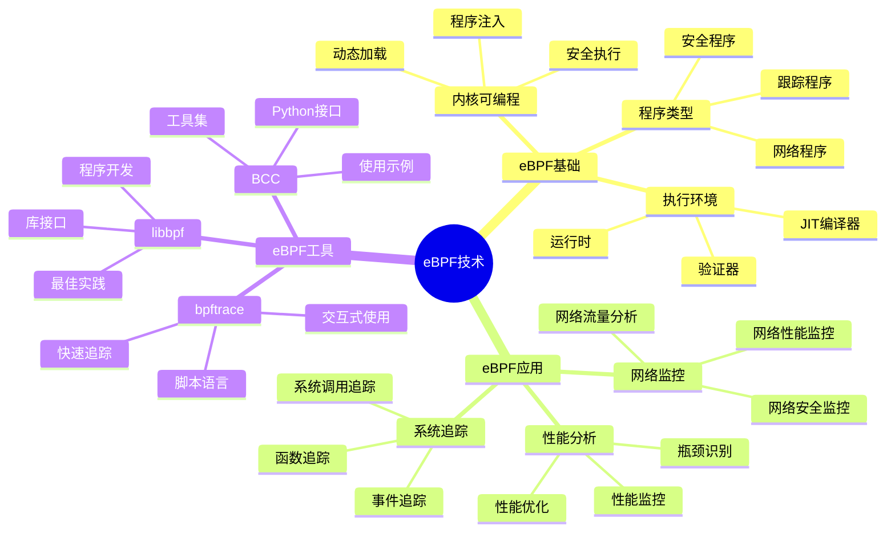
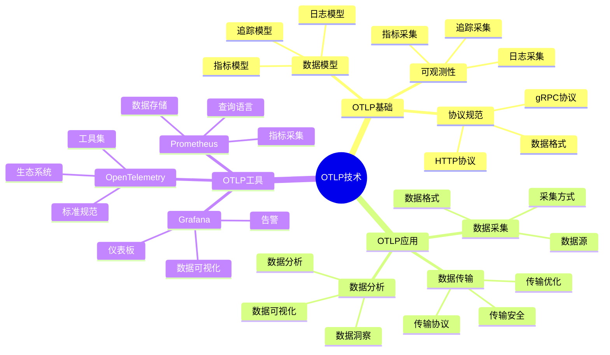
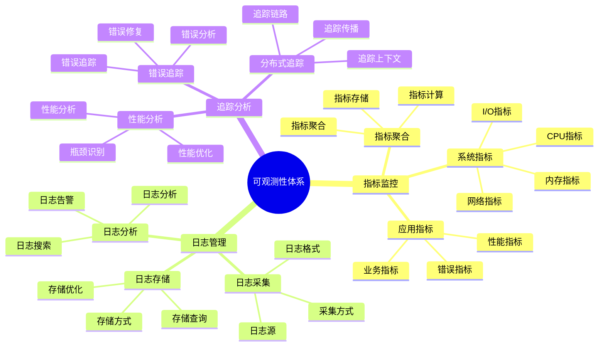
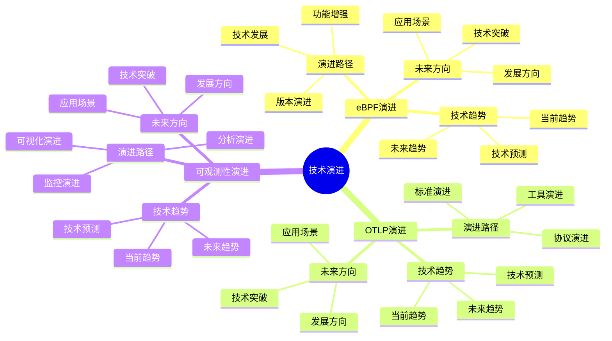

# eBPF/OTLP视角详细思维导图

## 📑 目录

- [eBPF/OTLP视角详细思维导图](#ebpfotlp视角详细思维导图)
  - [📑 目录](#-目录)
  - [1 eBPF技术详解](#1-ebpf技术详解)
  - [2 OTLP技术详解](#2-otlp技术详解)
  - [3 可观测性体系](#3-可观测性体系)
  - [4 技术演进路径](#4-技术演进路径)

---

## 1 eBPF技术详解

---

## 2 OTLP技术详解

---

## 3 可观测性体系

---

## 4 技术演进路径

---

## 5 eBPF/OTLP应用场景矩阵

| 应用场景 | eBPF应用 | OTLP应用 | 技术组合 | 效果 | 推荐度 |
|---------|---------|---------|---------|------|--------|
| **网络监控** | 网络流量分析 | 网络指标采集 | eBPF + OTLP | 高 | ⭐⭐⭐⭐⭐ |
| **性能分析** | 性能追踪 | 性能指标采集 | eBPF + OTLP | 高 | ⭐⭐⭐⭐⭐ |
| **安全监控** | 安全事件追踪 | 安全日志采集 | eBPF + OTLP | 高 | ⭐⭐⭐⭐⭐ |
| **分布式追踪** | 系统调用追踪 | 分布式追踪 | eBPF + OTLP | 高 | ⭐⭐⭐⭐⭐ |
| **故障诊断** | 系统追踪 | 日志分析 | eBPF + OTLP | 高 | ⭐⭐⭐⭐ |
| **性能优化** | 性能分析 | 性能指标 | eBPF + OTLP | 高 | ⭐⭐⭐⭐ |

**推荐度说明**：

- **⭐⭐⭐⭐⭐**：强烈推荐
- **⭐⭐⭐⭐**：推荐
- **⭐⭐⭐**：可选

---

**最后更新**：2025-11-07
**文档状态**：✅ 完整 | 📊 包含eBPF/OTLP视角详细思维导图 | 🎯 生产就绪
**维护者**：项目团队
