# eBPF/OTLP视角详细思维导图

## 📑 目录

- [eBPF/OTLP视角详细思维导图](#ebpfotlp视角详细思维导图)
  - [📑 目录](#-目录)
  - [1 eBPF技术详解](#1-ebpf技术详解)
  - [2 OTLP技术详解](#2-otlp技术详解)
  - [3 可观测性体系](#3-可观测性体系)
  - [4 技术演进路径](#4-技术演进路径)
  - [5 eBPF/OTLP应用场景矩阵](#5-ebpfotlp应用场景矩阵)
  - [6 使用指南](#6-使用指南)
    - [6.1 快速开始](#61-快速开始)
    - [6.2 可观测性设计应用](#62-可观测性设计应用)
    - [6.3 性能分析应用](#63-性能分析应用)
  - [7 使用技巧](#7-使用技巧)
    - [7.1 eBPF使用技巧](#71-ebpf使用技巧)
    - [7.2 OTLP使用技巧](#72-otlp使用技巧)
  - [8 实践案例](#8-实践案例)
    - [8.1 Kubernetes集群可观测性案例](#81-kubernetes集群可观测性案例)
    - [8.2 微服务性能分析案例](#82-微服务性能分析案例)
  - [9 2025 年最新实践](#9-2025-年最新实践)
    - [9.1 eBPF/OTLP视角详细思维导图应用最佳实践（2025）](#91-ebpfotlp视角详细思维导图应用最佳实践2025)
  - [10 实际应用案例](#10-实际应用案例)
    - [案例 1：eBPF/OTLP视角应用（2025）](#案例-1ebpfotlp视角应用2025)
  - [11 相关文档](#11-相关文档)

---

## 1 eBPF技术详解


---

## 2 OTLP技术详解


---

## 3 可观测性体系


---

## 4 技术演进路径

```mermaid
mindmap
  root((技术演进))
    eBPF演进
      演进路径
        技术发展
        版本演进
        功能增强
      技术趋势
        当前趋势
        未来趋势
        技术预测
      未来方向
        发展方向
        技术突破
        应用场景
    OTLP演进
      演进路径
        标准演进
        协议演进
        工具演进
      技术趋势
        当前趋势
        未来趋势
        技术预测
      未来方向
        发展方向
        技术突破
        应用场景
    可观测性演进
      演进路径
        监控演进
        分析演进
        可视化演进
      技术趋势
        当前趋势
        未来趋势
        技术预测
      未来方向
        发展方向
        技术突破
        应用场景
```



---

## 5 eBPF/OTLP应用场景矩阵

| 应用场景 | eBPF应用 | OTLP应用 | 技术组合 | 效果 | 推荐度 |
|---------|---------|---------|---------|------|--------|
| **网络监控** | 网络流量分析 | 网络指标采集 | eBPF + OTLP | 高 | ⭐⭐⭐⭐⭐ |
| **性能分析** | 性能追踪 | 性能指标采集 | eBPF + OTLP | 高 | ⭐⭐⭐⭐⭐ |
| **安全监控** | 安全事件追踪 | 安全日志采集 | eBPF + OTLP | 高 | ⭐⭐⭐⭐⭐ |
| **分布式追踪** | 系统调用追踪 | 分布式追踪 | eBPF + OTLP | 高 | ⭐⭐⭐⭐⭐ |
| **故障诊断** | 系统追踪 | 日志分析 | eBPF + OTLP | 高 | ⭐⭐⭐⭐ |
| **性能优化** | 性能分析 | 性能指标 | eBPF + OTLP | 高 | ⭐⭐⭐⭐ |

**推荐度说明**：

- **⭐⭐⭐⭐⭐**：强烈推荐
- **⭐⭐⭐⭐**：推荐
- **⭐⭐⭐**：可选

---

## 6 使用指南

### 6.1 快速开始

**适用场景**：可观测性设计、性能分析、安全监控

**使用步骤**：

1. **理解eBPF技术**：理解eBPF的基础概念、应用场景、工具使用
2. **理解OTLP技术**：理解OTLP的基础概念、应用场景、工具使用
3. **技术组合应用**：结合eBPF和OTLP进行可观测性设计
4. **实践应用**：在实际项目中应用eBPF/OTLP技术

**推荐度**：⭐⭐⭐⭐⭐

---

### 6.2 可观测性设计应用

**适用场景**：实际项目中的可观测性设计

**使用步骤**：

1. **需求分析**：分析可观测性需求（指标、日志、追踪）
2. **eBPF应用**：使用eBPF进行系统追踪和性能分析
3. **OTLP应用**：使用OTLP进行数据采集和传输
4. **数据整合**：整合eBPF和OTLP的数据
5. **可视化展示**：使用可视化工具展示可观测性数据

**推荐度**：⭐⭐⭐⭐⭐

---

### 6.3 性能分析应用

**适用场景**：系统性能分析和优化

**使用步骤**：

1. **性能问题识别**：使用eBPF识别性能瓶颈
2. **性能数据采集**：使用OTLP采集性能指标
3. **性能数据分析**：分析性能数据，找出问题根源
4. **性能优化**：根据分析结果进行性能优化
5. **效果验证**：验证优化效果

**推荐度**：⭐⭐⭐⭐⭐

---

## 7 使用技巧

### 7.1 eBPF使用技巧

**技巧1：程序类型选择**

- 根据应用场景选择合适的eBPF程序类型
- 理解不同程序类型的适用场景
- 避免程序类型滥用

**技巧2：性能优化**

- 优化eBPF程序的性能
- 减少eBPF程序的开销
- 提高系统整体性能

**推荐度**：⭐⭐⭐⭐⭐

---

### 7.2 OTLP使用技巧

**技巧1：数据采集优化**

- 优化数据采集的频率和粒度
- 减少数据采集的开销
- 提高数据采集的效率

**技巧2：数据传输优化**

- 优化数据传输协议和格式
- 减少数据传输的开销
- 提高数据传输的效率

**推荐度**：⭐⭐⭐⭐⭐

---

## 8 实践案例

### 8.1 Kubernetes集群可观测性案例

**场景**：为Kubernetes集群设计可观测性方案

**分析过程**：

1. **需求分析**：
   - 需要监控Pod、Node、Service等资源
   - 需要追踪请求链路
   - 需要分析性能瓶颈

2. **eBPF应用**：
   - 使用eBPF追踪系统调用和网络流量
   - 使用eBPF分析性能瓶颈
   - 使用eBPF监控安全事件

3. **OTLP应用**：
   - 使用OTLP采集指标数据
   - 使用OTLP采集日志数据
   - 使用OTLP采集追踪数据

4. **技术组合**：结合eBPF和OTLP实现全面的可观测性

**效果**：成功实现Kubernetes集群的全面可观测性

**推荐度**：⭐⭐⭐⭐⭐

---

### 8.2 微服务性能分析案例

**场景**：分析微服务架构的性能问题

**分析过程**：

1. **性能问题识别**：使用eBPF识别性能瓶颈（网络延迟、CPU占用等）
2. **性能数据采集**：使用OTLP采集性能指标（响应时间、吞吐量等）
3. **性能数据分析**：分析性能数据，找出问题根源（服务间调用延迟、数据库查询慢等）
4. **性能优化**：根据分析结果进行性能优化（优化网络配置、优化数据库查询等）
5. **效果验证**：验证优化效果（响应时间降低、吞吐量提升）

**效果**：成功识别和解决微服务架构的性能问题

**推荐度**：⭐⭐⭐⭐⭐

---

## 9 2025 年最新实践

### 9.1 eBPF/OTLP视角详细思维导图应用最佳实践（2025）

**2025 年趋势**：eBPF/OTLP视角在可观测性、性能分析、安全监控中的深度应用

**实践要点**：

- **可观测性**：使用 eBPF 和 OTLP 构建统一可观测性体系
- **性能分析**：使用 eBPF 进行内核级性能分析
- **安全监控**：使用 eBPF 进行实时安全监控
- **数据采集**：使用 OTLP 统一数据采集标准

**代码示例**：

```python
# 2025 年 eBPF/OTLP 视角工具
class EBPFOTLPPerspectiveTool:
    def __init__(self):
        self.ebpf_collector = EBPFCollector()
        self.otlp_exporter = OTLPExporter()
        self.analyzer = PerformanceAnalyzer()
        self.monitor = SecurityMonitor()

    def collect_metrics(self, ebpf_programs):
        """指标采集"""
        metrics = self.ebpf_collector.collect(ebpf_programs)
        return self.otlp_exporter.export(metrics)

    def analyze_performance(self, metrics):
        """性能分析"""
        return self.analyzer.analyze(metrics)

    def monitor_security(self, events):
        """安全监控"""
        return self.monitor.monitor(events)
```

## 10 实际应用案例

### 案例 1：eBPF/OTLP视角应用（2025）

**场景**：使用 eBPF/OTLP 构建云原生可观测性体系

**实现方案**：

```python
# eBPF/OTLP 视角应用
tool = EBPFOTLPPerspectiveTool()

# 指标采集
ebpf_programs = [Program(type="tracepoint"), Program(type="kprobe")]
metrics = tool.collect_metrics(ebpf_programs)

# 性能分析
analysis = tool.analyze_performance(metrics)

# 安全监控
events = [Event(type="syscall"), Event(type="network")]
security = tool.monitor_security(events)
```

**效果**：

- 可观测性：统一可观测性体系，提高监控效率
- 性能分析：内核级性能分析，提高分析准确性
- 安全监控：实时安全监控，提高安全响应速度

---

## 11 相关文档

- **[应用视角思维导图](01-application-perspectives-mindmap.md)** - 应用视角全景、eBPF/OTLP视角概述
- **[应用场景认知矩阵](02-application-scenarios-matrix.md)** - 技术演进场景、业务架构场景
- **[技术演进路径图](08-technology-evolution-path.md)** - 技术演进全景、虚拟化演进路径、容器化演进路径
- **[综合应用指南](09-comprehensive-application-guide.md)** - 应用开发全景、技术栈选择、架构设计
- **[技术集成综合指南](11-technology-integration-guide.md)** - 技术集成全景、容器化技术集成、可观测性技术集成

---

**最后更新**：2025-11-15
**文档状态**：✅ 完整 | 📊 包含eBPF/OTLP视角详细思维导图、使用指南、使用技巧、实践案例 | 🎯 生产就绪
**维护者**：项目团队
