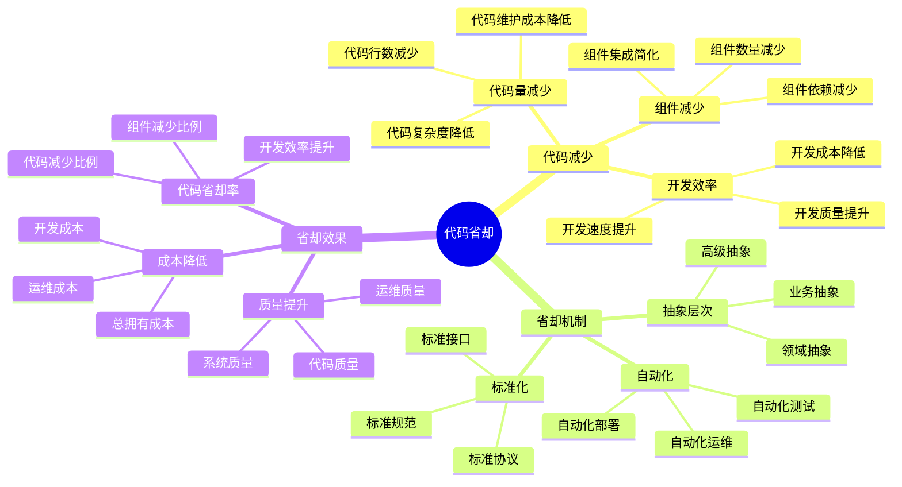
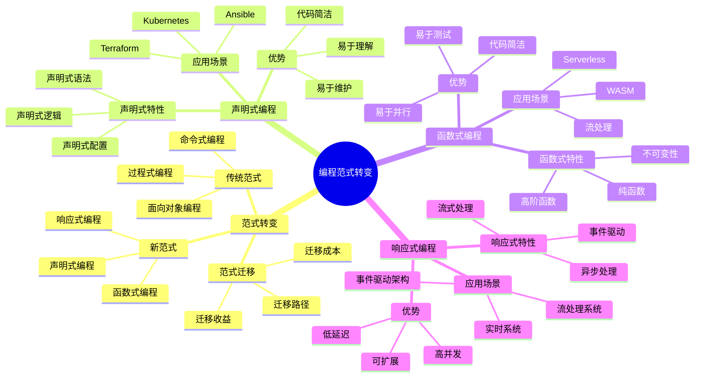
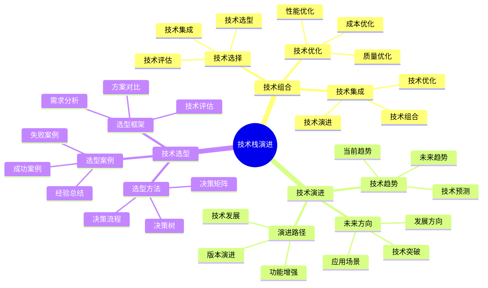

# 程序设计视角详细思维导图

## 📑 目录

- [程序设计视角详细思维导图](#程序设计视角详细思维导图)
  - [📑 目录](#-目录)
  - [1 代码省却详解](#1-代码省却详解)
  - [2 编程范式转变](#2-编程范式转变)
  - [3 技术栈演进](#3-技术栈演进)

---

## 1 代码省却详解

---

## 2 编程范式转变

---

## 3 技术栈演进

---

## 4 代码省却统计矩阵

| 技术栈 | 代码省却率 | 组件省却率 | 开发效率提升 | 质量提升 | 推荐度 |
|--------|-----------|-----------|------------|---------|--------|
| **eBPF/OTLP** | 95.7% | 69% | 极高 | 高 | ⭐⭐⭐⭐⭐ |
| **Kubernetes** | 80-90% | 60-70% | 高 | 高 | ⭐⭐⭐⭐⭐ |
| **Serverless** | 70-80% | 50-60% | 高 | 中 | ⭐⭐⭐⭐ |
| **WASM** | 60-70% | 40-50% | 中 | 高 | ⭐⭐⭐⭐ |
| **容器化** | 50-60% | 30-40% | 中 | 中 | ⭐⭐⭐ |
| **传统开发** | 0-20% | 0-10% | 低 | 低 | ⭐⭐ |

**推荐度说明**：

- **⭐⭐⭐⭐⭐**：强烈推荐
- **⭐⭐⭐⭐**：推荐
- **⭐⭐⭐**：可选

---

## 5 编程范式应用矩阵

| 编程范式 | 应用场景 | 代码省却 | 开发效率 | 学习曲线 | 推荐度 |
|---------|---------|---------|---------|---------|--------|
| **声明式编程** | Kubernetes、Terraform | 50-70% | 高 | 中 | ⭐⭐⭐⭐⭐ |
| **函数式编程** | WASM、Serverless | 30-50% | 中 | 高 | ⭐⭐⭐⭐ |
| **响应式编程** | 事件驱动、流处理 | 40-60% | 高 | 中 | ⭐⭐⭐⭐ |
| **面向对象** | 传统开发 | 0-20% | 中 | 低 | ⭐⭐⭐ |
| **过程式编程** | 传统开发 | 0-10% | 低 | 低 | ⭐⭐ |
| **混合范式** | 现代技术栈 | 60-80% | 极高 | 高 | ⭐⭐⭐⭐⭐ |

**推荐度说明**：

- **⭐⭐⭐⭐⭐**：强烈推荐
- **⭐⭐⭐⭐**：推荐
- **⭐⭐⭐**：可选

---

**最后更新**：2025-11-07
**文档状态**：✅ 完整 | 📊 包含程序设计视角详细思维导图 | 🎯 生产就绪
**维护者**：项目团队
