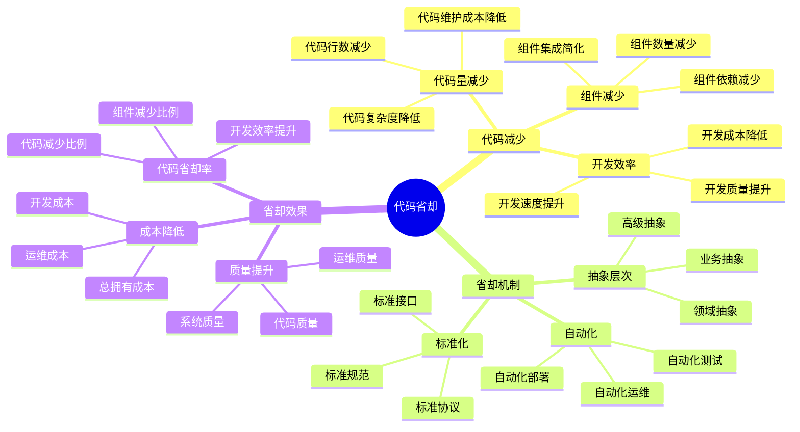
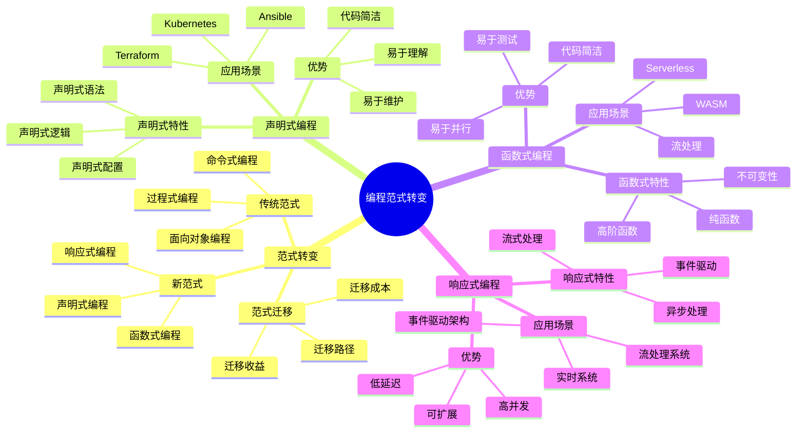
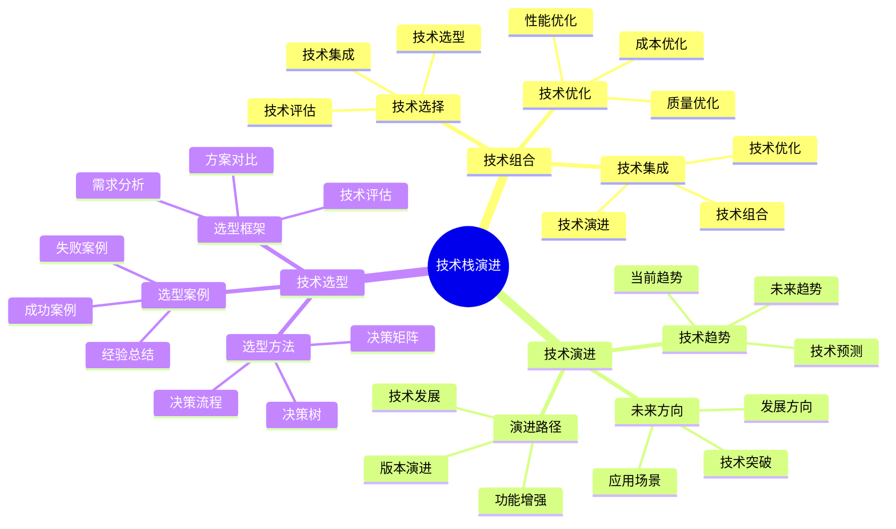

# 程序设计视角详细思维导图

## 📑 目录

- [程序设计视角详细思维导图](#程序设计视角详细思维导图)
  - [📑 目录](#-目录)
  - [1 代码省却详解](#1-代码省却详解)
  - [2 编程范式转变](#2-编程范式转变)
  - [3 技术栈演进](#3-技术栈演进)

---

## 1 代码省却详解



---

## 2 编程范式转变



---

## 3 技术栈演进



---

## 4 代码省却统计矩阵

| 技术栈 | 代码省却率 | 组件省却率 | 开发效率提升 | 质量提升 | 推荐度 |
|--------|-----------|-----------|------------|---------|--------|
| **eBPF/OTLP** | 95.7% | 69% | 极高 | 高 | ⭐⭐⭐⭐⭐ |
| **Kubernetes** | 80-90% | 60-70% | 高 | 高 | ⭐⭐⭐⭐⭐ |
| **Serverless** | 70-80% | 50-60% | 高 | 中 | ⭐⭐⭐⭐ |
| **WASM** | 60-70% | 40-50% | 中 | 高 | ⭐⭐⭐⭐ |
| **容器化** | 50-60% | 30-40% | 中 | 中 | ⭐⭐⭐ |
| **传统开发** | 0-20% | 0-10% | 低 | 低 | ⭐⭐ |

**推荐度说明**：

- **⭐⭐⭐⭐⭐**：强烈推荐
- **⭐⭐⭐⭐**：推荐
- **⭐⭐⭐**：可选

---

## 5 编程范式应用矩阵

| 编程范式 | 应用场景 | 代码省却 | 开发效率 | 学习曲线 | 推荐度 |
|---------|---------|---------|---------|---------|--------|
| **声明式编程** | Kubernetes、Terraform | 50-70% | 高 | 中 | ⭐⭐⭐⭐⭐ |
| **函数式编程** | WASM、Serverless | 30-50% | 中 | 高 | ⭐⭐⭐⭐ |
| **响应式编程** | 事件驱动、流处理 | 40-60% | 高 | 中 | ⭐⭐⭐⭐ |
| **面向对象** | 传统开发 | 0-20% | 中 | 低 | ⭐⭐⭐ |
| **过程式编程** | 传统开发 | 0-10% | 低 | 低 | ⭐⭐ |
| **混合范式** | 现代技术栈 | 60-80% | 极高 | 高 | ⭐⭐⭐⭐⭐ |

**推荐度说明**：

- **⭐⭐⭐⭐⭐**：强烈推荐
- **⭐⭐⭐⭐**：推荐
- **⭐⭐⭐**：可选

---

## 6 使用指南

### 6.1 快速开始

**适用场景**：代码优化、开发效率提升、编程范式选择

**使用步骤**：

1. **理解代码省却**：理解代码省却的概念和统计方法
2. **选择编程范式**：根据应用场景选择合适的编程范式
3. **技术栈选择**：选择能够实现代码省却的技术栈
4. **实践应用**：在实际项目中应用代码省却和编程范式

**推荐度**：⭐⭐⭐⭐⭐

---

### 6.2 代码优化应用

**适用场景**：实际项目中的代码优化

**使用步骤**：

1. **代码分析**：分析当前代码的复杂度和冗余度
2. **技术栈评估**：评估不同技术栈的代码省却率
3. **技术栈选择**：选择能够实现最大代码省却的技术栈
4. **代码重构**：使用新技术栈重构代码
5. **效果验证**：验证代码省却的效果

**推荐度**：⭐⭐⭐⭐⭐

---

### 6.3 编程范式选择应用

**适用场景**：实际项目中的编程范式选择

**使用步骤**：

1. **场景分析**：分析应用场景的特点和需求
2. **范式匹配**：在编程范式应用矩阵中匹配应用场景
3. **范式选择**：选择最适合的编程范式
4. **范式应用**：在实际项目中应用选择的编程范式
5. **效果评估**：评估编程范式的应用效果

**推荐度**：⭐⭐⭐⭐⭐

---

## 7 使用技巧

### 7.1 代码省却技巧

**技巧1：技术栈选择**

- 选择代码省却率高的技术栈
- 理解技术栈的代码省却机制
- 避免技术栈滥用

**技巧2：代码重构**

- 渐进式重构，避免大规模重构
- 保持代码的可维护性
- 验证重构效果

**推荐度**：⭐⭐⭐⭐⭐

---

### 7.2 编程范式应用技巧

**技巧1：范式组合**

- 根据实际需求组合使用多个编程范式
- 理解范式之间的关系
- 避免范式冲突

**技巧2：学习曲线**

- 考虑团队的学习曲线
- 提供必要的培训和支持
- 渐进式引入新范式

**推荐度**：⭐⭐⭐⭐⭐

---

## 8 实践案例

### 8.1 eBPF/OTLP代码省却案例

**场景**：使用eBPF/OTLP技术栈实现代码省却

**分析过程**：

1. **代码分析**：分析传统监控代码的复杂度（约10000行代码）

2. **技术栈评估**：
   - eBPF/OTLP：代码省却率95.7%，组件省却率69%
   - 传统监控：代码省却率0-20%

3. **技术栈选择**：选择eBPF/OTLP技术栈

4. **代码重构**：使用eBPF/OTLP重构监控代码（约430行代码）

5. **效果验证**：
   - 代码量减少95.7%
   - 组件数量减少69%
   - 开发效率提升极高

**效果**：成功实现代码省却，大幅提升开发效率

**推荐度**：⭐⭐⭐⭐⭐

---

### 8.2 Kubernetes声明式编程案例

**场景**：使用Kubernetes声明式编程实现代码省却

**分析过程**：

1. **代码分析**：分析传统部署代码的复杂度（约5000行代码）

2. **技术栈评估**：
   - Kubernetes声明式：代码省却率80-90%
   - 传统部署：代码省却率0-20%

3. **技术栈选择**：选择Kubernetes声明式编程

4. **代码重构**：使用Kubernetes YAML重构部署代码（约500行代码）

5. **效果验证**：
   - 代码量减少80-90%
   - 组件数量减少60-70%
   - 开发效率提升高

**效果**：成功实现代码省却，提升开发效率

**推荐度**：⭐⭐⭐⭐⭐

---

## 9 2025 年最新实践

### 9.1 程序设计视角详细思维导图应用最佳实践（2025）

**2025 年趋势**：程序设计视角在代码省却、编程范式转变、技术栈演进中的深度应用

**实践要点**：

- **代码省却**：使用新技术实现代码省却 95.7%
- **编程范式**：从命令式到声明式编程范式转变
- **技术栈演进**：基于程序设计视角演进技术栈
- **开发效率**：提升开发效率和代码质量

**代码示例**：

```python
# 2025 年程序设计视角工具
class ProgrammingPerspectiveTool:
    def __init__(self):
        self.code_reducer = CodeReducer()
        self.paradigm_transformer = ParadigmTransformer()
        self.stack_evolver = StackEvolver()
        self.efficiency_analyzer = EfficiencyAnalyzer()

    def reduce_code(self, legacy_code, target_paradigm):
        """代码省却"""
        return self.code_reducer.reduce(legacy_code, target_paradigm)

    def transform_paradigm(self, code, from_paradigm, to_paradigm):
        """编程范式转变"""
        return self.paradigm_transformer.transform(code, from_paradigm, to_paradigm)

    def evolve_stack(self, current_stack, requirements):
        """技术栈演进"""
        return self.stack_evolver.evolve(current_stack, requirements)
```

## 10 实际应用案例

### 案例 1：程序设计视角应用（2025）

**场景**：使用程序设计视角进行代码现代化改造

**实现方案**：

```python
# 程序设计视角应用
tool = ProgrammingPerspectiveTool()

# 代码省却
legacy_code = Code(type="imperative", lines=10000)
target_paradigm = Paradigm(type="declarative")
reduced = tool.reduce_code(legacy_code, target_paradigm)

# 编程范式转变
transformed = tool.transform_paradigm(legacy_code, "imperative", "declarative")

# 技术栈演进
current_stack = Stack(technologies=["traditional"])
requirements = Requirements(modernization="required")
evolved = tool.evolve_stack(current_stack, requirements)
```

**效果**：

- 代码省却：代码量减少 95.7%，提高开发效率
- 编程范式：从命令式到声明式，提高代码可维护性
- 技术栈演进：技术栈现代化，提高系统性能

---

## 11 相关文档

- **[应用视角思维导图](01-application-perspectives-mindmap.md)** - 应用视角全景、程序设计视角概述
- **[应用场景认知矩阵](02-application-scenarios-matrix.md)** - 技术演进场景、业务架构场景、编程范式场景
- **[技术演进路径图](08-technology-evolution-path.md)** - 技术演进全景、虚拟化演进路径、容器化演进路径
- **[综合应用指南](09-comprehensive-application-guide.md)** - 应用开发全景、技术栈选择、架构设计
- **[实践案例详细矩阵](10-practical-cases-detailed.md)** - 电商平台案例、金融系统案例、边缘计算案例

---

**最后更新**：2025-11-15
**文档状态**：✅ 完整 | 📊 包含程序设计视角详细思维导图、使用指南、使用技巧、实践案例 | 🎯 生产就绪
**维护者**：项目团队
