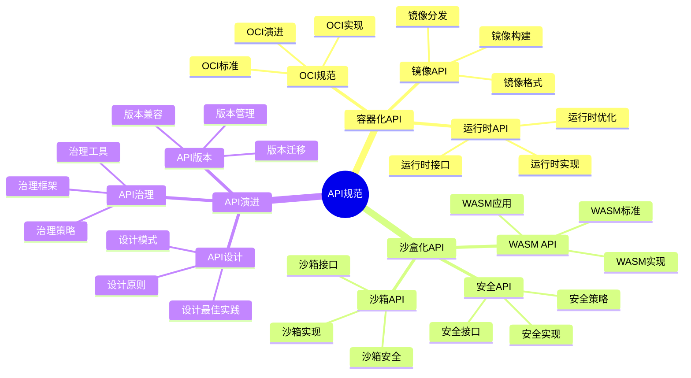
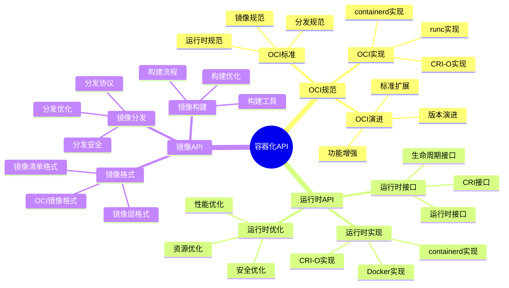
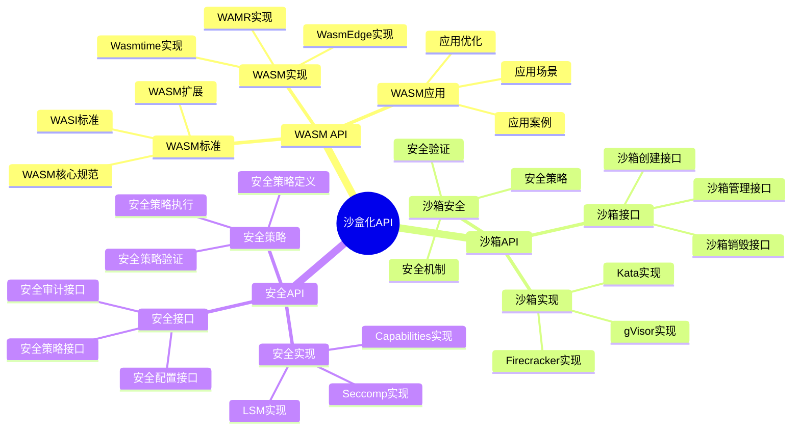
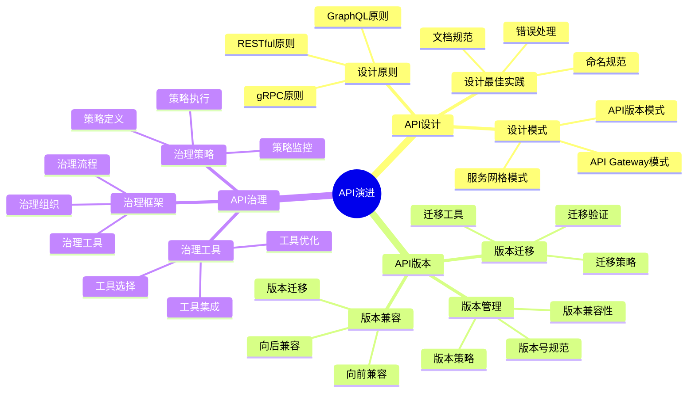

# API规范视角详细思维导图

## 📑 目录

- [API规范视角详细思维导图](#api规范视角详细思维导图)
  - [📑 目录](#-目录)
  - [1 API规范核心概念](#1-api规范核心概念)
  - [2 容器化API详解](#2-容器化api详解)
  - [3 沙盒化API详解](#3-沙盒化api详解)
  - [4 API演进路径](#4-api演进路径)

---

## 1 API规范核心概念

---

## 2 容器化API详解

---

## 3 沙盒化API详解

---

## 4 API演进路径

---

## 5 API规范应用场景矩阵

| 应用场景 | API类型 | API标准 | 技术选择 | 效果 | 推荐度 |
|---------|---------|---------|---------|------|--------|
| **容器化** | OCI API | OCI规范 | containerd/runc | 高 | ⭐⭐⭐⭐⭐ |
| **沙盒化** | WASM API | WASI标准 | WasmEdge/Wasmtime | 高 | ⭐⭐⭐⭐⭐ |
| **运行时** | 运行时API | CRI规范 | containerd/CRI-O | 高 | ⭐⭐⭐⭐⭐ |
| **服务网格** | 服务API | 服务网格标准 | Istio/Linkerd | 高 | ⭐⭐⭐⭐ |
| **可观测性** | 可观测性API | OTLP标准 | OpenTelemetry | 高 | ⭐⭐⭐⭐⭐ |
| **安全** | 安全API | 安全标准 | LSM/Seccomp | 高 | ⭐⭐⭐⭐⭐ |

**推荐度说明**：

- **⭐⭐⭐⭐⭐**：强烈推荐
- **⭐⭐⭐⭐**：推荐
- **⭐⭐⭐**：可选

---

**最后更新**：2025-11-07
**文档状态**：✅ 完整 | 📊 包含API规范视角详细思维导图 | 🎯 生产就绪
**维护者**：项目团队
