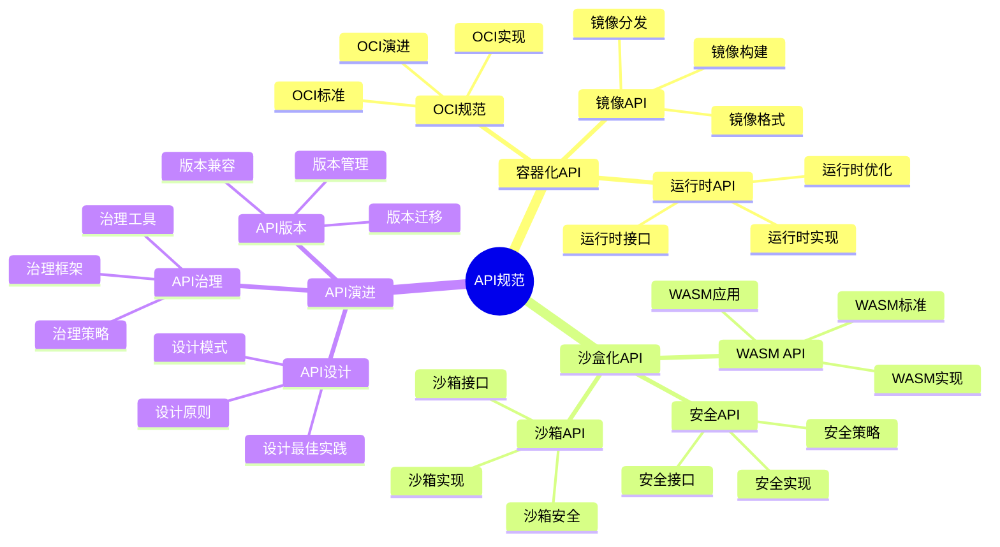
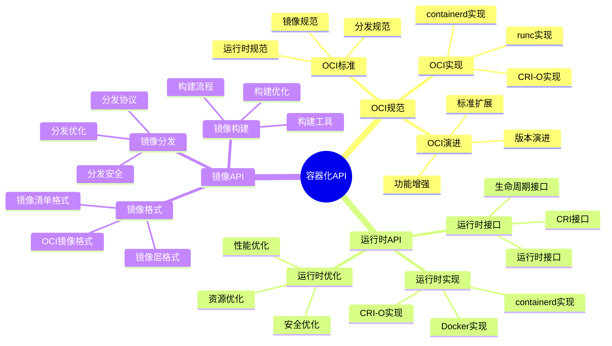
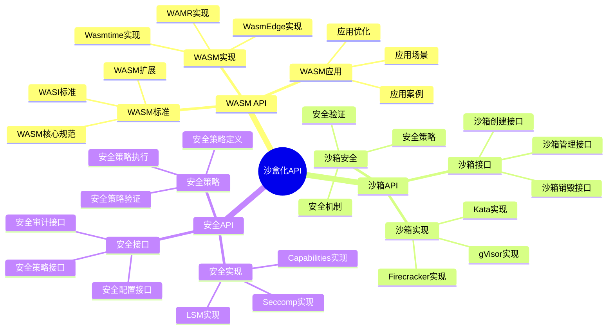
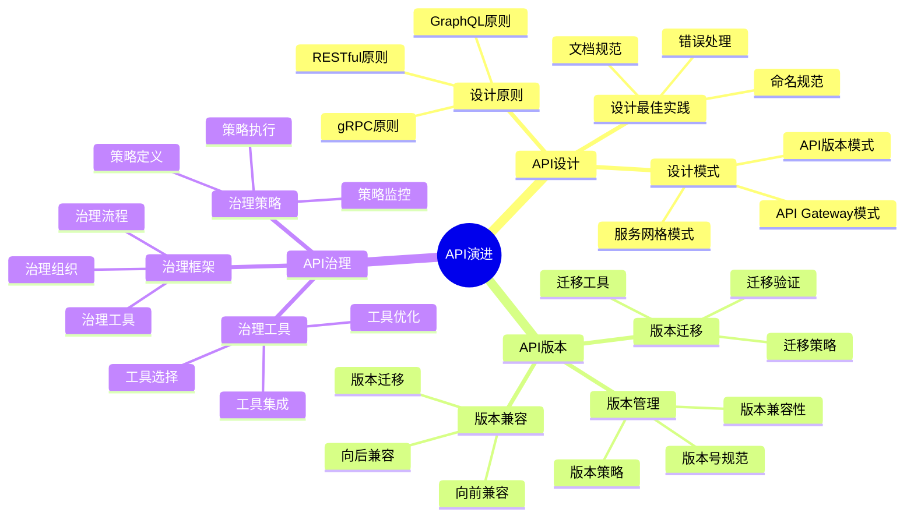

# API规范视角详细思维导图

## 📑 目录

- [API规范视角详细思维导图](#api规范视角详细思维导图)
  - [📑 目录](#-目录)
  - [1 API规范核心概念](#1-api规范核心概念)
  - [2 容器化API详解](#2-容器化api详解)
  - [3 沙盒化API详解](#3-沙盒化api详解)
  - [4 API演进路径](#4-api演进路径)
  - [5 API规范应用场景矩阵](#5-api规范应用场景矩阵)
  - [6 使用指南](#6-使用指南)
    - [6.1 快速开始](#61-快速开始)
    - [6.2 API设计应用](#62-api设计应用)
    - [6.3 API演进应用](#63-api演进应用)
  - [7 使用技巧](#7-使用技巧)
    - [7.1 API设计技巧](#71-api设计技巧)
    - [7.2 API演进技巧](#72-api演进技巧)
  - [8 实践案例](#8-实践案例)
    - [8.1 容器运行时API设计案例](#81-容器运行时api设计案例)
    - [8.2 WASM沙盒API设计案例](#82-wasm沙盒api设计案例)
  - [9 2025 年最新实践](#9-2025-年最新实践)
    - [9.1 API规范视角详细思维导图应用最佳实践（2025）](#91-api规范视角详细思维导图应用最佳实践2025)
  - [10 实际应用案例](#10-实际应用案例)
    - [案例 1：API规范视角应用（2025）](#案例-1api规范视角应用2025)
  - [11 相关文档](#11-相关文档)

---

## 1 API规范核心概念



---

## 2 容器化API详解



---

## 3 沙盒化API详解



---

## 4 API演进路径



---

## 5 API规范应用场景矩阵

| 应用场景 | API类型 | API标准 | 技术选择 | 效果 | 推荐度 |
|---------|---------|---------|---------|------|--------|
| **容器化** | OCI API | OCI规范 | containerd/runc | 高 | ⭐⭐⭐⭐⭐ |
| **沙盒化** | WASM API | WASI标准 | WasmEdge/Wasmtime | 高 | ⭐⭐⭐⭐⭐ |
| **运行时** | 运行时API | CRI规范 | containerd/CRI-O | 高 | ⭐⭐⭐⭐⭐ |
| **服务网格** | 服务API | 服务网格标准 | Istio/Linkerd | 高 | ⭐⭐⭐⭐ |
| **可观测性** | 可观测性API | OTLP标准 | OpenTelemetry | 高 | ⭐⭐⭐⭐⭐ |
| **安全** | 安全API | 安全标准 | LSM/Seccomp | 高 | ⭐⭐⭐⭐⭐ |

**推荐度说明**：

- **⭐⭐⭐⭐⭐**：强烈推荐
- **⭐⭐⭐⭐**：推荐
- **⭐⭐⭐**：可选

---

## 6 使用指南

### 6.1 快速开始

**适用场景**：API设计、API规范选择、API演进

**使用步骤**：

1. **理解API规范**：理解容器化API、沙盒化API、API演进路径
2. **场景匹配**：根据应用场景匹配API类型
3. **API选择**：选择合适的API规范和标准
4. **API设计**：根据API规范进行API设计

**推荐度**：⭐⭐⭐⭐⭐

---

### 6.2 API设计应用

**适用场景**：实际项目中的API设计

**使用步骤**：

1. **需求分析**：分析API的功能需求和非功能需求
2. **API类型选择**：根据需求选择合适的API类型（容器化API、沙盒化API等）
3. **API标准选择**：选择符合标准的API规范（OCI、WASI、CRI等）
4. **API设计**：根据API规范设计API接口
5. **API验证**：验证API设计的正确性和合规性

**推荐度**：⭐⭐⭐⭐⭐

---

### 6.3 API演进应用

**适用场景**：API演进和版本管理

**使用步骤**：

1. **现状分析**：分析当前API的现状和问题
2. **演进路径规划**：规划API演进路径
3. **版本管理**：制定API版本管理策略
4. **演进实施**：按照演进路径实施API演进
5. **兼容性管理**：管理API版本的兼容性

**推荐度**：⭐⭐⭐⭐⭐

---

## 7 使用技巧

### 7.1 API设计技巧

**技巧1：标准遵循**

- 遵循行业标准和规范（OCI、WASI、CRI等）
- 理解标准的设计原则和最佳实践
- 避免标准滥用

**技巧2：版本管理**

- 制定清晰的版本管理策略
- 保持向后兼容性
- 提供版本迁移指南

**推荐度**：⭐⭐⭐⭐⭐

---

### 7.2 API演进技巧

**技巧1：渐进演进**

- 采用渐进式演进策略
- 先小范围验证，再全面推广
- 降低演进风险

**技巧2：兼容性管理**

- 保持API的向后兼容性
- 提供版本兼容性指南
- 建立兼容性测试机制

**推荐度**：⭐⭐⭐⭐⭐

---

## 8 实践案例

### 8.1 容器运行时API设计案例

**场景**：设计容器运行时API

**分析过程**：

1. **需求分析**：
   - 需要支持容器生命周期管理
   - 需要支持镜像管理
   - 需要符合OCI标准

2. **API类型选择**：选择容器化API（OCI API）

3. **API标准选择**：选择OCI规范

4. **API设计**：
   - 使用OCI Runtime规范设计运行时API
   - 使用OCI Image规范设计镜像API
   - 使用CRI规范设计容器运行时接口

5. **API验证**：验证API设计符合OCI和CRI标准

**效果**：成功设计符合标准的容器运行时API

**推荐度**：⭐⭐⭐⭐⭐

---

### 8.2 WASM沙盒API设计案例

**场景**：设计WASM沙盒API

**分析过程**：

1. **需求分析**：
   - 需要支持WASM模块执行
   - 需要支持沙盒隔离
   - 需要符合WASI标准

2. **API类型选择**：选择沙盒化API（WASM API）

3. **API标准选择**：选择WASI标准

4. **API设计**：
   - 使用WASI规范设计WASM API
   - 使用WASM标准设计模块API
   - 使用安全API设计沙盒隔离API

5. **API验证**：验证API设计符合WASI标准

**效果**：成功设计符合标准的WASM沙盒API

**推荐度**：⭐⭐⭐⭐⭐

---

## 9 2025 年最新实践

### 9.1 API规范视角详细思维导图应用最佳实践（2025）

**2025 年趋势**：API规范视角在容器化API、沙盒化API、WASM化API中的深度应用

**实践要点**：

- **API设计**：基于规范设计标准化API
- **API演进**：系统化演进API规范
- **API验证**：使用形式化方法验证API规范
- **API兼容性**：确保API向后兼容性

**代码示例**：

```python
# 2025 年 API规范视角工具
class APIPerspectiveTool:
    def __init__(self):
        self.designer = APIDesigner()
        self.evolver = APIEvolver()
        self.verifier = APIVerifier()
        self.compatibility_checker = CompatibilityChecker()

    def design_api(self, spec, standards):
        """API设计"""
        return self.designer.design(spec, standards)

    def evolve_api(self, current_api, requirements):
        """API演进"""
        return self.evolver.evolve(current_api, requirements)

    def verify_api(self, api_spec):
        """API验证"""
        return self.verifier.verify(api_spec)
```

## 10 实际应用案例

### 案例 1：API规范视角应用（2025）

**场景**：使用API规范视角设计容器化API

**实现方案**：

```python
# API规范视角应用
tool = APIPerspectiveTool()

# API设计
spec = APISpec(type="containerization", features=["runtime", "image"])
standards = Standards(oci=True, cri=True)
api = tool.design_api(spec, standards)

# API演进
current_api = API(version="v1.0")
requirements = Requirements(wasm_support=True)
evolved = tool.evolve_api(current_api, requirements)

# API验证
verification = tool.verify_api(api)
```

**效果**：

- API设计：标准化API设计，提高API质量
- API演进：系统化API演进，保证向后兼容
- API验证：形式化API验证，提高API可靠性

---

## 11 相关文档

- **[应用视角思维导图](01-application-perspectives-mindmap.md)** - 应用视角全景、API规范视角概述
- **[应用场景认知矩阵](02-application-scenarios-matrix.md)** - 技术演进场景、业务架构场景、API演进场景
- **[技术演进路径图](08-technology-evolution-path.md)** - 技术演进全景、虚拟化演进路径、容器化演进路径、沙盒化演进路径
- **[综合应用指南](09-comprehensive-application-guide.md)** - 应用开发全景、技术栈选择、架构设计
- **[技术集成综合指南](11-technology-integration-guide.md)** - 技术集成全景、容器化技术集成、可观测性技术集成

---

**最后更新**：2025-11-15
**文档状态**：✅ 完整 | 📊 包含API规范视角详细思维导图、使用指南、使用技巧、实践案例 | 🎯 生产就绪
**维护者**：项目团队
