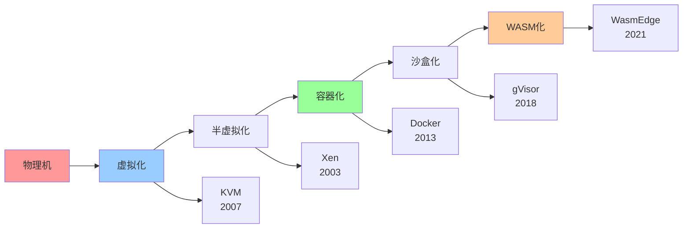
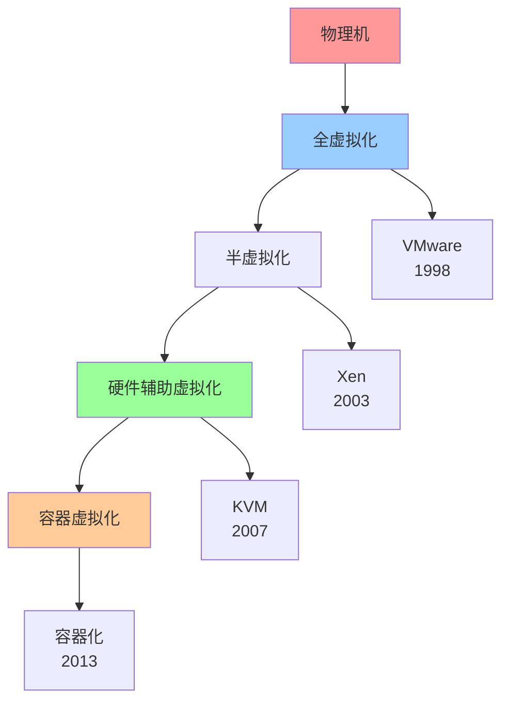
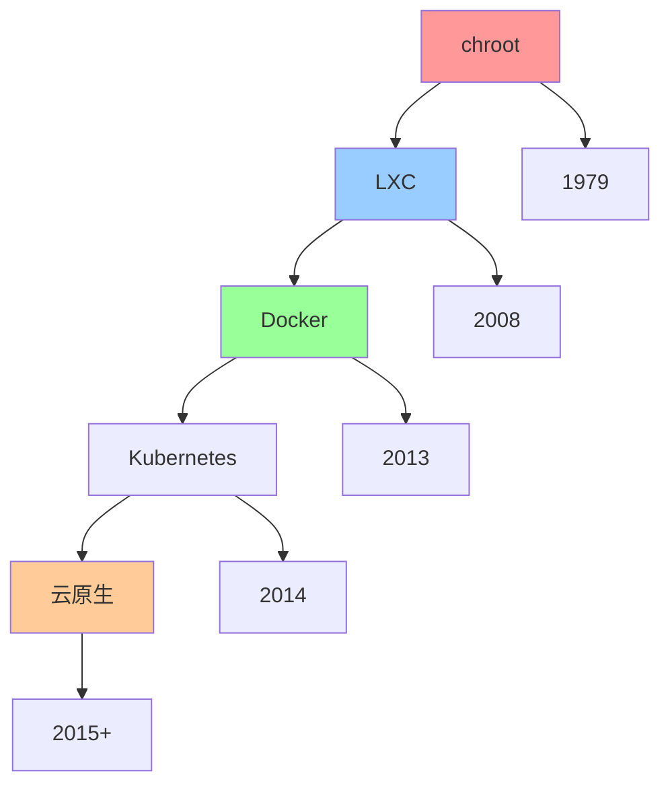
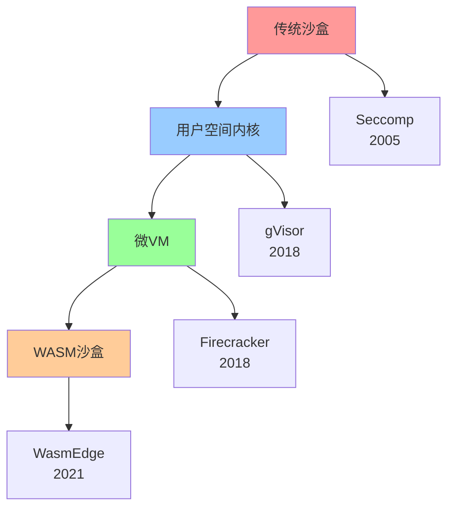

# 技术演进路径图

## 📑 目录

- [技术演进路径图](#技术演进路径图)
  - [📑 目录](#-目录)
  - [1 技术演进全景](#1-技术演进全景)
  - [2 虚拟化演进路径](#2-虚拟化演进路径)
  - [3 容器化演进路径](#3-容器化演进路径)
  - [4 沙盒化演进路径](#4-沙盒化演进路径)
  - [5 技术演进时间线](#5-技术演进时间线)
  - [6 技术演进驱动因素](#6-技术演进驱动因素)
  - [7 使用指南](#7-使用指南)
    - [7.1 快速开始](#71-快速开始)
    - [7.2 技术演进应用](#72-技术演进应用)
    - [7.3 技术选型应用](#73-技术选型应用)
  - [8 使用技巧](#8-使用技巧)
    - [8.1 演进规划技巧](#81-演进规划技巧)
    - [8.2 技术选型技巧](#82-技术选型技巧)
  - [9 实践案例](#9-实践案例)
    - [9.1 容器化演进案例](#91-容器化演进案例)
    - [9.2 沙盒化演进案例](#92-沙盒化演进案例)
  - [10 2025 年最新实践](#10-2025-年最新实践)
    - [10.1 技术演进路径图应用最佳实践（2025）](#101-技术演进路径图应用最佳实践2025)
  - [11 实际应用案例](#11-实际应用案例)
    - [案例 1：技术演进路径图应用（2025）](#案例-1技术演进路径图应用2025)
  - [12 相关文档](#12-相关文档)

---

## 1 技术演进全景



---

## 2 虚拟化演进路径



---

## 3 容器化演进路径



---

## 4 沙盒化演进路径



---

## 5 技术演进时间线

| 时间 | 技术 | 里程碑 | 影响 | 推荐度 |
|------|------|--------|------|--------|
| **1979** | chroot | Unix隔离 | 基础隔离 | ⭐⭐⭐ |
| **1998** | VMware | 全虚拟化 | 虚拟化普及 | ⭐⭐⭐⭐ |
| **2003** | Xen | 半虚拟化 | 性能提升 | ⭐⭐⭐⭐ |
| **2005** | Seccomp | 系统调用过滤 | 安全增强 | ⭐⭐⭐⭐ |
| **2007** | KVM | 硬件辅助虚拟化 | 性能提升 | ⭐⭐⭐⭐⭐ |
| **2008** | LXC | Linux容器 | 容器基础 | ⭐⭐⭐⭐ |
| **2013** | Docker | 容器化 | 容器普及 | ⭐⭐⭐⭐⭐ |
| **2014** | Kubernetes | 容器编排 | 云原生 | ⭐⭐⭐⭐⭐ |
| **2018** | gVisor | 用户空间内核 | 安全沙盒 | ⭐⭐⭐⭐⭐ |
| **2018** | Firecracker | 微VM | Serverless | ⭐⭐⭐⭐⭐ |
| **2021** | WasmEdge | WASM运行时 | 边缘计算 | ⭐⭐⭐⭐⭐ |

**推荐度说明**：

- **⭐⭐⭐⭐⭐**：强烈推荐
- **⭐⭐⭐⭐**：推荐
- **⭐⭐⭐**：可选

---

## 6 技术演进驱动因素

| 驱动因素 | 影响技术 | 演进方向 | 效果 | 推荐度 |
|---------|---------|---------|------|--------|
| **性能需求** | 虚拟化→容器化 | 性能提升 | 高 | ⭐⭐⭐⭐⭐ |
| **安全需求** | 容器化→沙盒化 | 安全增强 | 高 | ⭐⭐⭐⭐⭐ |
| **资源优化** | 虚拟化→容器化 | 资源效率 | 高 | ⭐⭐⭐⭐⭐ |
| **部署效率** | 物理机→容器化 | 部署速度 | 高 | ⭐⭐⭐⭐⭐ |
| **边缘计算** | 容器化→WASM | 轻量化 | 高 | ⭐⭐⭐⭐ |
| **Serverless** | 容器化→微VM | 快速启动 | 高 | ⭐⭐⭐⭐⭐ |

**推荐度说明**：

- **⭐⭐⭐⭐⭐**：强烈推荐
- **⭐⭐⭐⭐**：推荐
- **⭐⭐⭐**：可选

---

## 7 使用指南

### 7.1 快速开始

**适用场景**：技术演进规划、技术选型、技术预测

**使用步骤**：

1. **现状评估**：评估当前技术栈
2. **演进路径**：选择技术演进路径
3. **演进规划**：制定技术演进规划

**推荐度**：⭐⭐⭐⭐⭐

---

### 7.2 技术演进应用

**适用场景**：实际项目中的技术演进

**使用步骤**：

1. **现状评估**：评估当前技术栈（虚拟化、容器化、沙盒化）
2. **演进需求**：分析技术演进需求（性能、安全、资源优化）
3. **演进路径选择**：根据技术演进路径选择演进方向
4. **演进规划**：制定技术演进规划（步骤、时间、资源）
5. **演进实施**：分阶段实施技术演进
6. **效果评估**：评估技术演进的效果

**推荐度**：⭐⭐⭐⭐⭐

---

### 7.3 技术选型应用

**适用场景**：基于技术演进的技术选型

**使用步骤**：

1. **需求分析**：分析技术需求（性能、安全、资源优化）
2. **演进阶段识别**：识别技术演进阶段
3. **技术选择**：根据演进路径选择合适的技术
4. **技术评估**：评估技术的成熟度和适用性

**推荐度**：⭐⭐⭐⭐⭐

---

## 8 使用技巧

### 8.1 演进规划技巧

**技巧1：渐进演进**

- 采用渐进式演进策略
- 分阶段实施演进
- 降低演进风险

**技巧2：驱动因素分析**

- 分析技术演进的驱动因素
- 理解演进的原因和方向
- 制定合理的演进策略

**推荐度**：⭐⭐⭐⭐⭐

---

### 8.2 技术选型技巧

**技巧1：演进阶段匹配**

- 根据项目需求匹配技术演进阶段
- 选择合适的技术栈
- 避免技术过度或不足

**技巧2：技术成熟度评估**

- 评估技术的成熟度
- 理解技术的优缺点
- 选择成熟稳定的技术

**推荐度**：⭐⭐⭐⭐⭐

---

## 9 实践案例

### 9.1 容器化演进案例

**场景**：企业应用从虚拟化演进到容器化

**演进过程**：

1. **现状评估**：
   - 当前技术：虚拟化（KVM）
   - 技术栈：VMware虚拟化

2. **演进需求**：
   - 性能需求：提升性能
   - 资源优化：提高资源利用率
   - 部署效率：加快部署速度

3. **演进路径选择**：
   - 选择路径：虚拟化 → 容器化
   - 演进驱动：性能需求、资源优化、部署效率

4. **演进规划**：
   - 阶段1：容器化准备（1个月）
   - 阶段2：容器化实施（2个月）
   - 阶段3：容器化优化（1个月）

5. **演进实施**：
   - 使用Docker进行容器化
   - 使用Kubernetes进行容器编排
   - 优化容器资源分配

6. **效果评估**：
   - 性能提升30%
   - 资源利用率提升40%
   - 部署速度提升50%

**效果**：成功实现容器化演进，性能、资源利用率和部署效率显著提升

**推荐度**：⭐⭐⭐⭐⭐

---

### 9.2 沙盒化演进案例

**场景**：容器化应用演进到沙盒化

**演进过程**：

1. **现状评估**：
   - 当前技术：容器化（Docker）
   - 技术栈：Docker + Kubernetes

2. **演进需求**：
   - 安全需求：增强安全性
   - 隔离需求：提高隔离性
   - 多租户需求：支持多租户

3. **演进路径选择**：
   - 选择路径：容器化 → 沙盒化
   - 演进驱动：安全需求、隔离需求

4. **演进规划**：
   - 阶段1：沙盒化评估（1个月）
   - 阶段2：沙盒化实施（2个月）
   - 阶段3：沙盒化优化（1个月）

5. **演进实施**：
   - 使用gVisor进行沙盒化
   - 使用Firecracker进行微VM
   - 优化沙盒性能

6. **效果评估**：
   - 安全性显著提升
   - 隔离性显著提升
   - 多租户支持能力提升

**效果**：成功实现沙盒化演进，安全性和隔离性显著提升

**推荐度**：⭐⭐⭐⭐⭐

---

## 10 2025 年最新实践

### 10.1 技术演进路径图应用最佳实践（2025）

**2025 年趋势**：技术演进路径图在技术规划、演进决策、架构设计中的深度应用

**实践要点**：

- **路径规划**：使用路径图规划技术演进路径
- **演进决策**：基于路径图进行演进决策
- **风险评估**：评估技术演进的风险和收益
- **持续优化**：基于实践效果优化演进路径

**代码示例**：

```python
# 2025 年技术演进路径图工具
class TechnologyEvolutionPathTool:
    def __init__(self):
        self.path_map = TechnologyEvolutionPathMap()
        self.planner = EvolutionPlanner()
        self.decision_support = DecisionSupport()
        self.risk_analyzer = RiskAnalyzer()

    def plan_path(self, current_state, target_state):
        """路径规划"""
        return self.planner.plan(current_state, target_state)

    def support_decision(self, path, constraints):
        """演进决策"""
        return self.decision_support.recommend(path, constraints)

    def analyze_risk(self, path):
        """风险评估"""
        return self.risk_analyzer.analyze(path)
```

## 11 实际应用案例

### 案例 1：技术演进路径图应用（2025）

**场景**：使用技术演进路径图规划容器化技术演进

**实现方案**：

```python
# 技术演进路径图应用
tool = TechnologyEvolutionPathTool()

# 路径规划
current_state = State(technology="traditional", version="v1.0")
target_state = State(technology="containerized", version="v2.0")
path = tool.plan_path(current_state, target_state)

# 演进决策
constraints = Constraints(budget="limited", timeline="6months")
decision = tool.support_decision(path, constraints)

# 风险评估
risk = tool.analyze_risk(path)
```

**效果**：

- 路径规划：系统化规划技术演进路径，提高规划质量
- 演进决策：基于路径图进行决策，提高决策准确性
- 风险评估：评估演进风险，降低演进风险

---

## 12 相关文档

- **[应用视角思维导图](01-application-perspectives-mindmap.md)** - 应用视角全景、eBPF/OTLP视角、程序设计视角
- **[应用场景认知矩阵](02-application-scenarios-matrix.md)** - 技术演进场景、业务架构场景、API演进场景
- **[实际应用案例矩阵](06-practical-cases-matrix.md)** - 云原生应用案例、边缘计算案例、AI推理案例
- **[架构演进路径图](../../02-architecture-design/visualizations/06-architecture-evolution-path.md)** - 架构演进全景、演进路径、演进决策

---

**最后更新**：2025-11-15
**文档状态**：✅ 完整 | 📊 包含技术演进路径图、使用指南、使用技巧、实践案例 | 🎯 生产就绪
**维护者**：项目团队
