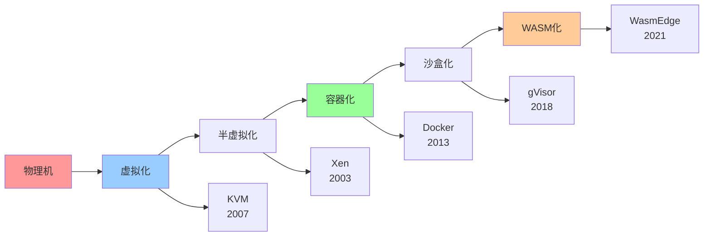
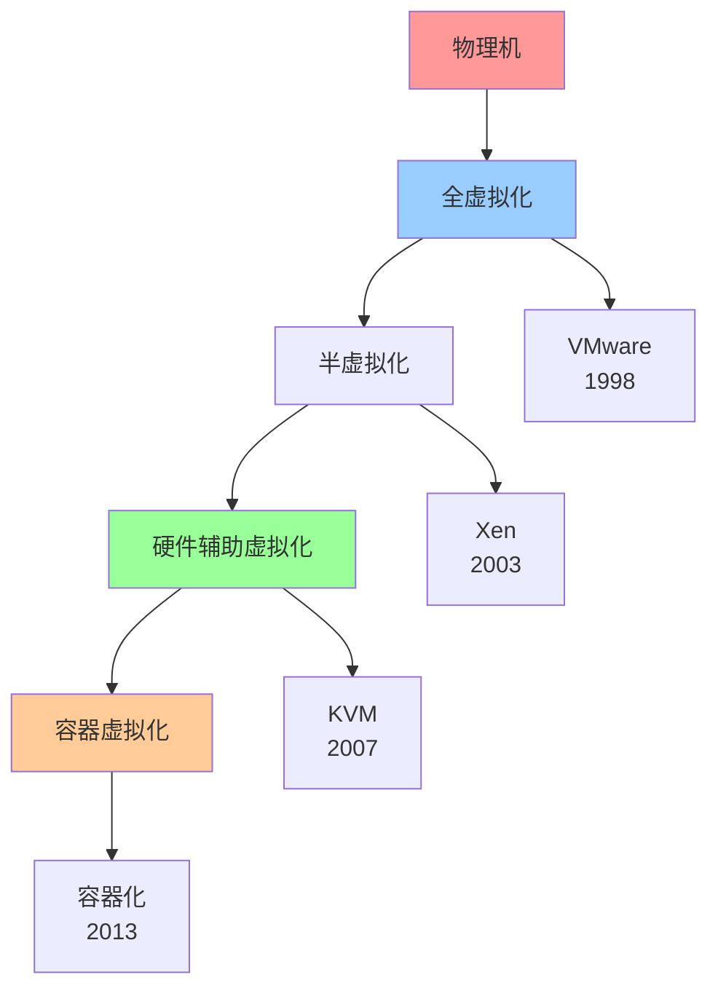
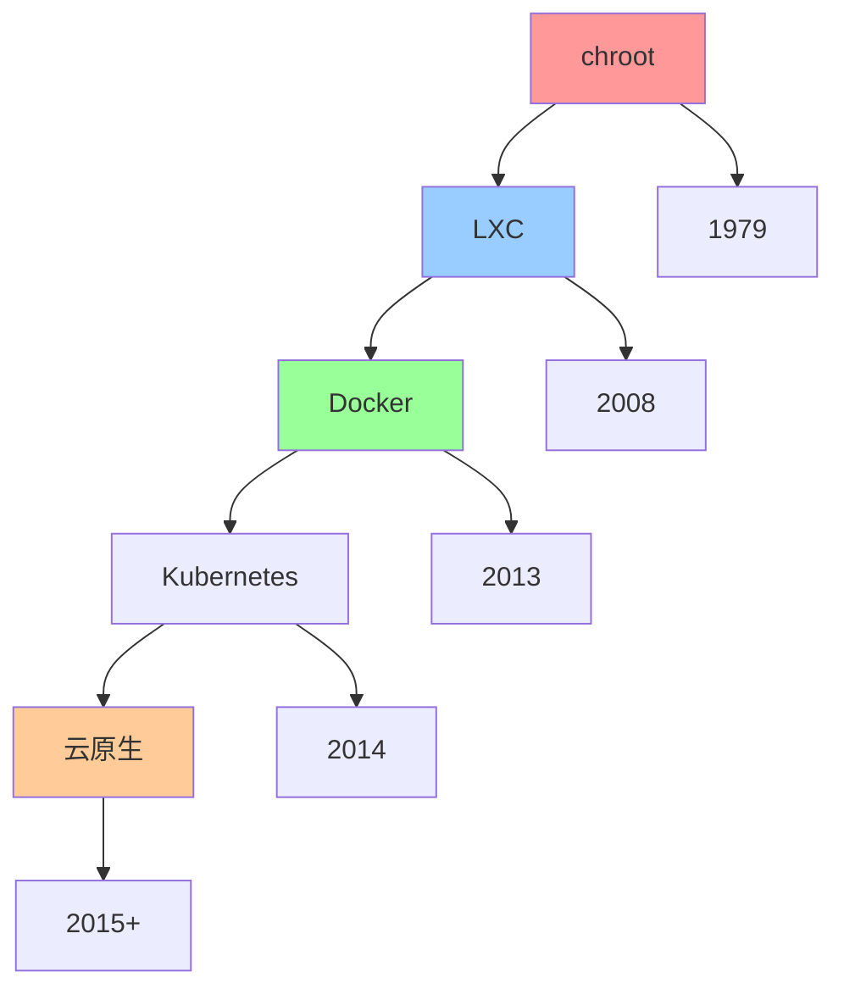
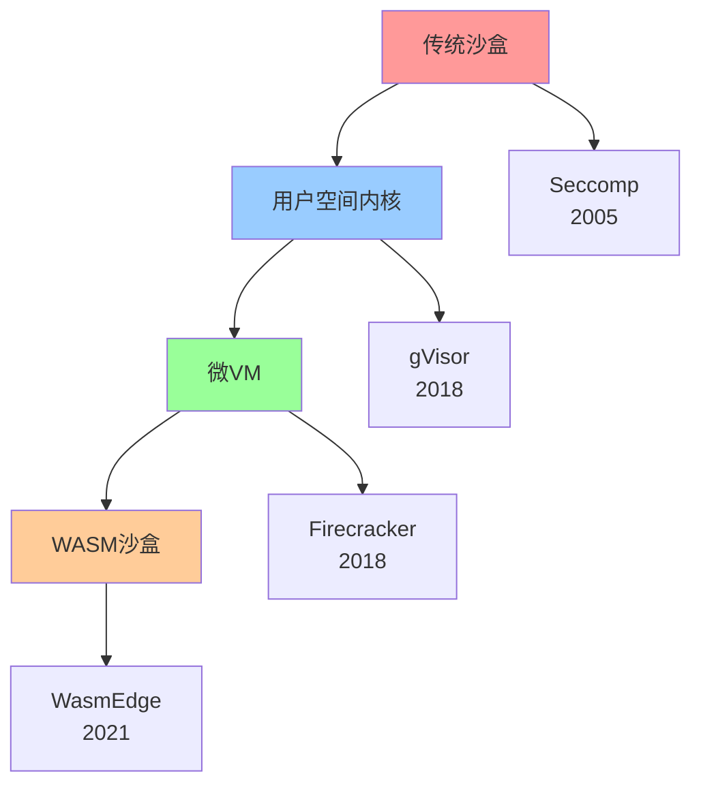

# 技术演进路径图

## 📑 目录

- [技术演进路径图](#技术演进路径图)
  - [📑 目录](#-目录)
  - [1 技术演进全景](#1-技术演进全景)
  - [2 虚拟化演进路径](#2-虚拟化演进路径)
  - [3 容器化演进路径](#3-容器化演进路径)
  - [4 沙盒化演进路径](#4-沙盒化演进路径)

---

## 1 技术演进全景

---

## 2 虚拟化演进路径

---

## 3 容器化演进路径

---

## 4 沙盒化演进路径

---

## 5 技术演进时间线

| 时间 | 技术 | 里程碑 | 影响 | 推荐度 |
|------|------|--------|------|--------|
| **1979** | chroot | Unix隔离 | 基础隔离 | ⭐⭐⭐ |
| **1998** | VMware | 全虚拟化 | 虚拟化普及 | ⭐⭐⭐⭐ |
| **2003** | Xen | 半虚拟化 | 性能提升 | ⭐⭐⭐⭐ |
| **2005** | Seccomp | 系统调用过滤 | 安全增强 | ⭐⭐⭐⭐ |
| **2007** | KVM | 硬件辅助虚拟化 | 性能提升 | ⭐⭐⭐⭐⭐ |
| **2008** | LXC | Linux容器 | 容器基础 | ⭐⭐⭐⭐ |
| **2013** | Docker | 容器化 | 容器普及 | ⭐⭐⭐⭐⭐ |
| **2014** | Kubernetes | 容器编排 | 云原生 | ⭐⭐⭐⭐⭐ |
| **2018** | gVisor | 用户空间内核 | 安全沙盒 | ⭐⭐⭐⭐⭐ |
| **2018** | Firecracker | 微VM | Serverless | ⭐⭐⭐⭐⭐ |
| **2021** | WasmEdge | WASM运行时 | 边缘计算 | ⭐⭐⭐⭐⭐ |

**推荐度说明**：

- **⭐⭐⭐⭐⭐**：强烈推荐
- **⭐⭐⭐⭐**：推荐
- **⭐⭐⭐**：可选

---

## 6 技术演进驱动因素

| 驱动因素 | 影响技术 | 演进方向 | 效果 | 推荐度 |
|---------|---------|---------|------|--------|
| **性能需求** | 虚拟化→容器化 | 性能提升 | 高 | ⭐⭐⭐⭐⭐ |
| **安全需求** | 容器化→沙盒化 | 安全增强 | 高 | ⭐⭐⭐⭐⭐ |
| **资源优化** | 虚拟化→容器化 | 资源效率 | 高 | ⭐⭐⭐⭐⭐ |
| **部署效率** | 物理机→容器化 | 部署速度 | 高 | ⭐⭐⭐⭐⭐ |
| **边缘计算** | 容器化→WASM | 轻量化 | 高 | ⭐⭐⭐⭐ |
| **Serverless** | 容器化→微VM | 快速启动 | 高 | ⭐⭐⭐⭐⭐ |

**推荐度说明**：

- **⭐⭐⭐⭐⭐**：强烈推荐
- **⭐⭐⭐⭐**：推荐
- **⭐⭐⭐**：可选

---

**最后更新**：2025-11-07
**文档状态**：✅ 完整 | 📊 包含技术演进路径图 | 🎯 生产就绪
**维护者**：项目团队
