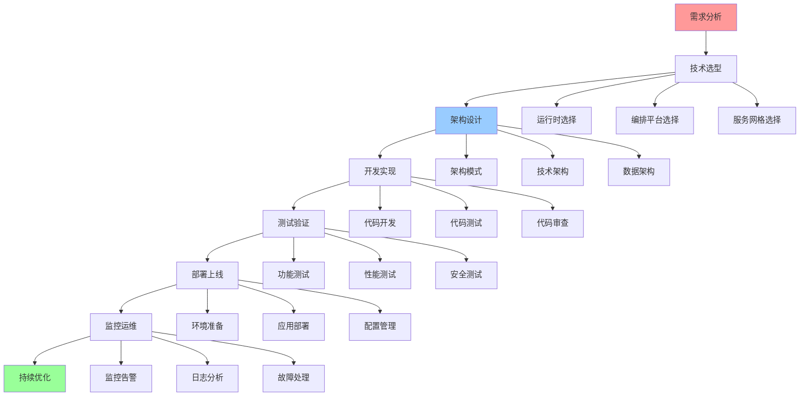

# 综合应用指南

## 📑 目录

- [综合应用指南](#综合应用指南)
  - [📑 目录](#-目录)
  - [1 应用开发全景](#1-应用开发全景)
  - [2 技术栈选择](#2-技术栈选择)
  - [3 架构设计](#3-架构设计)
  - [4 部署运维](#4-部署运维)

---

## 1 应用开发全景

---

## 2 技术栈选择

| 选择项 | 选项 | 适用场景 | 认知模型 | 推荐度 |
|--------|------|---------|---------|--------|
| **容器运行时** | runc/crun/youki/Kata/gVisor/Firecracker | 根据隔离需求 | 隔离模型+资源模型 | ⭐⭐⭐⭐⭐ |
| **编排平台** | Kubernetes/Docker Compose/K3s | 根据规模需求 | 架构决策框架 | ⭐⭐⭐⭐⭐ |
| **服务网格** | Istio/Linkerd/Consul Connect/Kuma | 根据功能需求 | 架构决策框架 | ⭐⭐⭐⭐ |
| **监控系统** | Prometheus+Grafana | 可观测性需求 | eBPF/OTLP视角 | ⭐⭐⭐⭐⭐ |
| **日志系统** | ELK/Loki | 日志分析需求 | eBPF/OTLP视角 | ⭐⭐⭐⭐ |
| **追踪系统** | Jaeger/Zipkin | 分布式追踪 | eBPF/OTLP视角 | ⭐⭐⭐⭐ |

**推荐度说明**：

- **⭐⭐⭐⭐⭐**：强烈推荐
- **⭐⭐⭐⭐**：推荐
- **⭐⭐⭐**：可选

---

## 3 架构设计

| 设计项 | 设计内容 | 认知模型 | 推荐度 |
|--------|---------|---------|--------|
| **架构模式** | 单体/微服务/Serverless/边缘 | 架构决策框架 | ⭐⭐⭐⭐⭐ |
| **技术架构** | 技术栈、技术组件、技术集成 | 结构视角+架构决策框架 | ⭐⭐⭐⭐⭐ |
| **数据架构** | 数据存储、数据管理、数据安全 | 存储概念+安全模型 | ⭐⭐⭐⭐⭐ |
| **网络架构** | 网络拓扑、网络协议、网络安全 | 网络概念+安全模型 | ⭐⭐⭐⭐ |
| **安全架构** | 隔离设计、权限设计、网络安全 | 安全模型+隔离模型 | ⭐⭐⭐⭐⭐ |
| **监控架构** | 监控设计、告警设计、分析设计 | eBPF/OTLP视角 | ⭐⭐⭐⭐ |

**推荐度说明**：

- **⭐⭐⭐⭐⭐**：强烈推荐
- **⭐⭐⭐⭐**：推荐
- **⭐⭐⭐**：可选

---

## 4 部署运维

| 运维项 | 运维内容 | 认知模型 | 推荐度 |
|--------|---------|---------|--------|
| **环境管理** | 环境准备、环境配置、环境验证 | 资源模型 | ⭐⭐⭐⭐⭐ |
| **应用部署** | 部署流程、部署验证、部署回滚 | 架构决策框架 | ⭐⭐⭐⭐⭐ |
| **配置管理** | 配置管理、配置版本、配置安全 | 安全模型 | ⭐⭐⭐⭐ |
| **监控告警** | 监控设计、告警配置、告警处理 | eBPF/OTLP视角 | ⭐⭐⭐⭐⭐ |
| **日志管理** | 日志采集、日志存储、日志分析 | eBPF/OTLP视角 | ⭐⭐⭐⭐ |
| **故障处理** | 故障发现、故障分析、故障恢复 | 问题解决方案矩阵 | ⭐⭐⭐⭐⭐ |

**推荐度说明**：

- **⭐⭐⭐⭐⭐**：强烈推荐
- **⭐⭐⭐⭐**：推荐
- **⭐⭐⭐**：可选

---

## 5 应用开发检查清单

| 检查项 | 检查内容 | 重要性 | 推荐度 |
|--------|---------|--------|--------|
| **需求分析** | 需求完整、需求可行、需求优先级 | 极高 | ⭐⭐⭐⭐⭐ |
| **技术选型** | 技术评估、技术选择、技术验证 | 高 | ⭐⭐⭐⭐⭐ |
| **架构设计** | 架构模式、技术架构、数据架构 | 高 | ⭐⭐⭐⭐⭐ |
| **开发实现** | 代码开发、代码测试、代码审查 | 高 | ⭐⭐⭐⭐⭐ |
| **测试验证** | 功能测试、性能测试、安全测试 | 高 | ⭐⭐⭐⭐⭐ |
| **部署上线** | 环境准备、应用部署、配置管理 | 高 | ⭐⭐⭐⭐⭐ |
| **监控运维** | 监控告警、日志管理、故障处理 | 中 | ⭐⭐⭐⭐ |

**推荐度说明**：

- **⭐⭐⭐⭐⭐**：强烈推荐
- **⭐⭐⭐⭐**：推荐
- **⭐⭐⭐**：可选

---

**最后更新**：2025-11-07
**文档状态**：✅ 完整 | 📊 包含综合应用指南 | 🎯 生产就绪
**维护者**：项目团队
